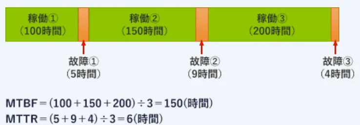
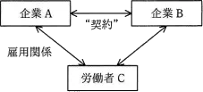
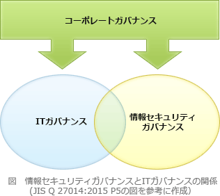
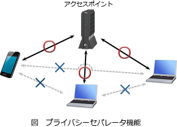
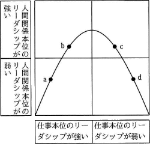

# 情報セキュリティマネジメントA

## **サイバー攻撃とコンピューターウィルス**

| 種類                       | 説明                                    |
|--------------------------|---------------------------------------|
| コンピュータウィルスComputer Virus | 寄生在其他程序中，对计算机造成不良影响的病毒                |
| マクロウィルスMacro Virus       | 利用Excel、Word等宏功能进行感染的病毒               |
| ワームWorm                  | 具有自我复制功能，能够自行传播感染的病毒                  |
| トロイの木馬Trojan Horse       | 伪装成有用软件诱导用户执行，在后台进行非法操作的病毒            |
| スパイウェアSpyware            | 混入其他软件中安装到计算机上，窃取用户信息的病毒              |
| ランサムウェアRansomware        | 擅自加密用户PC上的文件，以解密为条件勒索金钱的病毒            |
| キーロガーKeylogger           | 非法记录键盘操作，窃取用户个人信息的程序                  |
| ルートキットRootkit            | 将后门生成工具、日志篡改工具等用于非法访问计算机的工具打包集合而成的工具包 |

| 方法                                | 説明                                            |
|-----------------------------------|-----------------------------------------------|
| ビヘイビア法Behavior Method             | 在虚拟环境中**实际运行**待检测程序，通过其行为来检测恶意软件。也能检测未知病毒     |
| パターンマッチング法Pattern Matching Method | 将已知病毒的特征码（签名代码）与待检测程序进行**比较**来检测恶意软件。无法检测未知病毒 |

| 分類                      | 攻撃手法                                                                    | 簡単な解説                                     |
|-------------------------|-------------------------------------------------------------------------|-------------------------------------------|
| パスワードクラックPassword Crack | 辞書攻撃Dictionary Attack                                                   | 逐一尝试字典中收录的单词和常用短语的手法。                     |
|                         | ブルートフォース攻撃Brute Force Attack             | "穷举攻击"。尝试所有可能的字符组合的手法。虽然耗时但确定性高。          |
|                         | リバースブルートフォース攻撃Reverse Brute Force Attack | 固定"密码"（例："123456"），对大量"ID"逐一进行尝试的手法。      |
|                         | パスワードリスト攻撃Password List Attack           | 使用从其他服务泄露的ID和密码列表，尝试非法登录的手法。              |
|                         | レインボー攻撃Rainbow Attack                                                   | 使用密码哈希值（加密值）的转换表（彩虹表）来解析原始密码的手法。          |
| 脆弱性を狙う攻撃                | クロスサイトスクリプティングCross-Site Scripting(XSS)  | 在留言板或输入表单中嵌入恶意脚本（程序），使浏览者执行的攻击。           |
|                         | SQLインジェクションSQL Injection                 | 利用操作数据库的语言（SQL）的漏洞，发送非法命令来窃取或破坏数据的攻击。     |
|                         | OSコマンドインジェクションOS Command Injection                                      | 从外部向服务器的OS发送命令，进行非法操作的攻击。                 |
|                         | ディレクトリリスティングDirectory Listing                                           | 利用服务器内文件列表被意外显示的状态，探查信息的行为。               |
|                         | ディレクトリトラバーサルDirectory Traversal                                         | 使用"../"等特殊字符，浏览本来无法访问的层级文件的攻击。            |
| なりすまし攻撃Spoofing Attack  | DNSキャッシュポイズニングDNS Cache Poisoning        | 篡改DNS服务器的信息，将用户从正确的URL引导至虚假网站的攻击。         |
|                         | フィッシングPhishing                                                          | 伪装成金融机构等，通过虚假邮件或虚假网站诱导用户，骗取个人信息和银行卡信息的诈骗。 |
|                         | セッションハイジャックSession Hijack                                               | 窃取通信识别标识"会话ID"，冒充该用户进行操作的攻击。              |
|                         | SEOポイズニングSEO Poisoning                                                  | 使恶意网站显示在搜索引擎结果的前列，诱导用户访问的手法。              |
|                         | IPスプーフィングIP Spoofing                                                    | 伪造发送方的IP地址，隐藏身份或冒充可信通信对象的攻击。              |
| パソコンへの攻撃PC Attack       | ドライブバイダウンロードDrive-by Download            | 仅浏览网站就在不知不觉中被下载并执行恶意软件（病毒等）的攻击。           |
|                         | バッファオーバーフローBuffer Overflow                                              | 向程序分配的内存区域发送超量数据，导致系统故障或停止的攻击。            |
|                         | DoS攻撃DoS Attack                                                         | 向服务器发送大量数据，施加过度负载使服务停止的攻击。                |
|                         | DDoS攻撃DDoS Attack                                                       | 从多台计算机（跳板机）同时发起DoS攻击，使服务器瘫痪的攻击。           |

## 法務

- 刑法

| 罪名                       | 例                       |
|--------------------------|-------------------------|
| 不正指令電磁的記録に関する罪（マルウェア作成罪） | マルウェアを作成する。             |
| 電子計算機使用詐欺罪               | なりすましをする。データを改ざんする。     |
| 電子計算機損壊等業務妨害罪            | コンピュータやデータを破壊し、業務を妨害する。 |
| 電磁的記録不正作出及び供用罪           | データを偽造する。偽造データを使用する。    |
| 支払用カード電磁的記録不正作出等罪        | クレジットカード・キャッシュカードを偽造する。 |

- 不正アクセス禁止法
    - 擅自使用他人的使用者 ID 或密碼進行非法訪問的行為。
    - 利用安全漏洞（Security Hole）進行的入侵攻擊。
    - 未經許可將他人的密碼告訴第三方的行為。
- 特定電子メール法
  這是為了防止垃圾郵件（迷惑郵件）與濫發郵件（Spam）而制定的法律。法律中規定了發送者的姓名及電子郵件地址的顯示義務、對未經接收者同意之郵件的規制，以及對利用虛構電子郵件地址發送郵件之行為的規制。
  在《特定電子郵件法》中，為了發送廣告或宣傳郵件，必須採用**選擇加入（Opt-in）方式**。此外，發送者必須響應透過**選擇退出（Opt-out）方式
  **所提出的拒絕接收郵件要求。

个人号码的使用目的仅限于三个方面:税务、社会保障和防灾。

| 类别 | 著作者人格权 (Moral Rights) | 著作权/著作财产权 (Economic Rights) |
| :--- | :--- | :--- |
| **法律性质** | 保护作者的**名誉和人格利益** | 保护作者的**经济利益**（通过利用作品获利） |
| **能否转让** | **不可转让**（一身专属权）。即使签了合同，法律上你也还拥有它。 | **可自由转让**、继承、抵押。 |
| **包含的主要权利** | 1. **公表权**：决定何时/如何公开作品。 2. **氏名表示权**：决定是否署名。 3. **同一性保持权**：禁止他人擅自修改作品。 | 复制权、上演权、公信权、**改编权**（27条）、二次利用权（28条）等。 |
| **常见合同条款** | **「著作者人格権の不行使特約」**：约定作者承诺“不向行使”这些权利。 | **「著作権譲渡特約」**：约定将权利从作者处转让给公司或客户。 |

## 実装技術

DNSSEC(DNS Security Extensions)是增强DNS安全性的技术，通过**数字签名**确保你访问的网站地址（IP）是**真实、未被篡改**的，防止DNS欺骗和缓存污染攻击，把用户从恶意网站引走，保护你上网安全。

## システム評価指標

- MTBF(Mean Time Between Failure)
  平均故障間隔。故障が回復してから次に故障するまでの平均時間のこと。
- MTTR(Mean Time To Repair)平均修復時間。
  故障が発生したときに回復に要する平均時間のこと。

## 对策

| プロトコール |ポート  | 説明 |
|----------------|------|------|
| SMPT | 25  | メール送信用プロトコル |
| POP  | 110 | メール受信用（サーバーからダウンロード） |
| IMAP | 143 | メール受信用（サーバー上で管理） |

## 管理

| 简称       | 英文全称                                                                                           | 核心职能 | 关键词 |
|:---------|:-----------------------------------------------------------------------------------------------| :--- | :--- |
| CRYPTREC | **Crypt**ography **R**esearch and **E**valuation **C**ommittees                                | 评估电子政府使用的**密码技术**安全性。 | 密码安全、政府推荐 |
| CSIRT    | **C**omputer **S**ecurity **I**ncident **R**esponse **T**eam                                   | 负责**安全事件**响应、处置与预防的团队总称。 | 事件响应、团队 |
| J-CSIP   | **I**nitiative for **C**yber **S**ecurity **I**nformation sharing **P**artnership of **J**apan | 以 IPA 为枢纽，在不同行业间**共享攻击信息**。 | 信息共享、13个产业 |
| JISEC    | **J**apan **I**T **S**ecurity **E**valuation and **C**ertification Scheme                      | 基于 **ISO/IEC 15408** 标准的 IT 产品安全性认证。 | 产品认证、ISO标准 |

| 項目        | 内容要点                            |
|:----------|:--------------------------------|
| リスク移転（共有） | 通过保险或外包，将风险转嫁给第三方。              |
| リスク回避     | 彻底消除风险源，使发生概率为零。                |
| リスク低減     | 采取措施降低发生频率或减轻损失程度。              |
| リスク受容（保有） | 由于损失较小或对策成本过高，选择不做干预。           |
| リスクコントロール | 采取措施避免或降低潜在风险。                  |
| リスクファイナンス | 为应对风险可能发生的情况，必须确保损失赔偿和应对费用资金到位。 |

## 真题

### 令和6年

- JIS Q 31000:2019(リスクマネジメント－指針)におけるリスクアセスメントを構成するプロセスの組合せは**リスク特定，リスク分析，リスク評価**。

| 步骤 (日文) | 简短解释 |
| :--- | :--- |
| リスク基準の確立 | 确定评价风险的标准和范围。 |
| リスク特定 | 找出潜在的风险及其来源。 |
| リスク分析 | 分析风险发生的可能性和影响程度。 |
| リスク評価 | 对比准则，确定处理的优先顺序。 |
| リスク対応 | 采取具体措施处理或规避风险。 |

- 情報の取扱基準の中で，社外秘情報の持出しを禁じ，周知した上で，従業員に情報を不正に持ち出された場合に，"社外秘情報とは知らなかった"という言い訳をさせないことが目的の一つになっている対策は**情報うの管理レベルについてのラベル付け**
- サイバーキルチェーンに関する説明として，適切なものは**攻撃者の視点から，攻撃の手口を偵察から目的の実行までの段階に分けたもの**。
- 個人情報保護法が保護の対象としている個人情報に関する記述のうち，適切なものは**生存する個人に関する情報に限られる。**
- 社内ネットワークからインターネットへのアクセスを中継し，Webコンテンツをキャッシュすることによってアクセスを高速にする仕組みで，セキュリティ確保にも利用されるものは**プロキシサーバ**。
- 全社的な推進体制でRPAを導入するときの留意点として，適切なものは**各業務部門が連携して，RPAの対象業務に対して業務プロセス全体の可視化と業務プロセスの見直しを行った上で，RPAの導入を行う**。

### 令和5年度

- "情報セキュリティ管理基準(平成28年)"に関する記述のうち，最も適切なものは**JIS Q 27001:2014(情報セキュリティマネジメントシステム－要求事項)及びJIS Q 27002:2014(情報セキュリティ管理策の実践のための規範)との整合性をとっている**。

### サンプル問題

- JIS Q 27002:2014(情報セキュリティ管理策の実践のための規範)の"サポートユーティリティ"に関する例示に基づいて，サポートユーティリティと判断されるものは: **サーバ室の空調**。
- JIS Q 27000:2019(情報セキュリティマネジメントシステム－用語)における"**リスクレベル**"の定義は: **結果とその起こりやすさの組合せとして表現される，リスクの大きさ。**
- A社では現在，インターネット上のWebサイトを内部ネットワークのPC上のWebブラウザから参照している。新たなシステムを導入し，DMZ上に用意したVDI(Virtual Desktop Infrastructure)サーバにPCからログインし，インターネット上のWebサイトをVDIサーバ上の仮想デスクトップのWebブラウザから参照するように変更する。この変更によって期待できるセキュリティ上の効果は**インターネット上のWebサイトから，内部ネットワークのPCへのマルウェアのダウンロードを防ぐ**。
- プロジェクトの日程計画を作成するのに適した技法は**PERT**。
- 一方のコンピュータが正常に機能しているときには，他方のコンピュータが待機状態にあるシステムは**デュプレックスシステム**。

### 令和元年

- BEC(Business E-mail Compromise)に該当するものは**巧妙なだましの手口を駆使し，取引先になりすまして偽の電子メールを送り，金銭をだまし取る**。
- 参加組織及びそのグループ企業において検知されたサイバー攻撃などの情報を，IPAが情報ハブになって集約し，参加組織間で共有する取組は**J-CSIP**
- JIS Q 27001:2014(情報セキュリティマネジメントシステム－要求事項)において，リスクを受容するプロセスに求められるものは**受容するリスクについては，リスク所有者が承認すること**
- 退職する従業員による不正を防ぐための対策のうち，IPA"組織における内部不正防止ガイドライン(第4版)"に照らして，適切なものは**退職間際に重要情報の不正な持出しが行われやすいので，退職予定者に対する重要情報へのアクセスや媒体の持出しの監視を強化する。**
- JIS Q 27000:2019(情報セキュリティマネジメントシステム－用語)において，不適合が発生した場合にその原因を除去し，再発を防止するためのものとして定義されているものは**是正処置**。
- A社では現在，インターネット上のWebサイトを内部ネットワークのPC上のWebブラウザから参照している。新たなシステムを導入し，DMZ上に用意したVDI(Virtual Desktop Infrastructure)サーバにPCからログインし，インターネット上のWebサイトをVDIサーバ上の仮想デスクトップのWebブラウザから参照するように変更する。この変更によって期待できるセキュリティ上の効果は**インターネット上のWebサイトから，内部ネットワークのPCへのマルウェアのダウンロードを防ぐ**
- シャドーITに該当するものは**IT部門の許可を得ずに，従業員又は部門が業務に利用しているデバイスやクラウドサービス**
- ステガノグラフィは**画像などのデータの中に，秘密にしたい情報を他者に気付かれることなく埋め込む**
- メッセージが改ざんされていないかどうかを確認するために，そのメッセージから，ブロック暗号を用いて生成することができるものは**メッセージ認証符号**
- リスクベース認証に該当するものは**利用者のIPアドレスなどの環境を分析し，いつもと異なるネットワークからのアクセスに対して追加の認証を行う**。
- 攻撃者が，多数のオープンリゾルバに対して，"あるドメイン"の実在しないランダムなサブドメインを多数問い合わせる攻撃(ランダムサブドメイン攻撃)を仕掛け，多数のオープンリゾルバが応答した。このときに発生する事象は**あるドメインを管理する権威DNSサーバに対して負荷が掛かる。**
- クレジットカードなどのカード会員データのセキュリティ強化を目的として制定され，技術面及び運用面の要件を定めたものは**PCI DSS**(Payment Card Industry Data Security Standard)
- ハニーポットの説明は**わざと侵入しやすいように設定した機器やシステムをインターネット上に配置することによって，攻撃手法やマルウェアの振る舞いなどの調査と研究に利用する**
- シュリンクラップ契約において，ソフトウェアの使用許諾契約が成立するのは**ウソフトウェアの入ったDVD-ROMの包装を解いた時点**
- 常時10名以上の従業員を有するソフトウェア開発会社が，社内の情報セキュリティ管理を強化するために，秘密情報を扱う担当従業員の扱いを見直すこととした。労働法に照らし，適切な行為は**就業規則に業務上知り得た秘密の漏えい禁止の一般的な規定があるときに，担当従業員の職務に即して秘密の内容を特定する個別合意を行う**
- 金融庁"財務報告に係る内部統制の評価及び監査の基準(令和元年)"に基づいて，内部統制の基本的要素を，統制環境，リスクの評価と対応，統制活動，情報と伝達，モニタリング，ITへの対応の六つに分類したときに，統制活動に該当するものは**発注業務と検収業務をそれぞれ別の者に担当させること**
- ヒューマンエラーに起因する障害を発生しにくくする方法に，エラープルーフ化がある。運用作業におけるエラープルーフ化の例として，最も適切なものは**画面上の複数のウィンドウを同時に使用する作業では，ウィンドウを間違えないようにウィンドウの背景色をそれぞれ異なる色にする**
- プロジェクトライフサイクルの一般的な特性は**リスクは，プロジェクトが完了に近づくにつれて減少する**
- データベースのトランザクションに関する記述のうち，適切なものは**複数のトランザクション間でデッドロックが発生したので，トランザクションをDBMSがロールバックした**
- RPA(Robotic Process Automation)を活用することによって業務の改善を図ったものは**事務職員が人手で行っていた定型的かつ大量のコピー&ペースト作業をソフトウェアによって自動化し，作業時間の短縮と作業精度の向上を実現させた。**
- 情報システムを取得するための提案依頼書(RFP)の作成と提案依頼に当たって，取得者であるユーザー企業側の対応のうち，適切なものは**複数の要求事項がある場合，重要な要求とそうでない要求の区別がつくようにRFP作成時点で重要度を設定しておく。**

### 平成31年春期

- JPCERT/CC "CSIRTガイド(2015年11月26日)" では，CSIRTを活動とサービス対象によって六つに分類しており，その一つにコーディネーションセンターがある。コーディネーションセンターの活動とサービス対象の組合せとして，適切なものは: **活動:インシデント対応の中で、CSIRT 間の情報連携、調整を行う。サービス対象: 他の CSIRT**
- CRYPTREC(Cryptography Research and Evaluation Committees)の役割として，適切なものは: **電子政府での利用を推奨する暗号技術の安全性を評価，監視する。**
- リスク対応のうち，リスクファイナンシングに該当するものは: **システムが被害を受けるリスクを想定して，保険を掛ける。**
- JIS Q 27000:2014(情報セキュリティマネジメントシステム－用語)では，リスクを運用管理することについて，アカウンタビリティ及び権限をもつ人又は主体: **リスク所有者**
- JIS Q 27001:2014(情報セキュリティマネジメントシステム－要求事項)において，**情報セキュリティ目的**をどのように達成するかについて計画するとき，**"実施事項"，"責任者"，"達成期限"**のほかに，決定しなければならない事項として定められているものは: **"必要な資源"及び"結果の評価方法"**
- 組織での情報資産管理台帳の記入方法のうち，IPA"中小企業の情報セキュリティ対策ガイドライン(第2.1版)"に照らして，適切なものは: **利用しているクラウドサービスに保存している情報資産を含めて，台帳に記入する。**
- 入室時と退室時にIDカードを用いて認証を行い，入退室を管理する。このとき，入室時の認証に用いられなかったIDカードでの退室を許可しない，又は退室時の認証に用いられなかったIDカードでの再入室を許可しないコントロールを行う仕組みは: **アンチパスバック(Anti-pass back, 一进一出防折返)**
- IPS**(Intrusion Prevention System，侵入防御システム)**の説明は: **サーバやネットワークへの侵入を防ぐために，不正な通信を検知して遮断する装置**
- 社内PCからインターネットに通信するとき，パケット中にある社内PCのプライベートIPアドレスとポート番号の組合せを，ファイアウォールのインターネット側のIPアドレスとポート番号の組合せに変換することによって，インターネットからは分からないように社内PCのプライベートIPアドレスを隠蔽することが可能なものは: **IPマスカレード(IP masquerade /NAT)**
- 無線LANを利用できる者を限定したいとき，アクセスポイントへの第三者による無断接続の防止に最も効果があるものは: **セキュリティ方式にWPA2-PSKを使用し，十分に長い事前共有鍵を設定する。**
- XML署名を利用することによってできることは: **XML文書全体に対する単一の署名だけではなく，文書の一部に対して署名を付与する部分署名や多重署名などの複雑な要件に対応する。**
- メッセージ認証符号(Message Authentication Code:MAC)の利用目的に該当するものは: **メッセージが改ざんされていないことを確認する。**
- 楕円曲線暗号の特徴は**RSA暗号と比べて，短い鍵長で同レベルの安全性が実現できる。**
- 図は，企業と労働者の関係を表している。企業Bと労働者Cの関係を表す記述のうち，適切なものは: **"契約"が出向にかかわる契約で，企業Aが企業Bに労働者Cを出向させたとき，企業Bと労働者Cとの間には指揮命令関係が生じる。**

- 経済産業省"情報セキュリティ監査基準 実施基準ガイドライン(Ver1.0)" における，情報セキュリティ対策の適切性に対して一定の保証を付与することを目的とする監査(保証型の監査)と情報セキュリティ対策の改善に役立つ助言を行うことを目的とする監査(助言型の監査)の実施に関する記述のうち，適切なものは**不特定多数の利害関係者の情報を取り扱う情報システムに対しては，保証型の監査を定期的に実施し，その結果を開示することが有用である。**
- システム監査報告書に記載する指摘事項じこうに関する説明のうち，適切なものは**調査結果に事実誤認がないことを監査対象部門に確認した上で，監査人が指摘事項とする必要があると判断した事項を記載する。**
- システム運用におけるデータの取扱いに関する記述のうち，最も適切なものは**入力データのエラー検出は，データを処理する段階で行うよりも，入力段階で行った方が検出及び修正の作業効率が良い**。
- BPO(Business Process Outsourcing)の説明は**社内業務のうちコアビジネスでない事業に関わる業務の一部又は全部を，外部の専門的な企業に委託すること**。
- 組織が実施する作業を，プロジェクトと定常業務の二つに類別するとき，プロジェクトに該当するものは**地方公共団体が行っている，庁舎の建替え**。
- RFIに回答した各ベンダーに対してRFPを提示した。今後のベンダー選定に当たって，公正に手続を進めるためにあらかじめ実施しておくことは**提案の評価基準や要求事項の適合度への重み付けをするルールを設けるなど，選定の手順を確立しておく。**
- ソフトウェア開発プロセスにおけるセキュリティを確保するための取組について，JIS Q 27001:2014(情報セキュリティマネジメントシステム－要求事項)の附属書Aの管理策に照らして監査を行った。判明した状況のうち，監査人が監査報告書に指摘事項として記載すべきものは**ソフトウェア開発におけるセキュリティ機能の試験は，開発期間が終了した後に実施している**。

### 平成30年秋期

- 組織的なインシデント対応体制の構築や運用を支援する目的でJPCERT/CCが作成したものは**CSIRTマテリアル**
- 安全・安心なIT社会を実現するために創設された制度であり，IPA"中小企業の情報セキュリティ対策ガイドライン"に沿った情報セキュリティ対策に取り組むことを中小企業が自己宣言するものは**SECURITY ACTION**
- JIS Q 27014:2015(情報セキュリティガバナンス)における，情報セキュリティガバナンスの範囲とITガバナンスの範囲に関する記述のうち，適切なものは**情報セキュリティガバナンスの範囲とITガバナンスの範囲は重複する場合がある**

- IPA"中小企業の情報セキュリティ対策ガイドライン(第2.1版)"に記載されている，基本方針，対策基準，実施手順から成る組織の情報セキュリティポリシーに関する記述のうち，適切なものは**組織の規模が小さい場合は，対策基準と実施手順を併せて1階層とし，基本方針を含めて2階層の文書構造として策定してもよい**
- セキュアブートの説明は**PCの起動時にOSやドライバのデジタル署名を検証し，許可されていないものを実行しないようにすることによって，OS起動前のマルウェアの実行を防ぐ技術**
- 公衆無線LANのアクセスポイントを設置するときのセキュリティ対策と効果の組合せの組みのうち，適切なものは**対策:同一のアクセスポイントに無線で接続している端末同士の通信を，アクセスポイントで遮断する。効果:同一のアクセスポイントに無線で接続している他の端末に，公衆無線 LAN の利用者がアクセスポイントを経由して無断でアクセスすることを防止する。**。

- APT **(Advanced Persistent Threats)** の説明は **攻撃者が特定の目的をもち，標的となる組織の防御策に応じて複数の攻撃手法を組み合わせ，気付かれないよう執拗(よう)に攻撃を繰り返すこと**
- 従量課金制のクラウドサービスにおけるEDoS(Economic Denial of Service，又はEconomic Denial of Sustainability)攻撃の説明は**クラウドサービス利用者の経済的な損失を目的に，リソースを大量消費させる攻撃**
- 共通脆弱性評価システム(CVSS)の特徴として，適切なものは**情報システムの脆弱性の深刻度に対するオープンで汎用的な評価手法であり，特定ベンダーに依存しない評価方法を提供する**
- サイバーセキュリティ基本法において定められたサイバーセキュリティ戦略本部は，**内閣**に置かれているか。
- Webページの著作権に関する記述のうち，適切なものはどれか。**特定の分野ごとにWebページのURLを収集し，独自の解釈を付けたリンク集は，著作権法で保護され得る**
- ボリュームライセンス契約の説明はどれか。**企業などソフトウェアの大量購入者向けに，インストールできる台数をあらかじめ取り決め，マスタが提供される契約**
- JIS Q 27001:2014(情報セキュリティマネジメントシステム－要求事項)に基づいてISMS内部監査を行った結果として判明した状況のうち，監査人が指摘事項として監査報告書に記載すべきものはどれか。**リスクアセスメントを実施した後に，リスク受容基準を決めた。**
- 外部委託管理の監査に関する記述のうち，最も適切なものはどれか。**請負契約においては，委託側の事務所で作業を行っている受託側要員のシステムへのアクセスについて，アクセス管理が妥当かどうかを，委託側が監査できるように定める**
- ITサービスマネジメントにおいて，SMS(サービスマネジメントシステム)の効果的な計画立案，運用及び管理を確実にするために，SLAやサービスカタログを文書化し，維持しなければならないのは誰か。**サービス提供者**
- 信頼性設計に関する記述のうち，フェールセーフの説明はどれか。**システムの一部が故障しても，危険が生じないような構造や仕組みを導入する設計のこと**

| 概念                        | 核心目标       | 常见例子              |
|---------------------------|------------|-------------------|
| フェールセーフFail-safe          | 宁可停止也要保证安全 | 联锁装置、故障即断电        |
| フェールソフトFail-soft          | 功能减弱但不停机   | 服务器集群中一台挂了，其他继续撑着 |
| フールプルーフFool-proof         | 让人没法犯错     | 异形插头（插反了插不进去）     |
| フォールトトレランスFault-tolerance | 冗余备份，无感知切换 | RAID磁盘阵列、双机热备     |

- デジタルディバイドの解消のために取り組むべきことは**情報リテラシーの習得機会を増やしたり，情報通信機器や情報サービスが一層利用しやすい環境を整備したりすること**
- 企画，要件定義，システム開発，ソフトウェア実装，ハードウェア実装，保守から成る一連のプロセスにおいて，要件定義プロセスで実施すべきものは**システムに関わり合いをもつ利害関係者の種類を識別し，利害関係者のニーズ，要望及び課せられる制約条件を識別する**
- 情報セキュリティ管理を推進する取組みa～dのうち，IPA"中小企業の情報セキュリティ対策ガイドライン(第2.1版)"において，経営者がリーダーシップを発揮し自ら行うべき取組みとして示されているものだけを全て挙げた組合せは~~a 情報セキュリティ監査の目的を有効かつ効率的に達成するために，監査計画を立案する。~~ b情報セキュリティ対策の有効性を維持するために，対策を定期又は随時に見直す。c情報セキュリティ対策を組織的に実施する意思を明確に示すために，方針を定める。d情報セキュリティの新たな脅威に備えるために，最新動向を収集する。
- リーダーシップのスタイルは，その組織の状況に合わせる必要がある。組織の状況とリーダーシップのスタイルの関係に次のことが想定できるとすると，スポーツチームの監督のリーダーシップのスタイルのうち，図中のdと考えられるものはどれか。**勝つためには選手に戦術の立案と実行を任せることだ**

### 平成30年春期

- サイバーレスキュー隊(J-CRAT)に関する記述として，適切なものはどれか。**標的型サイバー攻撃の被害低減と攻撃連鎖の遮断を支援する活動を担う。**
- JIS Q 27000:2014(情報セキュリティマネジメントシステム－用語)におけるリスク評価についての説明として，適切なものはどれか。**リスクとその大きさが受容可能か否かを決定するために，リスク分析の結果をリスク基準と比較するプロセス**
- JIS Q 27000:2014(情報セキュリティマネジメントシステム－用語)及びJIS Q 27001:2014(情報セキュリティマネジメントシステム－要求事項)における情報セキュリティ事象と情報セキュリティインシデントの関係のうち，適切なものはどれか。**単独又は一連の情報セキュリティ事象は，情報セキュリティインシデントに分類され得る**

- JIS Q 27002:2014(情報セキュリティ管理策の実践のための規範)でいう特権的アクセス権の管理について，情報システムの管理特権を利用した行為はどれか。**システム管理者が，業務システムのプログラムにアクセスし，バージョンアップを行う。**
- ネットワーク障害の発生時に，その原因を調べるために，ミラーポート及びLANアナライザーを用意して，LANアナライザーを使用できるようにしておくときに，留意することはどれか。**LANアナライザーはネットワークを通過するパケットを表示できるので，盗聴などに悪用されないように注意する必要がある。**
- SPF(Sender Policy Framework)の仕組みはどれか。**電子メールを受信するサーバが，電子メールの送信元のドメイン情報と，電子メールを送信したサーバのIPアドレスから，ドメインの詐称がないことを確認する。**
- UPS**(Uninterruptible Power Supply)**の導入によって期待できる情報セキュリティ対策としての効果はどれか。**電源の瞬断に起因するデータの破損を防ぐ。**
- サーバへの侵入を防止するのに有効な対策はどれか。**サーバ上の不要なサービスを停止する。** 
- A社では，インターネットを介して提供されるクラウドサービスを，共用PCから利用している。共用PCの利用者IDは従業員の間で共用しているが，クラウドサービスの利用者IDは従業員ごとに異なるものを使用している。クラウドサービスのパスワードの管理方法のうち，本人以外の者による不正なログインの防止の観点から，適切なものはどれか。**各従業員が指紋認証で保護されたスマートフォンをもち，スマートフォン上の信頼できるパスワード管理アプリケーションに各自のパスワードを記録する。**
- A社では，利用しているソフトウェア製品の脆弱性に対して，ベンダーから提供された最新のセキュリティパッチを適用することを決定した。ソフトウェア製品がインストールされている組織内のPCやサーバについて，セキュリティパッチの適用漏れを防ぎたい。そのために有効なものはどれか。**ソフトウェア製品の名称やバージョン，それらが導入されている機器の所在，IPアドレスを管理するIT資産管理システム**
- サイバーセキュリティ基本法の説明はどれか。**国民は，サイバーセキュリティの重要性に関する関心と理解を深め，その確保に必要な注意を払うよう努めるものとすると規定している。**
- JIS Q 27001:2014(情報セキュリティマネジメントシステム－要求事項)に準拠してISMSを運用している場合，内部監査について順守すべき要求事項はどれか。**監査プログラムは前回までの監査結果を考慮しなければならない。**
- システム監査において，監査証拠となるものはどれか。**システム監査チームが被監査部門から入手したシステム運用記録**
- システム監査実施における被監査部門の行為として，適切なものはどれか。**監査部門から要求されたアンケート調査に回答し，監査の実施に先立って監査部門に送付する。**
- 磁気ディスクの耐障害性に関する説明のうち，RAID5に該当するものはどれか。**最低でも3台の磁気ディスクが必要となるが，いずれか1台の磁気ディスクが故障しても全データを復旧することができる。**
- 電子メールのヘッダーフィールドのうち，SMTPでメッセージが転送される過程で削除されるものはどれか。**Bcc**(Blind Carbon Copy)
- CSR**(Corporate Social Responsibility)**調達に該当するものはどれか。**自然環境，人権などへの配慮を調達基準として示し，調達先に遵守を求める。**

### 平成29年秋期

- 組織がJIS Q 27001:2014(情報セキュリティマネジメントシステム－要求事項)への適合を宣言するとき，要求事項及び管理策の適用要否の考え方として，適切なものはどれか。規格本文の箇条4~10に規定された要求事項**全ての適用が必要である**附属書A"管理目的及び管理策"規定された管理策**妥当な理由があれば適用除外できる**
- 情報セキュリティマネジメントにおける，脅威と脆弱性に関する記述のうち，最も適切なものはどれか。**脅威が存在しないと判断できる場合，脆弱性に対処する必要性は低い。**
- 情報システムにおいて，秘密情報を判別し，秘密情報の漏えいにつながる操作に対して警告を発令したり，その操作を自動的に無効化させたりするものはどれか。**DLP**(Data Loss Prevention)
- ルート認証局についての記述はどれか。 **信頼される第三者機関として，認証局運用規程を公開している。**
- ファジング**fuzzing**の説明はどれか。**問題を引き起こしそうな多様なデータを自動生成し，ソフトウェアに入力したときのソフトウェアの応答や挙動から脆弱性を検出する。**
- 著作権法において，保護の対象となり得ないものはどれか。**プログラム言語や規約**
- 大規模なシステム開発を受注したA社では，不足する開発要員を派遣事業者であるB社からの労働者派遣によって補うことにした。A社の行為のうち，労働者派遣法に照らして適切なものはどれか。**システム開発が長期間となることが予想されるので，開発要員の派遣期間を3年とする契約を結ぶ。**
- 監査調書の説明はどれか。 **監査人が行った監査手続の実施記録であり，監査意見の根拠となる。**
- 工程管理図表に関する記述のうち，ガントチャートの特徴はどれか。**作業開始と作業終了の予定と実績や，作業中の項目などが把握できる**
- 共通フレーム2013によれば，企画プロセスで実施することはどれか。**システム化計画の立案**

### 平成29年春期
- JIS Q 27001:2014(情報セキュリティマネジメントシステム－要求事項)において，ISMSに関するリーダーシップ及びコミットメントをトップマネジメントが実証する上で行う事項として挙げられているものはどれか。**ISMSの有効性に寄与するよう人々を指揮し，支援する。**
- 経済産業省とIPAが策定した"サイバーセキュリティ経営ガイドライン(Ver1.1)"が，自社のセキュリティ対策に加えて，実施状況を確認すべきとしている対策はどれか。**自社のサプライチェーンのビジネスパートナが行うセキュリティ対策**
- **ディザスタリカバリ**を計画する際の検討項目の一つであるRPO(Recovery Point Objective)はどれか。**システムが再稼働したときに，災害発生前のどの時点の状態までデータを復旧しなければならないかを示す指標**
- JIS Q 31000:2010(リスクマネジメント－原則及び指針)において，リスクマネジメントを効果的なものにするために，組織が順守することが望ましいこととして挙げられている原則はどれか。**リスクマネジメントは，組織に合わせて作られる。**
- JIS Q 27000:2014(情報セキュリティマネジメントシステム－用語)における"リスクレベル"の定義はどれか。**結果とその起こりやすさの組合せとして表現される，リスクの大きさ**
- 暗号の危殆(たい)化に該当するものはどれか。**考案された当時は容易に解読できなかった暗号アルゴリズムが，コンピュータの性能の飛躍的な向上などによって，解読されやすい状態になること**
- 情報セキュリティにおけるタイムスタンプサービスの説明はどれか。**電子データが，ある日時に確かに存在していたこと，及びその日時以降に改ざんされていないことを証明するサービス**
- JIS Q 27001:2014(情報セキュリティマネジメントシステム－要求事項)において，組織の管理下で働く人々が認識をもたなければならないとされているのは，"ISMSの有効性に対する自らの貢献"及び"ISMS要求事項に適合しないことの意味"と，もう一つはどれか。**情報セキュリティ方針**
- 情報セキュリティ管理を行う上での情報の収集源の一つとしてJVNが挙げられる。JVN**(Japan Vulnerability Notes)**が主として提供する情報はどれか。**ソフトウェアなどの脆弱性関連情報や対策情報 **
- NIDS**(Network Intrusion Detection System)**(ネットワーク型IDS)を導入する目的はどれか。**管理下のネットワーク内への不正侵入の試みを検知し，管理者に通知する。**
- デジタルフォレンジックスの**(Digital Forensics)**説明として，適切なものはどれか。**不正アクセスなどコンピュータに関する犯罪に対して法的な証拠性を確保できるように，原因究明に必要な情報の保全，収集，分析をすること**
- 1台のファイアウォールによって，外部セグメント，DMZ，内部ネットワークの三つのセグメントに分割されたネットワークがある。このネットワークにおいて，Webサーバと，重要なデータをもつDBサーバから成るシステムを使って，利用者向けのサービスをインターネットに公開する場合，インターネットからの不正アクセスから重要なデータを保護するためのサーバの設置方法のうち，最も適切なものはどれか。ここで，ファイアウォールでは，外部セグメントとDMZ間及びDMZと内部ネットワーク間の通信は特定のプロトコルだけを許可し，外部セグメントと内部ネットワーク間の通信は許可しないものとする。**WebサーバをDMZに，DBサーバを内部ネットワークに設置する**
- 2要素認証に該当する組みはどれか。**パスワード認証，静脈認証** - 知識因素,持有因素,生物因素
- JIS Q 27000:2019(情報セキュリティマネジメントシステム－用語)における真正性及び信頼性に対する定義a～dの組みのうち，適切なものはどれか。**真正性:エンティティは，それが主張するとおりのものであるという特性.信赖性:意図する行動と結果とが一貫しているという特性**。
- 何らかの理由で有効期間中に失効したデジタル証明書の一覧を示すデータはどれか。**CRL**(Certificate Revocation List)
- 不正が発生する際には"不正のトライアングル"の3要素全てが存在すると考えられている。"不正のトライアングル"の構成要素の説明として，適切なものはどれか。**"機会"とは，情報システムなどの技術や物理的な環境，組織のルールなど，内部者による不正行為の実行を可能又は容易にする環境の存在である。**

- OSI基本参照モデルのネットワーク層で動作し，"認証ヘッダー(AH)"と"暗号ペイロード(ESP)"の二つのプロトコルを含むものはどれか。**IPsec**
- WAF(Web Application Firewall)におけるブラックリスト又はホワイトリストの説明のうち，適切なものはどれか。**ブラックリストは，問題のある通信データパターンを定義したものであり，該当する通信を遮断又は無害化する。**
- インターネットショッピングで商品を購入するとき，売買契約が成立するのはどの時点か。**事業者からの承諾の通知が消費者に到達した時点**
- 時間外労働に関する記述のうち，労働基準法に照らして適切なものはどれか。**法定労働時間外の労働を労使協定(36協定)なしで行わせるのは違法である。**
- 特権ID(システムの設定，データの操作，それらの権限の設定が可能なID)の不正使用を発見するコントロールとして最も有効なものはどれか。**特権IDの貸出し及び返却の管理簿と，特権IDのログを照合する。**
- システムテストの監査におけるチェックポイントのうち，最も適切なものはどれか。**例外ケースや異常ケースを想定したテストが行われていること**
- システム監査人が，監査報告書の原案について被監査部門と意見交換を行う目的として，最も適切なものはどれか。**監査報告書に記載する指摘事項及び改善勧告について，事実誤認がないことを確認するため**
- システム障害管理の監査で判明した状況のうち，監査人が監査報告書で報告すべき指摘事項はどれか。**システム障害の種類や発生箇所，影響度合いに関係なく，共通の連絡・報告ルートが定められている。**
- ITサービスマネジメントにおける運用レベル合意書(OLA)の説明はどれか。**サービス提供者と内部グループとの間で取り交わした合意文書であり，サービス及びサービス目標を定義した文書である。**
- ITサービスマネジメントにおける問題管理プロセスの目的はどれか。**インシデントの未知の根本原因を特定し，恒久的な解決策を提案したり，インシデントの発生を事前予防的に防止したりする。**
- 企業活動におけるBCP**(Business Continuity Plan)**を説明したものはどれか。**災害やシステム障害など予期せぬ事態が発生した場合でも，重要な業務の継続を可能とするために事前に策定される行動計画のこと**

### 平成28年秋期

- ICカードとPINを用いた利用者認証における適切な運用はどれか。 **エPINは，ICカードには同封せず，別経路で利用者に知らせる。**
- JPCERT/CC**Coordination Center**の説明はどれか。 **ウ特定の政府機関や企業から独立した組織であり，国内のコンピュータセキュリティインシデントに関する報告の受付，対応の支援，発生状況の把握，手口の分析，再発防止策の検討や助言を行っている。**
- 組織の所属者全員に利用者IDが発行されるシステムがある。利用者IDの発行・削除は申請に基づき行われているが，申請漏れや申請内容のシステムへの反映漏れがある。資料A，Bの組合せのうち，資料Aと資料Bを突き合わせて確認することによって，退職者に発行されていた利用者IDの削除漏れが最も確実に発見できるものはどれか。**利用者IDとそれが発行されている者の一覧+組織の現在の所属者の名簿**
- JIS Q 27000におけるリスク評価はどれか。 **イリスクが受容可能か否かを決定するために，リスク分析の結果をリスク基準と比較するプロセス**
- JIS Q 31000:2010における，残留リスクの定義はどれか。 **エリスク対応後に残るリスク**
- 情報セキュリティ意識向上のための教育の実施状況をJIS Q 27002に従ってレビューした。情報セキュリティを強化する観点から，改善が必要な状況はどれか。 **エ正規従業員と同様の業務に従事している派遣従業員を除いて，教育を実施していた。**
- システム管理者に対する施策のうち，IPA"組織における内部不正防止ガイドライン"に照らして，内部不正防止の観点から適切なものはどれか。 **エ夜間・休日のシステム管理者の単独作業を制限する。**
- ボットネットにおけるC&Cサーバの役割はどれか。 **エ侵入して乗っ取ったコンピュータに対して，他のコンピュータへの攻撃などの不正な操作をするよう，外部から命令を出したり応答を受け取ったりする。**
- 会社や団体が，自組織の従業員に貸与するスマートフォンに対して，セキュリティポリシーに従った一元的な設定をしたり，業務アプリケーションを配信したりして，スマートフォンの利用状況などを一元管理する仕組みはどれか。 **エMDM(Mobile Device Management)**
- サーバにバックドアを作り，サーバ内で侵入の痕跡を隠蔽するなどの機能をもつ不正なプログラムやツールのパッケージはどれか。 **イrootkit**
- SIEM(Security Information and Event Management)の機能として，最も適切なものはどれか。 **イサーバやネットワーク機器などのログデータを一括管理，分析して，セキュリティ上の脅威を発見し，通知する。**
- SPF(Sender Policy Framework)を利用する目的はどれか。 **エメール送信元のなりすましを検知する。**
- 次の電子メールの環境を用いて，秘密情報を含むファイルを電子メールに添付して社外の宛先の利用者に送信したい。その際のファイルの添付方法，及びその添付方法を使う理由として，適切なものはどれか。〔電子メールの環境〕電子メールは，Webブラウザから利用できる電子メールシステム(Webメール)を用いて送信する。WebブラウザとWebメールのサーバとの通信はHTTP over TLS(HTTPS)で行う。社外の宛先ドメインのメールサーバはSMTPとPOP3を使用している。IP層以下は暗号化していない。 **イWebブラウザからWebメールのサーバまでの通信は暗号化されるが，その後の通信が暗号化されないこともあるので，ファイルを暗号化してメールに添付する。**
- ウイルス検出におけるビヘイビア法に分類されるものはどれか。 **エ検査対象をメモリ上の仮想環境下で実行して，その挙動を監視する。**
- インターネットと社内サーバの間にファイアウォールが設置されている環境で，時刻同期の通信プロトコルを用いて社内サーバがもつ時計をインターネット上の時刻サーバの正確な時刻に同期させる。このとき，ファイアウォールで許可すべき時刻サーバとの間の通信プロトコルはどれか。 **イNTP(UDP，ポート番号123)**
- 人間には読み取ることが可能でも，プログラムでは読み取ることが難しいという差異を利用して，ゆがめたり一部を隠したりした画像から文字を判読して入力させることによって，プログラムによる自動入力を排除するための技術はどれか。 **アCAPTCHA**
- 情報の"完全性"を脅かす攻撃はどれか。 **アWebページの改ざん**
- クロスサイトスクリプティングの手口はどれか。 **アWebアプリケーションに用意された入力フィールドに，悪意のあるJavaScriptコードを含んだデータを入力する。**
- 内閣は，2015年9月にサイバーセキュリティ戦略を定め，その目的達成のための施策の立案及び実施に当たって，五つの基本原則に従うべきとした。その基本原則に含まれるものはどれか。 **アサイバー空間が一部の主体に占有されることがあってはならず，常に参加を求める者に開かれたものでなければならない。**
- スクリプトキディの典型的な行為に該当するものはどれか。 **イ技術不足なので新しい攻撃手法を考え出すことはできないが，公開された方法に従って不正アクセスを行う。**
- 緊急事態を装って組織内部の人間からパスワードや機密情報を入手する不正な行為は，どれに分類されるか。 **アソーシャルエンジニアリング**
- パスワードリスト攻撃に該当するものはどれか。 **ウどこかのWebサイトから流出した利用者IDとパスワードのリストを用いて，他のWebサイトに対してログインを試行する。**
- ランサムウェアに分類されるものはどれか。 **エ感染したPCのファイルを暗号化し，ファイルの復号と引換えに金銭を要求するマルウェア**
- なりすましメールでなく，EC(電子商取引)サイトから届いたものであることを確認できる電子メールはどれか。 **ウデジタル署名の署名者のメールアドレスのドメインがECサイトのものであり，署名者のデジタル証明書の発行元が信頼できる組織のものである。**
- PKI(公開鍵基盤)の認証局が果たす役割はどれか。 **ウ失効したデジタル証明書の一覧を発行する。**
- 情報技術セキュリティ評価のための国際標準であり，コモンクライテリア(CC)と呼ばれるものはどれか。 **ウISO/IEC 15408**
- 情報流通プラットフォーム対処法において，損害賠償責任が制限されるプロバイダの行為に該当するものはどれか。ここで，"利用者"とはプロバイダに加入してサービスを利用している者とする。 **エ利用者の電子掲示板への書込みが，他人の権利を侵害しているとは知らずに放置した。**
- 刑法の電子計算機使用詐欺罪が適用される違法行為はどれか。 **ウインターネットを経由して銀行のシステムに虚危の情報を与え，不正な振込や送金をさせる。**
- "特定個人情報ファイル"の取扱いのうち，国の個人情報保護委員会が制定した"特定個人情報の適正な取扱いに関するガイドライン(事業者編)"で，認められているものはどれか。 **ウ従業員の個人番号を含む源泉徴収票を，業務委託先の税理士に作成させる。**
- 広告宣伝の電子メールを送信する場合，特定電子メール法に照らして適切なものはどれか。 **ウ取引関係にあるなどの一定の場合を除き，あらかじめ送信に同意した者だけに対して送信するオプトイン方式をとる。**
- 不正アクセス禁止法による処罰の対象となる行為はどれか。 **エ不正アクセスを行う目的で他人の利用者ID，パスワードを取得したが，これまでに不正アクセスは行っていない。**
- 準委任契約の説明はどれか。 **ウ善管注意義務を負って作業を受託する契約**
- JIS Q 27001に準拠してISMSを運用している場合，内部監査について順守すべき要求事項はどれか。 **エ監査プログラムには前回までの監査結果を考慮しなければならない。**
- インシデントの調査やシステム監査にも利用できる，証拠を収集し保全する技法はどれか。 **ウデジタルフォレンジックス**
- 事業継続計画(BCP)について監査を実施した結果，適切な状況と判断されるものはどれか。 **ア従業員の緊急連絡先リストを作成し，最新版に更新している。**
- "情報セキュリティ監査基準(平成20年)"に関する記述のうち，最も適切なものはどれか。 **ウ情報セキュリティ監査の判断の尺度には，原則として，"情報セキュリティ管理基準"を用いることとしている。**
- システムの移行テストを実施する主要な目的はどれか。 **ア確実性や効率性の観点で，既存システムから新システムへの切替え手順や切替えに伴う問題点を確認する。**
- あるデータセンターでは，受発注管理システムの運用サービスを提供している。次の"受発注管理システムの運用中の事象"において，インシデントに該当するものはどれか。〔受発注管理システムの運用中の事象〕夜間バッチ処理において，注文トランザクションデータから注文書を出力するプログラムが異常終了した。異常終了を検知した運用担当者から連絡を受けた保守担当者は，緊急出社してサービスを回復し，後日，異常終了の原因となったプログラムの誤りを修正した。 **ウプログラムの異常終了**
- メールサーバのディスクに障害が発生して多数の電子メールが消失した。消失した電子メールの復旧を試みたが，2週間ごとに行っている磁気テープへのフルバックアップしかなかったので，最後のフルバックアップ以降1週間分の電子メールが回復できなかった。そこで，今後は前日の状態までには復旧できるようにしたい。対応策として，適切なものはどれか。 **ア2週間ごとの磁気テープへのフルバックアップに加え，毎日，磁気テープへの差分バックアップを行う。**
- プロジェクトに関わるステークホルダの説明のうち，適切なものはどれか。 **イプロジェクトの成果が，自らの利益になる者と不利益になる者がいる。**
- クライアントサーバシステムを構築する。Webブラウザによってクライアント処理を行う場合，専用のアプリケーションによって行う場合と比較して，最も軽減される作業はどれか。 **アクライアント環境の保守**
- E-R図に関する記述として，適切なものはどれか。 **イ管理の対象をエンティティ及びエンティテイ間のリレーションシップとして表現する。**
- IPアドレスの自動設定をするためにDHCPサーバが設置されたLAN環境の説明のうち，適切なものはどれか。 **ウDHCPによる自動設定を行うPCに，DHCPサーバのアドレスを設定しておく必要はない。**
- BPOを説明したものはどれか。 **イ社内業務のうちコアビジネスでない事業に関わる業務の一部又は全部を，外部の専門的な企業に委託すること**
- 共通フレームによれば，企画プロセスにおいて明確にするものはどれか。 **ウ経営・事業の目的，目標を達成するために必要なシステムに関係する経営上のニーズ，システム化又はシステム改善を必要とする業務上の課題などの事項**
- マトリックス組織を説明したものはどれか。 **イ構成員が，自己の専門とする職能部門と特定の事業を遂行する部門の両方に所属する組織である。**],op:

### 平成28年春期

- CSIRTの説明として，適切なものはどれか。 **企業内・組織内や政府機関に設置され，情報セキュリティインシデントに関する報告を受け取り，調査し，対応活動を行う組織の総称である。**
- 情報セキュリティ対策のクリアデスクに該当するものはどれか。 **帰宅時，書類やノートPCを机の上に出したままにせず，施錠できる机の引出しなどに保管する。**
- 情報セキュリティに係るリスクマネジメントが効果的に実施されるよう，リスクアセスメントに基づいた適切なコントロールの整備，運用状況を検証又は評価し，保証又は助言を与えるものであり，実施者に独立かつ専門的な立場が求められるものはどれか。 **情報セキュリティ監査**
- ノートPCやスマートフォンなどのモバイル機器に重要情報を格納して持ち出すとき，機器の紛失による情報漏えい対策として有効なものはどれか。 **モバイル機器内の情報をリモートから消去できるツールを導入する。**
- JIS Q 27001において，リスクを受容するプロセスに求められるものはどれか。 **受容するリスクについては，リスク所有者が承認すること**
- JIS Q 27001に基づく情報セキュリティ方針の取扱いとして，適切なものはどれか。 **従業員及び関連する外部関係者に通知する。**
- IPA"組織における内部不正防止ガイドライン(第5版)"にも記載されている，組織の適切な情報セキュリティ対策はどれか。 **インターネット上のWebサイトへのアクセスに関しては，コンテンツフィルター(URLフィルター)を導入して，SNS，オンラインストレージ，掲示板などへのアクセスを制限する。**
- 情報システムに対するアクセスのうち，JIS Q 27002でいう特権的アクセス権を利用した行為はどれか。 **システム管理者が業務システムのプログラムのバージョンアップを行う。**
- "不正のトライアングル"理論において，全てそろったときに不正が発生すると考えられている3要素はどれか。 **機会，動機，正当化**
- 利用者アクセスログの取扱いのうち，IPA"組織における内部不正防止ガイドライン(第5版)"にも記載されており，内部不正の早期発見及び事後対策の観点で適切なものはどれか。 **ログを定期的に確認する。**
- BYODの説明，及びその情報セキュリティリスクに関する記述のうち，適切なものはどれか。 **従業員が私的に保有する情報端末を業務に利用することであり，セキュリティ設定の不備に起因するウイルス感染などの情報セキュリティリスクが増大する。**
- IDSの機能はどれか。 **サーバやネットワークを監視し，セキュリティポリシーを侵害するような挙動を検知した場合に管理者へ通知する。**
- クライアントとWebサーバの間において，クライアントがWebサーバに送信されたデータを検査して，SQLインジェクションなどの攻撃を遮断するためのものはどれか。 **WAF**
- PCで行うマルウェア対策のうち，適切なものはどれか。 **ウイルスがPCの脆(ぜい)弱性を突いて感染しないように，OS及びアプリケーションの修正パッチを適切に適用する。**
- システム管理者による内部不正を防止する対策として，適切なものはどれか。 **システム管理者の作業を本人以外の者に監視させる。**
- デジタルフォレンジックスでハッシュ値を利用する目的として，適切なものはどれか。 **証拠となり得るデータについて，原本と複製の同一性を証明する。**
- 機密ファイルが格納されていて，正常に動作する PC の磁気ディスクを産業廃棄物処理業者に引き渡して廃棄する場合の情報漏えい対策のうち，適切なものはどれか。 **ランダムなビット列で，磁気ディスクの全領域を複数回上書きする。**
- 2要素認証に該当する組はどれか。 **ICカード認証，指紋認証**
- APTの説明はどれか。 **攻撃者は特定の目的をもち，標的となる組織の防御策に応じて複数の手法を組み合わせて，気付かれないよう執拗(よう)に攻撃を繰り返す。**
- 利用者PCのHDDが暗号化されていないとき，攻撃者が利用者PCからHDDを抜き取り，攻撃者が用意したPCに接続してHDD内の情報を盗む攻撃によって発生する情報漏えいのリスクの低减策のうち，適切なものはどれか。 **利用者PC上でHDDパスワードを設定する。**
- クロスサイトスクリプティングに該当するものはどれか。 **攻撃者が罠(わな)を仕掛けたWebページを利用者が閲覧し，当該ページ内のリンクをクリックしたときに，不正スクリプトを含む文字列が脆弱なWebサーバに送り込まれ，レスポンスに埋め込まれた不正スクリプトの実行によって，情報漏えいをもたらす。**
- クリックジャッキング攻撃に該当するものはどれか。 **WebサイトAのコンテンツ上に透明化した標的サイトBのコンテンツを配置し，WebサイトA上の操作に見せかけて標的サイトB上で操作させる。**
- 送信者Aが文書ファイルと，その文書ファイルのデジタル署名を受信者Bに送信したとき，受信者Bができることはどれか。ここで，受信者Bは送信者Aの署名検証鍵Xを保有しており，受信者Bと第三者は送信者Aの署名生成鍵Yを知らないものとする。 **文書ファイルが改ざんされていないこと，及びデジタル署名が署名生成鍵Yによって生成されたことを確認できる。**
- 公開鍵暗号を利用した電子商取引において，認証局(CA)の役割はどれか。 **取引当事者の公開鍵に対するデジタル証明書を発行する。**
- ドライブバイダウンロード攻撃の説明はどれか。 **Webサイトを閲覧したとき，利用者が気付かないうちに，利用者の意図にかかわらず，利用者のPCに不正プログラムが転送される。**
- パスワードリスト攻撃の手口に該当するものはどれか。 **エ 複数サイトで同ーの利用者IDとパスワードを使っている利用者がいる状況に着目して，不正に取得した他サイトの利用者IDとパスワードの一覧表を用いて，ログインを試行する。**
- バックドアに該当するものはどれか。 **イ システム内に攻撃者が秘密裏に作成した利用者アカウント**
- PCとサーバとの間でIPsecによる暗号化通信を行う。ブロック暗号の暗号化アルゴリズムとしてAESを使うとき，用いるべき鍵はどれか。 **イ PCとサーバで共有された共通鍵**
- 攻撃者がシステムに侵入するときにポートスキャンを行う目的はどれか。 **ア 事前調査の段階で，攻撃できそうなサービスがあるかどうかを調査する。**
- AさんがBさんの公開鍵で暗号化した電子メールを，BさんとCさんに送信した結果のうち，適切なものはどれか。ここで，Aさん，Bさん，Cさんのそれぞれの公開鍵は3人全員がもち，それぞれの秘密鍵は本人だけがもっているものとする。 **エ 暗号化された電子メールを，Bさんだけが，自身の秘密鍵で復号できる。**
- "OECDプライバシーガイドライン"には8原則が定められている。その中の四つの原則についての説明のうち，適切なものはどれか。 **エ **
- 個人情報に関する記述のうち，個人情報保護法に照らして適切なものはどれか。 **ア 構成する文字列やドメイン名によって特定の個人を識別できるメールアドレスは，個人情報である。**
- 刑法における"電子計算機損壊等業務妨害"に該当する行為はどれか。 **ア 企業が運営するWebサイトに接続し，Webページを改ざんした。**
- 特定電子メール送信適正化法で規制される，いわゆる迷惑メール(スパムメール)はどれか。 **エ 送信することの承諾を得ていない不特定多数の人に送った広告メール**
- 不正競争防止法によって保護される対象として規定されているものはどれか。 **ウ 秘密として管理されている事業活動に有用な技術上又は営業上の情報であって，公然と知られていないもの**
- 請負契約の下で，自己の雇用する労働者を契約先の事業所などで働かせる場合，適切なものはどれか。 **イ 雇用主が自らの指揮命令の下に当該労働者を業務に従事させる。**
- スプレッドシートの利用に係るコントロールの監査において把握した，利用者による行為のうち，指摘事項に該当するものはどれか。 **イ スプレッドシートに組み込まれたロジックを，業務上の必要に応じて，随時，変更し上書き保存していた。**
- 従業員の守秘義務について，"情報セキュリティ管理基準"に基づいて監査を行った。指摘事項に該当するものはどれか。 **ア 雇用の終了をもって守秘義務が解消されることが，雇用契約に定められている。**
- "情報セキュリティ監査基準"に基づいて情報セキュリティ監査を実施する場合，監査の対象，及びコンピュータを導入していない部署における監査実施の要否の組合せのうち，最も適切なものはどれか。 **ア **
- SLAに記載する内容として，適切なものはどれか。 **ア サービス及びサービス目標を特定した，サービス提供者と顧客との間の合意事項**
- 事業継続計画で用いられる用語であり，インシデントの発生後，次のいずれかの事項までに要する時間を表すものはどれか。製品又はサービスが再開される。事業活動が再開される。資源が復旧される。 **エ RTO**
- 過去5年間のシステム障害について，年ごとの種類別件数と総件数の推移を一つの図で表すのに最も適したものはどれか。 **ア 積上げ棒グラフ**
- コンピュータシステムに対して問合せの終わり又は要求の終わりを指示してから，利用者端末に最初の処理結果のメッセージが出始めるまでの経過時間を何というか。 **エ レスポンスタイム**
- 企業の様々な活動を介して得られた大量のデータを整理・統合して蓄積しておき，意思決定支援などに利用するものはどれか。 **イ データウェアハウス**
- ルータの機能に関する記述として，適切なものはどれか。 **ア LAN同士やLANとWANを接続して，ネットワーク層での中継処理を行う。**
- 社内ネットワークからインターネットへのアクセスを中継し，Webコンテンツをキャッシュすることによってアクセスを高速にする仕組みで，セキュリティの確保にも利用されるものはどれか。 **エ プロキシ**
- 利用者が，インターネットを経由してサービスプロバイダのシステムに接続し，サービスプロバイダが提供するアプリケーションの必要な機能だけを必要なときにオンラインで利用するものはどれか。 **イ SaaS**
- 図に示す手順で情報システムを調達する場合，bに入るものはどれか。 **イ RFP**
- 事業継続計画の策定に際し，リスクへの対応として適切なものはどれか。 **イ 想定するリスクのうち，許容できる損失を超えるものを優先的に対処する。**
- 企業経営の透明性を確保するために，企業は誰のために経営を行っているか，トップマネジメントの構造はどうなっているか，組織内部に自浄能力をもっているかなどの視点で，企業活动を監督・監視する仕組みはどれか。 **ウ コーポレートガバナンス**],op: