# TRY！N1语法必备

## 1 オクトーバーフエスト

| 日本語                          | 中国語    | 日本語                           | 中国語     |
| ------------------------------- | --------- | -------------------------------- | ---------- |
| ミュンヘン(munhen)              | 慕尼黑    | 樽(たる)                         | 木桶，酒桶 |
| ヘクタール(hectare)             | 公顷      | ドーム(dome)                     | 圆顶       |
| 敷地(しきち)                    | 用地      | 繰り広げる                       | 展开       |
| 本場(ほんば)                    | 发源地    | 訪(おとず)れる                   | 访问       |
| 節目(ふしめ)                    | 节点,阶段 | ムード(mood)                     |            |
| テント(tent)                    |           | ノスタルジック(nostalgic)        | 怀旧的     |
| 漂う(ただよう)                  | 漂浮      | バイエルン(Bayern)               | 巴伐利亚   |
| パレード(parade)                | 游行      | それぞれ                         | 各自;每个  |
| 例年(れいねん)                  | 往年      | 見込(みこ)む                     | 预料       |
| 集客(しゅっこう)                | 吸引顾客  | メリーゴーランド(merry-go-round) | 旋转木马   |
| ジェットコースター(jet coaster) | 过山车    | あらゆる                         | 所有       |
| 全(まった)く                    | 完全      |

- {Vるの / Vたの / N} を皮切りに(して) / を皮切りとして: 从...开始(接连发生...), 皮切[かわき]り: 开端(积极,书面)
- {简体句: AN / N} とあって: ...(很特别)和一般不同(描述社会现象和客观事实)
- {N1} ならではの {N2}: 是N1独有的N2
- {N} にもまして: 比...更加(...), ...也是但更加(...), 増[ま]す: 增加
- {N} に至るまで: 到...之前所有的地方/时间等, 至[いた]る: 到达(书面)
- {N} からして: 举...例(全部都...)

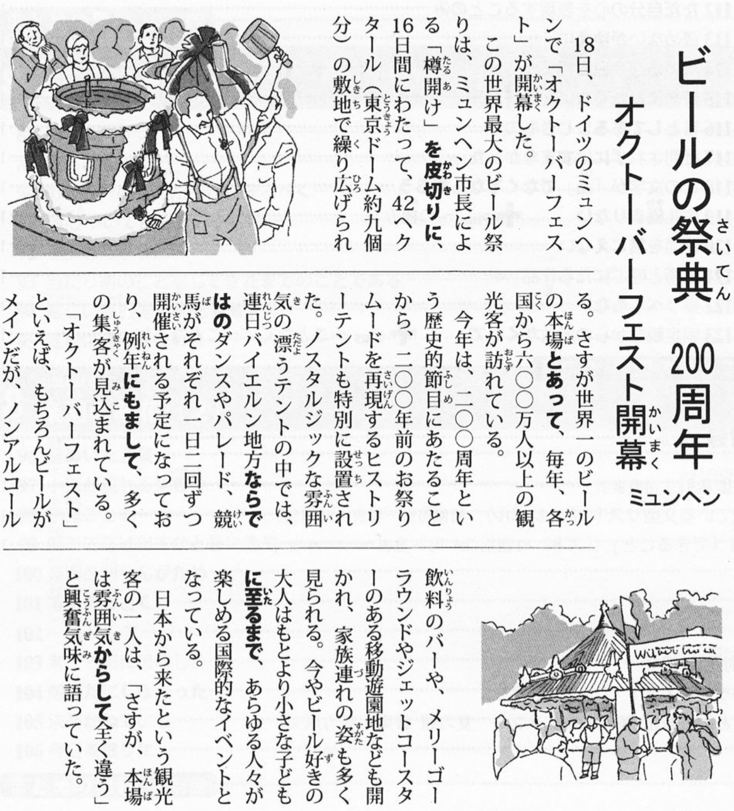

## 2 産業医を増やそう

| 日本語                 | 中国語   | 日本語               | 中国語    |
| ---------------------- | -------- | -------------------- | --------- |
| 事業所(じぎょうしょ)   | 工作场所 | わずか               | 仅仅      |
| つまり                 | 总之     | 言うまでもない       | 理所当然  |
| 病状(びょうじょう)     |          | 休職(きゅうしょく)   | 停职      |
| もはや                 | 已经     | 猶予(ゆうよ)         | 延期;犹豫 |
| 働(はたら)き盛(ざか)り | 精力充沛 | おろそか             | 疏忽      |
| さらに                 | 更加     | 各方面(かくほうめん) |           |
| さらなる               | 更加     |                      |           |

- {N} に至っては: 举例...更加(...), 至[いた]る: 到达
- {N} といえど(も): 即使是..., ...といっても, 雖[いえど]も
- {N} を余儀なくされる: 不得不..., ...ざるを得ない, 余儀[よぎ]: 其他办法
- {1量词} たりとも...{ない}: 即使一个也不...
- {V / Vない} きらいがあります: 有...不好的倾向, 嫌[きら]い
- {V} 次第だ: 解释说明, 和...んです一样
- {N} をもって: 以...为手段
- {N1} あっての {N2}: 正因為有了N1才有了N2
- {Vて} やまない: 长时间强烈的想..., 止[や]む: 停止

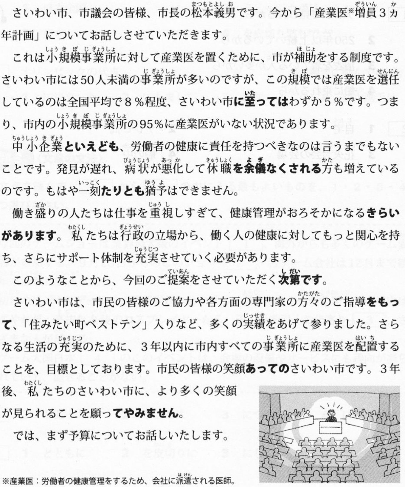

## 3 飯食わめ女房(1)

| 日本語           | 中国語             | 日本語               | 中国語   |
| ---------------- | ------------------ | -------------------- | -------- |
| けち             | 小气               | 怠(なあ)け者(もの)   | 懒人     |
| 掃除(そうじ)     | 打扫               | たいそう             | 非常     |
| 汚い(きたない)   | 脏的;不正当的      | 体中(からだじゅう)   | 全身     |
| 埃(ほこり)       | 灰尘               | 有様(ありさま)       | 状况     |
| 嫁(よめ)         | 老婆;儿媳妇        | 余計(よけい)         | 多余的   |
| 呆(あき)れる     | （对不好的事）吃惊 | 夕方(ゆうがた)       | 傍晚     |
| どうか           | 表示恳求别人       | 働き者(はたらきもの) | 勤劳的人 |
| 気立(きだ)て     | 性格               | 身(み)なり           | 打扮     |
| 見違(みちが)える | 看错               |                      |          |

- {N} まみれ: 表面粘满不舒服的.../无法摆脱...
- {N} をよそに: 不顾..., 余所[よそ]: 别处
- {简体句: AN / N} なりに / なりの{N}: 对应...的立场/水平
- {Vない} でもない: 不是不...
- {V / Vない} しまつで: 沦落到..., 始末[しまつ]: 始末;坏情况
- {V / N(助词)} なり {V / N(助词)} なり: 建议...也行...也行
- {N} ずくめ: 尽是..., 尽[ずく]め
- {AN / N} にして: 有...和...两个方面
- {N1} はおろか {N2} も/さえ/まで/すら {ない}: N1就不说了即使N2也不..., 疎[おろ]か: 不用说
- {N(助词)} すら: 甚至...(也...)

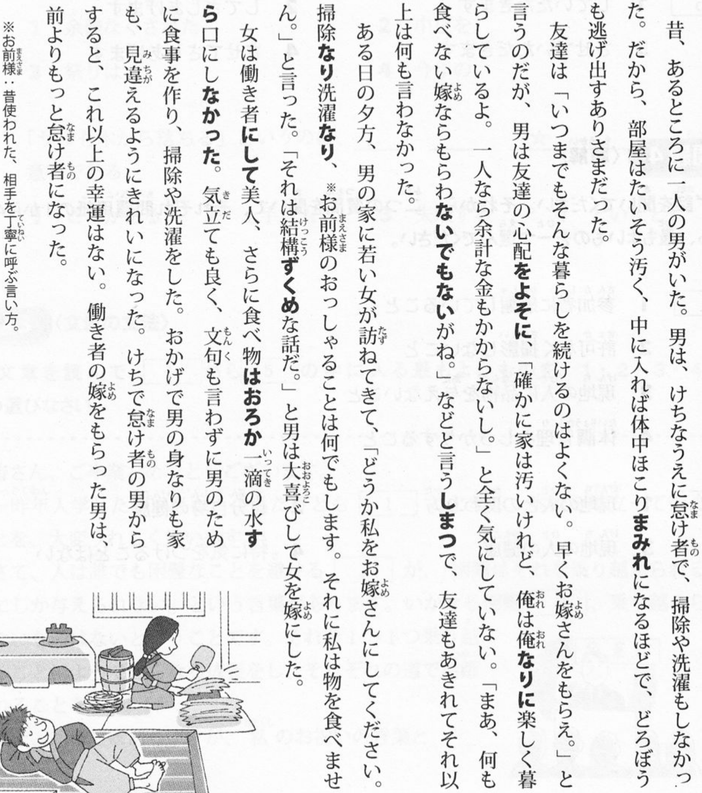

## 3 飯食わめ女房(2)

| 日本語             | 中国語                | 日本語             | 中国語          |
| ------------------ | --------------------- | ------------------ | --------------- |
| 昼間(ひるま)       | 白天                  | 向(む)こう         | 前面            |
| 自慢(じまん)       | 自夸,吹嘘             | 真っ青(まっさお)   | 铁青            |
| 化(ばけ)け物もの   | 怪物                  | 出(で)かける       | 外出            |
| ふり               | 装作(n)               | こっそり           | 悄悄地          |
| 言い残(のこ)す     | 没有说完;遗嘱         | 覗(のぞ)く         | 窥视            |
| ごろごろ           | 无所事事;滚动的隆隆声 | 一苦労(ひとくろう) | 一番辛劳        |
| 呟(つぶや)く       | 嘀咕                  | 釜(かま)           | 锅              |
| 米(こめ)           |                       | 炊(た)く           | 烧              |
| 結(むす)ぶ         | 系;连结               | 解(ほど)く         | 解开            |
| 鋭(するど)い       | 尖锐;敏锐             | 生(は)える         | 长出            |
| 現(あらわ)れる     | 显现                  | どんどん           | 连续不断;咚咚   |
| 握(にぎ)り飯(めし) | (球形或三角形)饭团    | 放(ほう)り込む     | 投入            |
| むしゃむしゃ       | 狼吞虎咽地            | 飛(と)び出(だ)す   | 跑出去;突然出现 |
| つい               | 无意中                | 悲鳴(ひめい)       | 惨叫            |
| ぎらぎら           | 闪耀的                | 光(ひか)る         | 发光            |
| 睨(にら)み付ける   | 瞪视, 怒视            | 食(く)う           | 吃;花费         |
| 捕(つか)まる       | (被)抓住              | 慌(あわ)てる       | 慌张;急忙       |

- {N} かたがた: ...顺便(后为重点), 旁[かたがた]: 借...的机会  
  {N / V连用} がてら: ...顺便
- {简体句: ANだ / Nだ} とは: 竟然...
- {Vる} なり: ...后(马上发生意外的...事)
- {V} わ {V} わ: 列举烦恼或喜悦
- {Vる / Vた} が早いか: 一...就...(惊讶)
- {Vる / Vた} そばから: 一...就...(重复做/白费), 側[そば]
- {Vない型} ずにはおかない  
  {Vない}ではおかない: 一定...
- {Vた} が最後: 一旦...(就...), 消极
- {Vて} やる: 带着不满做...

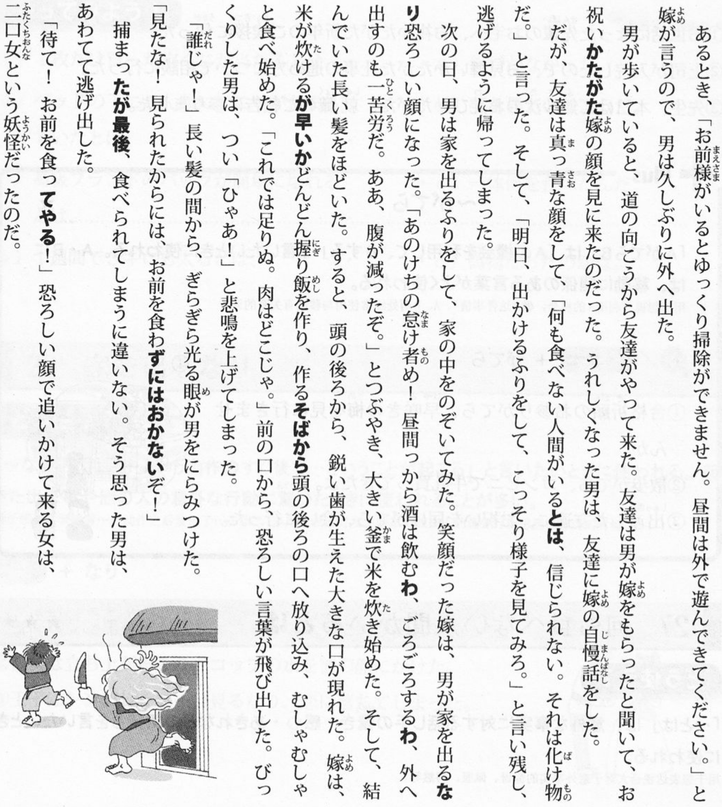

## 4 上司との付き合い方(1)

| 日本語               | 中国語      | 日本語         | 中国語      |
| -------------------- | ----------- | -------------- | ----------- |
| 一人前(いちにんまえ) | 独当一面(n) | 気楽(きらく)   | 轻松;坦然   |
| 常(つね)に           | 经常        | 上位(じょうい) | 较高的地位  |
| 指示(しじ)           |             | 仰(あお)ぐ     | 请求;仰;    |
| 何度(なんど)         | 几次        | 聞き返す       | 反复问;反问 |

- {N / V} ともなると / ともなれば: 如果是...的条件或立场(当然会...)
- {N} にひきかえ: 与...不同(...), 引き換え: 交换
- {N} もさることながら: ...自不用说(...也), 去[さ]る: 离去
- {N1} であれ {N2} であれ: N1也是N2也是(无论什么都一样)
- {N1} に即して: 根据...状态/经验/规定, (用于法规时用 則して), 即[そく]す: 顺应  
  {N1} に即した {N2}
- {N} をおいて他にない: 只有..., (积极)

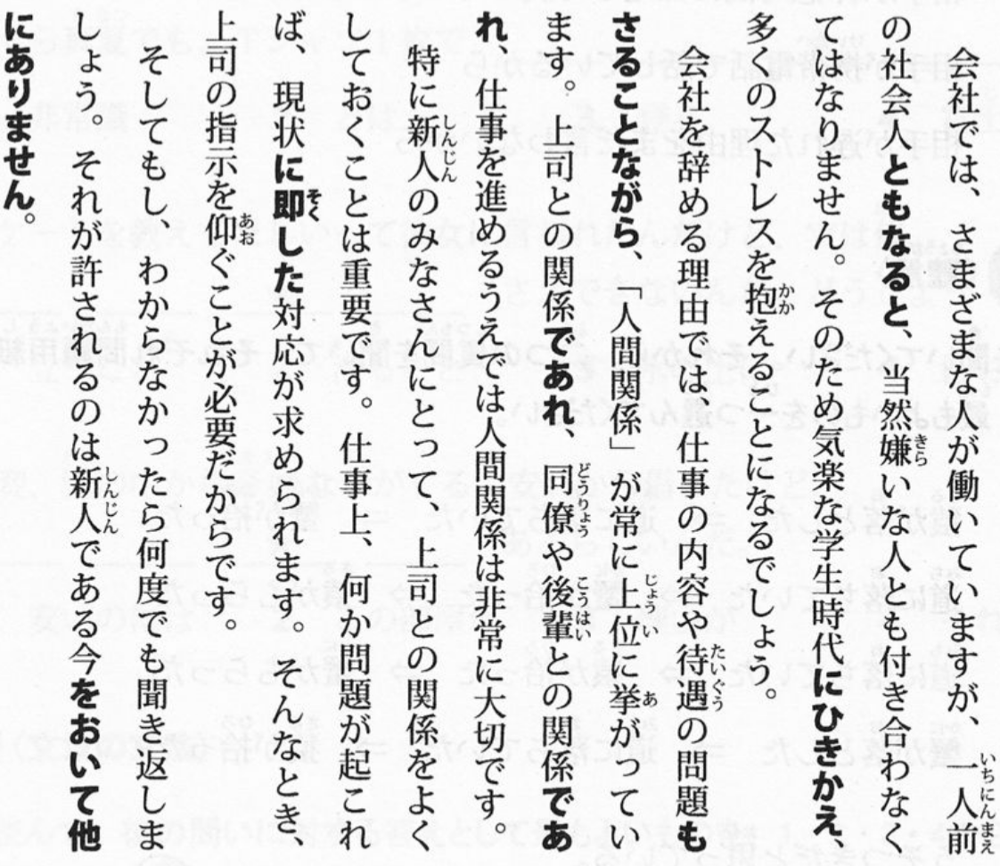

## 4 上司との付き合い方(2)

| 日本語           | 中国語          | 日本語             | 中国語                 |
| ---------------- | --------------- | ------------------ | ---------------------- |
| ちなみに         | 顺便说一句      | 伸びる             | (势力,才能等)发展;变长 |
| 素直(すなお)     | 直率;听话       | 繋(つな)がる       | 连接;关联              |
| 悪口(わるくち)   | 坏话            | 一時(いっとき)     | 暂时;一个时期;同时     |
| 気晴(きば)らし   | 散心            | 定着(ていちゃく)   | 固定,附着              |
| 美的(びてき)     |                 | 凝視(ぎょうし)     |                        |
| 細(こま)かい     | 细小;仔细       | 長所(ちょうしょ)   | 长处                   |
| 目を向ける       | 关注            | すると             | 于是                   |
| 叱(しか)る       | 责备            | 面倒見(めんどうみ) | 照顾                   |
| 緻密(ちみつ)     | 细致            | 通(つう)じる       | 通过,领会              |
| 直接(ちょくせつ) |                 | 真実味(しんじつみ) | 真情实意               |
| 言(い)わば       | 可以说,换句话说 | 思いやり           | 体谅                   |
| 周囲(しゅうい)   | 周围;周长       | 積極(せっきょく)   |                        |
| 働きかける       | 对...做工作     |                    |                        |

- {Vる} までもなく / までもない: 没必要...
- {N} (の)いかん: 看...的情况, 如何[いかん]: 如何;情况
- {Vない} までも: 虽然没...的程度(但...)
- {N1} といい {N2} といい: N1也好N2也好(都...)
- {N} といったところだ: 大概是...(举例)

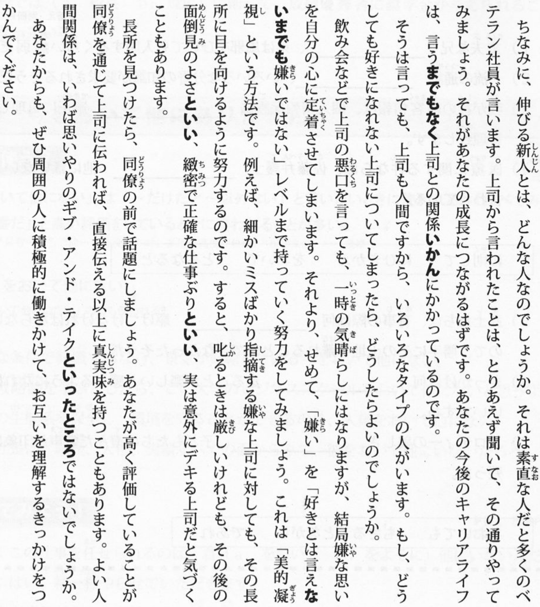

## 5 転職 (1)

| 日本語                       | 中国語            | 日本語           | 中国語    |
| ---------------------------- | ----------------- | ---------------- | --------- |
| 某月(ぼうがつ)某日(ぼうじつ) |                   | 見出(みだ)し     | 标题      |
| 宿直(しゅくちょく)           | 值夜班(n)         | 居眠り(いねむり) | 瞌睡(v,n) |
| 取り調べ                     | 审讯              | 挟(はさ)む       | 相隔;夹   |
| 間(ま)が抜ける               | 疏忽大意          | 寝込む           | 熟睡      |
| 言い訳(いいわけ)             | 借口(n,v)         | 納得(なっとく)   | 认可      |
| 潜(くぐ)り抜ける             | 通过(困境);钻过去 | 酷(こく)         | 残酷      |
| 業種(ぎょうしゅ)             | 行业类别          | マスコミ         | 媒体      |
| 騒ぎ出す                     | 开始喧闹          |                  |           |

- {简体句: AN / N} といおうか {简体句: AN / N} といおうか: 既可以...这样说也可以...那样说
- {简体句} の をいいことに: 借机做(...坏事)
- {简体句现在型: AN / N} にもほどがある: ...也该有个度; 太过于...
- {简体句: AN / N} ならまだしも: 如果...的话还能接受(但...), 未[ま]だしも: 还算过得去
- {N} 以前: 比...早很久的基础阶段
- {V} べくして {同前面Vた}: ...是理所当然, 可[べ]くして
- {N} が {同前面N(な)} だけに: 正因为...特殊

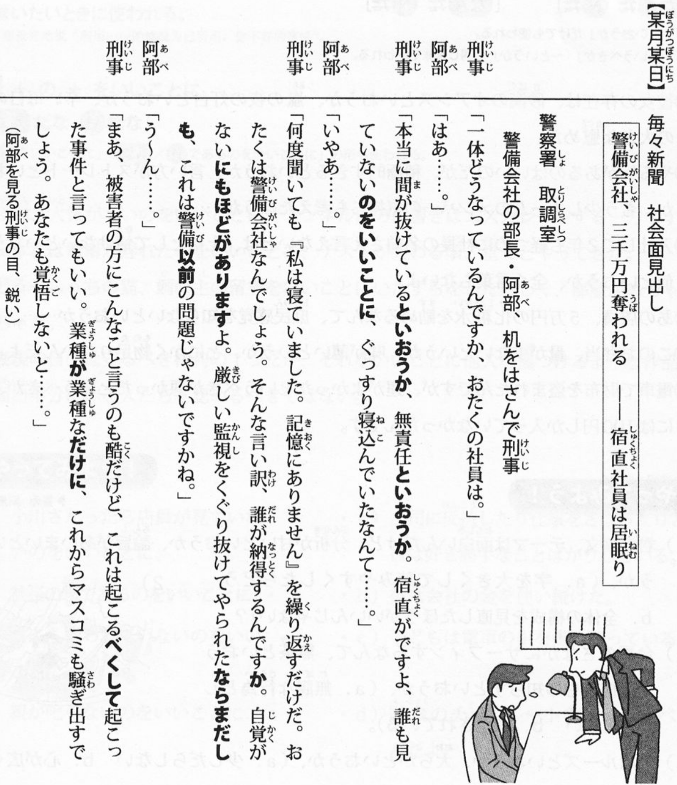

## 5 転職 (2)

- {N1} といわず {N2} といわず: N1也是N2也是
- {简体过去型} ら {同前词语过去型} で: ①不管是不是...(都不行)②...没什么大不了的,(形容词的话前面可以现在型)  
  {Vば} {同前词语过去型} で
- {N / V} にたえない: 不能忍受..., 耐[た]える: 忍受;值得;胜任
- {Vよう} ものなら: 如果要...(会导致不好的结果)
- {简体句: AN / N} ならいざしらず: 如果是...也许会那样(但不是, 所以...), いざ知らず: 不得而知
- {Vない} ものか: 想尽力.../希望对方做...(反问)
- {V / Vない / AI / AN / N} に越したことはない: 没有比...更好的了

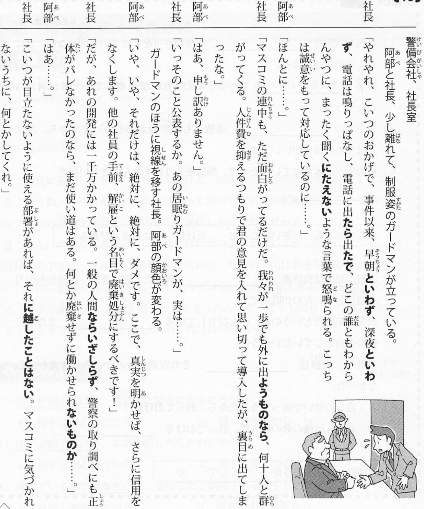

## 5 転職 (3)

- {简体句: AN / N} とはいえ: 虽然...
- {V / N} といったところだ: 程度/数量大概是那样(表达不够的心情, 常和"顶多/总算/好歹"等一起使用)
- {V} に {同前V可能型ない}: 想做...但做不了
- {N} にかこつけて: 借口...(做...), 多用于批评, 託[かこ]つける

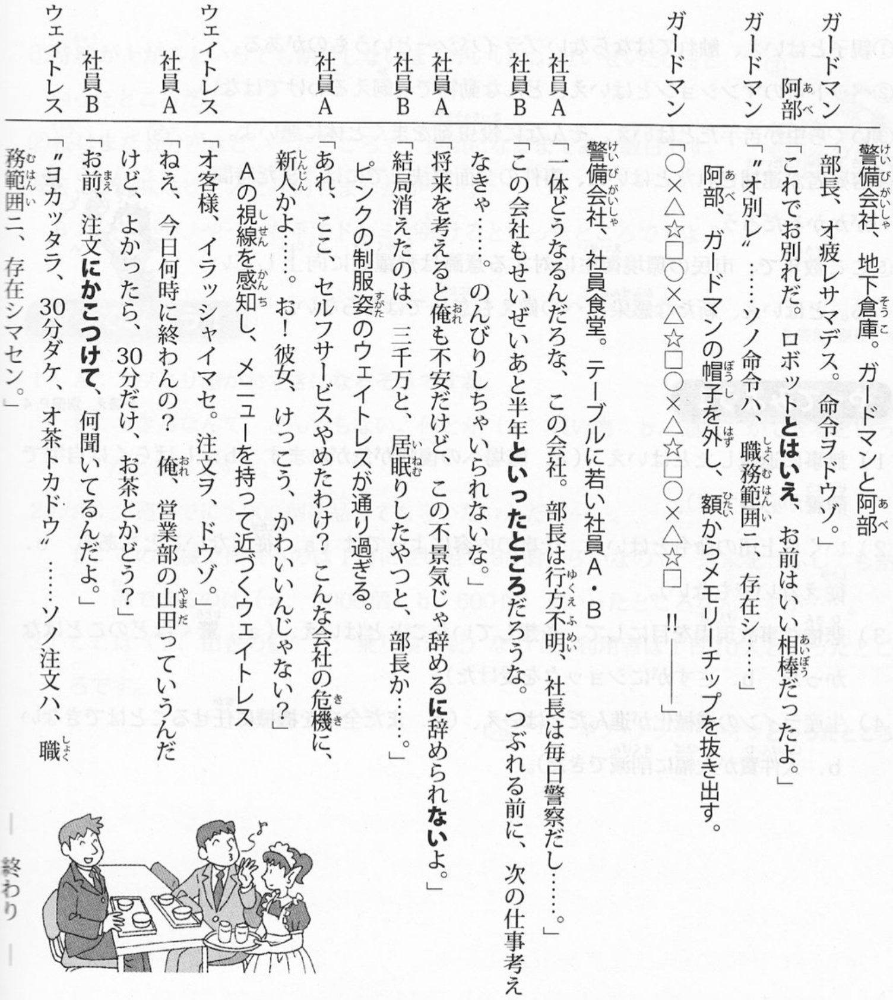

## 6 研修を終えて

- {AI / Nの} ところ(を): 用于表示道歉/请求/感谢的铺垫说法
- {N} の至り: 非常..., 至[いた]る: 到
- {N} をもって / をもちまして: 某事发生或改变的时间点
- {Nの / Vない} こととて: 因为...(多用于道歉)
- {N} にたえない: 非常..., 耐[た]える: 忍受;值得;胜任
- {N} たる{N2} / たるに: 在...的立场/地位, (阐述理所当然怎样), 足る: 值得,足以相称的资格
- {AI / ANな} 限りだ: 强烈的感觉到...

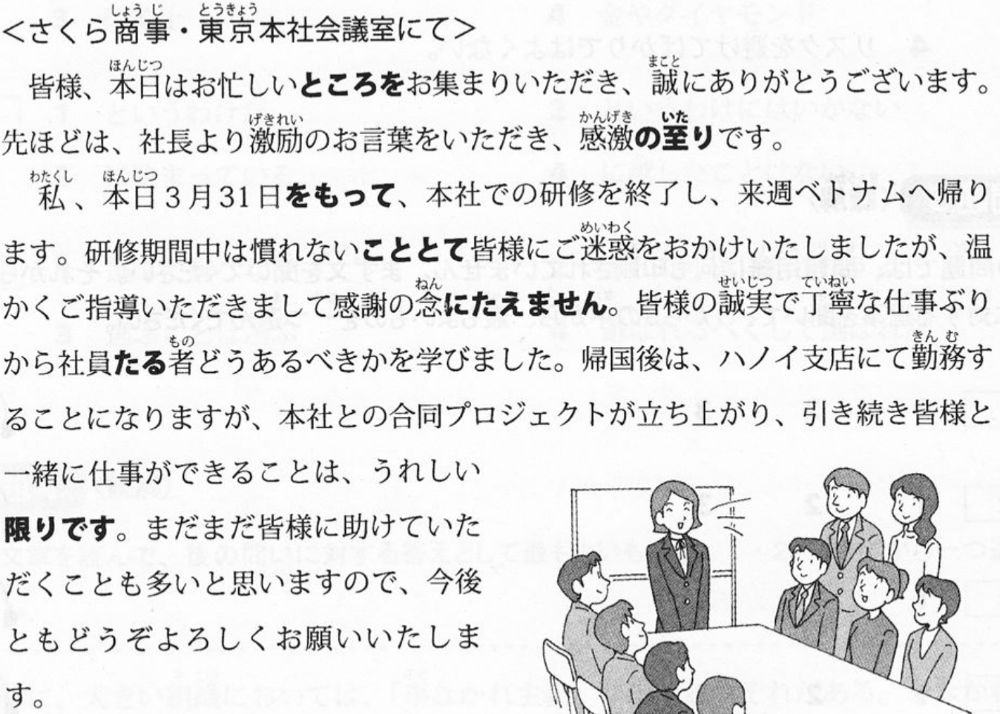

## 7 さすが本田君(1)

- {N} じゃあるまいし / ではあるまいし: 又不是...(却...), 批评或表达意见
- {Vない型} んばかり: 几乎要...的样子  
  する→せんばかり
- {V假定} それまで: 如果...一切都完了
- {简体句: ANな / Nな} ものを: 同~のに
- {N} ときたら: ...太糟糕了
- {Vた} ところで: 即使...(也没用)
- {Vよう} が/と: 就算..., 表达不受影响的态度/不可改变的事实
- {Vよう} が/と {同前V} まいが / まいと: 不管是不是...(都...)
- {简体句现在型: AN / N} 要是...就...这样了, 表达提意见和抱怨
- {N} にすれば / にしたら / にしても / にしてみれば: 在...的立场考虑, 想象别人的想法
- {V} までのことだ / までだ: 大不了...

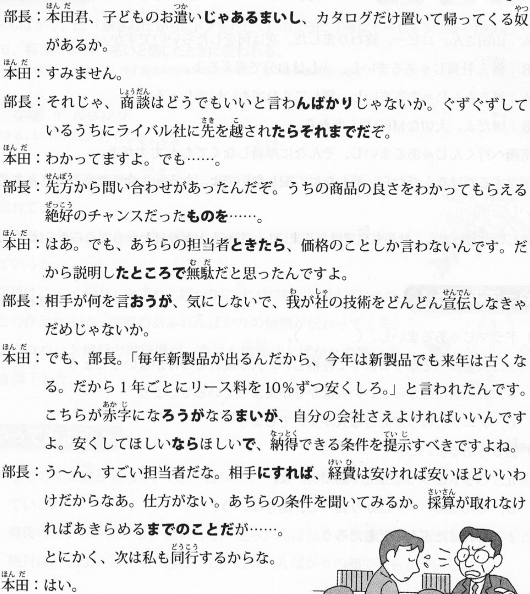

## 7 さすが本田君(2)

- {AI / AN(だ) / N(だ) / V} といったらない / ったらない / といったらありゃしない / ったらありゃしない: 无法用言语表达,非常...
- {Vよう} にも {同前面V可能型ない}: 想做...但做不到
- {V连用} まくる: 一味做..., 反复做..., 捲[まく]る: 卷起;拼命做
- {N} にしたところで / にしたって: 即使...(也...), 后跟不好的事
- {Vて} みせる: 一定要努力...

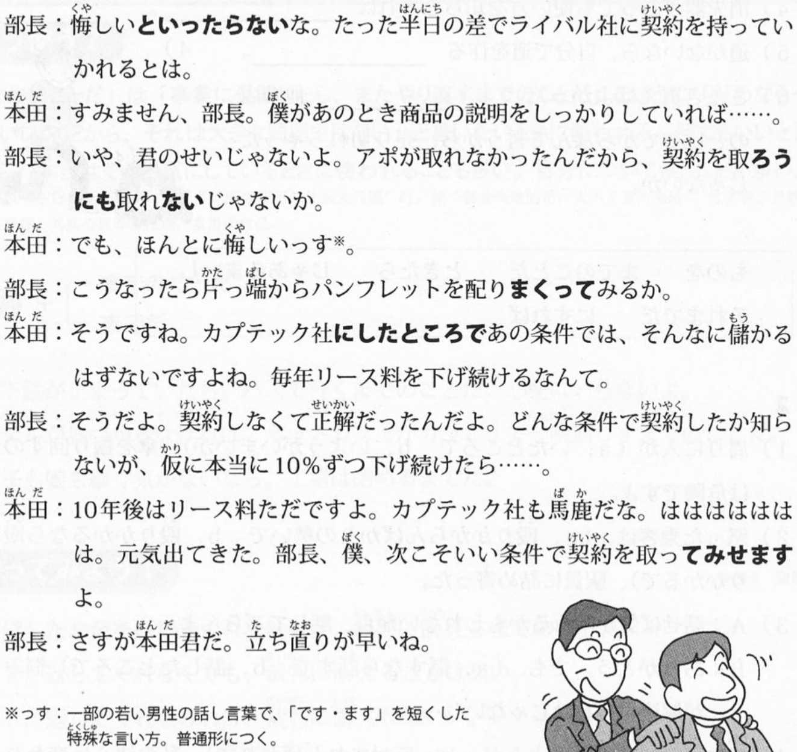

## 8 楽围の萌花(1)

- {V连用} つ {V连用} つ: 两个动作重复进行
- {V} ともなく: 不是特别有意识地做...
- {V} べく: 一心想要...
- {Vて} からというもの: 自从...(就一直...)
  {N} というもの: 在此期间一直...
- {V连用 / N} ながら(に): 抱持...的状态
  {} ながらの {N}
- {Vた} までのことだ / までだ: 不过是..., 表达谦虚
- {N} をものともせず(に): 不顾困难...
- {V / N} かたわら: 一边...(一边...), 傍[かたわ]ら: 旁边;一边...一边...(书面)

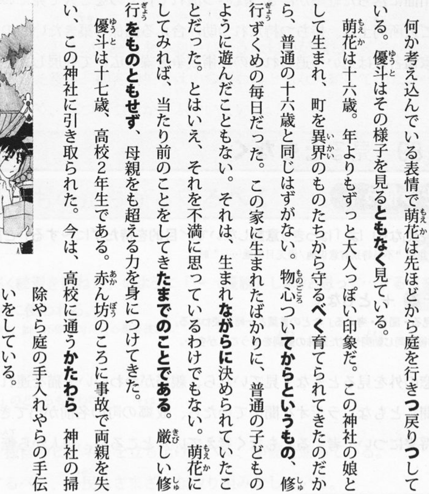

## 8 楽围の萌花(2)

- {N} めく / めいた{N}: 像...的样子, 「...らしく見える」
- {V} や否や / や: 刚刚...(立刻...)
- {V（が）/ Vた（が）/ N(の)} ごとき / ごとく / ごとし： 像...一样, 如[ごと]く (与「〜ような」「〜ように」「〜ようだ」用法相同)
- {简体句: AN / N} かと思いきや: 本以为...却...「...かと思うと」
- {Vない型} んがため / んがための{N}: 为了...
- {N} にして: 相当于生硬的「で」, 明确表达情况/状态
- {Vる} だに: 就连...(都...), 表示害怕/痛苦/艰难等情绪
- {N} だにしない: 压根没
- {V连用} かねる: 难以...
- {时间相关N} を限りに / 限りで: 到...为止

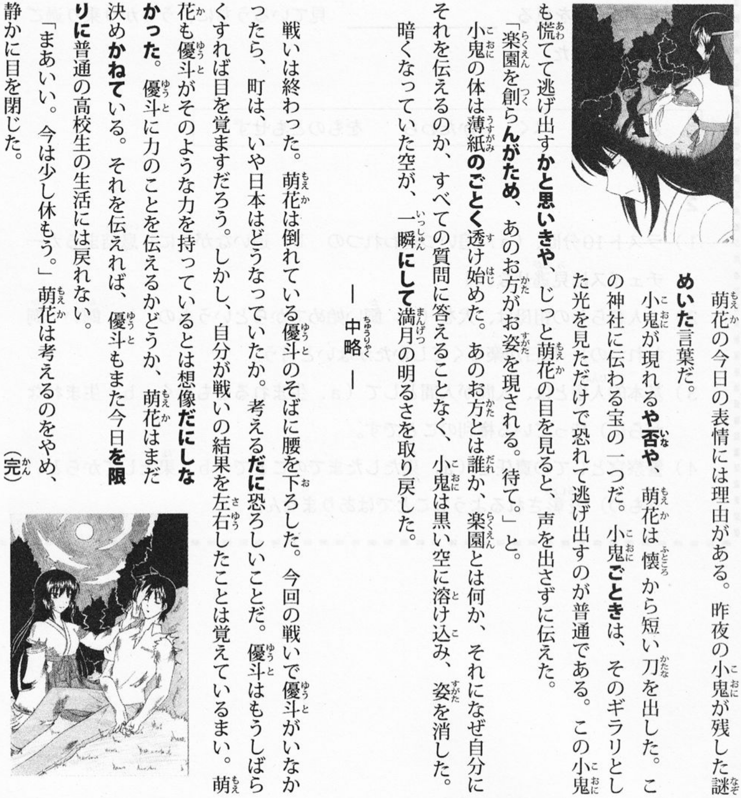

## 9 トリアージ

- {数量 + 量词} からいる / からある / からの {N}: 多达..., 强调数量很大
- {N} にかかわる: 与...有关;对...有重大影响, 関[かか]わる
- {N} にあって: 在...的特殊状况下
- {Vます} ようによって: 根据...

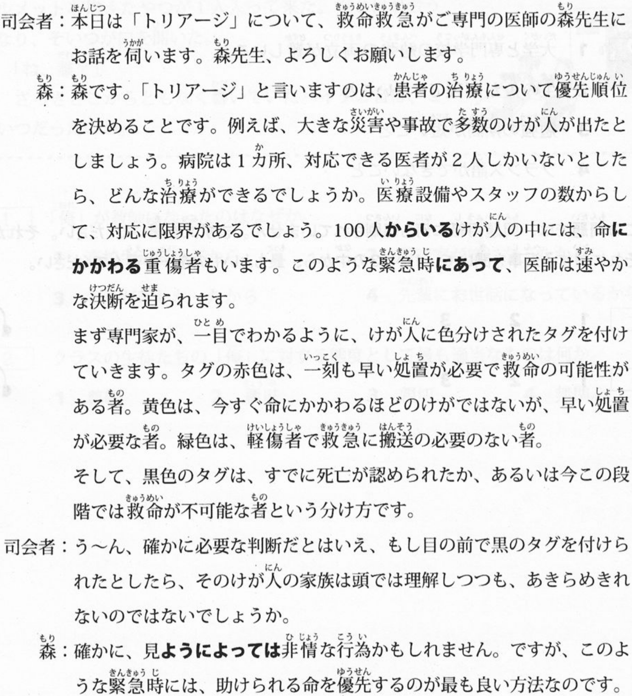
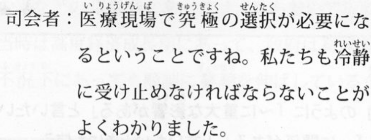

## 10 前衛書道

- {V} べからず: 禁止..., 书面
  {V} べからざる {N}
- (ただ) {V / N} のみ: 真的只是..., 书面
- {简体句} がうえ: 「から / ため」, 书面
- {N} と相まって / が相まって: 与...相结合, 共同作用, 相[あ]まって
- {V / N}  にかたくない: 不难..., 難[かた]くない
- {N1} としてあるまじき/ にあるまじき {N2}: 作为...不应该有的行为, あるまじき: 不合适的
- {Vない型} ずにはすまない / ないではすまない: 不能不..., 済む,书面
- {N} でなくてなんだろう / でなくてなんであろう: 不是...又是什么呢; 真的是...
- {AN} 極まりない / 極まる: 极其...(消极), 極[きわ]まる: 到达极限
  {Nの} 極み: 非常...
- {N} を禁じ得ない: 禁不住..., 禁[きん]じる: 禁止
- {V / N} にたる: 值得..., 足[た]る: 值得;能够
- {V} べくもない: 不应该/无法...
- {N / Vこと} なくして(は) {ない}: 没有...就不能...
  {V} ことなく / ことなしに

