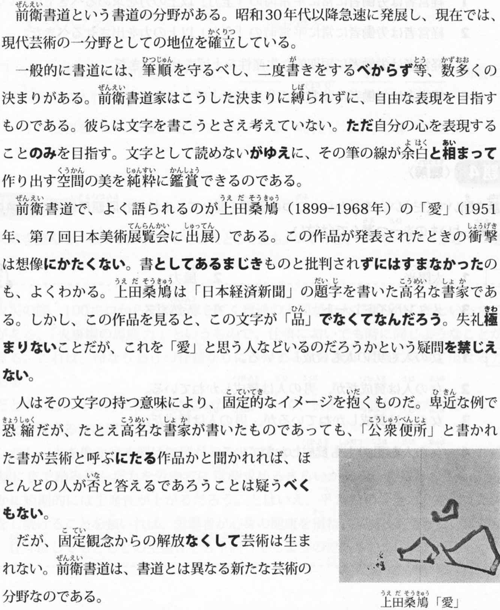

# TRY！N1语法必备

## 1 オクトーバーフエスト

| 日本语 | 中文翻译 | 日本语 | 中文翻译 |
|--------|----------|--------|----------|
| ミュンヘン(munhen) | 慕尼黑 | 樽(たる) | 木桶，酒桶 |
| ヘクタール(hectare) | 公顷 | ドーム(dome) | 圆顶 |

- {Vるの / Vたの / N} を皮切りに(して) / を皮切りとして: 从...开始(接连发生...), 皮切[かわき]り: 开端(积极,书面)
- {简体句: AN / N} とあって: ...(很特别)和一般不同(书面)
- {N1} ならではの {N2}: 是N1独有的N2
- {N} にもまして: 比...更加(...), ...也是但更加(...), 増[ま]す: 增加
- {N} に至るまで: 到...之前所有的地方/时间等, 至[いた]る: 到达(书面)
- {N} からして: 举...例(全部都...)

## 2 産業医を増やそう

- {N} に至っては: 举例...更加(...), 至[いた]る: 到达
- {N} といえど(も): 即使是..., ...といっても, 雖[いえど]も
- {N} を余儀なくされる: 不得不..., ...ざるを得ない
- {1量词} たりとも...ない: 即使一个也不...
- {V / Vない} きらいがあります: 有...不好的倾向, 嫌[きら]い
- {V} 次第だ: 解释说明, 和...んです一样
- {N} をもって: 以...为手段
- {N1} あっての {N2}: 正因為有了N1才有了N2
- {Vて} やまない: 长时间强烈的想..., 止む

## 3 飯食わめ女房(1)

- {N} まみれ: 表面粘满不舒服的.../无法摆脱...
- {N} をよそに: 不顾...
- {简体句: AN / N} なりに / なりの{N}: 对应...的立场/水平
- {Vない} でもない: 不是不...
- {V / Vない} しまつで: 沦落到..., 始末[しまつ]: 始末;坏结果
- {V / N(助词)} なり {V / N(助词)} なり: 建议...也行...也行
- {N} ずくめ: 尽是..., 尽[ずく]め
- {AN / N} にして: 有...和...两个方面
- {N1} はおろか {N2} も/さえ/まで/すら {ない}: N1就不说了即使N2也不..., 疎[おろ]か: 不用说
- {N(助词)} すら: 甚至...(也...)

## 3 飯食わめ女房(2)

- {N} かたがた: ...顺便(后为重点), 旁[かたがた]  
  {N / V~~ます~~} がてら: ...顺便
- {简体句: ANだ / Nだ} とは: 竟然...
- {Vる} なり: ...后(马上发生意外的...事)
- {V} わ {V} わ: 列举烦恼或喜悦
- {Vる / Vた} が早いか: 一...就...(惊讶)
- {Vる / Vた} そばから: 一...就...(重复做/白费), 側[そば]
- {V~~ない~~} ずにはおかない  
  {Vない}ではおかない: 一定...
- {Vた} が最後: 一旦...(就...), 消极
- {Vて} やる: 带着不满做...

## 4 上司との付き合い方(1)

- {N / V} ともなると / ともなれば: 如果是...的条件或立场(当然会...)
- {N} にひきかえ: 与...不同(...), 引き換え: 交换
- {N} もさることながら: ...自不用说(...也), 去[さ]る: 离去
- {N1} であれ {N2} であれ: N1也是N2也是(无论什么都一样)
- {N1} に即して: 根据...状态/经验/规定, (用于法规时用 則して), 即[そく]す: 顺应  
  {N1} に即した {N2}
- {N} をおいて他にない: 只有..., (积极)

## 4 上司との付き合い方(2)

- {Vる} までもなく / までもない: 没必要...
- {N} (の)いかん: 看...的情况, 如何[いかん]: 如何;情况
- {Vない} までも: 虽然没...的程度(但...)
- {N1} といい {N2} といい: N1也好N2也好(都...)
- {N} といったところだ: 大概是...(举例)

## 5 転職 (1)

- {简体句: AN / N} といおうか {简体句: AN / N} といおうか: 既可以...这样说也可以...那样说
- {简体句} の をいいことに: 借机做(...坏事)
- {简体句现在型: AN / N} にもほどがある: ...也该有个度; 太过于...
- {简体句: AN / N} ならまだしも: 如果...的话还能接受(但...)
- {N} 以前: 比...早很久的基础阶段
- {V} べくして {同前面Vた}: ...是理所当然, 可[べ]くして
- {N} が {同前面N(な)} だけに: 正因为...特殊

## 5 転職 (2)

- {N1} といわず {N2} といわず: N1也是N2也是
- {简体过去型} ら {同前词语过去型} で: ①不管是不是...都不行②...没什么大不了的,(形容词的话前面可以现在型)  
  {Vば} {同前词语过去型} で
- {N / V} にたえない: 不能忍受..., 耐[た]える: 忍受;值得;胜任
- {Vよう} ものなら: 如果要...(会导致不好的结果)
- {简体句: AN / N} ならいざしらず: 如果是...也许会那样(但不是, 所以...), いざ知らず: 不得而知
- {Vない} ものか: 想尽力.../希望对方做...(反问)
- {V / Vない / AI / AN / N} に越したことはない: 没有比...更好的了

## 5 転職 (3)

- {简体句: AN / N} とはいえ: 虽然...
- {V / N} といったところだ: 程度/数量大概是那样(表达不够的心情, 常和"顶多/总算/好歹"等一起使用)
- {V} に {同前V可能型ない}: 想做...但做不了
- {N} にかこつけて: 借口...(做...), 多用于批评, 託[かこ]つける

## 6 研修を終えて

- {AI / Nの} ところ(を): 用于表示道歉/请求/感谢的铺垫说法
- {N} の至り: 非常..., 至[いた]る: 到
- {N} をもって / をもちまして: 某事发生或改变的时间点
- {Nの / Vない} こととて: 因为...(多用于道歉)
- {N} にたえない: 非常..., 耐[た]える: 忍受;值得;胜任
- {N} たる{N2} / たるに: 在...的立场/地位, (阐述理所当然怎样), 足る: 值得,足以相称的资格
- {AI / ANな} 限りだ: 强烈的感觉到...

## 7 さすが本田君(1)

## 7 さすが本田君(2)

## 8 楽围の萌花(1)

## 8 楽围の萌花(2)

## 9 トリアージ

## 10 前衛書道

