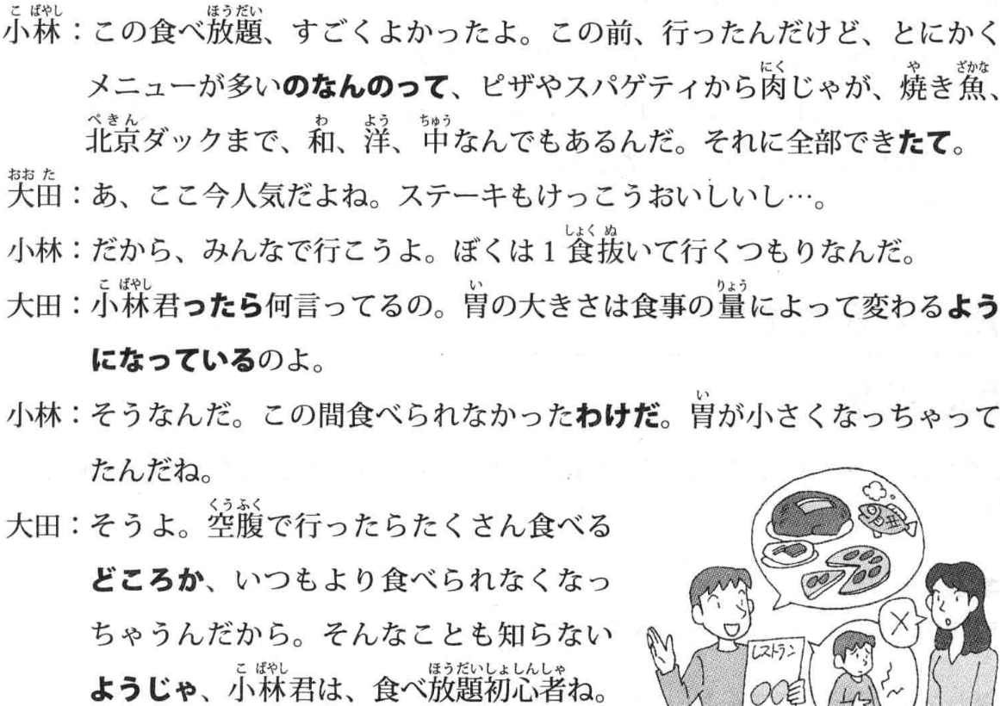
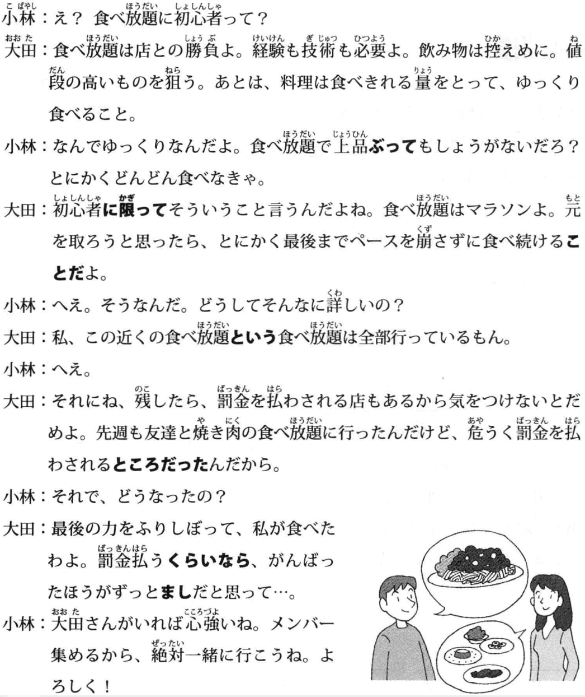
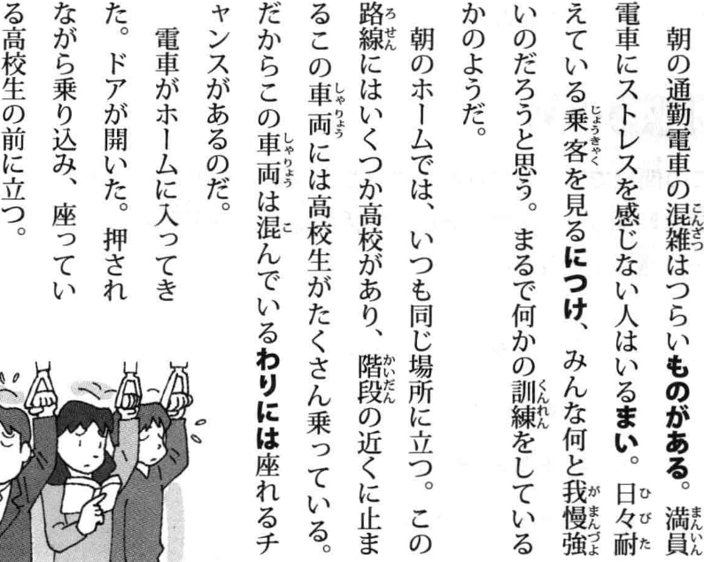
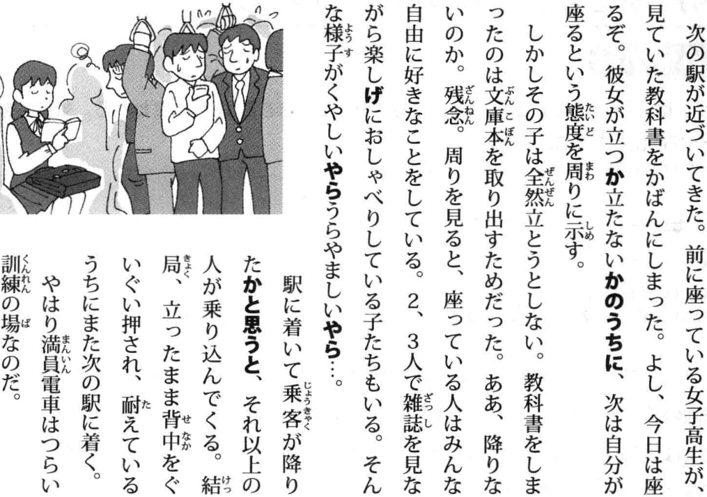
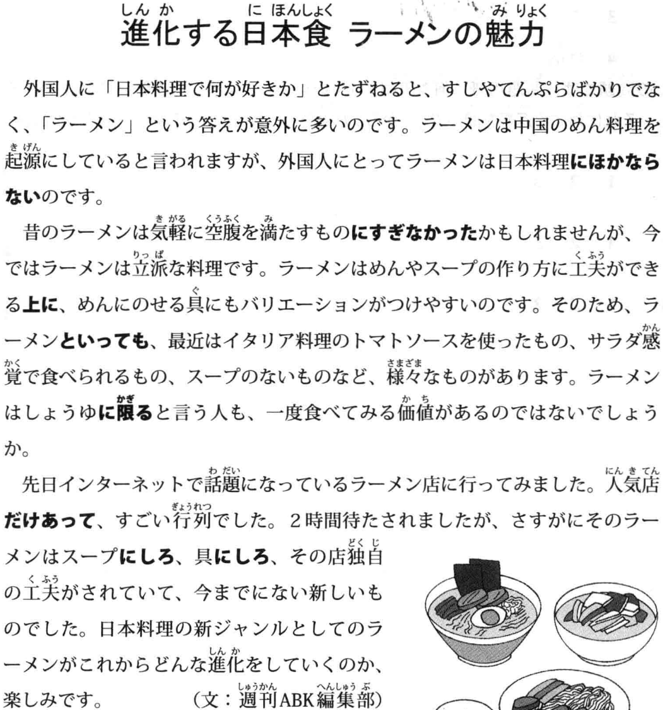
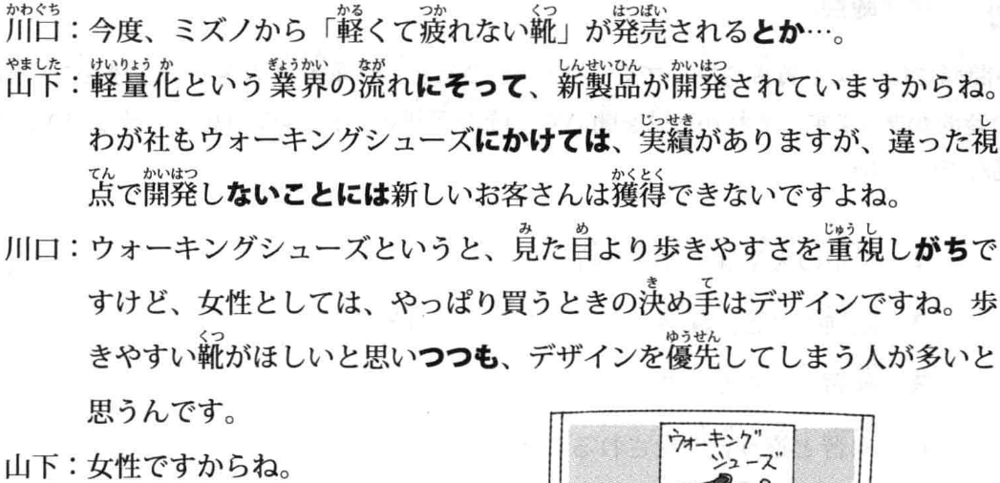
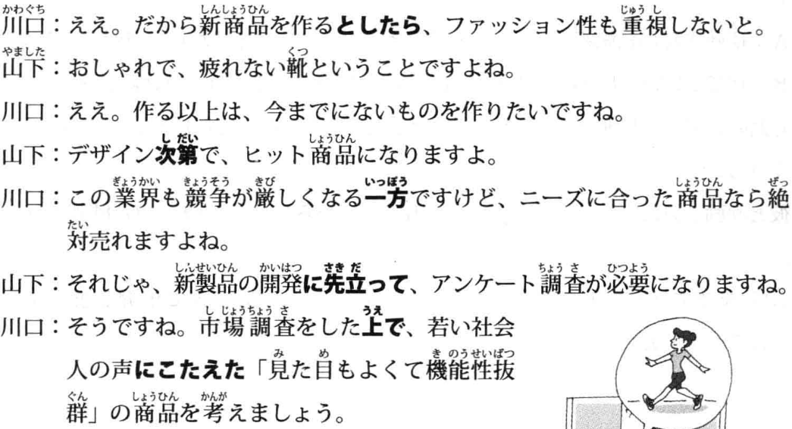
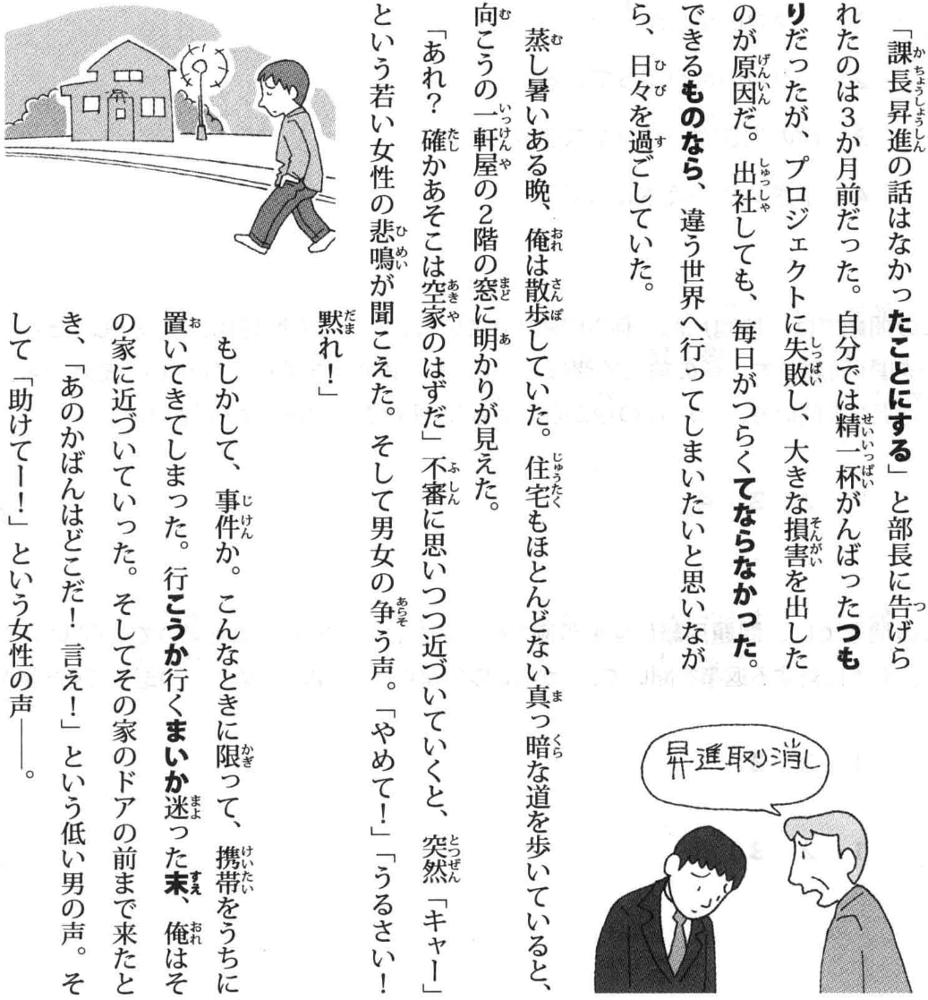
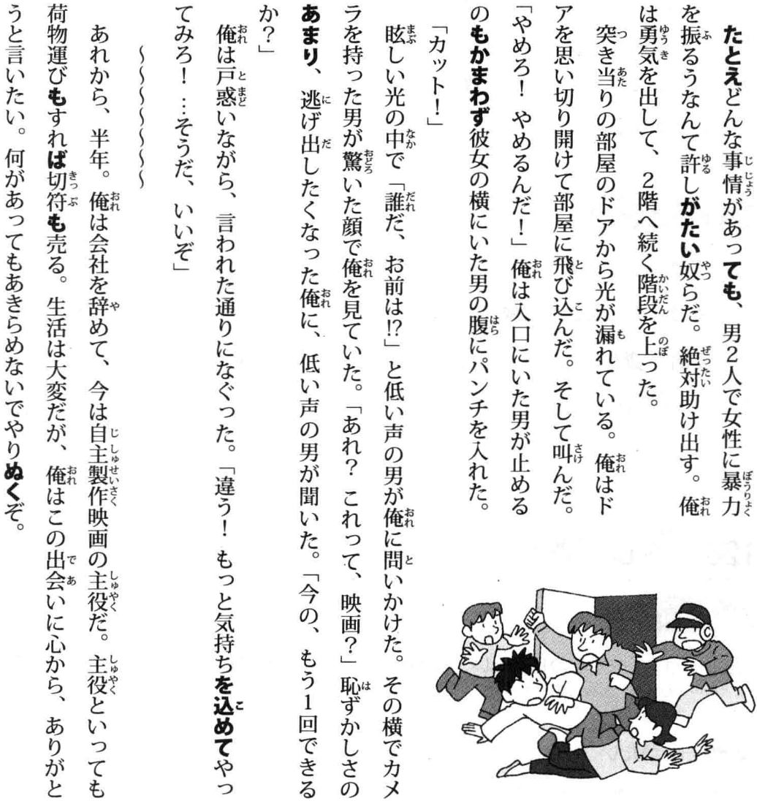
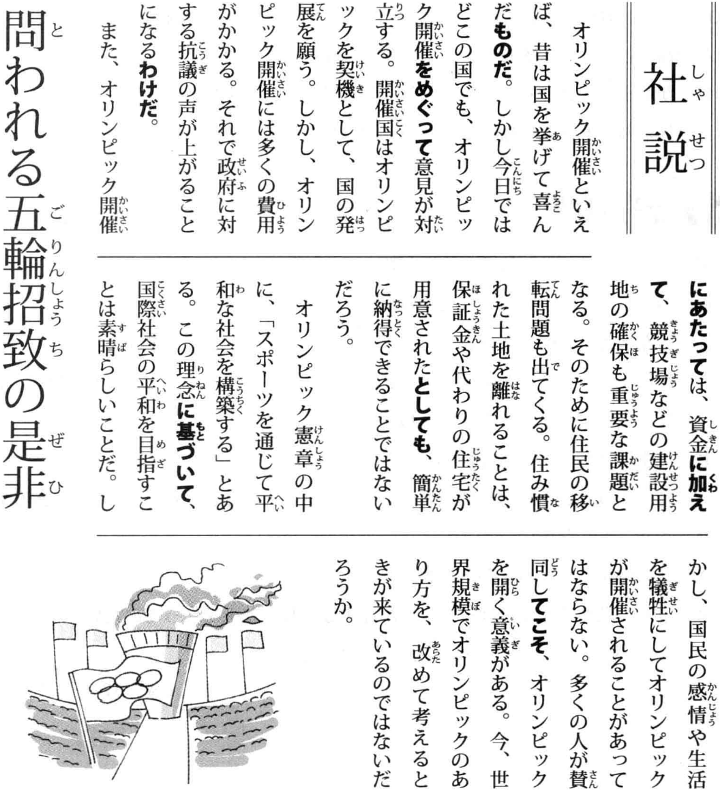

# TRY！N2语法必备

## 1 スタッフ募集のお知らせ

| 日本語 | 中国語 | 日本語 | 中国語 |
|--------|---------|--------|---------|
| お知らせ | 通知, 告示 | 周囲（しゅうい） | 周围,环境 |
| 人材（じんざい） | 人才,职员,工作人员 | 万引き（まんびき） | 入店行窃 |
| 求（もと）める | 寻求,寻找 | 浮気（うわき） | 花心,感情不专一 |
| 開店（かいてん） | 开店,开始营业 | 単純（たんじゅん） | 单纯,简单 |
| 閉店（へいてん） | 关店,打烊,结束营业 | にせ物（もの） | 山寨货,假货 |
| 業務（ぎょうむ） | 工作,业务 | 服装（ふくそう） | 服装 |
| 販売（はんばい） | 销售,卖 | 心がける | 放在心上,多及 |
| 清掃（せいそう） | 扫除,打扫 | 要望（ようぼう） | 需求 |
| やる気がある | 有干劲 | 手当て（てあて） | 津贴:工资以外支付的钱 |
| 大歓迎（だいかんげい） | 热烈欢迎 | 返品（へんぴん） | 退货 |
| 接客（せっきゃく） | 接待顾客 | 発言（はつげん） | 发言 |
| 応対（おうたい） | 应对,回答 | 晴雨（せいう） | 晴天或者雨天 |
| 給与（きゅうよ） | 报酬,工资,薪水 | 意見をまとめる | 汇总/整理意见 |
| 考慮（こうりょ） | 考虑 | 寄付（きふ） | 捐赠,捐助,捐款 |
| 往復（おうふく） | 往返(往返于) | 汚染（おせん） | 污染 |
| 支給（しきゅう） | 支付,报销 | 幸運（こううん） | 好运,幸运 |
| 所定（しょてい） | 指定 | 失業（しつぎょう） | 失业 |
| フォーム | 表格，形式 | 紛失（ふんしつ） | 遗失 |
| 問（と）い合わせ | 问询，打听 | 火災（かさい） | 火灾 |
| 書類審査（しょるいしんさ） | 书面材料审查 | 屋内（おくない） | 室内 |
| 採否（さいひ） | 是否采用 | ~~パスワード~~ | 密码 |
| 持参（じさん） | 携带,随身携带 | 着用（ちゃくよう） | 穿着(穿戴,系好) |
| 改装工事（かいそうこうじ） | 装修施工 | 非常ボタン | 紧急按钮 |
| 左記（さき） | 如左图所示 | 期限（きげん） | 最后期限,截止日 |
| 仮店舗（かりてんぽ） | 临时店铺 | 厳守（げんしゅ） | 严格遵守 |
| キャンペーン | 促销活动 | 振り込み | 转账，存入 |
| 生（なま）もの | 生食,生的食物 | 願書（がんしょ） | 申请书,报名表 |
| 点検（てんけん） | 检查 | 窓口（まどぐち） | 联络窗口,联络人 |
| 臨時休業（りんじきゅうぎょう） | 临时停业 | 筆記用具（ひっきようぐ） | 书写工具 |
| 昼夜（ちゅうや） | 昼夜 | 分別（ぶんべつ） | 区别,分别,判别 |
| 深夜（しんや） | 深夜,半夜 | 承る(うけたまわる) | 接受，听从；聆听 |
| 有無（うむ） | 有无 | サミット | 峰会 |
| 老若男女（ろうにゃくだんじょ） | 男女老少 | 下取り(したどり) | 以旧换新 |
| 提供（ていきょう） | 提供,供应,给予 | 通常(つうじょう) | 通常，平常 |

- {N} につき: 因为(郑重表达, 用于通知/告示/书信)
- {N} を問わず/は問わず:  无论~, 不管~(正式文体), 問[と]う: 询问
- {N} に限って / に限り：唯独~, 只有~(正式文体)
- {N} に応じて(は) / に応じ / に応じた: 根据...(情况条件)做、応[おう]じる：按照
- {V / Vない} にかかわらず / にかかわりなく：与...无关, 関わる[かかわる]: 关系到
- {N} において / における:  在...(地点/时代/领域), 於ける[おける]
- {Vる / Vた / Nの} 際に：在...情况时(书面)
- {Vる / Vない / Nの} ことだ: (不)应该~(注意事项)

<audio controls src="/assets/audio/TRYN2/02 曲目 2.mp3" title="2" style="width: 100%;"></audio>

## 2 転任のあいさつ(1)

| 日语 (假名) | 中文含义 | 日语 (假名) | 中文含义 |
|------------|---------|------------|---------|
| 転任 (てんにん) | 转任 | 防止 (ぼうし) | 防止 |
| 命 (めい) じる | 命令、要求 | 活発 (かっぱつ) | 活跃、生动 |
| 日課 (にっか) | 每天必做的事 | 口答え (くちごたえ) | 顶嘴 |
| 遺伝子 (いでんし) | 遗传基因 | ちっとも～ない | 完全不/没～ |
| 見直す (みなおす) | 重新考虑/审视 | 反抗 (はんこう) | 反抗 |
| スパイス(spice) | 香料 | めいっぱい | 尽全力, 尽可能 |
| 電子レンジ(microwave oven) | 微波炉 | おしゃれ | 时尚, 潮 |
| ジャケット(jacket) | 夹克外套 | 宗教 (しゅうきょう) | 宗教 |
| 入荷 (にゅうか) | 入荷, 进货; 到货 | 店舗 (てんぽ) | 店铺 |
| 従業員 (じゅうぎょういん) | 职员 | 開設 (かいせつ) | 开设, 建立 |
| 解雇 (かいこ) | 解雇 | 周辺 (しゅうへん) | 周围, 周边环境, 附近 |
| 認 (みと) める | 认可, 承认 | コストパフォーマンス | 性价比, 性能价格比 |
| 尊敬 (そんけい) | 尊敬 | 円高 (えんだか) | 日元升值, 日元走强 |
| 清掃 (せいそう) | 扫除, 打扫 | 農村 (のうそん) | 农村 |
| 同意 (どうい) | 同意 | IC レコーダー | 录音笔, 录音设备 |
| 睡眠 (すいみん) | 睡眠 | 小型 (こがた) | 小型 |
| 確保 (かくほ) | 保障, 确保 | 録音 (ろくおん) | 录音 |
| 犯罪 (はんざい) | 犯罪 | 疑う (うたがう) | 怀疑 |

- {Vて / N} 以来：～以后(一直保持)
- {N} をはじめ(として) / をはじめとする：以~为首, 以~为代表, 始め[はじめ]
- {N} のもとで / のもとに：在…(范围)下, 下[もと]:  下面; 身边
- {N} はもちろん/はもとより: 除了…还有, besides(正式)
- {V / ANな / AI} ものだ：理应…(命令)
- {V / Nの} 上で(は) / 上での: 在...上(方面), 后跟重要的事, 上[うえ]
- {V连用 / AI / AN / N} ながら(も):  虽然…但是…

<audio controls src="/assets/audio/TRYN2/04 曲目 4.mp3" title="4" style="width: 100%;"></audio>

## 2 転任のあいさつ(2)

| 日语 (假名) | 中文含义 | 日语 (假名) | 中文含义 |
|------------|---------|------------|---------|
| 拡大（かくだい） | 扩大 | 出場（しゅつじょう） | 出场,出赛 |
| 挑戦（ちょうせん） | 挑战,尝试 | 扱う（あつかう） | 处理,对应;经销,操作 |
| 全力（ぜんりょく） | 全力 | 期日（きじつ） | 期限,日期 |
| 慣(な)れ親(した)しむ | 熟识,亲近 | 間（ま）に合わせる | 赶上 |
| 心遣い（こころづかい） | 关心,关照 | 誇り（ほこり） | 荣耀,自豪,自尊心 |
| 組織（そしき） | 组织 | 全力を尽(つ)くす | 尽全力 |
| シンポジウム | 研讨会 | 税金（ぜいきん） | 税,税金 |
| 総意（そうい） | 共识 | 裁判(さいばん) | 裁判，审判 |
| **手本（てほん）** | 榜样,模板 | 争う（あらそう） | 竞争,争斗 |
| ~~エンジニア~~ | 工程师 | 生涯（しょうがい） | 生涯 |
| 前提（ぜんてい） | 前提 | 終(お)える | 终结,终止,结束 |
| 交際（こうさい） | 交际；交往,谈恋爱 | 溢れる（あふれる） | 溢出,充满 |
| 利益（りえき） | 利益 | 業績（ぎょうせき） | 业绩 |
| 採用（さいよう） | 采用,录用,录取 | 収入（しゅうにゅう） | 收入 |
| ~~キャプテン(captain)~~ | 队长,船长 | 減少（げんしょう） | 减少 |
| 一丸（いちがん）となって | 齐心协力,抱成一团 | 貯金（ちょきん） | 存款 |
| 思い切り（おもいきり） | 决意,断念；尽量地,彻底地 | 増加（ぞうか） | 增加 |
| 監督（かんとく） | 教练,总监,导演 | 真実（しんじつ） | 真相,真实 |
| **投書（とうしょ）** | 投诉；投稿, 读者来信 | フリー | 免费；自由 |
| 昆虫（こんちゅう） | 昆虫 | 優（すぐ）れる | 卓越,优秀,出色 |
| 就任（しゅうにん） | 就任 | 天候（てんこう） | 天气 |
| 発展（はってん） | 发展 | 規則（きそく） | 规则 |
| ノーベル賞（しょう） | 诺贝尔奖 | 乱れ(みだれ) | 乱，杂乱 |
| 受賞（じゅしょう） | 获奖 | 取り扱う | 操作，处理，经营，对待 |
| 受験生（じゅけんせい） | 考生 | 〜に励む(はげむ) | 勤于～ |
| 地域(ちいき)ぐるみ | 全域 | ついに | 终于，好不容易才… |
| 催し物(もよおしもの) | 文娱活动，集会，庆典 | 精一杯(せいいっぱい) | 尽力，拼命 |
| ~~コンテスト~~ | 竞赛,大赛,比赛 | 応援(おうえん) | 应援，声援 |

- {NA} を {NB} とする / に: 把A当作B
- {Vるの / N} がきっかけで / がきっかけになって / をきっかけに(して) / をきっかけとして：以~为契机, 切っ掛け[きっかけ]: 契机
- {Vる / Aい / ANである} からには / からは: 既然...就应当...
- {V / ANな / AI / Nの} わけではない / わけでもない：并不是~, 并非~
- {Vる} ことなく / こともなく：(保持)不…
- {V / AI / AN / N} にもかかわらず: 虽然…但是…, 関わる[かかわる]: 关系到

<audio controls src="/assets/audio/TRYN2/05 曲目 5.mp3" title="5" style="width: 100%;"></audio>

## 3 ホテルの仕事

| 日语 (假名) | 中文含义 | 日语 (假名) | 中文含义 |
|------------|---------|------------|---------|
| 心構え（こころがまえ） | 心理准备,觉悟,心态 | 限界（げんかい） | 界限,局限 |
| 苦情（くじょう） | 不满,投诉,抱怨 | やりがいがある | 值得做的,有价值/意义的 |
| 処理（しょり） | 处理,善后 | 見た目 | 外观,外表 |
| クレーム | 投诉,抱怨 | 全力（ぜんりょく） | 全力 |
| 正当（せいとう） | 正当的 | 戦う（たたかう） | 奋斗,战斗 |
| 追求（ついきゅう） | 追求 | 話題（わだい） | 话题 |
| 自覚（じかく） | 自我觉悟,自我意识 | 特集（とくしゅう） | 特集,专题文章 |
| サービス料 | 小费,服务费 | **配慮（はいりょ）** | 关怀,照顾,照料 |
| 高齢者（こうれいしゃ） | 老年人,高龄者 | 骨折（こっせつ） | 骨折,折断骨头 |
| 申請（しんせい） | 申请 | 悪用（あくよう） | 恶意使用,滥用 |
| 実行（じっこう）に移す | 进行,开始执行 | **詐欺（さぎ）** | 欺诈 |
| 接近（せっきん） | 临近,接近 | 悪化（あっか） | 恶化 |
| 命令（めいれい） | 命令 | 賑わう（にぎわう） | 热闹,繁华,兴盛 |
| 従う（したがう） | 跟从,听从,遵循,遵守 | デビュー(法début) | 初次登台,出道,初出茅庐 |
| 防（ふせ）ぐ | 防止,预防 | 女優（じょゆう） | 女演员 |
| ～に恵（めぐ）まれた | 受～眷顾,有很多～ | 仕上げる（しあげる） | 完成 |
| 昨今（さっこん） | 最近,如今 | 甘（あま）える | 撒娇,恃宠而娇 |
| 就職難(しゅうしょくなん) | 就职难 | プロ | 专业的，专门的 |
| 仕事に就く | 就职,找到工作 | 防ぐ(ふせぐ) | 防御，预防 |
| 魅力（みりょく） | 魅力 | 納入(のうにゅう) | 缴纳，上缴(钱/物) |

- {N}として/ としての / としても：作为…(表示某种身份、资格或立场等)
- {V / Vない / ANな / Nの} 限り：只要(不)...就...
- {Vない型} ざるを得ない：Have to(消极), 得ない, ざる=>古日语否定  
する⇒ せざるをえない
- {简体句} というものではない / というものでもない： (普遍认为的事)并非...
- {N} はともかく(として)：…暂且不谈
- {V连用} かねない:  有可能…(负面客観)  
{V连用} かねる：难以…
- {简体句 / AN / N} というより：与其说…还不如说
- {Vて / Nで} はいられない: 不可能(持续)…
{V~~て~~} ちゃいられない

<audio controls src="/assets/audio/TRYN2/10 曲目 10.mp3" title="10" style="width: 100%;"></audio>

## 4 台風情報

| 日语 (假名) | 中文含义 | 日语 (假名) | 中文含义 |
|------------|---------|------------|---------|
| 広範囲（こうはんい） | 大范围 | 栽培（さいばい） | 栽培 |
| 沿岸（えんがん） | 沿岸 | 倒産（とうさん） | 倒闭,破产 |
| 接近（せっきん） | 接近,靠近 | 責任が生(しょう)じる | 发生,产生(责任) |
| 注意報（ちゅういほう） | 警报 | 上昇（じょうしょう） | 上升 |
| 明け方（あけかた） | 黎明 | 噴火（ふんか） | 喷发,喷火 |
| 局地（きょくち） | 局部地区 | 避難（ひなん） | 避难 |
| 中継（ちゅうけい） | 转播,中转 | 販売（はんばい） | 销售,卖 |
| 売り場（うりば） | 出售处,柜台 | 電話がつながる | 接通(电话) |
| 思い浮（う）かべる | 想起,回忆起 | 雷（かみなり） | 雷 |
| 庇う（かばう） | 庇护,袒护,保护 | 整備（せいび） | 保养,整备,配备,配齐 |
| 拍手（はくしゅ） | 拍手,鼓掌 | 汚染（おせん） | 大气污染 |
| 部署（ぶしょ） | 部门 | 害（がい）する | 损害 |
| 検討（けんとう） | 讨论,探讨,研究 | 日夜（にちや） | 日夜 |
| 決定（けってい） | 决定 | 土砂崩れ（どしゃくずれ） | 砂石滑坡,塌方 |
| 草花（くさばな） | 花草 | 整える（ととのえる） | 整顿,备齐 |
| 励（はげ）ます | 鼓励,激励 | 求(もと)められる | 被要求,被追求 |
| 温泉に浸（つ）かる | 泡温泉 | 謎（なぞ） | 迷 |
| 救助（きゅうじょ） | 救助 | 都（みやこ） | 京城,都市 |
| 実る（みのる） | 结果实,取得成果 | 拡大（かくだい） | 扩大 |
| 生け花（いけばな） | 插花 | 運転を見合わせる | 暂缓运行 |
| 遺跡（いせき） | 遗迹,古迹 | サンプル | 样品 |
| 梅雨入り（つゆいり） | 入梅,进入梅雨季节 | 入荷（にゅうか） | 入荷,到货,进货 |
| 群れ（むれ） | 群,群体 | 発送（はっそう） | 寄送,发送 |
| 肩（かた） | 肩,肩膀 | 大幅（おおはば） | 大幅度，颇大 |
| 腕（うで） | 手臂;本领 | アクセス数 | 访问量 |
| 不況（ふきょう） | 不景气,萧条 | 重ねる(かさねる) | 追加；反复，重复 |
| 日焼け（ひやけ） | 日晒,晒黑 | 悔(く)いのない | 不后悔 |

- {V连用} つつ: 一边…一边…(比「…ながら」更书面)
- {N} にわたって / にわたり / にわたる:  (时间/地点/领域/题材..)范围内全部, 渡る[わたる]: 渡, 迁徙
- {N} から {N} にかけて：从…到…(表示时间、空间的大致范围)
- {V / N} にともなって / にともない / にともなう:  随着…(书面语), 伴[ともな]う
- {Vる / Nの} おそれがある：恐怕会…, 恐れ[おそれ]：恐惧
- {V / AI / AN / N} とともに: 与…的同时, 随着…, 共[とも]
- {V连用 / V3~~する~~ / N} 次第: (现在还做不到,但)...的话马上做..., 次第[しだい]: 顺序

<audio controls src="/assets/audio/TRYN2/15 曲目 15.mp3" title="15" style="width: 100%;"></audio>

## 5 就職活動(1)

| 日语 (假名) | 中文含义 | 日语 (假名) | 中文含义 |
|------------|---------|------------|---------|
| 就職先（しゅうしょくさき） | 工作场所 | 改善（かいぜん） | 改善 |
| 若干（じゃかん） | 若干名 | 手編み（てあみ） | 手织,手工编织 |
| 求人（きゅうじん） | 招聘,招募,需要人手 | 命（めい）じる | 命令,要求 |
| 自己(じこ)PR | 自我介绍,自荐 | アイデアが浮(う)かぶ | 想出点子/主意 |
| 黙(だま)る | 沉默 | ヒット商品 | 热卖商品,畅销货 |
| ステーキ(steak) | 牛排 | バラ | 蔷薇，玫瑰 |
| 寝（ね）たきり | 卧床不起 | 花束（はなたば） | 花束 |
| うっかり | 疏忽,不小心 | 合唱（がっしょう） | 合唱 |
| 赤ん坊（あかんぼう） | 婴儿,宝宝 | コンクール(法concours) | 竞赛,比赛 |
| 状況(じょうきょう) | 情况,状况 | 沼（ぬま） | 沼泽,池塘 |
| 締め切り(しめきり) | 截止日期，期限 | 行きつけ | 常去，去惯了 |
| お腹をこわす | 闹肚子,吃坏肚子 | 日中（にっちゅう） | 白天,昼间 |
| ～に追（お）われる | 被～追赶,被～紧逼 | 下旬（げじゅん） | 下旬 |
| 学校に通う(かよう) | 每天上补习班 | 心細い（こころぼそい） | 不安、胆怯 |
| 修復（しゅうふく） | 修复,改善 | がっかり | 颓废，失望 |

- {Vた}きり / きりだ：…之后一直那样
- {V / ている / N} どころではない / どころじゃない: 不是做~的状态(没有时间金钱精力做某事)
- {V / ANな / AI / Nである}ものの：虽然...(但是...)
- {Vた / AI / ANな} ことに：倒装用法, 强调心情感情
- {V / AI / AN / N} にしては: 就…而言(表示评价的标准)
- {Vる / ANな / Aい / Nの} ことか: 多么…啊, 表达强烈的感情, 常与「どれほど/どんなに/なんと/何度」等词呼应使用

<audio controls src="/assets/audio/TRYN2/20 曲目 20.mp3" title="20" style="width: 100%;"></audio>

## 5 就職活動(2)

| 日语 (假名) | 中文含义 | 日语 (假名) | 中文含义 |
|------------|---------|------------|---------|
| 採用（さいよう） | 采用,录用,录取 | 単位（たんい） | 单位；学分 |
| 拘る(こだわる) | 拘泥于；讲究，追求 | 留年（りゅうねん） | 留级 |
| さんざん | 拼命地,狠狠地,彻底地 | 試着（しちゃく） | 试穿 |
| 結局（けっきょく） | 结果,到头来 | 無駄遣い（むだづかい） | 浪费 |
| 都合（つごう） | 时间上方便与否;情况,理由 | 引き上げる | 提升,抬高,抬起 |
| 欠航（けっこう） | 停航,航班取消 | 楽（らく）をする | 放松,过得轻松 |
| 新卒(しんそつ) | 应届毕业生 | 儲ける（もうける） | 发财,赚钱 |
| 面倒（めんどう） | 麻烦；照料 | へらへら（する） | 憨笑，傻笑；阿谀奉承 |
| 引(ひ)き受(う)ける | 接受,负责,承揽 | 機嫌(きげん) | 情绪，心情；高兴的，痛快的 |

- {V连用 / Aく / ANで / N} さえ {各类词ば形}：只要…（就）
- {V连用} ようがない / ようもない: 无法…(消极)
- {Vた}あげく(に):  at the end of, 最後…(消极)
- {V}ものではない / もんじゃない：不应该…
- {V}だけ{V}：...可能失败(但去试试)

<audio controls src="/assets/audio/TRYN2/21 曲目 21.mp3" title="21" style="width: 100%;"></audio>

## 6 苦労した5年間(1)

| 日语 (假名) | 中文含义 | 日语 (假名) | 中文含义 |
|------------|---------|------------|---------|
| とうとう | 终于 | とりあえず | 暂且,姑且,先 |
| 同期（どうき） | 同期,同步；同期生 | ねんざ | 扭伤 |
| 知識（ちしき） | 知识 | 経費（けいひ） | 经费 |
| 価値（かち） | 价值 | 節約（せつやく） | 节约,节省 |
| からかう | 嘲弄,戏弄,开玩笑 | 世話好（ず）き | 助人为乐的;爱管闲事的 |
| 出店（しゅってん） | 开新店 | 援助（えんじょ） | 技术援助,技术支持 |
| 売れ残る | 滞销,卖剩下 | 業績不振（ぎょうせきふしん） | 业绩低迷不振,成绩不佳 |
| 抗議（こうぎ） | 抗议 | 情（なさ）けない | 可怜,悲惨;无情,可耻 |
| 向こう（＝相手） | 对方 | 批判（ひはん） | 批判 |
| 虫に刺（さ）される | 被虫蛰,被虫咬 | とんでもない | 不可能的事,毫无道理,岂有此理,意想不到的 |

- {V / NAな / AI / Nな} ばかりに: 正因为…(消极)
- {Vる} ことはない: 没必要~(建议)
- {N} に比べて / と比べて: 和…相比, 比[くら]べる：比较
- {V / ANな / AI / Nな} ものか / もんか: 绝对不…
- {N} というものだ： 普遍认为...

<audio controls src="/assets/audio/TRYN2/25 曲目 25.mp3" title="25" style="width: 100%;"></audio>

## 6 苦労した5年間(2)

| 日语 (假名) | 中文含义 | 日语 (假名) | 中文含义 |
|------------|---------|------------|---------|
| 制限（せいげん） | 限制 | 違反（いはん） | 违反 |
| 成果（せいか） | 成果 | 罰金（ばっきん） | 罚款 |
| 欠点（けってん） | 缺点,缺陷,不足之处 | 診察券(しんさつけん) | 挂号凭证 |
| 指摘（してき） | 指正,提醒 | 郵送（ゆうそう） | 寄送 |
| 注射（ちゅうしゃ） | 打针 | 気合(きあい)を入(い)れる | 聚精会神，全力以赴 |
| 流行る（はやる） | 流行,蔓延 | 胸を張（は）る | 挺起胸膛；摆架子，得意洋洋 |
| 予防（よぼう） | 预防 | 打ち合わせる | 事前商量，碰头；对打 |
| 顔色が悪い | 脸色很差 | 苦境（くっきょう） | 困境，危难之时 |
| 奢る（おごる） | 请客 | ニーズ | 要求，需求 |
| 朝一（あさいち） | 早上先，早上第一件事 | セキュリティーシステム | 安保系统 |

- {Vば / Aば / Nであれば} こそ：正因为...
- {ない型} ことはない / こともない: 不是不…, 有可能…
- {V可能型 / Vたい / ほしい / 好きな} だけ: 尽可能做...
- {V / AI / 各类词た形} （んだ）もの/もん:  因为(多用于对自己的行为进行辩解，常和「だって」呼应使用。是口语的表达方式，多为女性和儿童使用，带有撤娇，辩解的语气。)
- {V / Vない} わけにはいかない / わけにもいかない：不能...
- {Vる / N} のみ：只有...(正式)
- {Vた} つもりで: 本来不是这样就当是...

<audio controls src="/assets/audio/TRYN2/26 曲目 26.mp3" title="26" style="width: 100%;"></audio>

## 7 才才力ミと生熊系(1)

| 日语 (假名) | 中文含义 | 日语 (假名) | 中文含义 |
|------------|---------|------------|---------|
| オオカミ | 狼 | 得（う）る | 取得,获得,得到 |
| 家畜(かちく) | 家畜 | チンパンジー | 黑猩猩 |
| 襲う（おそう） | 攻击,袭击 | ブドウ | 葡萄 |
| シカ | 鹿 | 坂道（さかみち） | 坡道 |
| 草食（そうしょく） | 草食 | 送迎（そうげい） | 迎送,接送 |
| 防ぐ（ふせぐ） | 防止,预防 | 暗算（あんざん） | 心算 |
| 役割（やくわり） | 角色,作用 | 電卓（でんたく） | 计算器 |
| 果(は)たす | 尽到,完成,实现 | 及(およ)ぼす | 波及,影响到 |
| 絶滅（ぜつめつ） | 灭绝 | 引き取る | 领养，取回；退下，回去 |
| ネズミ | 老鼠 | 耳を傾(かたむ)ける | 侧耳倾听,聆听 |
| 人柄（ひとがら） | 人品,人格 | シェア | 份额,市场占有率;分享,共有 |
| 適任（てきにん） | 胜任,称职 | 貢献（こうけん） | 贡献,做贡献 |
| 頼(たの)もしい | 值得信任的 | 被災地（ひさいち） | 灾区 |
| それなりの | 相应的,得体的 | 支援（しえん） | 支援,援助 |
| リーズナブル | 合理的 | 寄（よ）せる | 召集,聚集,使…靠近 |
| 実行（じっこう） | 实行,实施 | くるみ | 胡桃,核桃 |
| 患者（かんじゃ） | 患者,病患 | アーモンド | 杏仁 |
| たいした～じゃない | 不值一提的～,没什么大不了的～ | ナッツ | 坚果 |
| 目撃者（もくげきしゃ） | 目击者 | 信仰（しんこう） | 信仰;相信 |
| 証言（しょうげん） | 证词;作证 | ヨガ | 瑜伽 |
| 手に入(はい)る | 获得,弄到手 | ストレッチ | 伸展 |
| 黒字（くろじ） | 盈余,赚钱;黑色的字 | 体調を崩す | 累坏身体,生病 |
| 赤字（あかじ） | 亏损,赤字;红色的字 | 整備（せいび） | 保养,整备,配备,配齐 |
| 誘致（ゆうち） | 招揽,招致 | 不景気(ふけいき) | 不景气，不繁荣，萧条 |
| 慎重（しんちょう） | 慎重 | 学割(がくわり) | 学生优惠 |

- {N} から見ると / から見れば / から見て: 从…来看
- {简体句: ANな, Aい, Nの} 一方 / 一方で(は): 一方面…(另一方面…)
- {Vる / Aい / ANな / Nである} ことから：因为…; 从…来看
- {V / AI / AN / Nである} のみならず：不仅…而且…
- (N や) N といった: …等等(举例)
- {V / N} にしたがって/にしたがい: ①按照②随着, 従[したが]う: 跟随; 按照; 随着

<audio controls src="/assets/audio/TRYN2/32 曲目 32.mp3" title="32" style="width: 100%;"></audio>

## 7 才才力ミと生熊系(2)

| 日语 (假名) | 中文含义 | 日语 (假名) | 中文含义 |
|------------|---------|------------|---------|
| 復活（ふっかつ） | 复活,苏生,复兴 | 使いこなす | 熟练掌握,运用自如 |
| 有効（ゆうこう） | 有效的 | 植木鉢（うえきばち） | 花盆 |
| 受け入れる | 接受,采纳 | 喜ばしい（よろこばしい） | 可喜的,令人高兴的 |
| 放す（はなす） | 释放,放开 | 親しい（したしい） | 亲近的,亲密的 |
| 順調（じゅんちょう） | 顺利的 | 位置づけ（いちづけ） | 定位，评价 |
| 激減（げきげん） | 剧减,急剧减少 | 異常（いじょう） | 异常,异常的 |
| 徐々（じょじょ）に | 慢慢地 | ますます | 越发，更加 |
| 取り組み（とりくみ） | 尝试,努力,对策 | 心がける | 留心,注意,记在心上 |
| 手がかり | 线索,头绪 | ぶつかる | 冲撞,碰撞 |
| 掴む（つかむ） | 抓,抓住;获得 | あらゆる | 所有的，一切的 |
| ありうる | 应该有，可能有 | 力を生(い)かす | 发挥力量 |
| ありえない | 不会有，不可能有 | 発掘(はっくつ) | 发掘 |
| 内定（ないてい） | 内定 | 明らかになる | 变得清晰/明确/明朗起来 |
| 取り消し（とりけし） | 取消 | 疑う（うたがう） | 怀疑，疑惑 |
| 人件費（じんけんひ） | 人工费,劳工成本 | 遥か(はるか) | 遥远；远比，远远 |
| 予測（よそく） | 预测 | さらなる | 连体词；更加，更多 |
| 取り扱い（とりあつかい） | 使用，处理；接待，待遇 | 湧く(わく) | 产生，涌现出 |
| 細心(さいしん)の注意を払う | 密切关注/注意 | 勝負（しょうぶ） | 比赛；胜负 |
| 予知（よち） | 预知 | 年配(ねんぱい) | 过中年的人；大致年龄 |

- {V连用} 得る：能够…, 有可能…，得[う]る  
{V连用} 得ない：没有可能…，得[え]ない(得基本型读う或え,变形全部读え)
- {N} に反して / に反し / に反する:  与…相反
- {N} に関して / に関しても / に関する：关于…
- {V / ANな / AI / Nの} 反面/半面：另一方面~
- {N} 上 / 上は / 上も：从...上考虑, 上[じょう]
- {V连用} つつある: 一点一点变化…
- {N} に限らず: 不仅...(而且...)

<audio controls src="/assets/audio/TRYN2/33 曲目 33.mp3" title="33" style="width: 100%;"></audio>

## 8 取引先で

| 日语 (假名) | 中文含义 | 日语 (假名) | 中文含义 |
|------------|---------|------------|---------|
| 依頼（いらい） | 委托，托付；请求 | 被害（ひがい）にあう | 遭受灾害 |
| サンプル | 样品,样本 | お見舞い申し上げます | 对此深表遗憾(对病人/受灾的人表示同情) |
| 日程（にってい） | 日程 | 事情（じじょう） | 情况,缘由 |
| 席(せき)を外(はず)す | 离开座位,不在 | コンテスト | 竞赛,大赛,比赛 |
| イルカ | 海豚 | 近いうち | 近期,不久的将来 |
| ラッピング | （艺术）包装 | 貴重（きちょう） | 贵重的,宝贵的 |
| カウンター | 柜台 | 抽選（ちゅうせん） | 抽签,抓阄儿,抽奖 |
| 少々（しょうしょう） | 稍微 | とんだこと | 意想不到的事；严重的事 |
| 寄付（きふ） | 捐款,捐赠,赠送 | 気にする | 介意；担心，关心 |

- お/ご{V连用}願う：拜托...(自谦)
- お/ご{V连用}申し上げる：自己做...(自谦)
- {Vば} と思う：如果...就好了(省略了幸い/ありがたい)
- {N} につきまして： 关于... (...について・...にとって・...において・...として更加礼貌的说法)

<audio controls src="/assets/audio/TRYN2/38 曲目 38.mp3" title="38" style="width: 100%;"></audio>

## 9 食べ放題 (1)

| 日语 (假名) | 中文含义 | 日语 (假名) | 中文含义 |
|------------|---------|------------|---------|
| 食べ放題(ほうだい) | 自助畅吃,随便吃 | くしゃみ | 喷嚏 |
| 肉じゃが | 日式土豆炖肉 | センサー | 感应器 |
| 食事を抜（ぬ）く | 不吃饭,饿肚子 | エジプト | 埃及 |
| 空腹（くうふく） | 空腹,空腹的 | ライター | 打火机 |
| 虫歯（むしば） | 虫牙,蛀牙 | 着火（ちゃっか） | 着火 |
| 歯を抜（ぬ）く | 拔牙 | いたずら | 淘气,恶作剧;玩弄 |
| 見合い（みあい） | 相亲 | 揺（ゆ）れる | 摇晃,摇摆 |
| ベンチ | 长凳 | 粒（つぶ） | 粒,颗 |
| ペンキ | 油漆 | 独創（どくそう） | 独创的 |
| よそ | 其他 | カーブ | 弯道,弯 |
| 吠える（ほえる） | 吼叫,咆哮 | 見通しが悪い | 能见度差,看不远 |
| しょっちゅう | 经常,总是 | プリンター | 打印机 |
| フリーズ | 死机 | チャット | 聊天 |
| 玄関（げんかん） | 玄关 | 紫（むらさき） | 紫色 |

- {V / ANな} のなんのって: 非常...
- {V连用} たて: 刚..., 立て[たて]
- {N}ったら: 说起...(和熟人说)  
  ってば(口语)
- {V / Vない}ようになっている：自然而然发生...
- {V / ANな / AI / Nの} わけだ：原来如此
- {V / AN /AI / N} どころか:  别说…连…、哪里…反而…, 表示从根本上进行否定
- {V} ようでは / ようじゃ: 继续...的话不会有好结果

<audio controls src="/assets/audio/TRYN2/42 曲目 42.mp3" title="42" style="width: 100%;"></audio>

## 9 食べ放題 (2)

| 日语 (假名) | 中文含义 | 日语 (假名) | 中文含义 |
|------------|---------|------------|---------|
| 控（ひか）えめ | 有节制的，留有余地 | けち | 小气,吝啬 |
| 狙う（ねらう） | 瞄准,觊觎;以…为目标 | 嫌(いや)がる | 讨厌,嫌弃;不愿意 |
| 上品（じょうひん） | 高雅的,上档次的 | 換気（かんき） | 换气,通风 |
| とにかく | 总之,无论如何 | 独占（どくせん） | 独占 |
| 元を取る | 值回本钱 | 地元（じもと） | 当地,本地 |
| ペースを崩す(くずす) | 打乱节奏 | 夢中(むちゅう) | 入迷，沉迷 |
| 罰金(ばっきん) | 罚款 | 電車を乗り過ごす | 坐车坐过站 |
| 危うく（あやうく） | 险些,差一点 | 手遅れ(ておくれ) | 耽误，延误 |
| 力を振り絞る | 竭尽全力 | 気まずい | 令人发窘，不融洽，不痛快 |
| 心強い（こころづよい） | 有把握,令人放心的 | 飾る（かざる） | 装饰，修饰 |
| 勇気（ゆうき） | 勇气 | 潰す（つぶす） | 击溃，毁掉 |
| 写す(うつす) | 抄写，临摹；描绘；拍摄 | 誤魔化す(ごまかす) | 蒙骗，糊弄 |

- {N / AN / A~~い~~} ぶる: 装作...
- {N} に限って: 批评...的人(一般有...的倾向)
- {Vる / Vない} ことだ:  (不)应该~(建议)
- {N} という {N}: 全部...(前后名词一致)
- {V / Vた / Vていた} ところだった: 险些~(可以用「もう少しで/あやうく」等来加强语气)
- {V} くらいなら：与其...(不如...)
- {V} まし：比...好

<audio controls src="/assets/audio/TRYN2/43 曲目 43.mp3" title="43" style="width: 100%;"></audio>

## 10 满員電車(1)

| 日语 (假名) | 中文含义 | 日语 (假名) | 中文含义 |
|------------|---------|------------|---------|
| 混雑（こんざつ） | 混杂,拥挤 | 容易（ようい） | 容易 |
| 耐(た)える | 忍耐,忍受,承受 | 直後（ちょくご） | 刚…之后,紧接着;正后面 |
| 我慢強い(がまんづよい) | 有毅力,忍耐力强 | 心に誓う（ちかう） | 由衷发誓 |
| 訓練（くんれん） | 训练 | 走り回る | 辗转,奔波；跑来跑去 |
| 心に響く（ひびく） | 共鸣 | 躾（しつけ） | 教养 |
| 好転（こうてん） | 好转 | 悲惨（ひさん） | 悲惨的 |
| 早急（さっきゅう） | 紧急,尽快,火速 | 痛感（つうかん） | 痛感,深深地认识到 |
| 利害（りがい） | 利害 | たいした～じゃない | 不是什么大不了的～,不那么～ |
| 対立（たいりつ） | 对立 | 儲け（もうけ） | 利润,赚头 |

- {V / ANな / AI} ものがある：感受到…
- {V1} まい / まいか：不会…吧 (相当于「ないだろう」)  
{V2连用} まい / まいか  
する→するまい / すまい  
くる→くるまい / こまい
- {V / N} につけ / につけては / につけても: 每当…(就…)
- {V / ANな / AI /Nの} わりには：虽然…(但是…), 割に⇒わりに

<audio controls src="/assets/audio/TRYN2/48 曲目 48.mp3" title="48" style="width: 100%;"></audio>

## 10 满員電車(2)

| 日语 (假名) | 中文含义 | 日语 (假名) | 中文含义 |
|------------|---------|------------|---------|
| しまう | 收拾起来,收好 | 手がつけられない | 无从下手，无计可施 |
| ぐいぐい | 使劲地（推/拉）,势头猛烈地 | 新聞に載（の）る | 刊登在报纸上 |
| さっさと | 迅速地,干脆地 | 潜る（もぐる） | 潜水 |
| 支度(したく) | 预备，准备 | 銜える（くわえる） | 叼,衔(在嘴里) |
| どっと | 突然大量增加的状态 | 飽きる（あきる） | 厌倦,腻烦 |
| なだれ込む | 蜂拥而入 | 注目を浴びる | 受万众瞩目 |
| 誇(ほこ)らしい | 自豪,洋洋得意,自鸣得意 | 新米(しんまい) | 新手 |
| 微笑む（ほほえむ） | 微笑 | ぶつぶつ | 嘟哝，抱怨 |
| レバー | 肝脏,肝 | くちばし | 嘴，喙 |
| ビタミン | 维生素 | 襲う（おそう） | 袭击 |
| 喚く（わめく） | 叫,呼唤,嚷嚷 | 驚かす(おどろかす) | 吓唬，使害怕 |

- {Vる}か{Vない}かのうちに: 刚…(就…)
- {V连用 / AI词干 / AN} げ: 像…似的(活用相当于AN)
- {V / AI / N} やら {V / AI / N} やら：又是…又是…
- {Vた} かと思うと / かと思ったら：原以为…却…(情况极具变化);刚...就...

<audio controls src="/assets/audio/TRYN2/49 曲目 49.mp3" title="49" style="width: 100%;"></audio>

## 11 ラーメンの紹介 

| 日语 (假名) | 中文含义 | 日语 (假名) | 中文含义 |
|------------|---------|------------|---------|
| 尋ねる(たずねる) | 问，大厅 | 下り坂（くだりざか） | 下坡；衰退,没落 |
| 起源（きげん） | 起源 | スピードが出(で)る | 加速 |
| 気軽（きがる） | 轻松地 , 愉快地,随意地 | 豊富（ほうふ） | 丰富的 |
| 空腹(くうふく)を満(み)たす | 填满肚子 | 賃金（ちんぎん） | 工资,薪金,报酬 |
| 話題になる | 成为话题 | 日帰り(ひがえり) | 当天往返 |
| 行列（ぎょうれつ） | 队伍 | わずか | 仅仅,一点点 |
| ラーメンの具（ぐ） | 拉面的浇头 ,配备的食材 | 気楽（きらく） | 舒畅,舒适,悠闲轻松 |
| バリエーション | 变化，变动 | 〜意識が高い | …的觉悟高,意识高 |
| ジャンル | 风格,类型,流派,种类 | 誇る（ほこる） | 夸耀,引以为荣 |
| 幸福（こうふく） | 幸福,幸福的 | 猛暑（もうしょ） | 酷暑 |
| 主張（しゅちょう） | 主张 | いっそう | 更加,越发 |
| 豊か（ゆたか） | 丰富的 , 富足的 | ショック | 震惊,打击;令人震惊的 |
| パトロール | 巡逻,巡视 | 期日（きじつ） | 日期，期限 |
| 占(し)める | 占据,占有,占领 | 精一杯(せいいっぱい) | 竭尽全力，全力以赴 |
| 先進国（せんしんこく） | 发达国家 | いたずら | 淘气,恶作剧;玩弄 |
| 二酸化炭素(にさんかたんそ) | CO2:二氧化碳 | 山の幸(さち)海の幸 | 山珍海味 |
| 応用（おうよう） | 应用 | 抜群（ばつぐん） | 拔群 |
| 下痢（げり） | 腹泻,拉肚子 | 緊張がほぐれる | 紧张消除，放松下来 |

- {N} にほかならない：正是.…,不外乎…
- {V / AI / AN(である) / N(である)} にすぎない: 只不过…
- {V / AI / ANな / Nである / Nの} 上(に): 不仅..., besides
- {V / AN / AI / N} といっても: 虽说…
- {V / Vない / N} に限る: ...最好(相当于「...のが一番いい」)
- {V / AN / AI / N} だけ / だけあって / だけに / だけのことはある: 正因为...
- {V / AI / AN(である) / N(である)} にしても / にせよ / にしろ {V / AI / AN(である) / N(である)} にしても / にせよ / にしろ：无论…还是…(都…)

<audio controls src="/assets/audio/TRYN2/54 曲目 54.mp3" title="54" style="width: 100%;"></audio>

## 12 ウォーキングシューズの開発(1)

| 日语 (假名) | 中文含义 | 日语 (假名) | 中文含义 |
|------------|---------|------------|---------|
| 流れ(ながれ) | 流程,流向 | 缶詰（かんづめ） | 罐头 |
| 実績（じっせき） | 业绩,成绩 | 戸惑う（とまどう） | 犹豫,不知所措 |
| 獲得（かくとく） | 获得,取得 | 余計(よけい) | 多余的 |
| 見た目（みため） | 外观，外表 | 口を出す | 多嘴,插嘴 |
| 決め手（きめて） | 解决手段，致胜关键；决策者 | 偏る（かたよる） | 偏颇,偏袒,不平衡 |
| 熱中症(ねっちゅうしょう) | 中暑 | 砂漠（さばく） | 沙漠 |
| 寄る(よる) | 靠近，接近；顺路去 | 自炊（じすい） | 自己做饭吃,自炊 |
| マニュアル | 手册，指南，说明书 | にきび | 痘痘,粉刺,痤疮 |
| 夕暮れ（ゆうぐれ） | 日暮，黄昏 | 疑う（うたがう） | 怀疑,质疑 |
| 右に出る者はいない | 无出其右，无人可比 | 安さにひかれる | 被便宜的价格吸引 |
| トップレベル | 最高级别,高峰 | 夜が明(あ)ける | 破晓,黎明 |
| 誤解（ごかい） | 误解 | 組み立(た)てる | 组装，组织 |
| カルシウム | 钙 | 手順(てじゅん) | 顺序，步骤 |
| 補う（おぎなう） | 补充,补偿,弥补 | 宝くじ(たからくじ) | 彩票 |

- {小句}とか{小句}とか: 不完全列举
- {N} にそって / にそった：沿着…, 按照…, 沿う[そう]: 沿着
- {N} にかけては / にかけても: 在…方面(积极)
- {Vない / AIない / AN / Nでない} ことには: 如果不…(就不…)
- {V连用 / N} がちだ / がちの / がちな: 经常会…, 有…的倾向, 勝ち[がち]
- {V连用} つつ(も): 虽然…(但是…)

<audio controls src="/assets/audio/TRYN2/57 曲目 57.mp3" title="57" style="width: 100%;"></audio>

## 12 ウォーキングシューズの開発(2)

| 日语 (假名) | 中文含义 | 日语 (假名) | 中文含义 |
|------------|---------|------------|---------|
| 生まれ変わる | 转世,投胎 | 接近（せっきん） | 接近 |
| ルート | 道路,路线,渠道 | 発達（はったつ） | 发展,发育,进步 |
| 了承（りょうしょう） | 理解,谅解,同意 | 要望（ようぼう） | 要求，希望 |
| 審査（しんさ） | 审查 | 署名（しょめい） | 署名,签字 |
| 発注（はっちゅう） | 下订单,订购,订货 | 欠陥（けっかん） | 缺陷,缺点 |
| 納期（のうき） | 交货期,缴纳期 | アイドル | 偶像 |
| グローバル化 | 全球化 | アンコール | 重演,重播 |
| 不況（ふきょう） | 不景气 | 視聴者(しちょうしゃ) | 观众,听众 |
| 汚職（おしょく） | 贪污,渎职 | 仕入れ値（しいれね） | 成本价,进货价 |
| 薄れる（うすれる） | 渐薄,渐弱,模糊 | プログラム | 计划；节目单；程序 |
| 広告(こうこく)を流す(ながす) | 播放广告 | リスク | 风险 |
| 店頭（てんとう） | 店面,门面 | バランスが崩(くず)れる | 平衡被打破 |
| 出費（しゅっぴ） | 支出,开支,开销 | ユニーク | 独特，特有 |
| リハーサル | 彩排,排练 | 並み(なみ) | 普通，一般；同等程度 |

- {简体句} としたら/とすると/ とすれば: 如果…
- {N} 次第だ / 次第で(は)：取决于..., 要看...来定
- {V} 一方: 越来越…(消极)
- {N} に先立って / に先立ち:  在…之前, 先立つ[さきだつ]: 在…之前; 带头
- {Vた / Nの} 上で(の)：在...之后(正式)
- {N} にこたえて / にこたえ: 响应…

<audio controls src="/assets/audio/TRYN2/58 曲目 58.mp3" title="58" style="width: 100%;"></audio>

## 13 人生の転機(1)

| 日语 (假名) | 中文含义 | 日语 (假名) | 中文含义 |
|------------|---------|------------|---------|
| 昇進（しょうしん） | 晋升 | セットする | 设定 |
| 告（つ）げる | 告知,通报 | 傷(きず)つける | 伤害 |
| 損害（そんがい） | 损害 | 懐(なつ)かしい | 眷恋,令人怀念的,怀旧的 |
| 蒸し暑い（むしあつい） | 闷热 | 抵抗（ていこう） | 抵抗 |
| 明(あ)かり | 亮光 | 一刻(いっこく)も早く | 尽快,尽可能早点 |
| 不審（ふしん） | 可疑，怀疑 | 願いがかなう | 实现愿望 |
| 悲鳴（ひめい） | 哀鸣,悲鸣,惨叫 | メダル | 奖牌 |
| 争う（あらそう） | 竞争,争斗 | うろうろ | 徘徊，心神不定 |
| コピペ（＝コピーアンドペースト） | 复制粘贴 | 居眠り（いねむり） | 打瞌睡,打盹 |
| ばれる | 露陷,败露 | 引退（いんたい） | 退职；退役 |
| 反則（はんそく） | 违规,违章 | やりがいのある | 有价值 |
| おかず | 小菜,菜肴 | さんざん | 拼命地,狠狠地,彻底地 |
| ささやく | 喃喃细语,咬耳朵 | 苦労(くろう)を重(かさ)ねる | 吃了很多苦,不断受苦 |

- {Vた} ことにする: 就当作…
- {Vた / Vている / ANな / AI / Nの} つもり: 自己认为...(别人不觉得)
- {Vて / AIて / ANで} ならない：…得不得了,非常…(消极)
- {V可能型} ものなら：如果能…的话
- {V意志} か {V} まいか: ...还是不...
- {Vた / Nの} 末に/末の：经过…最后(…), 末[すえ]

<audio controls src="/assets/audio/TRYN2/63 曲目 63.mp3" title="63" style="width: 100%;"></audio>

## 13 人生の転機(2)

| 日语 (假名) | 中文含义 | 日语 (假名) | 中文含义 |
|------------|---------|------------|---------|
| 暴力(ぼうりょく)を振(ふ)るう | 施暴 | 食欲（しょくよく） | 食欲 |
| 勇気を出す | 拿出勇气 | 閉(と)じこもる | 闭门不出 |
| 突き当り(つきあたり) | 道路的尽头 | 衝撃的（しょうげきてき） | 冲击的,刺激的 |
| 漏(も)れる | 漏,泄露 | 恐れる（おそれる） | 害怕,恐惧,担心 |
| 叫ぶ（さけぶ） | 喊叫,尖叫 | ニックネーム | 小名,昵称 |
| パンチ | 拳头,拳击 | 恨む（うらむ） | 憎恨,怨恨 |
| 眩しい（まぶしい） | 炫目,耀眼 | 睨む(にらむ) | 瞪眼，怒目而视；注视 |
| 問(と)いかける | 询问,打听 | お得(とく) | 划算，实惠 |
| 戸惑う（とまどう） | 素手无策,不知如何是好 | 受け継(つ)ぐ | 继承 |
| お世辞（せじ） | 恭维(话),应酬(话),奉承(话) | 耐え抜く | 忍受，经受住了 |
| 合併（がっぺい） | 合并，兼并 | 芽（め） | 芽 |
| 申し出（もうしで） | 申请,提议,提出 | 訪(おとず)れる | 来临,造访,拜访 |
| 逆らう（さからう） | 违背,逆反 | じっと | 一动不动，目不转睛 |
| 歩道（ほどう） | 人行道 | はるばる | 很远，远道而来 |
| 人目（ひとめ） | 别人的眼目,众目 | セーターを編む(あむ) | 织毛衣 |
| 虫に刺（さ）される | 被虫咬,被虫蛰 | ミステリー | 神秘，玄幻 |

- たとえ {Vて / AIて / AN / N} も: 即使…也…
- {V连用} がたい：难以做…(客观原因, 主观感觉), 難い[がたい]
- {N} もかまわず: 不顾…(消极), 構う[かまう]：管
- {V / ANな / Nの} あまり(に): 由于过度…因而…(消极)
- {N} を込めて: 怀着…,充满…
- {N}も{Vば / AIば / ANなら / Nなら}{N}も{V}: 既…又…
- {V连用} 抜く: (克服困难)…到底

<audio controls src="/assets/audio/TRYN2/64 曲目 64.mp3" title="64" style="width: 100%;"></audio>

## 14 オリンビックの開催について

| 日语 (假名) | 中文含义 | 日语 (假名) | 中文含义 |
|------------|---------|------------|---------|
| 社説(しゃせつ) | 社论 | 店舗（てんぽ） | 店铺 |
| 国を挙（あ）げて | 举国 | 抵抗（ていこう） | 抵抗,反抗,抗拒,抵触 |
| 抗議（こうぎ） | 抗议 | 復興（ふっこう） | 复兴,重建 |
| 声が上（あ）がる | 呼声高涨 | 支援（しえん） | 支援,援助 |
| 競技（きょうぎ） | 竞技 | 心構え（こころがまえ） | 心理觉悟,心理准备 |
| 確保（かくほ） | 确保 | 優（すぐ）れる | 卓越,优秀,出色 |
| 補償（ほしょう） | 补偿金，赔偿金 | 経費（けいひ） | 经费 |
| 納得（なっとく） | 认同,认可;理解,领会 | 企画（きかく） | 企划,规划 |
| 犠牲（ぎせい） | 牺牲 | 子育て（こそだて） | 养育孩子 |
| 規模（きぼ） | 规模 | 世代（せだい） | 世代,一代人,辈 |
| 招致（しょうち） | 申请,招致,邀请 | 補償（ほしょう） | 补偿 |
| 是非（ぜひ） | 是非对错 | 仮に（かりに） | 假如,假定,如果 |
| めったに～ない | 几乎不～,几乎没有～ | 悲しむ（かなしむ） | 悲伤,伤心,难过 |
| たまには | 偶尔 | 異なる（ことなる） | 不同,不一样 |
| 遭難（そうなん） | 遇难 | 従う（したがう） | 跟从,听从,遵循,遵守 |
| 販売（はんばい） | 销售,卖 | 目撃者(もくげきしゃ) | 目击者 |
| 文句（もんく） | 抱怨,牢骚;异议 | 証言（しょうげん） | 证词;作证 |
| 捜査（そうさ） | 搜查 | 伝説（でんせつ） | 传说 |
| 差別（さべつ） | 差别,区别 | 芝生(しばふ) | 草坪 |
| 改善（かいぜん） | 改善 | 過失(かしつ) | 过失 |

- {Vた} ものだ：感慨地回忆过去;表达强烈的感情
- {N} をめぐって/をめぐり/をめぐる：围绕…, 巡[めぐ]る
- {V / ANな / AI / Nの} わけだ：解释说明, 因为...
- {V / N} にあたって / にあたり: …的时候(正式), 当たる[あたる]:碰上
- {N} に加えて / に加え: 不仅…(而且…)，加[くわ]える:加上
- {简体句} としても:  即使…(也…)
- {N} に基づいて / に基づき / に基づく / に基づいた: 根据..., 基[もと]づく: 基于
- {Vて} こそ：正因为...

<audio controls src="/assets/audio/TRYN2/68 曲目 68.mp3" title="68" style="width: 100%;"></audio>

