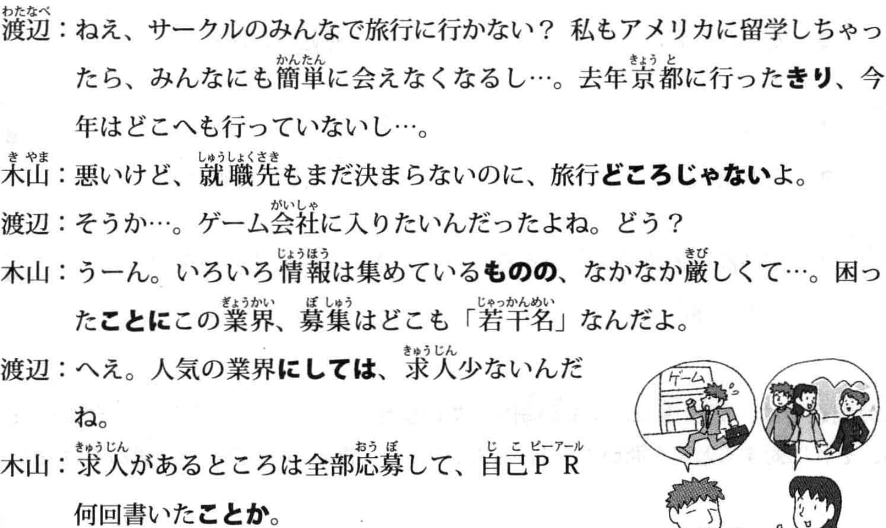

# TRY！N2语法必备

## 1 スタッフ募集のお知らせ

| 日本語 | 中国語 | 日本語 | 中国語 |
|--------|---------|--------|---------|
| お知らせ | 通知, 告示 | 周囲（しゅうい） | 周围,环境 |
| 人材（じんざい） | 人才,职员,工作人员 | 万引き（まんびき） | 入店行窃 |
| 求（もと）める | 寻求,寻找 | 浮気（うわき） | 花心,感情不专一 |
| 開店（かいてん） | 开店,开始营业 | 単純（たんじゅん） | 单纯,简单 |
| 閉店（へいてん） | 关店,打烊,结束营业 | にせ物（もの） | 山寨货,假货 |
| 業務（ぎょうむ） | 工作,业务 | 服装（ふくそう） | 服装 |
| 販売（はんばい） | 销售,卖 | 心がける | 放在心上,多及 |
| 清掃（せいそう） | 扫除,打扫 | 要望（ようぼう） | 需求 |
| やる気がある | 有干劲 | 手当て（てあて） | 津贴:工资以外支付的钱 |
| 大歓迎（だいかんげい） | 热烈欢迎 | 返品（へんぴん） | 退货 |
| 接客（せっきゃく） | 接待顾客 | 発言（はつげん） | 发言 |
| 応対（おうたい） | 应对,回答 | 晴雨（せいう） | 晴天或者雨天 |
| 給与（きゅうよ） | 报酬,工资,薪水 | 意見をまとめる | 汇总/整理意见 |
| 考慮（こうりょ） | 考虑 | 寄付（きふ） | 捐赠,捐助,捐款 |
| 往復（おうふく） | 往返(往返于) | 汚染（おせん） | 污染 |
| 支給（しきゅう） | 支付,报销 | 幸運（こううん） | 好运,幸运 |
| 所定（しょてい） | 指定 | 失業（しつぎょう） | 失业 |
| フォーム | 表格，形式 | 紛失（ふんしつ） | 遗失 |
| 問（と）い合わせ | 问询，打听 | 火災（かさい） | 火灾 |
| 書類審査（しょるいしんさ） | 书面材料审查 | 屋内（おくない） | 室内 |
| 採否（さいひ） | 是否采用 | ~~パスワード~~ | 密码 |
| 持参（じさん） | 携带,随身携带 | 着用（ちゃくよう） | 穿着(穿戴,系好) |
| 改装工事（かいそうこうじ） | 装修施工 | 非常ボタン | 紧急按钮 |
| 左記（さき） | 如左图所示 | 期限（きげん） | 最后期限,截止日 |
| 仮店舗（かりてんぽ） | 临时店铺 | 厳守（げんしゅ） | 严格遵守 |
| キャンペーン | 促销活动 | 振り込み | 转账，存入 |
| 生（なま）もの | 生食,生的食物 | 願書（がんしょ） | 申请书,报名表 |
| 点検（てんけん） | 检查 | 窓口（まどぐち） | 联络窗口,联络人 |
| 臨時休業（りんじきゅうぎょう） | 临时停业 | 筆記用具（ひっきようぐ） | 书写工具 |
| 昼夜（ちゅうや） | 昼夜 | 分別（ぶんべつ） | 区别,分别,判别 |
| 深夜（しんや） | 深夜,半夜 | 承る(うけたまわる) | 接受，听从；聆听 |
| 有無（うむ） | 有无 | サミット | 峰会 |
| 老若男女（ろうにゃくだんじょ） | 男女老少 | 下取り(したどり) | 以旧换新 |
| 提供（ていきょう） | 提供,供应,给予 | 通常(つうじょう) | 通常，平常 |

<audio controls src="/assets/audio/02 曲目 2.mp3" title="2"></audio>

## 2 転任のあいさつ(1)
| 日语 (假名) | 中文含义 | 日语 (假名) | 中文含义 |
|------------|---------|------------|---------|
| 転任 (てんにん) | 转任 | 防止 (ぼうし) | 防止 |
| 命 (めい) じる | 命令、要求 | 活発 (かっぱつ) | 活跃、生动 |
| 日課 (にっか) | 每天必做的事 | 口答え (くちごたえ) | 顶嘴 |
| 遺伝子 (いでんし) | 遗传基因 | ちっとも～ない | 完全不/没～ |
| 見直す (みなおす) | 重新考虑/审视 | 反抗 (はんこう) | 反抗 |
| スパイス(spice) | 香料 | めいっぱい | 尽全力, 尽可能 |
| 電子レンジ(microwave oven) | 微波炉 | おしゃれ | 时尚, 潮 |
| ジャケット(jacket) | 夹克外套 | 宗教 (しゅうきょう) | 宗教 |
| 入荷 (にゅうか) | 入荷, 进货; 到货 | 店舗 (てんぽ) | 店铺 |
| 従業員 (じゅうぎょういん) | 职员 | 開設 (かいせつ) | 开设, 建立 |
| 解雇 (かいこ) | 解雇 | 周辺 (しゅうへん) | 周围, 周边环境, 附近 |
| 認 (みと) める | 认可, 承认 | コストパフォーマンス | 性价比, 性能价格比 |
| 尊敬 (そんけい) | 尊敬 | 円高 (えんだか) | 日元升值, 日元走强 |
| 清掃 (せいそう) | 扫除, 打扫 | 農村 (のうそん) | 农村 |
| 同意 (どうい) | 同意 | IC レコーダー | 录音笔, 录音设备 |
| 睡眠 (すいみん) | 睡眠 | 小型 (こがた) | 小型 |
| 確保 (かくほ) | 保障, 确保 | 録音 (ろくおん) | 录音 |
| 犯罪 (はんざい) | 犯罪 | 疑う (うたがう) | 怀疑 |

<audio controls src="/assets/audio/04 曲目 4.mp3" title="4"></audio>

## 2 転任のあいさつ(2)

| 日语 (假名) | 中文含义 | 日语 (假名) | 中文含义 |
|------------|---------|------------|---------|
| 拡大（かくだい） | 扩大 | 出場（しゅつじょう） | 出场,出赛 |
| 挑戦（ちょうせん） | 挑战,尝试 | 扱う（あつかう） | 处理,对应;经销,操作 |
| 全力（ぜんりょく） | 全力 | 期日（きじつ） | 期限,日期 |
| 慣(な)れ親(した)しむ | 熟识,亲近 | 間（ま）に合わせる | 赶上 |
| 心遣い（こころづかい） | 关心,关照 | 誇り（ほこり） | 荣耀,自豪,自尊心 |
| 組織（そしき） | 组织 | 全力を尽(つ)くす | 尽全力 |
| シンポジウム | 研讨会 | 税金（ぜいきん） | 税,税金 |
| 総意（そうい） | 共识 | 裁判(さいばん) | 裁判，审判 |
| **手本（てほん）** | 榜样,模板 | 争う（あらそう） | 竞争,争斗 |
| ~~エンジニア~~ | 工程师 | 生涯（しょうがい） | 生涯 |
| 前提（ぜんてい） | 前提 | 終(お)える | 终结,终止,结束 |
| 交際（こうさい） | 交际；交往,谈恋爱 | 溢れる（あふれる） | 溢出,充满 |
| 利益（りえき） | 利益 | 業績（ぎょうせき） | 业绩 |
| 採用（さいよう） | 采用,录用,录取 | 収入（しゅうにゅう） | 收入 |
| ~~キャプテン(captain)~~ | 队长,船长 | 減少（げんしょう） | 减少 |
| 一丸（いちがん）となって | 齐心协力,抱成一团 | 貯金（ちょきん） | 存款 |
| 思い切り（おもいきり） | 决意,断念；尽量地,彻底地 | 増加（ぞうか） | 增加 |
| 監督（かんとく） | 教练,总监,导演 | 真実（しんじつ） | 真相,真实 |
| **投書（とうしょ）** | 投诉；投稿, 读者来信 | フリー | 免费；自由 |
| 昆虫（こんちゅう） | 昆虫 | 優（すぐ）れる | 卓越,优秀,出色 |
| 就任（しゅうにん） | 就任 | 天候（てんこう） | 天气 |
| 発展（はってん） | 发展 | 規則（きそく） | 规则 |
| ノーベル賞（しょう） | 诺贝尔奖 | 乱れ(みだれ) | 乱，杂乱 |
| 受賞（じゅしょう） | 获奖 | 取り扱う | 操作，处理，经营，对待 |
| 受験生（じゅけんせい） | 考生 | 〜に励む(はげむ) | 勤于～ |
| 地域(ちいき)ぐるみ | 全域 | ついに | 终于，好不容易才… |
| 催し物(もよおしもの) | 文娱活动，集会，庆典 | 精一杯(せいいっぱい) | 尽力，拼命 |
| ~~コンテスト~~ | 竞赛,大赛,比赛 | 応援(おうえん) | 应援，声援 |

<audio controls src="/assets/audio/05 曲目 5.mp3" title="5"></audio>

## 3 ホテルの仕事

| 日语 (假名) | 中文含义 | 日语 (假名) | 中文含义 |
|------------|---------|------------|---------|
| 心構え（こころがまえ） | 心理准备,觉悟,心态 | 限界（げんかい） | 界限,局限 |
| 苦情（くじょう） | 不满,投诉,抱怨 | やりがいがある | 值得做的,有价值/意义的 |
| 処理（しょり） | 处理,善后 | 見た目 | 外观,外表 |
| クレーム | 投诉,抱怨 | 全力（ぜんりょく） | 全力 |
| 正当（せいとう） | 正当的 | 戦う（たたかう） | 奋斗,战斗 |
| 追求（ついきゅう） | 追求 | 話題（わだい） | 话题 |
| 自覚（じかく） | 自我觉悟,自我意识 | 特集（とくしゅう） | 特集,专题文章 |
| サービス料 | 小费,服务费 | **配慮（はいりょ）** | 关怀,照顾,照料 |
| 高齢者（こうれいしゃ） | 老年人,高龄者 | 骨折（こっせつ） | 骨折,折断骨头 |
| 申請（しんせい） | 申请 | 悪用（あくよう） | 恶意使用,滥用 |
| 実行（じっこう）に移す | 进行,开始执行 | **詐欺（さぎ）** | 欺诈 |
| 接近（せっきん） | 临近,接近 | 悪化（あっか） | 恶化 |
| 命令（めいれい） | 命令 | 賑わう（にぎわう） | 热闹,繁华,兴盛 |
| 従う（したがう） | 跟从,听从,遵循,遵守 | デビュー(法début) | 初次登台,出道,初出茅庐 |
| 防（ふせ）ぐ | 防止,预防 | 女優（じょゆう） | 女演员 |
| ～に恵（めぐ）まれた | 受～眷顾,有很多～ | 仕上げる（しあげる） | 完成 |
| 昨今（さっこん） | 最近,如今 | 甘（あま）える | 撒娇,恃宠而娇 |
| 就職難(しゅうしょくなん) | 就职难 | プロ | 专业的，专门的 |
| 仕事に就く | 就职,找到工作 | 防ぐ(ふせぐ) | 防御，预防 |
| 魅力（みりょく） | 魅力 | 納入(のうにゅう) | 缴纳，上缴(钱/物) |

<audio controls src="/assets/audio/10 曲目 10.mp3" title="10"></audio>

## 4 台風情報
| 日语 (假名) | 中文含义 | 日语 (假名) | 中文含义 |
|------------|---------|------------|---------|
| 広範囲（こうはんい） | 大范围 | 栽培（さいばい） | 栽培 |
| 沿岸（えんがん） | 沿岸 | 倒産（とうさん） | 倒闭,破产 |
| 接近（せっきん） | 接近,靠近 | 責任が生(しょう)じる | 发生,产生(责任) |
| 注意報（ちゅういほう） | 警报 | 上昇（じょうしょう） | 上升 |
| 明け方（あけかた） | 黎明 | 噴火（ふんか） | 喷发,喷火 |
| 局地（きょくち） | 局部地区 | 避難（ひなん） | 避难 |
| 中継（ちゅうけい） | 转播,中转 | 販売（はんばい） | 销售,卖 |
| 売り場（うりば） | 出售处,柜台 | 電話がつながる | 接通(电话) |
| 思い浮（う）かべる | 想起,回忆起 | 雷（かみなり） | 雷 |
| 庇う（かばう） | 庇护,袒护,保护 | 整備（せいび） | 保养,整备,配备,配齐 |
| 拍手（はくしゅ） | 拍手,鼓掌 | 汚染（おせん） | 大气污染 |
| 部署（ぶしょ） | 部门 | 害（がい）する | 损害 |
| 検討（けんとう） | 讨论,探讨,研究 | 日夜（にちや） | 日夜 |
| 決定（けってい） | 决定 | 土砂崩れ（どしゃくずれ） | 砂石滑坡,塌方 |
| 草花（くさばな） | 花草 | 整える（ととのえる） | 整顿,备齐 |
| 励（はげ）ます | 鼓励,激励 | 求(もと)められる | 被要求,被追求 |
| 温泉に浸（つ）かる | 泡温泉 | 謎（なぞ） | 迷 |
| 救助（きゅうじょ） | 救助 | 都（みやこ） | 京城,都市 |
| 実る（みのる） | 结果实,取得成果 | 拡大（かくだい） | 扩大 |
| 生け花（いけばな） | 插花 | 運転を見合わせる | 暂缓运行 |
| 遺跡（いせき） | 遗迹,古迹 | サンプル | 样品 |
| 梅雨入り（つゆいり） | 入梅,进入梅雨季节 | 入荷（にゅうか） | 入荷,到货,进货 |
| 群れ（むれ） | 群,群体 | 発送（はっそう） | 寄送,发送 |
| 肩（かた） | 肩,肩膀 | 大幅（おおはば） | 大幅度，颇大 |
| 腕（うで） | 手臂;本领 | アクセス数 | 访问量 |
| 不況（ふきょう） | 不景气,萧条 | 重ねる(かさねる) | 追加；反复，重复 |
| 日焼け（ひやけ） | 日晒,晒黑 | 悔(く)いのない | 不后悔 |

<audio controls src="/assets/audio/15 曲目 15.mp3" title="15"></audio>

## 5 就職活動(1)

| 日语 (假名) | 中文含义 | 日语 (假名) | 中文含义 |
|------------|---------|------------|---------|
| 就職先（しゅうしょくさき） | 工作场所 | 改善（かいぜん） | 改善 |
| 若干（じゃかん） | 若干名 | 手編み（てあみ） | 手织,手工编织 |
| 求人（きゅうじん） | 招聘,招募,需要人手 | 命（めい）じる | 命令,要求 |
| 自己(じこ)PR | 自我介绍,自荐 | アイデアが浮(う)かぶ | 想出点子/主意 |
| 黙(だま)る | 沉默 | ヒット商品 | 热卖商品,畅销货 |
| ステーキ(steak) | 牛排 | バラ | 蔷薇，玫瑰 |
| 寝（ね）たきり | 卧床不起 | 花束（はなたば） | 花束 |
| うっかり | 疏忽,不小心 | 合唱（がっしょう） | 合唱 |
| 赤ん坊（あかんぼう） | 婴儿,宝宝 | コンクール(法concours) | 竞赛,比赛 |
| 状況(じょうきょう) | 情况,状况 | 沼（ぬま） | 沼泽,池塘 |
| 締め切り(しめきり) | 截止日期，期限 | 行きつけ | 常去，去惯了 |
| お腹をこわす | 闹肚子,吃坏肚子 | 日中（にっちゅう） | 白天,昼间 |
| ～に追（お）われる | 被～追赶,被～紧逼 | 下旬（げじゅん） | 下旬 |
| 学校に通う(かよう) | 每天上补习班 | 心細い（こころぼそい） | 不安、胆怯 |
| 修復（しゅうふく） | 修复,改善 | がっかり | 颓废，失望 |

<audio controls src="/assets/audio/20 曲目 20.mp3" title="20"></audio>

## 5 就職活動(2)
| 日语 (假名) | 中文含义 | 日语 (假名) | 中文含义 |
|------------|---------|------------|---------|
| 採用（さいよう） | 采用,录用,录取 | 単位（たんい） | 单位；学分 |
| 拘る(こだわる) | 拘泥于；讲究，追求 | 留年（りゅうねん） | 留级 |
| さんざん | 拼命地,狠狠地,彻底地 | 試着（しちゃく） | 试穿 |
| 結局（けっきょく） | 结果,到头来 | 無駄遣い（むだづかい） | 浪费 |
| 都合（つごう） | 时间上方便与否;情况,理由 | 引き上げる | 提升,抬高,抬起 |
| 欠航（けっこう） | 停航,航班取消 | 楽（らく）をする | 放松,过得轻松 |
| 新卒(しんそつ) | 应届毕业生 | 儲ける（もうける） | 发财,赚钱 |
| 面倒（めんどう） | 麻烦；照料 | へらへら（する） | 憨笑，傻笑；阿谀奉承 |
| 引(ひ)き受(う)ける | 接受,负责,承揽 | 機嫌(きげん) | 情绪，心情；高兴的，痛快的 |

<audio controls src="/assets/audio/21 曲目 21.mp3" title="21"></audio>

## 6 苦労した5年間(1)
| 日语 (假名) | 中文含义 | 日语 (假名) | 中文含义 |
|------------|---------|------------|---------|
| とうとう | 终于 | とりあえず | 暂且,姑且,先 |
| 同期（どうき） | 同期,同步；同期生 | ねんざ | 扭伤 |
| 知識（ちしき） | 知识 | 経費（けいひ） | 经费 |
| 価値（かち） | 价值 | 節約（せつやく） | 节约,节省 |
| からかう | 嘲弄,戏弄,开玩笑 | 世話好（ず）き | 助人为乐的;爱管闲事的 |
| 出店（しゅってん） | 开新店 | 援助（えんじょ） | 技术援助,技术支持 |
| 売れ残る | 滞销,卖剩下 | 業績不振（ぎょうせきふしん） | 业绩低迷不振,成绩不佳 |
| 抗議（こうぎ） | 抗议 | 情（なさ）けない | 可怜,悲惨;无情,可耻 |
| 向こう（＝相手） | 对方 | 批判（ひはん） | 批判 |
| 虫に刺（さ）される | 被虫蛰,被虫咬 | とんでもない | 不可能的事,毫无道理,岂有此理,意想不到的 |

<audio controls src="/assets/audio/25 曲目 25.mp3" title="25"></audio>

## 6 苦労した5年間(2)
| 日语 (假名) | 中文含义 | 日语 (假名) | 中文含义 |
|------------|---------|------------|---------|
| 制限（せいげん） | 限制 | 違反（いはん） | 违反 |
| 成果（せいか） | 成果 | 罰金（ばっきん） | 罚款 |
| 欠点（けってん） | 缺点,缺陷,不足之处 | 診察券(しんさつけん) | 挂号凭证 |
| 指摘（してき） | 指正,提醒 | 郵送（ゆうそう） | 寄送 |
| 注射（ちゅうしゃ） | 打针 | 気合(きあい)を入(い)れる | 聚精会神，全力以赴 |
| 流行る（はやる） | 流行,蔓延 | 胸を張（は）る | 挺起胸膛；摆架子，得意洋洋 |
| 予防（よぼう） | 预防 | 打ち合わせる | 事前商量，碰头；对打 |
| 顔色が悪い | 脸色很差 | 苦境（くっきょう） | 困境，危难之时 |
| 奢る（おごる） | 请客 | ニーズ | 要求，需求 |
| 朝一（あさいち） | 早上先，早上第一件事 | セキュリティーシステム | 安保系统 |

<audio controls src="/assets/audio/26 曲目 26.mp3" title="26"></audio>

## 7 才才力ミと生熊系(1)
| 日语 (假名) | 中文含义 | 日语 (假名) | 中文含义 |
|------------|---------|------------|---------|
| オオカミ | 狼 | 得（う）る | 取得,获得,得到 |
| 家畜(かちく) | 家畜 | チンパンジー | 黑猩猩 |
| 襲う（おそう） | 攻击,袭击 | ブドウ | 葡萄 |
| シカ | 鹿 | 坂道（さかみち） | 坡道 |
| 草食（そうしょく） | 草食 | 送迎（そうげい） | 迎送,接送 |
| 防ぐ（ふせぐ） | 防止,预防 | 暗算（あんざん） | 心算 |
| 役割（やくわり） | 角色,作用 | 電卓（でんたく） | 计算器 |
| 果(は)たす | 尽到,完成,实现 | 及(およ)ぼす | 波及,影响到 |
| 絶滅（ぜつめつ） | 灭绝 | 引き取る | 领养，取回；退下，回去 |
| ネズミ | 老鼠 | 耳を傾(かたむ)ける | 侧耳倾听,聆听 |
| 人柄（ひとがら） | 人品,人格 | シェア | 份额,市场占有率;分享,共有 |
| 適任（てきにん） | 胜任,称职 | 貢献（こうけん） | 贡献,做贡献 |
| 頼(たの)もしい | 值得信任的 | 被災地（ひさいち） | 灾区 |
| それなりの | 相应的,得体的 | 支援（しえん） | 支援,援助 |
| リーズナブル | 合理的 | 寄（よ）せる | 召集,聚集,使…靠近 |
| 実行（じっこう） | 实行,实施 | くるみ | 胡桃,核桃 |
| 患者（かんじゃ） | 患者,病患 | アーモンド | 杏仁 |
| たいした～じゃない | 不值一提的～,没什么大不了的～ | ナッツ | 坚果 |
| 目撃者（もくげきしゃ） | 目击者 | 信仰（しんこう） | 信仰;相信 |
| 証言（しょうげん） | 证词;作证 | ヨガ | 瑜伽 |
| 手に入(はい)る | 获得,弄到手 | ストレッチ | 伸展 |
| 黒字（くろじ） | 盈余,赚钱;黑色的字 | 体調を崩す | 累坏身体,生病 |
| 赤字（あかじ） | 亏损,赤字;红色的字 | 整備（せいび） | 保养,整备,配备,配齐 |
| 誘致（ゆうち） | 招揽,招致 | 不景気(ふけいき) | 不景气，不繁荣，萧条 |
| 慎重（しんちょう） | 慎重 | 学割(がくわり) | 学生优惠 |

<audio controls src="/assets/audio/32 曲目 32.mp3" title="32"></audio>

## 7 才才力ミと生熊系(2)
| 日语 (假名) | 中文含义 | 日语 (假名) | 中文含义 |
|------------|---------|------------|---------|
| 復活（ふっかつ） | 复活,苏生,复兴 | 使いこなす | 熟练掌握,运用自如 |
| 有効（ゆうこう） | 有效的 | 植木鉢（うえきばち） | 花盆 |
| 受け入れる | 接受,采纳 | 喜ばしい（よろこばしい） | 可喜的,令人高兴的 |
| 放す（はなす） | 释放,放开 | 親しい（したしい） | 亲近的,亲密的 |
| 順調（じゅんちょう） | 顺利的 | 位置づけ（いちづけ） | 定位，评价 |
| 激減（げきげん） | 剧减,急剧减少 | 異常（いじょう） | 异常,异常的 |
| 徐々（じょじょ）に | 慢慢地 | ますます | 越发，更加 |
| 取り組み（とりくみ） | 尝试,努力,对策 | 心がける | 留心,注意,记在心上 |
| 手がかり | 线索,头绪 | ぶつかる | 冲撞,碰撞 |
| 掴む（つかむ） | 抓,抓住;获得 | あらゆる | 所有的，一切的 |
| ありうる | 应该有，可能有 | 力を生(い)かす | 发挥力量 |
| ありえない | 不会有，不可能有 | 発掘(はっくつ) | 发掘 |
| 内定（ないてい） | 内定 | 明らかになる | 变得清晰/明确/明朗起来 |
| 取り消し（とりけし） | 取消 | 疑う（うたがう） | 怀疑，疑惑 |
| 人件費（じんけんひ） | 人工费,劳工成本 | 遥か(はるか) | 遥远；远比，远远 |
| 予測（よそく） | 预测 | さらなる | 连体词；更加，更多 |
| 取り扱い（とりあつかい） | 使用，处理；接待，待遇 | 湧く(わく) | 产生，涌现出 |
| 細心(さいしん)の注意を払う | 密切关注/注意 | 勝負（しょうぶ） | 比赛；胜负 |
| 予知（よち） | 预知 | 年配(ねんぱい) | 过中年的人；大致年龄 |

<audio controls src="/assets/audio/33 曲目 33.mp3" title="33"></audio>

## 8 取引先で
| 日语 (假名) | 中文含义 | 日语 (假名) | 中文含义 |
|------------|---------|------------|---------|
| 依頼（いらい） | 委托，托付；请求 | 被害（ひがい）にあう | 遭受灾害 |
| サンプル | 样品,样本 | お見舞い申し上げます | 对此深表遗憾(对病人/受灾的人表示同情) |
| 日程（にってい） | 日程 | 事情（じじょう） | 情况,缘由 |
| 席(せき)を外(はず)す | 离开座位,不在 | コンテスト | 竞赛,大赛,比赛 |
| イルカ | 海豚 | 近いうち | 近期,不久的将来 |
| ラッピング | （艺术）包装 | 貴重（きちょう） | 贵重的,宝贵的 |
| カウンター | 柜台 | 抽選（ちゅうせん） | 抽签,抓阄儿,抽奖 |
| 少々（しょうしょう） | 稍微 | とんだこと | 意想不到的事；严重的事 |
| 寄付（きふ） | 捐款,捐赠,赠送 | 気にする | 介意；担心，关心 |

<audio controls src="/assets/audio/38 曲目 38.mp3" title="38"></audio>

