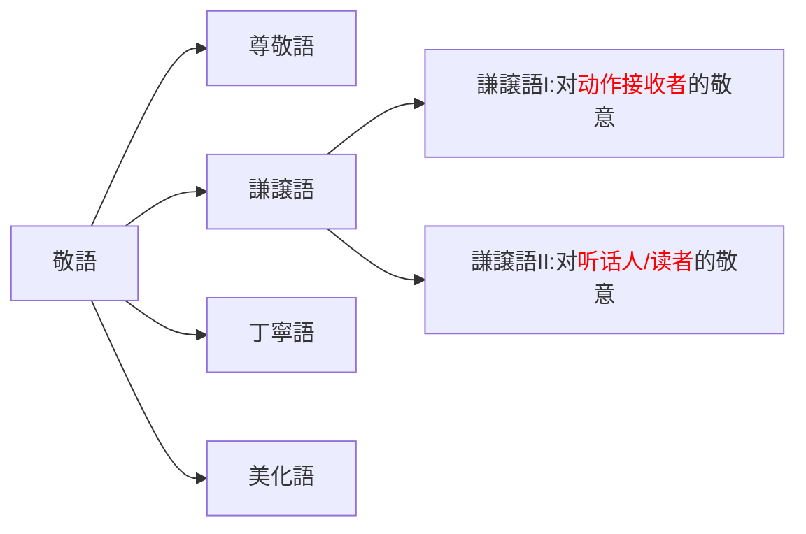

# 敬语

## 特殊动词

<table>
    <tr>
        <td rowspan="2"><ruby>基本形<rt>きほんけい</rt></ruby></td>
        <td rowspan="2"><ruby>尊敬語<rt>そんけいご</rt></ruby></td>
        <td colspan="2"><ruby>謙譲語<rt>けんじょうご</rt></ruby></td>
    </tr>
    <tr>
        <td>I</td>
        <td>II</td>
    </tr>
    <tr>
        <td><ruby>言<rt>い</rt></ruby>う</td>
        <td>おっしゃる</td>
        <td><ruby>申<rt>もう</rt></ruby>し<ruby>上<rt>あ</rt></ruby>げる 申す</td>
        <td><ruby>申<rt>もう</rt></ruby>す</td>
    </tr>
    <tr>
        <td><ruby>行<rt>い</rt></ruby>く</td>
        <td>いらっしゃる おいでになる</td>
        <td><ruby>伺<rt>うかが</rt></ruby>う</td>
        <td><ruby>参<rt>まい</rt></ruby>る</td>
    </tr>
    <tr>
        <td>来る</td>
        <td>⬆️ お<ruby>見<rt>み</rt></ruby>えになる お<ruby>越<rt>こ</rt></ruby>しになる</td>
        <td>⬆️</td>
        <td>⬆️</td>
    </tr>
    <tr>
        <td>いる</td>
        <td>いらっしゃる おいでになる</td>
        <td>-</td>
        <td>おる</td>
    </tr>
    <tr>
        <td><ruby>見<rt>み</rt></ruby>る</td>
        <td>ご<ruby>覧<rt>らん</rt></ruby>になる</td>
        <td><ruby>拝見<rt>はいけん</rt></ruby>する</td>
        <td>－</td>
    </tr>
    <tr>
        <td>する</td>
        <td>なさる</td>
        <td colspan="2" style="text-align: center;">いたす</td>
    </tr>
    <tr>
        <td><ruby>食<rt>た</rt></ruby>べる <ruby>飲<rt>の</rt></ruby>む</td>
        <td><ruby>召<rt>め</rt></ruby>し<ruby>上<rt>あ</rt></ruby>がる</td>
        <td colspan="2" style="text-align: center;">いただく</td>
    </tr>
    <tr>
        <td><ruby>知<rt>し</rt></ruby>っている</td>
        <td>ご<ruby>存知<rt>ぞんじ</rt></ruby>だ</td>
        <td>存じあげる</td>
        <td><ruby>存<rt>ぞん</rt></ruby>じておる</td>
    </tr>
    <tr>
        <td><ruby>寝<rt>ね</rt></ruby>る</td>
        <td>お<ruby>休<rt>やす</rt></ruby>みになる</td>
        <td colspan="2" style="text-align: center;">-</td>
    </tr>
    <tr>
        <td>くれる</td>
        <td>くださる</td>
        <td colspan="2" style="text-align: center;">-</td>
    </tr>
    <tr>
        <td>あげる</td>
        <td>－</td>
        <td colspan="2" style="text-align: center;"><ruby>差<rt>さ</rt></ruby>し<ruby>上<rt>あ</rt></ruby>げる</td>
    </tr>
    <tr>
        <td>もらう</td>
        <td>－</td>
        <td colspan="2" style="text-align: center;">いただく</td>
    </tr>
    <tr>
        <td><ruby>会<rt>あ</rt></ruby>う</td>
        <td>－</td>
        <td colspan="2" style="text-align: center;">お<ruby>目<rt>め</rt></ruby>にかかる</td>
    </tr>
    <tr>
        <td><ruby>思<rt>おも</rt></ruby>う</td>
        <td>－</td>
        <td colspan="2" style="text-align: center;"><ruby>存<rt>ぞん</rt></ruby>じる</td>
    </tr>
    <tr>
        <td><ruby>借<rt>か</rt></ruby>りる</td>
        <td>－</td>
        <td colspan="2" style="text-align: center;"><ruby>拝借<rt>はいしゃく</rt></ruby>する</td>
    </tr>
    <tr>
        <td><ruby>聞<rt>き</rt></ruby>く</td>
        <td>－</td>
        <td colspan="2" style="text-align: center;">(<ruby>先生<rt>せんせい</rt></ruby>から)<ruby>伺<rt>うかが</rt></ruby>う</td>
    </tr>
    <tr>
        <td><ruby>質問<rt>しつもん</rt></ruby>する</td>
        <td>－</td>
        <td colspan="2" style="text-align: center;">(<ruby>先生<rt>せんせい</rt></ruby>に)<ruby>伺<rt>うかが</rt></ruby>う</td>
    </tr>
    <tr>
        <td><ruby>訪問<rt>ほうもん</rt></ruby>する</td>
        <td>－</td>
        <td colspan="2" style="text-align: center;">(<ruby>お宅<rt>おたく</rt></ruby>に)<ruby>伺<rt>うかが</rt></ruby>う お<ruby>邪魔<rt>じゃま</rt></ruby>します</td>
    </tr>
    <tr>
        <td>ている</td>
        <td>ておいでになる</td>
        <td colspan="2" style="text-align: center;">-</td>
    </tr>
    <tr>
        <td><ruby>見<rt>み</rt></ruby>せる</td>
        <td>-</td>
        <td colspan="2" style="text-align: center;">ご<ruby>覧<rt>らん</rt></ruby>に<ruby>入<rt>い</rt></ruby>れる</td>
    </tr>
    <tr>
        <td><ruby>聞<rt>き</rt></ruby>く <ruby>引<rt>ひ</rt></ruby>き<ruby>受<rt>う</rt></ruby>ける</td>
        <td>-</td>
        <td colspan="2" style="text-align: center;"><ruby>承<rt>うけたまわ</rt></ruby>る</td>
    </tr>
    <tr>
        <td><ruby>思<rt>おも</rt></ruby>う（<ruby>知<rt>し</rt></ruby>っている）</td>
        <td>-</td>
        <td colspan="2" style="text-align: center;"><ruby>存<rt>ぞん</rt></ruby>じる</td>
    </tr>
    <tr>
        <td><ruby>伝言<rt>でんごん</rt></ruby>する</td>
        <td>-</td>
        <td colspan="2" style="text-align: center;"><ruby>申<rt>もう</rt></ruby>し<ruby>伝<rt>つた</rt></ruby>える</td>
    </tr>
    <tr>
        <td>～ていく・～てくる</td>
        <td>-</td>
        <td colspan="2" style="text-align: center;">～てまいる</td>
    </tr>
</table>

| 原形 | ます形`る`→`い`+ます | 命令形`る`→`い` | て/た形`る`→`っ`+て/た |
|---|---|---|---|
| いらっしゃる | いらっしゃいます | いらっしゃい | いらっしゃった |
| おっしゃる | おっしゃいます | おっしゃい | おっしゃった |
| なさる | なさいます | なさい | なさった |
| くださる | くださいます | ください | くださった |
| ごさる(五段) | - | - | - |

例句：ご連絡くださ`り`、本当にありがとうごさいます。

## 常用句型
<table>
    <tr>
        <th></th>
        <th>形式</th>
        <th>例句</th>
    </tr>
    <tr>
        <td rowspan="2"><ruby>尊敬語<rt>そんけいご</rt></ruby></td>
        <td>お/ご～なさる</td>
        <td>レジ<ruby>袋<rt>ぶくろ</rt></ruby>をご<ruby>利用<rt>りよう</rt></ruby>なさいますか？</td>
    </tr>
    <tr>
        <td>～ていらっしゃる／～ておいでになる</td>
        <td><ruby>森<rt>もり</rt></ruby>さんでいらっしゃいますか？</td>
    </tr>
    <tr>
        <td rowspan="2"><ruby>謙譲語<rt>けんじょうご</rt></ruby></td>
        <td>お/ご～する／<ruby>致<rt>いた</rt></ruby>す</td>
        <td>いらっしゃいませ。 お<ruby>席<rt>せき</rt></ruby>にご<ruby>案内<rt>あんない</rt></ruby>します。 お<ruby>願<rt>ねが</rt></ruby>い<ruby>致<rt>いた</rt></ruby>します。</td>
    </tr>
    <tr>
        <td>お/ご～いただく</td>
        <td>ご<ruby>連絡<rt>れんらく</rt></ruby><ruby>頂<rt>いただ</rt></ruby>きましてありがとうございます。</td>
    </tr>
    <tr>
        <td rowspan="2">请求</td>
        <td>お/ご～ください</td>
        <td>お<ruby>待<rt>ま</rt></ruby>ちください</td>
    </tr>
    <tr>
        <td>～て<ruby>頂<rt>いただ</rt></ruby>けますか／<ruby>頂<rt>いただ</rt></ruby>けませんか／<ruby>頂<rt>いただ</rt></ruby>けないでしょうか／<ruby>頂<rt>いただ</rt></ruby>けませんでしょうか</td>
        <td><ruby>名前<rt>なまえ</rt></ruby>を<ruby>教<rt>おし</rt></ruby>えていただけますか。</td>
    </tr>
    <tr>
        <td>请求许可</td>
        <td>～させていただく ～させていただけませんか</td>
        <td><ruby>私<rt>わたし</rt></ruby>も<ruby>参加<rt>さんか</rt></ruby>させていただきます。</td>
    </tr>
</table>