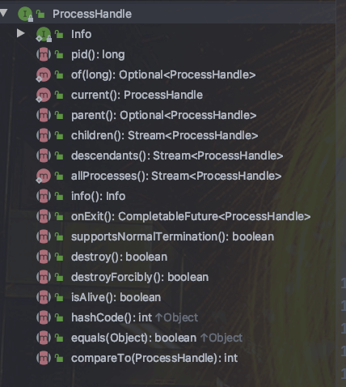

# Java

## 新特性

### 字符串模板（预览）-21

```java
String message = STR."Greetings \{name}!";
```

在上面的模板表达式中：

+   STR 是模板处理器。
+   `\{name}`为表达式，运行时，这些表达式将被相应的变量值替换。

Java 目前支持三种模板处理器：

+   STR：自动执行字符串插值，即将模板中的每个嵌入式表达式替换为其值（转换为字符串）。
+   FMT：和 STR 类似，但是它还可以接受格式说明符，这些格式说明符出现在嵌入式表达式的左边，用来控制输出的样式
+   RAW：不会像 STR 和 FMT 模板处理器那样自动处理字符串模板，而是返回一个 `StringTemplate` 对象，这个对象包含了模板中的文本和表达式的信息

```java
String name = "Lokesh";

//STR
String message = STR."Greetings \{name}.";

//FMT
String message = STR."Greetings %-12s\{name}.";

//RAW
StringTemplate st = RAW."Greetings \{name}.";
String message = STR.process(st);
```

除了 JDK 自带的三种模板处理器外，你还可以实现 `StringTemplate.Processor` 接口来创建自己的模板处理器。

我们可以使用局部变量、静态/非静态字段甚至方法作为嵌入表达式：

```java
//variable
message = STR."Greetings \{name}!";

//method
message = STR."Greetings \{getName()}!";

//field
message = STR."Greetings \{this.name}!";
```

还可以在表达式中执行计算并打印结果：

```java
int x = 10, y = 20;
String s = STR."\{x} + \{y} = \{x + y}";  //"10 + 20 = 30"
```

为了提高可读性，我们可以将嵌入的表达式分成多行:

```java
String time = STR."The current time is \{
    //sample comment - current time in HH:mm:ss
    DateTimeFormatter
      .ofPattern("HH:mm:ss")
      .format(LocalTime.now())
  }.";
```

### JShell-9

JShell 是 Java 9 新增的一个实用工具。为 Java 提供了类似于 Python 的实时命令行交互工具。

在 JShell 中可以直接输入表达式并查看其执行结果。


### 快速创建不可变集合-9

增加了`List.of()`、`Set.of()`、`Map.of()` 和 `Map.ofEntries()`等工厂方法来创建不可变集合（有点参考 Guava 的味道）：

```java
List.of("Java", "C++");
Set.of("Java", "C++");
Map.of("Java", 1, "C++", 2);
```

使用 `of()` 创建的集合为不可变集合，不能进行添加、删除、替换、 排序等操作，不然会报 `java.lang.UnsupportedOperationException` 异常

### String 存储结构优化-9

Java 8 及之前的版本，`String` 一直是用 `char[]` 存储。在 Java 9 之后，`String` 的实现改用 `byte[]` 数组存储字符串，节省了空间。

```java
public final class String implements java.io.Serializable,Comparable<String>, CharSequence {
    // @Stable 注解表示变量最多被修改一次，称为“稳定的”。
    @Stable
    private final byte[] value;
}

### 接口私有方法

Java 9 允许在接口中使用私有方法。这样的话，接口的使用就更加灵活了，有点像是一个简化版的抽象类。

```java
public interface MyInterface {
    private void methodPrivate(){
    }
}
```

### try-with-resources 增强-9

在 Java 9 之前，我们只能在 `try-with-resources` 块中声明变量：

```java
try (Scanner scanner = new Scanner(new File("testRead.txt"));
    PrintWriter writer = new PrintWriter(new File("testWrite.txt"))) {
    // omitted
}
```

在 Java 9 之后，在 `try-with-resources` 语句中可以使用 effectively-final 变量。

```java
final Scanner scanner = new Scanner(new File("testRead.txt"));
PrintWriter writer = new PrintWriter(new File("testWrite.txt"))
try (scanner;writer) {
    // omitted
}
```

**什么是 effectively-final 变量？** 简单来说就是没有被 `final` 修饰但是值在初始化后从未更改的变量。

正如上面的代码所演示的那样，即使 `writer` 变量没有被显示声明为 `final`，但它在第一次被赋值后就不会改变了，因此，它就是 effectively-final 变量。

### 进程 API-9

Java 9 增加了 `java.lang.ProcessHandle` 接口来实现对原生进程进行管理，尤其适合于管理长时间运行的进程。

```java
// 获取当前正在运行的 JVM 的进程
ProcessHandle currentProcess = ProcessHandle.current();
// 输出进程的 id
System.out.println(currentProcess.pid());
// 输出进程的信息
System.out.println(currentProcess.info());
```

`ProcessHandle` 接口概览：



### 局部变量类型推断(var)-10

由于太多 Java 开发者希望 Java 中引入局部变量推断，于是 Java 10 的时候它来了，也算是众望所归了！

Java 10 提供了 `var` 关键字声明局部变量。

```java
var id = 0;
var codefx = new URL("https://mp.weixin.qq.com/");
var list = new ArrayList<>();
var list = List.of(1, 2, 3);
var map = new HashMap<String, String>();
var p = Paths.of("src/test/java/Java9FeaturesTest.java");
var numbers = List.of("a", "b", "c");
for (var n : list)
    System.out.print(n+ " ");
```

var 关键字只能用于带有构造器的局部变量和 for 循环中。

```java
var count=null; //❌编译不通过，不能声明为 null
var r = () -> Math.random();//❌编译不通过,不能声明为 Lambda表达式
var array = {1,2,3};//❌编译不通过,不能声明数组
```

var 并不会改变 Java 是一门静态类型语言的事实，编译器负责推断出类型。

另外，Scala 和 Kotlin 中已经有了 `val` 关键字 ( `final var` 组合关键字)。

相关阅读：[《Java 10 新特性之局部变量类型推断》](https://zhuanlan.zhihu.com/p/34911982)。

### HTTP Client 标准化

Java 11 对 Java 9 中引入并在 Java 10 中进行了更新的 Http Client API 进行了标准化，在前两个版本中进行孵化的同时，Http Client 几乎被完全重写，并且现在完全支持异步非阻塞。

并且，Java 11 中，Http Client 的包名由 `jdk.incubator.http` 改为`java.net.http`，该 API 通过 `CompleteableFuture` 提供非阻塞请求和响应语义。使用起来也很简单，如下：

```java
var request = HttpRequest.newBuilder()
    .uri(URI.create("https://baidu.com"))
    .GET()
    .build();
var client = HttpClient.newHttpClient();

// 同步
HttpResponse<String> response = client.send(request, HttpResponse.BodyHandlers.ofString());
System.out.println(response.body());

// 异步
client.sendAsync(request, HttpResponse.BodyHandlers.ofString())
    .thenApply(HttpResponse::body)
    .thenAccept(System.out::println);
```

### 空指针异常精准提示-14

通过 JVM 参数中添加`-XX:+ShowCodeDetailsInExceptionMessages`，可以在空指针异常中获取更为详细的调用信息，更快的定位和解决问题。

```java
a.b.c.i = 99; // 假设这段代码会发生空指针
```

Java 14 之前：

```java
Exception in thread "main" java.lang.NullPointerException
    at NullPointerExample.main(NullPointerExample.java:5)
```

Java 14 之后：

```java
 // 增加参数后提示的异常中很明确的告知了哪里为空导致
Exception in thread "main" java.lang.NullPointerException:
        Cannot read field 'c' because 'a.b' is null.
    at Prog.main(Prog.java:5)
```

### switch 的增强(转正)-14

Java12 引入的 switch（预览特性）在 Java14 变为正式版本，不需要增加参数来启用，直接在 JDK14 中就能使用。

Java12 为 switch 表达式引入了类似 lambda 语法条件匹配成功后的执行块，不需要多写 break ，Java13 提供了 `yield` 来在 block 中返回值。

```java
String result = switch (day) {
            case "M", "W", "F" -> "MWF";
            case "T", "TH", "S" -> "TTS";
            default -> {
                if(day.isEmpty())
                    yield "Please insert a valid day.";
                else
                    yield "Looks like a Sunday.";
            }

        };
System.out.println(result);
```

### 增强的伪随机数生成器-17

JDK 17 之前，我们可以借助 `Random`、`ThreadLocalRandom`和`SplittableRandom`来生成随机数。不过，这 3 个类都各有缺陷，且缺少常见的伪随机算法支持。

Java 17 为伪随机数生成器 （pseudorandom number generator，PRNG，又称为确定性随机位生成器）增加了新的接口类型和实现，使得开发者更容易在应用程序中互换使用各种 PRNG 算法。

> [PRNG](https://ctf-wiki.org/crypto/streamcipher/prng/intro/) 用来生成接近于绝对随机数序列的数字序列。一般来说，PRNG 会依赖于一个初始值，也称为种子，来生成对应的伪随机数序列。只要种子确定了，PRNG 所生成的随机数就是完全确定的，因此其生成的随机数序列并不是真正随机的。

使用示例：

```java
RandomGeneratorFactory<RandomGenerator> l128X256MixRandom = RandomGeneratorFactory.of("L128X256MixRandom");
// 使用时间戳作为随机数种子
RandomGenerator randomGenerator = l128X256MixRandom.create(System.currentTimeMillis());
// 生成随机数
randomGenerator.nextInt(10);
```

### switch 的类型匹配（预览）-17

正如 `instanceof` 一样， `switch` 也紧跟着增加了类型匹配自动转换功能。

`instanceof` 代码示例：

```java
// Old code
if (o instanceof String) {
    String s = (String)o;
    ... use s ...
}

// New code
if (o instanceof String s) {
    ... use s ...
}
```

`switch` 代码示例：

```java
// Old code
static String formatter(Object o) {
    String formatted = "unknown";
    if (o instanceof Integer i) {
        formatted = String.format("int %d", i);
    } else if (o instanceof Long l) {
        formatted = String.format("long %d", l);
    } else if (o instanceof Double d) {
        formatted = String.format("double %f", d);
    } else if (o instanceof String s) {
        formatted = String.format("String %s", s);
    }
    return formatted;
}

// New code
static String formatterPatternSwitch(Object o) {
    return switch (o) {
        case Integer i -> String.format("int %d", i);
        case Long l    -> String.format("long %d", l);
        case Double d  -> String.format("double %f", d);
        case String s  -> String.format("String %s", s);
        default        -> o.toString();
    };
}

```

对于 `null` 值的判断也进行了优化。

```java
// Old code
static void testFooBar(String s) {
    if (s == null) {
        System.out.println("oops!");
        return;
    }
    switch (s) {
        case "Foo", "Bar" -> System.out.println("Great");
        default           -> System.out.println("Ok");
    }
}

// New code
static void testFooBar(String s) {
    switch (s) {
        case null         -> System.out.println("Oops");
        case "Foo", "Bar" -> System.out.println("Great");
        default           -> System.out.println("Ok");
    }
}
```

### 密封类-15


没有密封类之前，在 Java 中如果想让一个类不能被继承和修改，我们可以使用`final` 关键字对类进行修饰。不过，这种方式不太灵活，直接把一个类的继承和修改渠道给堵死了。

密封类可以对继承或者实现它们的类进行限制，这样这个类就只能被指定的类继承。

```java
// 抽象类 Person 只允许 Employee 和 Manager 继承。
public abstract sealed class Person
    permits Employee, Manager {

    //...
}
```

另外，任何扩展密封类的类本身都必须声明为 `sealed`、`non-sealed` 或 `final`。

```java
public final class Employee extends Person {
}

public non-sealed class Manager extends Person {
}
```

如果允许扩展的子类和封闭类在同一个源代码文件里，封闭类可以不使用 permits 语句，Java 编译器将检索源文件，在编译期为封闭类添加上许可的子类。

### 简易的 Web 服务器-18

Java 18 之后，你可以使用`jwebserver`命令启动一个简易的静态 Web 服务器。

```sh
$ jwebserver
Binding to loopback by default. For all interfaces use "-b 0.0.0.0" or "-b ::".
Serving /cwd and subdirectories on 127.0.0.1 port 8000
URL: http://127.0.0.1:8000/
```

### record 关键字-14

`record` 关键字可以简化 **数据类**（一个 Java 类一旦实例化就不能再修改）的定义方式，使用 `record` 代替 `class` 定义的类，只需要声明属性，就可以在获得属性的访问方法，以及 `toString()`，`hashCode()`, `equals()`方法。

类似于使用 `class` 定义类，同时使用了 lombok 插件，并打上了`@Getter,@ToString,@EqualsAndHashCode`注解。

```java
/**
 * 这个类具有两个特征
 * 1. 所有成员属性都是final
 * 2. 全部方法由构造方法，和两个成员属性访问器组成（共三个）
 * 那么这种类就很适合使用record来声明
 */
final class Rectangle implements Shape {
    final double length;
    final double width;

    public Rectangle(double length, double width) {
        this.length = length;
        this.width = width;
    }

    double length() { return length; }
    double width() { return width; }
}
/**
 * 1. 使用record声明的类会自动拥有上面类中的三个方法
 * 2. 在这基础上还附赠了equals()，hashCode()方法以及toString()方法
 * 3. toString方法中包括所有成员属性的字符串表示形式及其名称
 */
record Rectangle(float length, float width) { }
```

### 记录模式（第二次预览）-20

记录模式（Record Patterns） 可对 record 的值进行解构，也就是更方便地从记录类（Record Class）中提取数据。并且，还可以嵌套记录模式和类型模式结合使用，以实现强大的、声明性的和可组合的数据导航和处理形式。

记录模式不能单独使用，而是要与 instanceof 或 switch 模式匹配一同使用。

先以 instanceof 为例简单演示一下。

简单定义一个记录类：

```java
record Shape(String type, long unit){}
```

没有记录模式之前：

```java
Shape circle = new Shape("Circle", 10);
if (circle instanceof Shape shape) {
  System.out.println("Area of " + shape.type() + " is : " + Math.PI * Math.pow(shape.unit(), 2));
}
```

有了记录模式之后：

```java
Shape circle = new Shape("Circle", 10);
if (circle instanceof Shape(String type, long unit)) {
  System.out.println("Area of " + type + " is : " + Math.PI * Math.pow(unit, 2));
}
```

再看看记录模式与 switch 的配合使用。

定义一些类：

```java
interface Shape {}
record Circle(double radius) implements Shape { }
record Square(double side) implements Shape { }
record Rectangle(double length, double width) implements Shape { }
```

没有记录模式之前：

```java
Shape shape = new Circle(10);
switch (shape) {
    case Circle c:
        System.out.println("The shape is Circle with area: " + Math.PI * c.radius() * c.radius());
        break;

    case Square s:
        System.out.println("The shape is Square with area: " + s.side() * s.side());
        break;

    case Rectangle r:
        System.out.println("The shape is Rectangle with area: + " + r.length() * r.width());
        break;

    default:
        System.out.println("Unknown Shape");
        break;
}
```

有了记录模式之后：

```java
Shape shape = new Circle(10);
switch(shape) {

  case Circle(double radius):
    System.out.println("The shape is Circle with area: " + Math.PI * radius * radius);
    break;

  case Square(double side):
    System.out.println("The shape is Square with area: " + side * side);
    break;

  case Rectangle(double length, double width):
    System.out.println("The shape is Rectangle with area: + " + length * width);
    break;

  default:
    System.out.println("Unknown Shape");
    break;
}
```

记录模式可以避免不必要的转换，使得代码更建简洁易读。而且，用了记录模式后不必再担心 `null` 或者 `NullPointerException`，代码更安全可靠。

记录模式在 Java 19 进行了第一次预览， 由 [JEP 405open in new window](https://openjdk.org/jeps/405) 提出。JDK 20 中是第二次预览，由 [JEP 432open in new window](https://openjdk.org/jeps/432) 提出。这次的改进包括：

+   添加对通用记录模式类型参数推断的支持，
+   添加对记录模式的支持以出现在增强语句的标题中`for`
+   删除对命名记录模式的支持。

**注意**：不要把记录模式和 JDK16正式引入的记录类搞混了。

### 未命名模式和变量（预览）

未命名模式和变量使得我们可以使用下划线 `_` 表示未命名的变量以及模式匹配时不使用的组件，旨在提高代码的可读性和可维护性。

未命名变量的典型场景是 `try-with-resources` 语句、 `catch` 子句中的异常变量和`for`循环。当变量不需要使用的时候就可以使用下划线 `_`代替，这样清晰标识未被使用的变量。

```java
try (var _ = ScopedContext.acquire()) {
  // No use of acquired resource
}
try { ... }
catch (Exception _) { ... }
catch (Throwable _) { ... }

for (int i = 0, _ = runOnce(); i < arr.length; i++) {
  ...
}
```

未命名模式是一个无条件的模式，并不绑定任何值。未命名模式变量出现在类型模式中。

```java
if (r instanceof ColoredPoint(_, Color c)) { ... c ... }

switch (b) {
    case Box(RedBall _), Box(BlueBall _) -> processBox(b);
    case Box(GreenBall _)                -> stopProcessing();
    case Box(_)                          -> pickAnotherBox();
}
```
