# 索引

## 索引结构


| **索引结构**          | **描述**                                                   | **InnoDB** | **MyISAM** | **Memory** |
| --------------------- | ---------------------------------------------------------- | ---------- | ---------- | ---------- |
| B+Tree索引            | 最常见的索引类型，大部分引擎都支持 B+ 树索引               | ✅         | ✅         | ✅         |
| Hash索引              | 底层数据结构是用哈希表实现的，适合等值查询，不支持范围查询 | ❌         | ❌         | ✅         |
| R-tree（空间索引）    | 主要用于地理空间数据类型                                   | ❌         | ✅         | ❌         |
| Full-text（全文索引） | 通过倒排索引快速匹配文档，类似 Lucene、Solr、Elasticsearch | ✅（5.6+） | ✅         | ❌         |

> 注意： 我们平常所说的索引，如果没有特别指明，都是指B+树结构组织的索引。

### B-Tree

以一颗最大度数（max-degree）为5(5阶)的b-tree为例，那这个B树每个节点最多存储4个key，5个指针：(树的度数指的是一个节点的子节点个数)

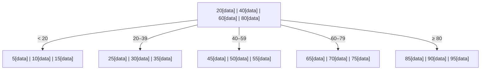
```mermaid
flowchart TD
    R["20[data] | 40[data] | 60[data] | 80[data]"]
    L["5[data] | 10[data] | 15[data]"]
    M["25[data] | 30[data] | 35[data]"]
    N["45[data] | 50[data] | 55[data]"]
    O["65[data] | 70[data] | 75[data]"]
    H["85[data] | 90[data] | 95[data]"]
    R -->|"< 20"| L
    R -->|"20–39"| M
    R -->|"40–59"| N
    R -->|"60–79"| O
    R -->|"≥ 80"| H
```

`键值[data]` 表示键值及其对应数据记录。此5阶B-Tree示意中，根节点包含4个键并连接5个子节点；内部节点和叶子节点都保存数据。

特点：

- 5阶的B树，每一个节点最多存储4个key，对应5个指针。
- 一旦节点存储的key数量到达5，就会裂变，中间元素向上分裂。
- 在B树中，非叶子节点和叶子节点都会存放数据。

### B+Tree

B+Tree是B-Tree的变种，我们以一颗最大度数（max-degree）为4（4阶）的b+tree为例，来看一下其结构示意图：

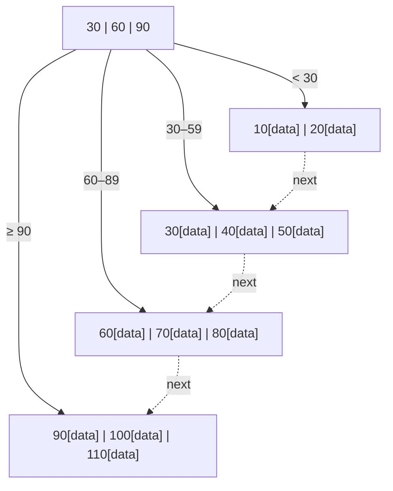
```mermaid
flowchart TD
    R["30 | 60 | 90"]
    L["10[data] | 20[data]"]
    M["30[data] | 40[data] | 50[data]"]
    N["60[data] | 70[data] | 80[data]"]
    H["90[data] | 100[data] | 110[data]"]
    R -->|"< 30"| L
    R -->|"30–59"| M
    R -->|"60–89"| N
    R -->|"≥ 90"| H
    L -. "next" .-> M
    M -. "next" .-> N
    N -. "next" .-> H
```

B+Tree内部节点只保存索引键，所有数据记录都在叶子节点；`键值[data]` 表示叶子节点中的键值及对应记录，叶子节点按顺序相连，便于范围扫描。

B+Tree 与 B-Tree相比，主要有以下三点区别：

- 所有的数据都会出现在叶子节点。
- 叶子节点形成一个单向链表。
- 非叶子节点仅仅起到索引数据作用，具体的数据都是在叶子节点存放的。

### Hash

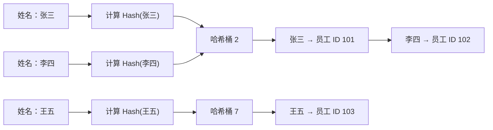
```mermaid
flowchart LR
    Z["姓名：张三"] --> HZ["计算 Hash(张三)"]
    L["姓名：李四"] --> HL["计算 Hash(李四)"]
    W["姓名：王五"] --> HW["计算 Hash(王五)"]
    HZ --> B2["哈希桶 2"]
    HL --> B2
    HW --> B7["哈希桶 7"]
    B2 --> RZ["张三 → 员工 ID 101"]
    RZ --> RL["李四 → 员工 ID 102"]
    B7 --> RW["王五 → 员工 ID 103"]
```

图中的桶号仅为示例。张三和李四落入同一个桶，查询 `name = '李四'` 时，需要在桶内比较姓名，才能定位员工 ID 102。

- 结构：通过哈希函数把索引键映射到哈希表位置，查找时计算键的哈希值并定位记录。
- 适用查询：适合索引列的等值查询（=、IN）；不支持范围查询、排序和前缀匹配。
- 限制：哈希冲突时还需比较实际键值；不适合需要顺序扫描或范围检索的场景。
- MySQL注意点：Memory 引擎支持显式 Hash 索引；InnoDB 的自适应哈希索引由引擎按访问情况自动建立，不是用户创建的普通索引。

> 为什么InnoDB选择使用B+tree索引结构?
>
> - **层级少**：单个节点可存更多索引项，树更矮，减少磁盘 I/O。
> - **查询稳定**：数据集中在叶子节点，查找路径长度基本一致。
> - **范围查询高效**：叶子节点有序并通过链表连接，便于范围扫描和排序。
> - **相比 B-Tree**：非叶子节点只存索引键，可容纳更多 key。
> - **相比 Hash**：不仅支持等值查询，还支持范围查询和排序。

## 索引分类

在MySQL数据库，将索引的具体类型主要分为以下几类


| **分类** | **含义**                                             | **特点**                 | **关键字** |
| -------- | ---------------------------------------------------- | ------------------------ | ---------- |
| 主键索引 | 针对于表中主键创建的索引                             | 默认自动创建, 只能有一个 | PRIMARY    |
| 唯一索引 | 避免同一个表中某数据列中的值重复                     | 可以有多个               | UNIQUE     |
| 常规索引 | 快速定位特定数据                                     | 可以有多个               |            |
| 全文索引 | 全文索引查找的是文本中的关键词，而不是比较索引中的值 | 可以有多个               | FULLTEXT   |

而在在InnoDB存储引擎中，根据索引的存储形式，又可以分为以下两种：


| **分类**                  | **含义**                                                   | **特点**            |
| ------------------------- | ---------------------------------------------------------- | ------------------- |
| 聚集索引(Clustered Index) | 将数据存储与索引放到了一块，索引结构的叶子节点保存了行数据 | 必须有,而且只有一个 |
| 二级索引(Secondary Index) | 将数据与索引分开存储，索引结构的叶子节点关联的是对应的主键 | 可以存在多个        |

聚集索引选取规则:

- 如果存在主键，主键索引就是聚集索引。
- 如果不存在主键，将使用第一个唯一（UNIQUE）索引作为聚集索引。
- 如果表没有主键，或没有合适的唯一索引，则InnoDB会自动生成一个rowid作为隐藏的聚集索引。

聚集索引和二级索引的具体结构如下：

- 聚集索引的叶子节点下挂的是这一行的数据 。
- 二级索引的叶子节点下挂的是该字段值对应的主键值。

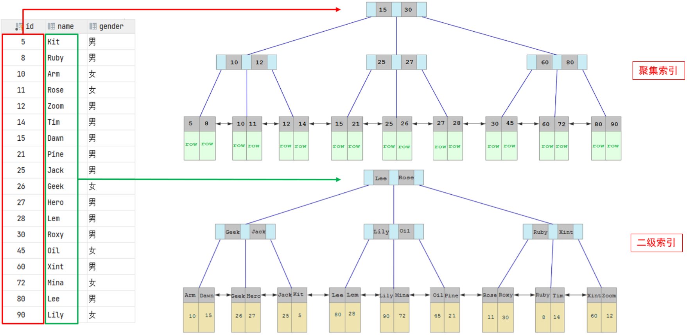

接下来，我们来分析一下，当我们执行如下的SQL语句时，具体的查找过程是什么样子的。

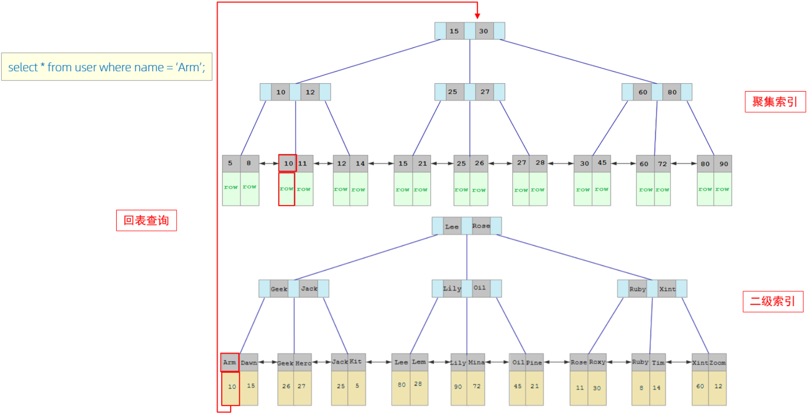

具体过程如下:

1. 由于是根据name字段进行查询，所以先根据name='Arm'到name字段的二级索引中进行匹配查找。但是在二级索引中只能查找到 Arm 对应的主键值 10。
2. 由于查询返回的数据是\*，所以此时，还需要根据主键值10，到聚集索引中查找10对应的记录，最终找到10对应的行row。
3. 最终拿到这一行的数据，直接返回即可。

> 回表查询(Table Lookup)： 这种先到二级索引中查找数据，找到主键值，然后再到聚集索引中根据主键值，获取数据的方式，就称之为回表查询。

## 索引语法

1). 创建索引

```sql
CREATE [ UNIQUE | FULLTEXT ] INDEX index_name ON table_name (index_col_name,... );
```

2). 查看索引

```sql
SHOW INDEX FROM table_name;
```

3). 删除索引

```sql
DROP INDEX index_name ON table_name;
```

## SQL性能分析

### SQL执行频率

通过 show \[session\|global\] status 命令可以提供服务器状态信息。通过如下指令，可以查看当前数据库的INSERT、UPDATE、DELETE、SELECT的访问频次：

```sql
-- session 是查看当前会话;
-- global 是查询全局数据;
SHOW GLOBAL STATUS LIKE 'Com_______';
```

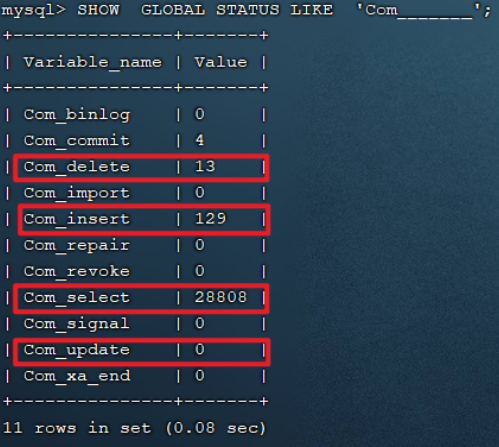

Com_delete: 删除次数

Com_insert: 插入次数

Com_select: 查询次数

Com_update: 更新次数

通过上述指令，我们可以查看到当前数据库到底是以查询为主，还是以增删改为主，从而为数据库优化提供参考依据。 如果是以增删改为主，我们可以考虑不对其进行索引的优化。 如果是以查询为主，那么就要考虑对数据库的索引进行优化了。

### 慢查询日志

慢查询日志记录了所有执行时间超过指定参数（long_query_time，单位：秒，默认10秒）的所有SQL语句的日志。

MySQL的慢查询日志默认没有开启，我们可以查看一下系统变量 slow_query_log。

```sql
mysql> show variables like 'slow_query_log';
+----------------+-------+
| Variable_name  | Value |
+----------------+-------+
| slow_query_log | OFF   |
+----------------+-------+
1 row in set (0.01 sec)
```

如果要开启慢查询日志，需要在MySQL的配置文件（/etc/my.cnf）中配置如下信息：

```sql
# 开启MySQL慢日志查询开关
slow_query_log=1
# 设置慢日志的时间为2秒，SQL语句执行时间超过2秒，就会视为慢查询，记录慢查询日志
long_query_time=2
```

配置完毕之后，通过以下指令重新启动MySQL服务器进行测试，查看慢日志文件中记录的信息/var/lib/mysql/localhost-slow.log。

```bash
systemctl restart mysqld
```

然后，再次查看开关情况，慢查询日志就已经打开了。

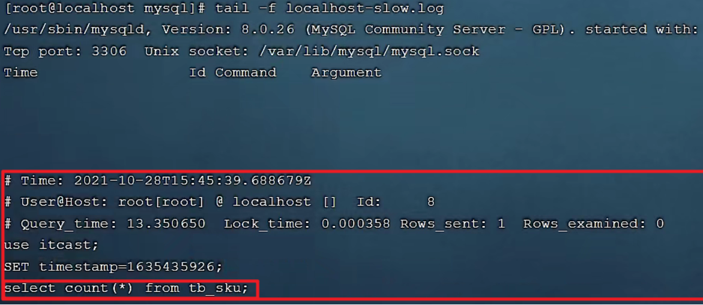

### profile详情

show profiles 能够在做SQL优化时帮助我们了解时间都耗费到哪里去了。通过have_profiling参数，能够看到当前MySQL是否支持profile操作：

```sql
mysql> select @@have_profiling;
+------------------+
| @@have_profiling |
+------------------+
| YES              |
+------------------+
1 row in set, 1 warning (0.00 sec)

mysql> select @@profiling;
+-------------+
| @@profiling |
+-------------+
|           0 |
+-------------+
1 row in set, 1 warning (0.00 sec)
```

可以看到，当前MySQL是支持 profile操作的，但是开关是关闭的。可以通过set语句在session/global级别开启profiling：

```sql
SET profiling = 1;

-- 查看每一条SQL的耗时基本情况
show profiles;
-- 查看指定query_id的SQL语句各个阶段的耗时情况
show profile for query query_id;
-- 查看指定query_id的SQL语句CPU的使用情况
show profile cpu for query query_id;
```

查看每一条SQL的耗时情况:

```sql
mysql> show profiles;
+----------+------------+----------------------------------------------+
| Query_ID | Duration   | Query                                        |
+----------+------------+----------------------------------------------+
|        2 | 0.00041925 | SELECT DATABASE()                            |
|        3 | 0.01222200 | show databases                              |
|        4 | 0.00726975 | show tables                                 |
|        5 | 0.00162125 | show tables                                 |
|        6 | 0.00062300 | select * from tb_user                       |
|        7 | 0.00097975 | select count(*) from tb_user                |
|        8 | 0.00053200 | select * from tb_user                       |
|        9 | 9.94508625 | select count(*) from tb_sku                 |
|       10 | 0.00366750 | select @@have_profiling                     |
|       11 | 0.00035200 | select @@profiling                          |
|       12 | 0.00015650 | select @@profiling                          |
|       13 | 0.00053075 | select * from tb_user                       |
|       14 | 0.00062125 | select * from tb_user where id = 1          |
|       15 | 0.00741925 | select * from tb_user where name = '白起'   |
|       16 | 9.53712800 | select count(*) from tb_sku                 |
+----------+------------+----------------------------------------------+
15 rows in set, 1 warning (0.00 sec)
```

查看指定SQL各个阶段的耗时情况:

```sql
mysql> show profile for query 16;
+------------------------------+----------+
| Status                       | Duration |
+------------------------------+----------+
| starting                     | 0.000137 |
| Executing hook on transaction| 0.000009 |
| starting                     | 0.000028 |
| checking permissions         | 0.000027 |
| Opening tables               | 0.000033 |
| init                         | 0.000006 |
| System lock                  | 0.000010 |
| optimizing                   | 0.000022 |
| statistics                   | 0.000015 |
| preparing                    | 0.000013 |
| executing                    | 9.536456 |
| end                          | 0.000025 |
| query end                    | 0.000007 |
| waiting for handler commit   | 0.000013 |
| closing tables               | 0.000014 |
| freeing items                | 0.000048 |
| logging slow query           | 0.000244 |
| cleaning up                  | 0.000024 |
+------------------------------+----------+
18 rows in set, 1 warning (0.01 sec)
```

### explain

EXPLAIN 或者 DESC命令获取 MySQL 如何执行 SELECT 语句的信息，包括在 SELECT 语句执行过程中表如何连接和连接的顺序。

```sql
-- 直接在select语句之前加上关键字 explain / desc
EXPLAIN SELECT 字段列表 FROM 表名 WHERE 条件 ;
```

- id: select查询的序列号，表示查询中执行select子句或者是操作表的顺序(id相同，执行顺序从上到下；id不同，值越大，越先执行)。
- select_type: 表示 SELECT 的类型，常见的取值有 SIMPLE（简单表，即不使用表连接或者子查询）、PRIMARY（主查询，即外层的查询）、UNION（UNION 中的第二个或者后面的查询语句）、SUBQUERY（SELECT/WHERE之后包含了子查询）等
- type: 表示连接类型，性能由好到差的连接类型为NULL、system、const、eq_ref、ref、range、 index、all。
- possible_key: 显示可能应用在这张表上的索引，一个或多个。
- key: 实际使用的索引，如果为NULL，则没有使用索引。
- key_len: 表示索引中使用的字节数， 该值为索引字段最大可能长度，并非实际使用长度，在不损失精确性的前提下， 长度越短越好 。
- rows: MySQL认为必须要执行查询的行数，在innodb引擎的表中，是一个估计值，可能并不总是准确的。
- filtered: 表示返回结果的行数占需读取行数的百分比， filtered 的值越大越好。
- Extra: 表示额外信息
  - `Using where`: Server 层还需要根据 WHERE 条件过滤记录
  - `Using index`: 使用覆盖索引，可直接从索引获取所需数据，无需回表
  - `Using index condition`: 使用索引下推（ICP），先在存储引擎层利用索引条件过滤，再回表
  - `Using filesort`: ORDER BY 无法直接利用索引顺序，需要额外排序
  - `Using temporary`: 使用临时表保存中间结果，常见于 GROUP BY、DISTINCT 等
  - `Using join buffer`: JOIN 无法充分利用索引，需要使用 Join Buffer
  - `Using index for group-by`: GROUP BY / DISTINCT 利用索引完成，避免扫描全部数据
  - `Using MRR`: 使用 Multi-Range Read，将随机回表转换为更顺序的读取
  - `Impossible WHERE`: WHERE 条件恒不成立，无需访问数据
  - `Select tables optimized away`: 查询可直接通过索引或统计信息得到结果，无需真正扫描表

## 索引使用

### 最左前缀法则

如果索引了多列（联合索引），要遵守最左前缀法则。最左前缀法则指的是查询从索引的最左列开始，并且不跳过索引中的列。如果跳跃某一列，索引将会部分失效(后面的字段索引失效)。

以 tb_user 表为例，我们先来查看一下之前 tb_user 表所创建的索引。

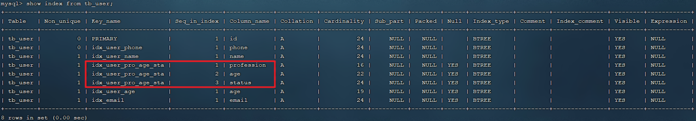

在 tb_user 表中，有一个联合索引，这个联合索引涉及到三个字段，顺序分别为：profession，age，status。

对于最左前缀法则指的是，查询时，最左变的列，也就是profession必须存在，否则索引全部失效。

而且中间不能跳过某一列，否则该列后面的字段索引将失效。 接下来，我们来演示几组案例，看一下具体的执行计划：

```sql
mysql> explain select * from tb_user where profession = '软件工程' and age = 31 and status = '0';
+----+-------------+---------+------------+------+----------------------+----------------------+---------+-------------------+------+----------+-----------------------+
| id | select_type | table   | partitions | type | possible_keys        | key                  | key_len | ref               | rows | filtered | Extra                 |
+----+-------------+---------+------------+------+----------------------+----------------------+---------+-------------------+------+----------+-----------------------+
|  1 | SIMPLE      | tb_user | NULL       | ref  | idx_user_pro_age_sta | idx_user_pro_age_sta | 54      | const,const,const |    1 |   100.00 | Using index condition |
+----+-------------+---------+------------+------+----------------------+----------------------+---------+-------------------+------+----------+-----------------------+

mysql> explain select * from tb_user where profession = '软件工程' and age = 31;
+----+-------------+---------+------------+------+----------------------+----------------------+---------+-------------+------+----------+-------+
| id | select_type | table   | partitions | type | possible_keys        | key                  | key_len | ref         | rows | filtered | Extra |
+----+-------------+---------+------------+------+----------------------+----------------------+---------+-------------+------+----------+-------+
|  1 | SIMPLE      | tb_user | NULL       | ref  | idx_user_pro_age_sta | idx_user_pro_age_sta | 49      | const,const |    1 |   100.00 | NULL  |
+----+-------------+---------+------------+------+----------------------+----------------------+---------+-------------+------+----------+-------+

mysql> explain select * from tb_user where profession = '软件工程';
+----+-------------+---------+------------+------+----------------------+----------------------+---------+-------+------+----------+-------+
| id | select_type | table   | partitions | type | possible_keys        | key                  | key_len | ref   | rows | filtered | Extra |
+----+-------------+---------+------------+------+----------------------+----------------------+---------+-------+------+----------+-------+
|  1 | SIMPLE      | tb_user | NULL       | ref  | idx_user_pro_age_sta | idx_user_pro_age_sta | 47      | const |    4 |   100.00 | NULL  |
+----+-------------+---------+------------+------+----------------------+----------------------+---------+-------+------+----------+-------+
1 row in set, 1 warning (0.00 sec)
```

以上的这三组测试中，我们发现只要联合索引最左边的字段 profession存在，索引就会生效，只不过索引的长度不同。 而且由以上三组测试，我们也可以推测出profession字段索引长度为47、age字段索引长度为2、status字段索引长度为5。

```sql
mysql> explain select * from tb_user where age = 31 and status = '0';
+----+-------------+---------+------------+------+---------------+------+---------+------+------+----------+-------------+
| id | select_type | table   | partitions | type | possible_keys | key  | key_len | ref  | rows | filtered | Extra       |
+----+-------------+---------+------------+------+---------------+------+---------+------+------+----------+-------------+
|  1 | SIMPLE      | tb_user | NULL       | ALL  | NULL          | NULL | NULL    | NULL |   24 |     4.17 | Using where |
+----+-------------+---------+------------+------+---------------+------+---------+------+------+----------+-------------+

mysql> explain select * from tb_user where status = '0';
+----+-------------+---------+------------+------+---------------+------+---------+------+------+----------+-------------+
| id | select_type | table   | partitions | type | possible_keys | key  | key_len | ref  | rows | filtered | Extra       |
+----+-------------+---------+------------+------+---------------+------+---------+------+------+----------+-------------+
|  1 | SIMPLE      | tb_user | NULL       | ALL  | NULL          | NULL | NULL    | NULL |   24 |    10.00 | Using where |
+----+-------------+---------+------------+------+---------------+------+---------+------+------+----------+-------------+
```

而通过上面的这两组测试，我们也可以看到索引并未生效，原因是因为不满足最左前缀法则，联合索引最左边的列profession不存在。

```sql
mysql> explain select * from tb_user where profession = '软件工程' and status = '0';
+----+-------------+---------+------------+------+----------------------+----------------------+---------+-------+------+----------+-----------------------+
| id | select_type | table   | partitions | type | possible_keys        | key                  | key_len | ref   | rows | filtered | Extra                 |
+----+-------------+---------+------------+------+----------------------+----------------------+---------+-------+------+----------+-----------------------+
|  1 | SIMPLE      | tb_user | NULL       | ref  | idx_user_pro_age_sta | idx_user_pro_age_sta | 47      | const |    4 |    10.00 | Using index condition |
+----+-------------+---------+------------+------+----------------------+----------------------+---------+-------+------+----------+-----------------------+
```

上述的SQL查询时，存在profession字段，最左边的列是存在的，索引满足最左前缀法则的基本条件。但是查询时，跳过了age这个列，所以后面的列索引是不会使用的，也就是索引部分生效，所以索引的长度就是47。

### 范围查询

联合索引中，出现范围查询(\>,\<)，范围查询右侧的列索引失效。

```sql
mysql> explain select * from tb_user where profession = '软件工程' and age > 30 and status = '0';
+----+-------------+---------+------------+-------+----------------------+----------------------+---------+------+------+----------+-----------------------+
| id | select_type | table   | partitions | type  | possible_keys        | key                  | key_len | ref  | rows | filtered | Extra                 |
+----+-------------+---------+------------+-------+----------------------+----------------------+---------+------+------+----------+-----------------------+
|  1 | SIMPLE      | tb_user | NULL       | range | idx_user_pro_age_sta | idx_user_pro_age_sta | 49      | NULL |    2 |    10.00 | Using index condition |
+----+-------------+---------+------------+-------+----------------------+----------------------+---------+------+------+----------+-----------------------+
```

当范围查询使用\> 或 \< 时，走联合索引了，但是索引的长度为49，就说明范围查询右边的status字段是没有走索引的。

```sql
mysql> explain select * from tb_user where profession = '软件工程' and age >= 30 and status = '0';
+----+-------------+---------+------------+-------+----------------------+----------------------+---------+------+------+----------+-----------------------+
| id | select_type | table   | partitions | type  | possible_keys        | key                  | key_len | ref  | rows | filtered | Extra                 |
+----+-------------+---------+------------+-------+----------------------+----------------------+---------+------+------+----------+-----------------------+
|  1 | SIMPLE      | tb_user | NULL       | range | idx_user_pro_age_sta | idx_user_pro_age_sta | 54      | NULL |    2 |    10.00 | Using index condition |
+----+-------------+---------+------------+-------+----------------------+----------------------+---------+------+------+----------+-----------------------+
```

当范围查询使用\>= 或 \<= 时，走联合索引了，但是索引的长度为54，就说明所有的字段都是走索引的。

所以，在业务允许的情况下，尽可能的使用类似于 \>= 或 \<= 这类的范围查询，而避免使用 \> 或 \<。

### 索引失效情况

#### **索引列运算**

不要在索引列上进行运算操作， 索引将失效。

在tb_user表中，除了前面介绍的联合索引之外，还有一个索引，是phone字段的单列索引。

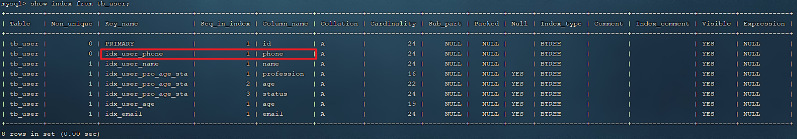

```sql
mysql> explain select * from tb_user where substring(phone,10,2) = '15';
+----+-------------+---------+------------+------+---------------+------+---------+------+------+----------+-------------+
| id | select_type | table   | partitions | type | possible_keys | key  | key_len | ref  | rows | filtered | Extra       |
+----+-------------+---------+------------+------+---------------+------+---------+------+------+----------+-------------+
|  1 | SIMPLE      | tb_user | NULL       | ALL  | NULL          | NULL | NULL    | NULL |   24 |   100.00 | Using where |
+----+-------------+---------+------------+------+---------------+------+---------+------+------+----------+-------------+
```

#### 字符串不加引号

字符串类型字段使用时，不加引号，索引将失效。

```sql
mysql> explain select * from tb_user where profession = '软件工程' and age = 31 and status = '0';
+----+-------------+---------+------------+------+----------------------+----------------------+---------+-------------------+------+----------+-----------------------+
| id | select_type | table   | partitions | type | possible_keys        | key                  | key_len | ref               | rows | filtered | Extra                 |
+----+-------------+---------+------------+------+----------------------+----------------------+---------+-------------------+------+----------+-----------------------+
|  1 | SIMPLE      | tb_user | NULL       | ref  | idx_user_pro_age_sta | idx_user_pro_age_sta | 54      | const,const,const |    1 |   100.00 | Using index condition |
+----+-------------+---------+------------+------+----------------------+----------------------+---------+-------------------+------+----------+-----------------------+

mysql>
mysql> explain select * from tb_user where profession = '软件工程' and age = 31 and status = 0;
+----+-------------+---------+------------+------+----------------------+----------------------+---------+-------------+------+----------+-----------------------+
| id | select_type | table   | partitions | type | possible_keys        | key                  | key_len | ref         | rows | filtered | Extra                 |
+----+-------------+---------+------------+------+----------------------+----------------------+---------+-------------+------+----------+-----------------------+
|  1 | SIMPLE      | tb_user | NULL       | ref  | idx_user_pro_age_sta | idx_user_pro_age_sta | 49      | const,const |    1 |    10.00 | Using index condition |
+----+-------------+---------+------------+------+----------------------+----------------------+---------+-------------+------+----------+-----------------------+
```

经过上面两组示例，我们会明显的发现，如果字符串不加单引号，对于查询结果，没什么影响，但是数据库存在隐式类型转换，索引将失效。

#### 模糊查询

如果仅仅是尾部模糊匹配，索引不会失效。如果是头部模糊匹配，索引失效。

接下来，我们来看一下这三条SQL语句的执行效果，查看一下其执行计划：

由于下面查询语句中，都是根据profession字段查询，符合最左前缀法则，联合索引是可以生效的，我们主要看一下，模糊查询时，%加在关键字之前，和加在关键字之后的影响。

```sql
mysql> explain select * from tb_user where profession like '软件%';
+----+-------------+---------+------------+-------+----------------------+----------------------+---------+------+------+----------+-----------------------+
| id | select_type | table   | partitions | type  | possible_keys        | key                  | key_len | ref  | rows | filtered | Extra                 |
+----+-------------+---------+------------+-------+----------------------+----------------------+---------+------+------+----------+-----------------------+
|  1 | SIMPLE      | tb_user | NULL       | range | idx_user_pro_age_sta | idx_user_pro_age_sta | 47      | NULL |    4 |   100.00 | Using index condition |
+----+-------------+---------+------------+-------+----------------------+----------------------+---------+------+------+----------+-----------------------+

mysql> explain select * from tb_user where profession like '%工程';
+----+-------------+---------+------------+------+---------------+------+---------+------+------+----------+-------------+
| id | select_type | table   | partitions | type | possible_keys | key  | key_len | ref  | rows | filtered | Extra       |
+----+-------------+---------+------------+------+---------------+------+---------+------+------+----------+-------------+
|  1 | SIMPLE      | tb_user | NULL       | ALL  | NULL          | NULL | NULL    | NULL |   24 |    11.11 | Using where |
+----+-------------+---------+------------+------+---------------+------+---------+------+------+----------+-------------+

mysql> explain select * from tb_user where profession like '%工%';
+----+-------------+---------+------------+------+---------------+------+---------+------+------+----------+-------------+
| id | select_type | table   | partitions | type | possible_keys | key  | key_len | ref  | rows | filtered | Extra       |
+----+-------------+---------+------------+------+---------------+------+---------+------+------+----------+-------------+
|  1 | SIMPLE      | tb_user | NULL       | ALL  | NULL          | NULL | NULL    | NULL |   24 |    11.11 | Using where |
+----+-------------+---------+------------+------+---------------+------+---------+------+------+----------+-------------+
```

经过上述的测试，我们发现，在like模糊查询中，在关键字后面加%，索引可以生效。而如果在关键字前面加了%，索引将会失效。

#### or连接条件

用or分割开的条件， 如果or前的条件中的列有索引，而后面的列中没有索引，那么涉及的索引都不会被用到。

```sql
mysql> explain select * from tb_user where id = 10 or age = 23;
+----+-------------+---------+------------+------+---------------+------+---------+------+------+----------+-------------+
| id | select_type | table   | partitions | type | possible_keys | key  | key_len | ref  | rows | filtered | Extra       |
+----+-------------+---------+------------+------+---------------+------+---------+------+------+----------+-------------+
|  1 | SIMPLE      | tb_user | NULL       | ALL  | PRIMARY       | NULL | NULL    | NULL |   24 |    13.75 | Using where |
+----+-------------+---------+------------+------+---------------+------+---------+------+------+----------+-------------+

mysql> explain select * from tb_user where phone = '17799990017' or age = 23;
+----+-------------+---------+------------+------+----------------+------+---------+------+------+----------+-------------+
| id | select_type | table   | partitions | type | possible_keys  | key  | key_len | ref  | rows | filtered | Extra       |
+----+-------------+---------+------------+------+----------------+------+---------+------+------+----------+-------------+
|  1 | SIMPLE      | tb_user | NULL       | ALL  | idx_user_phone | NULL | NULL    | NULL |   24 |    13.75 | Using where |
+----+-------------+---------+------------+------+----------------+------+---------+------+------+----------+-------------+
```

由于age没有索引，所以即使id、phone有索引，索引也会失效。所以需要针对于age也要建立索引。

然后，我们可以对age字段建立索引。

```sql
create index idx_user_age on tb_user(age);
```

建立了索引之后，我们再次执行上述的SQL语句，看看前后执行计划的变化。

```sql
mysql> explain select * from tb_user where id = 10 or age = 23;
+----+-------------+---------+------------+-------------+----------------------+----------------------+---------+------+------+----------+----------------------------------------------------+
| id | select_type | table   | partitions | type        | possible_keys        | key                  | key_len | ref  | rows | filtered | Extra                                              |
+----+-------------+---------+------------+-------------+----------------------+----------------------+---------+------+------+----------+----------------------------------------------------+
|  1 | SIMPLE      | tb_user | NULL       | index_merge | PRIMARY,idx_user_age | PRIMARY,idx_user_age | 4,2     | NULL |    3 |   100.00 | Using union(PRIMARY,idx_user_age); Using where     |
+----+-------------+---------+------------+-------------+----------------------+----------------------+---------+------+------+----------+----------------------------------------------------+

mysql> explain select * from tb_user where phone = '17799990017' or age = 23;
+----+-------------+---------+------------+-------------+-----------------------------+-----------------------------+---------+------+------+----------+-----------------------------------------------------------+
| id | select_type | table   | partitions | type        | possible_keys               | key                         | key_len | ref  | rows | filtered | Extra                                                     |
+----+-------------+---------+------------+-------------+-----------------------------+-----------------------------+---------+------+------+----------+-----------------------------------------------------------+
|  1 | SIMPLE      | tb_user | NULL       | index_merge | idx_user_phone,idx_user_age | idx_user_phone,idx_user_age | 46,2    | NULL |    3 |   100.00 | Using union(idx_user_phone,idx_user_age); Using where     |
+----+-------------+---------+------------+-------------+-----------------------------+-----------------------------+---------+------+------+----------+-----------------------------------------------------------+
```

最终，我们发现，当or连接的条件，左右两侧字段都有索引时，索引才会生效。

#### **数据分布影响**

如果MySQL评估使用索引比全表更慢，则不使用索引。

```sql
mysql> explain select * from tb_user where phone >= '17799990005';
+----+-------------+---------+------------+------+----------------+------+---------+------+------+----------+-------------+
| id | select_type | table   | partitions | type | possible_keys  | key  | key_len | ref  | rows | filtered | Extra       |
+----+-------------+---------+------------+------+----------------+------+---------+------+------+----------+-------------+
|  1 | SIMPLE      | tb_user | NULL       | ALL  | idx_user_phone | NULL | NULL    | NULL |   24 |    79.17 | Using where |
+----+-------------+---------+------------+------+----------------+------+---------+------+------+----------+-------------+

mysql> explain select * from tb_user where phone >= '17799990015';
+----+-------------+---------+------------+-------+----------------+----------------+---------+------+------+----------+-----------------------+
| id | select_type | table   | partitions | type  | possible_keys  | key            | key_len | ref  | rows | filtered | Extra                 |
+----+-------------+---------+------------+-------+----------------+----------------+---------+------+------+----------+-----------------------+
|  1 | SIMPLE      | tb_user | NULL       | range | idx_user_phone | idx_user_phone | 46      | NULL |    9 |   100.00 | Using index condition |
+----+-------------+---------+------------+-------+----------------+----------------+---------+------+------+----------+-----------------------+
```

经过测试我们发现，相同的SQL语句，只是传入的字段值不同，最终的执行计划也完全不一样，这是为什么呢？

就是因为MySQL在查询时，会评估使用索引的效率与走全表扫描的效率，如果走全表扫描更快，则放弃索引，走全表扫描。 因为索引是用来索引少量数据的，如果通过索引查询返回大批量的数据，则还不如走全表扫描来的快，此时索引就会失效。

接下来，我们再来看看 is null 与 is not null 操作是否走索引。

执行如下两条语句 ：

```sql
mysql> explain select * from tb_user where profession is null;
+----+-------------+---------+------------+------+----------------------+----------------------+---------+-------+------+----------+-----------------------+
| id | select_type | table   | partitions | type | possible_keys        | key                  | key_len | ref   | rows | filtered | Extra                 |
+----+-------------+---------+------------+------+----------------------+----------------------+---------+-------+------+----------+-----------------------+
|  1 | SIMPLE      | tb_user | NULL       | ref  | idx_user_pro_age_sta | idx_user_pro_age_sta | 47      | const |    1 |   100.00 | Using index condition |
+----+-------------+---------+------------+------+----------------------+----------------------+---------+-------+------+----------+-----------------------+

mysql> explain select * from tb_user where profession is not null;
+----+-------------+---------+------------+------+----------------------+------ +---------+------+------+----------+-------------+
| id | select_type | table   | partitions | type | possible_keys        | key   | key_len | ref  | rows | filtered | Extra       |
+----+-------------+---------+------------+------+----------------------+-------+---------+------+------+----------+-------------+
|  1 | SIMPLE      | tb_user | NULL       | ALL  | idx_user_pro_age_sta | NULL  | NULL    | NULL |   24 |   100.00 | Using where |
+----+-------------+---------+------------+------+----------------------+-------+---------+------+------+----------+-------------+
```

接下来，我们做一个操作将profession字段值全部更新为null。

```sql
update tb_user set profession = null;
```

然后，再次执行上述的两条SQL，查看SQL语句的执行计划。

```sql
mysql> explain select * from tb_user where profession is null;
+----+-------------+---------+------------+------+----------------------+------ +---------+------+------+----------+-------------+
| id | select_type | table   | partitions | type | possible_keys        | key  | key_len | ref  | rows | filtered | Extra       |
+----+-------------+---------+------------+------+----------------------+------ +---------+------+------+----------+-------------+
|  1 | SIMPLE      | tb_user | NULL       | ALL  | idx_user_pro_age_sta | NULL | NULL    | NULL |   24 |   100.00 | Using where |
+----+-------------+---------+------------+------+----------------------+------ +---------+------+------+----------+-------------+

mysql> explain select * from tb_user where profession is not null;
+----+-------------+---------+------------+-------+----------------------+----------------------+---------+------+------+----------+-----------------------+
| id | select_type | table   | partitions | type  | possible_keys        | key                  | key_len | ref  | rows | filtered | Extra                 |
+----+-------------+---------+------------+-------+----------------------+----------------------+---------+------+------+----------+-----------------------+
|  1 | SIMPLE      | tb_user | NULL       | range | idx_user_pro_age_sta | idx_user_pro_age_sta | 47      | NULL |    1 |   100.00 | Using index condition |
+----+-------------+---------+------------+-------+----------------------+----------------------+---------+------+------+----------+-----------------------+
```

最终我们看到，一模一样的SQL语句，先后执行了两次，结果查询计划是不一样的，为什么会出现这种现象，这是和数据库的数据分布有关系。查询时MySQL会评估，走索引快，还是全表扫描快，如果全表扫描更快，则放弃索引走全表扫描。 因此，is null 、is not null是否走索引，得具体情况具体分析，并不是固定的。

### SQL提示

我们能不能在查询的时候，自己来指定使用哪个索引呢？ 答案是肯定的，此时就可以借助于MySQL的SQL提示来完成。 接下来，介绍一下SQL提示。

SQL提示，是优化数据库的一个重要手段，简单来说，就是在SQL语句中加入一些人为的提示来达到优化操作的目的。

1). use index： 建议MySQL使用哪一个索引完成此次查询（仅仅是建议，mysql内部还会再次进行评估）。

```sql
explain select * from tb_user use index(idx_user_pro) where profession = '软件工程';
```

2). ignore index ： 忽略指定的索引。

```sql
explain select * from tb_user ignore index(idx_user_pro) where profession = '软件工程';
```

3). force index ： 强制使用索引。

```sql
explain select * from tb_user force index(idx_user_pro) where profession = '软件工程';
```

### 覆盖索引

尽量使用覆盖索引，减少select \*。那么什么是覆盖索引呢？覆盖索引是指 查询使用了索引，并且需要返回的列，在该索引中已经全部能够找到。

接下来，我们来看一组SQL的执行计划，看看执行计划的差别，然后再来具体做一个解析。

```sql
mysql> explain select id, profession from tb_user where profession = '软件工程' and age = 31 and status = '0';
+----+-------------+---------+------------+------+-------------------------------------------+----------------------+---------+-------------------+------+----------+--------------------------+
| id | select_type | table   | partitions | type | possible_keys                             | key                  | key_len | ref               | rows | filtered | Extra                    |
+----+-------------+---------+------------+------+-------------------------------------------+----------------------+---------+-------------------+------+----------+--------------------------+
|  1 | SIMPLE      | tb_user | NULL       | ref  | idx_user_pro_age_sta,idx_user_age,idx_user_pro | idx_user_pro_age_sta | 54      | const,const,const |    1 |   100.00 | Using where; Using index |
+----+-------------+---------+------------+------+-------------------------------------------+----------------------+---------+-------------------+------+----------+--------------------------+

mysql> explain select id,profession,age, status from tb_user where profession = '软件工程' and age = 31 and status = '0';
+----+-------------+---------+------------+------+-------------------------------------------+----------------------+---------+-------------------+------+----------+--------------------------+
| id | select_type | table   | partitions | type | possible_keys                             | key                  | key_len | ref               | rows | filtered | Extra                    |
+----+-------------+---------+------------+------+-------------------------------------------+----------------------+---------+-------------------+------+----------+--------------------------+
|  1 | SIMPLE      | tb_user | NULL       | ref  | idx_user_pro_age_sta,idx_user_age,idx_user_pro | idx_user_pro_age_sta | 54      | const,const,const |    1 |   100.00 | Using where; Using index |
+----+-------------+---------+------------+------+-------------------------------------------+----------------------+---------+-------------------+------+----------+--------------------------+

mysql> explain select id,profession,age, status, name from tb_user where profession = '软件工程' and age = 31 and status = '0';
+----+-------------+---------+------------+------+-------------------------------------------+----------------------+---------+-------------------+------+----------+-----------------------+
| id | select_type | table   | partitions | type | possible_keys                             | key                  | key_len | ref               | rows | filtered | Extra                 |
+----+-------------+---------+------------+------+-------------------------------------------+----------------------+---------+-------------------+------+----------+-----------------------+
|  1 | SIMPLE      | tb_user | NULL       | ref  | idx_user_pro_age_sta,idx_user_age,idx_user_pro | idx_user_pro_age_sta | 54      | const,const,const |    1 |   100.00 | Using index condition |
+----+-------------+---------+------------+------+-------------------------------------------+----------------------+---------+-------------------+------+----------+-----------------------+

mysql> explain select * from tb_user where profession = '软件工程' and age = 31 and status = '0';
+----+-------------+---------+------------+------+-------------------------------------------+----------------------+---------+-------------------+------+----------+-----------------------+
| id | select_type | table   | partitions | type | possible_keys                             | key                  | key_len | ref               | rows | filtered | Extra                 |
+----+-------------+---------+------------+------+-------------------------------------------+----------------------+---------+-------------------+------+----------+-----------------------+
|  1 | SIMPLE      | tb_user | NULL       | ref  | idx_user_pro_age_sta,idx_user_age,idx_user_pro | idx_user_pro_age_sta | 54      | const,const,const |    1 |   100.00 | Using index condition |
+----+-------------+---------+------------+------+-------------------------------------------+----------------------+---------+-------------------+------+----------+-----------------------+
```

从上述的执行计划我们可以看到，这四条SQL语句的执行计划前面所有的指标都是一样的，看不出来差异。但是此时，我们主要关注的是后面的Extra，前面两天SQL的结果为 Using where; Using Index ; 而后面两条SQL的结果为: Using index condition 。


| **Extra**                | **含义**                                                                 |
| ------------------------ | ------------------------------------------------------------------------ |
| Using where; Using Index | 查找使用了索引，但是需要的数据都在索引列中能找到，所以不需要回表查询数据 |
| Using index condition    | 查找使用了索引，但是需要回表查询数据                                     |

因为，在tb_user表中有一个联合索引 idx_user_pro_age_sta，该索引关联了三个字段profession、age、status，而这个索引也是一个二级索引，所以叶子节点下面挂的是这一行的主键id。 所以当我们查询返回的数据在 id、profession、age、status 之中，则直接走二级索引直接返回数据了。 如果超出这个范围，就需要拿到主键id，再去扫描聚集索引，再获取额外的数据了，这个过程就是回表。 而我们如果一直使用select \* 查询返回所有字段值，很容易就会造成回表查询（除非是根据主键查询，此时只会扫描聚集索引）。

为了大家更清楚的理解，什么是覆盖索引，什么是回表查询，我们一起再来看下面的这组SQL的执行过程。

A. 表结构及索引示意图:

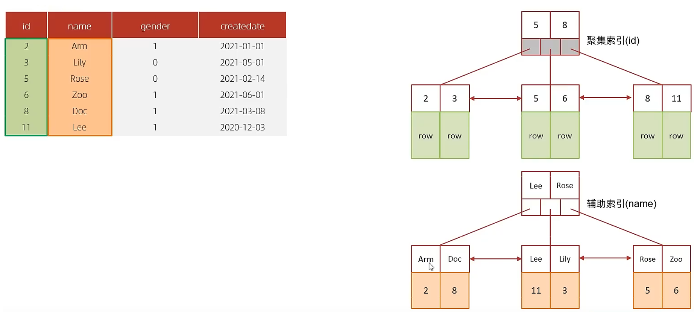

id是主键，是一个聚集索引。 name字段建立了普通索引，是一个二级索引（辅助索引）。

B. 执行SQL : select \* from tb_user where id = 2;

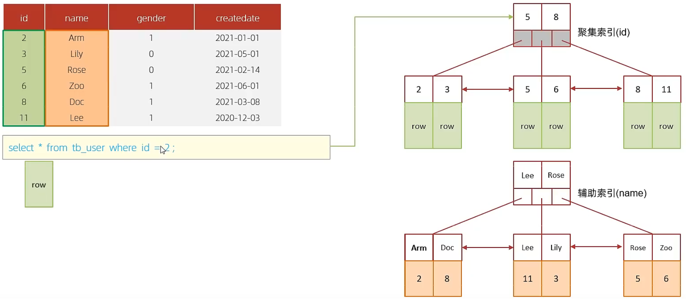

根据id查询，直接走聚集索引查询，一次索引扫描，直接返回数据，性能高。

C. 执行SQL：selet id,name from tb_user where name = 'Arm';

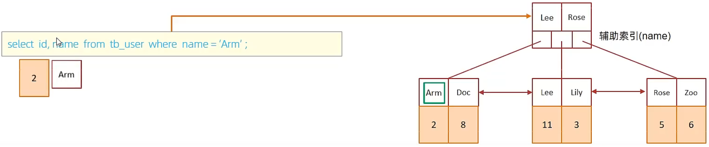

虽然是根据name字段查询，查询二级索引，但是由于查询返回在字段为 id，name，在name的二级索引中，这两个值都是可以直接获取到的，因为覆盖索引，所以不需要回表查询，性能高。

D. 执行SQL：selet id,name,gender from tb_user where name = 'Arm';

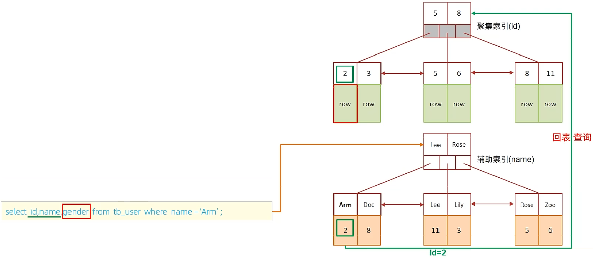

由于在name的二级索引中，不包含gender，所以，需要两次索引扫描，也就是需要回表查询，性能相对较差一点。

### 前缀索引

当字段类型为字符串（varchar，text，longtext等）时，有时候需要索引很长的字符串，这会让索引变得很大，查询时，浪费大量的磁盘IO， 影响查询效率。此时可以只将字符串的一部分前缀，建立索引，这样可以大大节约索引空间，从而提高索引效率。

1). 语法

```sql
create index idx_xxxx on table_name(column(n));
```

示例:

为tb_user表的email字段，建立长度为5的前缀索引。

```sql
create index idx_email_5 on tb_user(email(5));
```

2). 前缀长度

可以根据索引的选择性来决定，而选择性是指不重复的索引值（基数）和数据表的记录总数的比值，索引选择性越高则查询效率越高， 唯一索引的选择性是1，这是最好的索引选择性，性能也是最好的。

```sql
select count(distinct email) / count(*) from tb_user;
select count(distinct substring(email,1,5)) / count(*) from tb_user;
```

3). 前缀索引的查询流程

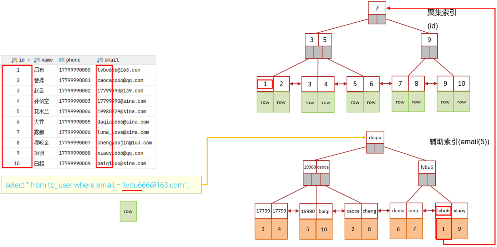

### 单列索引与联合索引

我们来执行一条SQL语句，看看其执行计划：

```sql
mysql> explain select id,phone,name from tb_user where phone = '17799990010' and name = '韩信';
+----+-------------+---------+------------+-------+------------------------------+----------------+---------+-------+------+----------+-------+
| id | select_type | table   | partitions | type  | possible_keys                | key            | key_len | ref   | rows | filtered | Extra |
+----+-------------+---------+------------+-------+------------------------------+----------------+---------+-------+------+----------+-------+
|  1 | SIMPLE      | tb_user | NULL       | const | idx_user_phone,idx_user_name | idx_user_phone | 46      | const |    1 |   100.00 | NULL  |
+----+-------------+---------+------------+-------+------------------------------+----------------+---------+-------+------+----------+-------+
```

通过上述执行计划我们可以看出来，在and连接的两个字段 phone、name上都是有单列索引的，但是最终mysql只会选择一个索引，也就是说，只能走一个字段的索引，此时是会回表查询的。

紧接着，我们再来创建一个phone和name字段的联合索引来查询一下执行计划。

```sql
mysql> explain select id,phone,name from tb_user use index(idx_user_phone_name) where phone = '17799990010' and name = '韩信';
+----+-------------+---------+------------+-------+---------------------+---------------------+---------+-------------+------+----------+-------------+
| id | select_type | table   | partitions | type  | possible_keys       | key                 | key_len | ref         | rows | filtered | Extra       |
+----+-------------+---------+------------+-------+---------------------+---------------------+---------+-------------+------+----------+-------------+
|  1 | SIMPLE      | tb_user | NULL       | const | idx_user_phone_name | idx_user_phone_name | 248     | const,const |    1 |   100.00 | Using index |
+----+-------------+---------+------------+-------+---------------------+---------------------+---------+-------------+------+----------+-------------+
```

此时，查询时，就走了联合索引，而在联合索引中包含 phone、name的信息，在叶子节点下挂的是对应的主键id，所以查询是无需回表查询的。

> 在业务场景中，如果存在多个查询条件，考虑针对于查询字段建立索引时，建议建立联合索引，而非单列索引。

如果查询使用的是联合索引，具体的结构示意图如下：

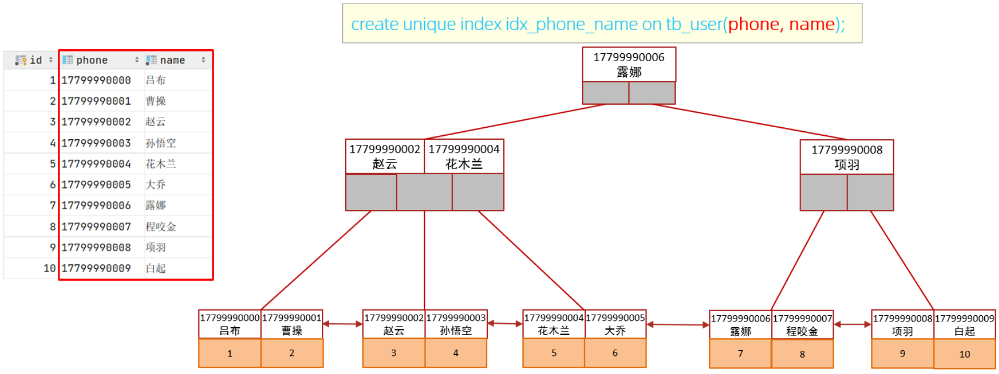

## 索引设计原则

1). 针对于数据量较大，且查询比较频繁的表建立索引。

2). 针对于常作为查询条件（where）、排序（order by）、分组（group by）操作的字段建立索引。

3). 尽量选择区分度高的列作为索引，尽量建立唯一索引，区分度越高，使用索引的效率越高。

4). 如果是字符串类型的字段，字段的长度较长，可以针对于字段的特点，建立前缀索引。

5). 尽量使用联合索引，减少单列索引，查询时，联合索引很多时候可以覆盖索引，节省存储空间，避免回表，提高查询效率。

6). 要控制索引的数量，索引并不是多多益善，索引越多，维护索引结构的代价也就越大，会影响增删改的效率。

7). 如果索引列不能存储NULL值，请在创建表时使用NOT NULL约束它。当优化器知道每列是否包含NULL值时，它可以更好地确定用哪个索引查询最有效。

# SQL优化

## 插入数据

- 优化方案一: 批量插入数据

```sql
insert into tb_test values(1,'Tom'),(2,'Cat'),(3,'Jerry');
```

- 优化方案二: 手动控制事务

```sql
start transaction;
insert into tb_test values(1,'Tom'),(2,'Cat'),(3,'Jerry');
insert into tb_test values(4,'Tom'),(5,'Cat'),(6,'Jerry');
insert into tb_test values(7,'Tom'),(8,'Cat'),(9,'Jerry');
commit;
```

- 优化方案三: 主键顺序插入，性能要高于乱序插入。

主键乱序插入 : 8 1 9 21 88 2 4 15 89 5 7 3

主键顺序插入 : 1 2 3 4 5 7 8 9 15 21 88 89

- 如果一次性需要插入大批量数据(比如: 几百万的记录)，使用insert语句插入性能较低，此时可以使用MySQL数据库提供的load指令进行插入。操作如下：

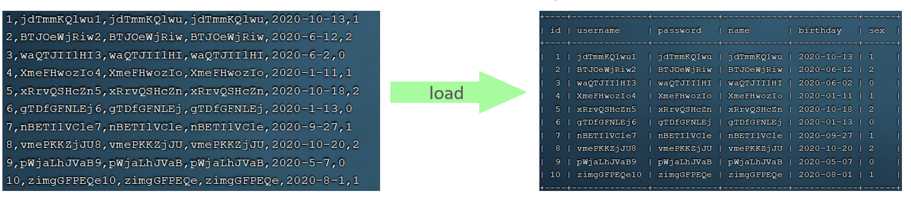

可以执行如下指令，将数据脚本文件中的数据加载到表结构中：

```sql
-- 客户端连接服务端时，加上参数 --local-infile
mysql –-local-infile -u root -p
-- 设置全局参数local_infile为1，开启从本地加载文件导入数据的开关
set global local_infile = 1;
-- 执行load指令将准备好的数据，加载到表结构中
load data local infile '/root/sql1.log' into table tb_user fields terminated by ',' lines terminated by '\n' ;
```

## 主键优化

在上一小节，我们提到，主键顺序插入的性能是要高于乱序插入的。 这一小节，就来介绍一下具体的原因，然后再分析一下主键又该如何设计。

1). 数据组织方式

在InnoDB存储引擎中，表数据都是根据主键顺序组织存放的，这种存储方式的表称为索引组织表(index organized table IOT)。

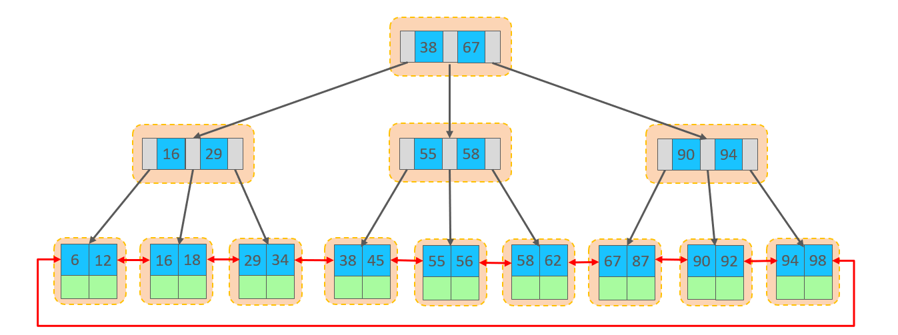

行数据，都是存储在聚集索引的叶子节点上的。而我们之前也讲解过InnoDB的逻辑结构图：

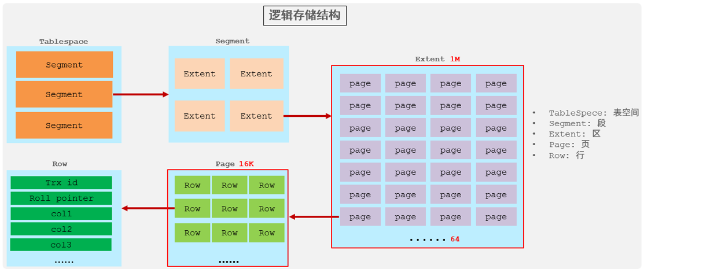

在InnoDB引擎中，数据行是记录在逻辑结构 page 页中的，而每一个页的大小是固定的，默认16K。那也就意味着， 一个页中所存储的行也是有限的，如果插入的数据行row在该页存储不小，将会存储到下一个页中，页与页之间会通过指针连接。

2). 页分裂

页可以为空，也可以填充一半，也可以填充100%。每个页包含了2-N行数据(如果一行数据过大，会行溢出)，根据主键排列。

A. 主键顺序插入效果

①. 从磁盘中申请页， 主键顺序插入

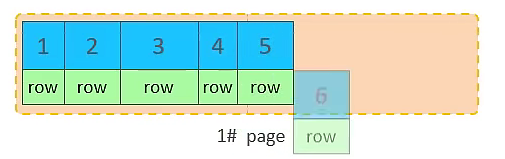

②. 第一个页没有满，继续往第一页插入

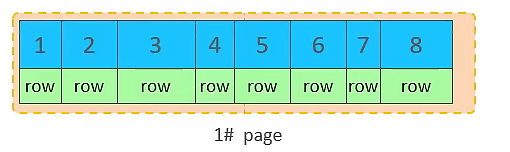

③. 当第一个也写满之后，再写入第二个页，页与页之间会通过指针连接


4. . 当第二页写满了，再往第三页写入


B. 主键乱序插入效果
①. 加入1#,2#页都已经写满了，存放了如图所示的数据
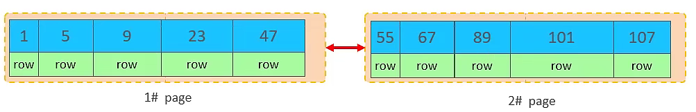

②. 此时再插入id为50的记录，我们来看看会发生什么现象

会再次开启一个页，写入新的页中吗？

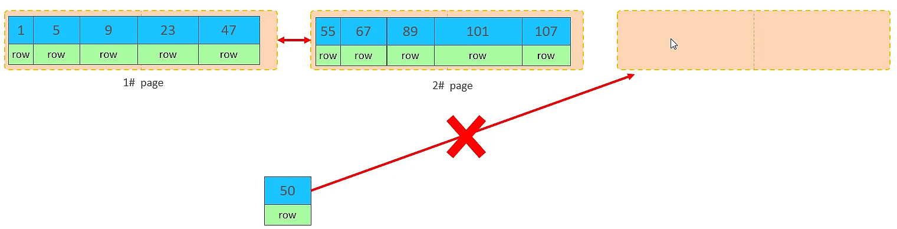

不会。因为，索引结构的叶子节点是有顺序的。按照顺序，应该存储在47之后。

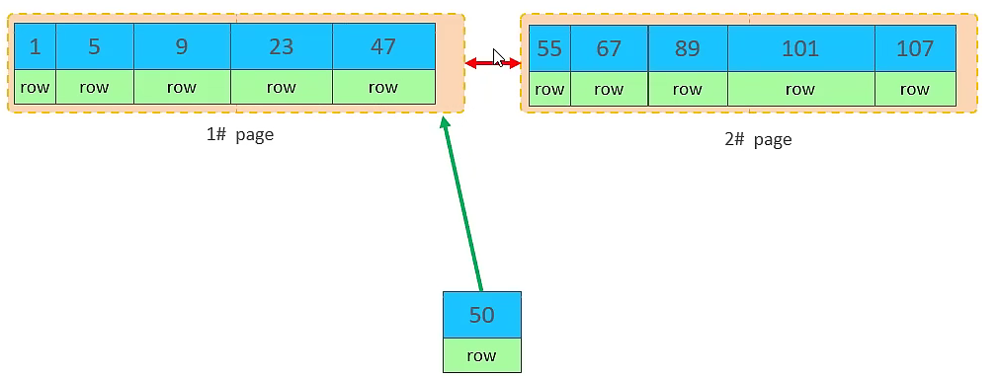

但是47所在的1#页，已经写满了，存储不了50对应的数据了。那么此时会开辟一个新的页3#。


但是并不会直接将50存入3#页，而是会将1#页后一半的数据，移动到3#页，然后在3#页，插入50。


移动数据，并插入id为50的数据之后，那么此时，这三个页之间的数据顺序是有问题的。1#的下一个页，应该是3#， 3#的下一个页是2#。 所以，此时，需要重新设置链表指针。

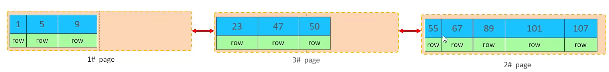

上述的这种现象，称之为 "页分裂"，是比较耗费性能的操作。

3). 页合并

目前表中已有数据的索引结构(叶子节点)如下：


当我们对已有数据进行删除时，具体的效果如下:

当删除一行记录时，实际上记录并没有被物理删除，只是记录被标记（flaged）为删除并且它的空间变得允许被其他记录声明使用。


当我们继续删除2#的数据记录

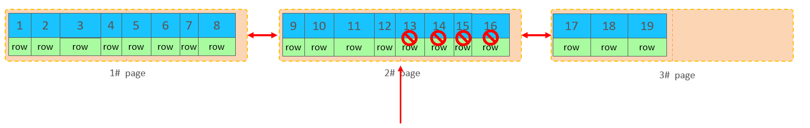

当页中删除的记录达到 MERGE_THRESHOLD（默认为页的50%），InnoDB会开始寻找最靠近的页（前或后）看看是否可以将两个页合并以优化空间使用。

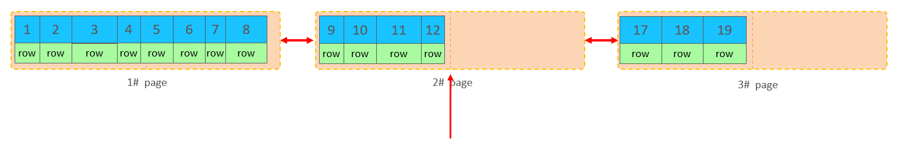


删除数据，并将页合并之后，再次插入新的数据21，则直接插入3#页


> MERGE_THRESHOLD：合并页的阈值，可以自己设置，在创建表或者创建索引时指定。 |

4). 索引设计原则

- 满足业务需求的情况下，尽量降低主键的长度。
- 插入数据时，尽量选择顺序插入，选择使用AUTO_INCREMENT自增主键。
- 尽量不要使用UUID做主键或者是其他自然主键，如身份证号。
- 业务操作时，避免对主键的修改。

## order by优化

MySQL的排序，有两种方式：

- Using filesort : 通过表的索引或全表扫描，读取满足条件的数据行，然后在排序缓冲区sort buffer中完成排序操作，所有不是通过索引直接返回排序结果的排序都叫 FileSort 排序。
- Using index : 通过有序索引顺序扫描直接返回有序数据，这种情况即为 using index，不需要额外排序，操作效率高。

对于以上的两种排序方式，Using index的性能高，而Using filesort的性能低，我们在优化排序操作时，尽量要优化为Using index。

接下来，我们来做一个测试：

A. 数据准备

```sql
mysql> drop index idx_user_phone on tb_user;
mysql> drop index idx_user_phone_name on tb_user;
mysql> drop index idx_user_name on tb_user;
mysql> show index from tb_user;
+---------+------------+----------------------+--------------+-------------+-----------+-------------+----------+--------+------+------------+---------+---------------+---------+------------+
| Table   | Non_unique | Key_name             | Seq_in_index | Column_name | Collation | Cardinality | Sub_part | Packed | Null | Index_type | Comment | Index_comment | Visible | Expression |
+---------+------------+----------------------+--------------+-------------+-----------+-------------+----------+--------+------+------------+---------+---------------+---------+------------+
| tb_user |          0 | PRIMARY              |            1 | id          | A         |          24 | NULL     | NULL   |      | BTREE      |         |               | YES     | NULL       |
| tb_user |          1 | idx_user_pro_age_sta |            1 | profession  | A         |          16 | NULL     | NULL   | YES  | BTREE      |         |               | YES     | NULL       |
| tb_user |          1 | idx_user_pro_age_sta |            2 | age         | A         |          22 | NULL     | NULL   | YES  | BTREE      |         |               | YES     | NULL       |
| tb_user |          1 | idx_user_pro_age_sta |            3 | status      | A         |          24 | NULL     | NULL   | YES  | BTREE      |         |               | YES     | NULL       |
| tb_user |          1 | idx_email_5          |            1 | email       | A         |          23 |        5 | NULL   | YES  | BTREE      |         |               | YES     | NULL       |
+---------+------------+----------------------+--------------+-------------+-----------+-------------+----------+--------+------+------------+---------+---------------+---------+------------+
```

B. 执行排序SQL

```sql
mysql> explain select id,age,phone from tb_user order by age;
+----+-------------+---------+------------+------+---------------+------+---------+------+------+----------+----------------+
| id | select_type | table   | partitions | type | possible_keys | key  | key_len | ref  | rows | filtered | Extra          |
+----+-------------+---------+------------+------+---------------+------+---------+------+------+----------+----------------+
|  1 | SIMPLE      | tb_user | NULL       | ALL  | NULL          | NULL | NULL    | NULL |   24 |   100.00 | Using filesort |
+----+-------------+---------+------------+------+---------------+------+---------+------+------+----------+----------------+

mysql> explain select id,age,phone from tb_user order by age, phone;
+----+-------------+---------+------------+------+---------------+------+---------+------+------+----------+----------------+
| id | select_type | table   | partitions | type | possible_keys | key  | key_len | ref  | rows | filtered | Extra          |
+----+-------------+---------+------------+------+---------------+------+---------+------+------+----------+----------------+
|  1 | SIMPLE      | tb_user | NULL       | ALL  | NULL          | NULL | NULL    | NULL |   24 |   100.00 | Using filesort |
+----+-------------+---------+------------+------+---------------+------+---------+------+------+----------+----------------+
```

由于 age, phone 都没有索引，所以此时再排序时，出现Using filesort，排序性能较低。

C. 创建索引

```sql
create index idx_user_age_phone_aa on tb_user(age,phone);
```

D. 创建索引后，根据age, phone进行升序排序

```sql
mysql> explain select id,age,phone from tb_user order by age;
+----+-------------+---------+------------+-------+---------------+-----------------------+---------+------+------+----------+-------------+
| id | select_type | table   | partitions | type  | possible_keys | key                   | key_len | ref  | rows | filtered | Extra       |
+----+-------------+---------+------------+-------+---------------+-----------------------+---------+------+------+----------+-------------+
|  1 | SIMPLE      | tb_user | NULL       | index | NULL          | idx_user_age_phone_aa | 48      | NULL |   24 |   100.00 | Using index |
+----+-------------+---------+------------+-------+---------------+-----------------------+---------+------+------+----------+-------------+

mysql> explain select id,age,phone from tb_user order by age, phone;
+----+-------------+---------+------------+-------+---------------+-----------------------+---------+------+------+----------+-------------+
| id | select_type | table   | partitions | type  | possible_keys | key                   | key_len | ref  | rows | filtered | Extra       |
+----+-------------+---------+------------+-------+---------------+-----------------------+---------+------+------+----------+-------------+
|  1 | SIMPLE      | tb_user | NULL       | index | NULL          | idx_user_age_phone_aa | 48      | NULL |   24 |   100.00 | Using index |
+----+-------------+---------+------------+-------+---------------+-----------------------+---------+------+------+----------+-------------+
```

建立索引之后，再次进行排序查询，就由原来的Using filesort， 变为了 Using index，性能就是比较高的了

E. 创建索引后，根据age, phone进行降序排序

```sql
mysql> explain select id,age,phone from tb_user order by age desc, phone desc;
+----+-------------+---------+------------+-------+---------------+-----------------------+---------+------+------+----------+------------------------------------+
| id | select_type | table   | partitions | type  | possible_keys | key                   | key_len | ref  | rows | filtered | Extra                              |
+----+-------------+---------+------------+-------+---------------+-----------------------+---------+------+------+----------+------------------------------------+
|  1 | SIMPLE      | tb_user | NULL       | index | NULL          | idx_user_age_phone_aa | 48      | NULL |   24 |   100.00 | Backward index scan; Using index   |
+----+-------------+---------+------------+-------+---------------+-----------------------+---------+------+------+----------+------------------------------------+
```

也出现 Using index，但是此时Extra中出现了 Backward index scan，这个代表反向扫描索引，因为在MySQL中我们创建的索引，默认索引的叶子节点是从小到大排序的，而此时我们查询排序时，是从大到小，所以，在扫描时，就是反向扫描，就会出现 Backward index scan。在MySQL8版本中，支持降序索引，我们也可以创建降序索引。

F. 根据phone，age进行升序排序，phone在前，age在后。

```sql
mysql> explain select id,age,phone from tb_user order by phone, age;
+----+-------------+---------+------------+-------+---------------+-----------------------+---------+------+------+----------+-----------------------------+
| id | select_type | table   | partitions | type  | possible_keys | key                   | key_len | ref  | rows | filtered | Extra                       |
+----+-------------+---------+------------+-------+---------------+-----------------------+---------+------+------+----------+-----------------------------+
|  1 | SIMPLE      | tb_user | NULL       | index | NULL          | idx_user_age_phone_aa | 48      | NULL |   24 |   100.00 | Using index; Using filesort |
+----+-------------+---------+------------+-------+---------------+-----------------------+---------+------+------+----------+-----------------------------+
```

排序时,也需要满足最左前缀法则,否则也会出现 filesort。因为在创建索引的时候，age是第一个字段，phone是第二个字段，所以排序时，也就该按照这个顺序来，否则就会出现Using filesort。

F. 根据age, phone进行降序一个升序，一个降序

```sql
mysql> explain select id,age,phone from tb_user order by age asc, phone desc;
+----+-------------+---------+------------+-------+---------------+-----------------------+---------+------+------+----------+-----------------------------+
| id | select_type | table   | partitions | type  | possible_keys | key                   | key_len | ref  | rows | filtered | Extra                       |
+----+-------------+---------+------------+-------+---------------+-----------------------+---------+------+------+----------+-----------------------------+
|  1 | SIMPLE      | tb_user | NULL       | index | NULL          | idx_user_age_phone_aa | 48      | NULL |   24 |   100.00 | Using index; Using filesort |
+----+-------------+---------+------------+-------+---------------+-----------------------+---------+------+------+----------+-----------------------------+
```

因为创建索引时，如果未指定顺序，默认都是按照升序排序的，而查询时，一个升序，一个降序，此时就会出现Using filesort。

为了解决上述的问题，我们可以创建一个索引，这个联合索引中 age 升序排序，phone 倒序排序。

G. 创建联合索引(age 升序排序，phone 倒序排序)

```sql
create index idx_user_age_phone_ad on tb_user(age asc, phone desc);
```

H. 然后再次执行如下SQL

```sql
mysql> explain select id,age,phone from tb_user order by age asc, phone desc;
+----+-------------+---------+------------+-------+---------------+-----------------------+---------+------+------+----------+-------------+
| id | select_type | table   | partitions | type  | possible_keys | key                   | key_len | ref  | rows | filtered | Extra       |
+----+-------------+---------+------------+-------+---------------+-----------------------+---------+------+------+----------+-------------+
|  1 | SIMPLE      | tb_user | NULL       | index | NULL          | idx_user_age_phone_ad | 48      | NULL |   24 |   100.00 | Using index |
+----+-------------+---------+------------+-------+---------------+-----------------------+---------+------+------+----------+-------------+
```

升序/降序联合索引结构图示:

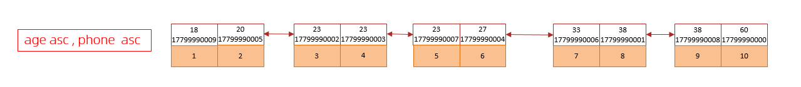

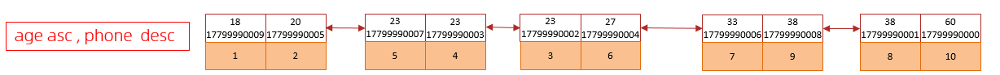

由上述的测试,我们得出order by优化原则:

A. 根据排序字段建立合适的索引，多字段排序时，也遵循最左前缀法则。

B. 尽量使用覆盖索引。

C. 多字段排序, 一个升序一个降序，此时需要注意联合索引在创建时的规则（ASC/DESC）。

D. 如果不可避免的出现filesort，大数据量排序时，可以适当增大排序缓冲区大小sort_buffer_size(默认256k)。

## group by优化

在分组操作中，我们需要通过以下两点进行优化，以提升性能：

**A. 在分组操作时，可以通过索引来提高效率。**

**B. 分组操作时，索引的使用也是满足最左前缀法则的。**

## limit优化

在数据量比较大时，如果进行limit分页查询，在查询时，越往后，分页查询效率越低。

我们一起来看看执行limit分页查询耗时对比：

```sql
mysql> select * from tb_sku limit 0,10;
10 rows in set (0.00 sec)

mysql> select * from tb_sku limit 1000000,10;
10 rows in set (1.66 sec)

mysql> select * from tb_sku limit 5000000,10;
10 rows in set (10.79 sec)

mysql> select * from tb_sku limit 9000000,10;
10 rows in set (19.39 sec)
```

通过测试我们会看到，越往后，分页查询效率越低，这就是分页查询的问题所在。

因为，当在进行分页查询时，如果执行 limit 2000000,10 ，此时需要MySQL排序前2000010记录，仅仅返回2000000-2000010的记录，其他记录丢弃，查询排序的代价非常大 。

优化思路: 一般分页查询时，通过创建 覆盖索引 能够比较好地提高性能，可以通过覆盖索引加子查询形式进行优化。

```sql
explain select * from tb_sku t , (select id from tb_sku order by id limit 2000000,10) a where t.id = a.id;
```

## count优化

count() 是一个聚合函数，对于返回的结果集，一行行地判断，如果 count 函数的参数不是 NULL，累计值就加 1，否则不加，最后返回累计值。


| count用法   | 含义                                                                                                                                                                                                                                         |
| ----------- | -------------------------------------------------------------------------------------------------------------------------------------------------------------------------------------------------------------------------------------------- |
| count(主键) | InnoDB 引擎会遍历整张表，把每一行的主键id值都取出来，返回给服务层。服务层拿到主键后，直接按行进行累加（主键不可能为`NULL`）。                                                                                                                |
| count(字段) | 没有`NOT NULL` 约束：InnoDB 引擎会遍历整张表，把每一行的字段值都取出来，返回给服务层，服务层判断是否为 `NULL`，不为 `NULL`，计数累加。有 `NOT NULL`约束：InnoDB 引擎会遍历整张表，把每一行的字段值都取出来，返回给服务层，直接按行进行累加。 |
| count(数字) | InnoDB 引擎遍历整张表，但不取值。服务层对于返回的每一行，放一个数字`1` 进去，直接按行进行累加。                                                                                                                                              |
| count(*)    | InnoDB 引擎并不会把全部字段取出来，而是专门做了优化，不取值，服务层直接按行进行累加。                                                                                                                                                        |

> 按照效率排序的话，count(字段) < count(主键 id) < count(1) ≈ count(\*)，所以尽量使用 count(\*)。

## update优化

我们主要需要注意一下update语句执行时的注意事项。

```sql
update course set name = 'javaEE' where id = 1 ;
```

当我们在执行删除的SQL语句时，会锁定id为1这一行的数据，然后事务提交之后，行锁释放。

但是当我们在执行如下SQL时。

```sql
update course set name = 'SpringBoot' where name = 'PHP' ;
```

当我们开启多个事务，在执行上述的SQL时，我们发现行锁升级为了表锁。 导致该update语句的性能 大大降低。

InnoDB的行锁是针对索引加的锁，不是针对记录加的锁 ,并且该索引不能失效，否则会从行锁 升级为表锁 。

# 锁

## 全局锁

全局锁就是对整个数据库实例加锁，加锁后整个实例就处于只读状态，后续的DML的写语句，DDL语句，已经更新操作的事务提交语句都将被阻塞。

其典型的使用场景是做全库的逻辑备份，对所有的表进行锁定，从而获取一致性视图，保证数据的完整性。

1). 加全局锁

```sql
flush tables with read lock;
```

2). 数据备份

```bash
mysqldump -uroot –p1234 itcast > itcast.sql
```

3). 释放锁

```sql
unlock tables;
```

数据库中加全局锁，是一个比较重的操作，存在以下问题：

- 如果在主库上备份，那么在备份期间都不能执行更新，业务基本上就得停摆。
- 如果在从库上备份，那么在备份期间从库不能执行主库同步过来的二进制日志（binlog），会导致主从延迟。

在InnoDB引擎中，我们可以在备份时加上参数 --single-transaction 参数来完成不加锁的一致性数据备份。

```bash
mysqldump --single-transaction -uroot –p123456 itcast > itcast.sql
```

## 表级锁

表级锁，每次操作锁住整张表。锁定粒度大，发生锁冲突的概率最高，并发度最低。应用在MyISAM、InnoDB、BDB等存储引擎中。

### 表锁

对于表锁，分为两类：

- 表共享读锁（read lock）
- 表独占写锁（write lock）

语法：

- 加锁：lock tables 表名... read/write。
- 释放锁：unlock tables / 客户端断开连接 。

读锁不会阻塞其他客户端的读，但是会阻塞写。写锁既会阻塞其他客户端的读，又会阻塞其他客户端的写。

### 元数据锁

meta data lock , 元数据锁，简写MDL。

MDL加锁过程是系统自动控制，无需显式使用，在访问一张表的时候会自动加上。MDL锁主要作用是维护表元数据的数据一致性，在表上有活动事务的时候，不可以对元数据进行写入操作。为了避免DML与DDL冲突，保证读写的正确性。

这里的元数据，大家可以简单理解为就是一张表的表结构。 也就是说，某一张表涉及到未提交的事务时，是不能够修改这张表的表结构的。

在MySQL5.5中引入了MDL，当对一张表进行增删改查的时候，加MDL读锁(共享)；当对表结构进行变更操作的时候，加MDL写锁(排他)。

常见的SQL操作时，所添加的元数据锁：


| **对应SQL**                                    | **锁类型**                             | **说明**                                         |
| ---------------------------------------------- | -------------------------------------- | ------------------------------------------------ |
| lock tables xxx read / write                   | SHARED_READ_ONLY /SHARED_NO_READ_WRITE |                                                  |
| select 、select ...lock in share mode          | SHARED_READ                            | 与SHARED_READ、SHARED_WRITE兼容，与EXCLUSIVE互斥 |
| insert 、update、delete、select ... for update | SHARED_WRITE                           | 与SHARED_READ、SHARED_WRITE兼容，与EXCLUSIVE互斥 |
| alter table ...                                | EXCLUSIVE                              | 与其他的MDL都互斥                                |

当执行SELECT、INSERT、UPDATE、DELETE等语句时，添加的是元数据共享锁（SHARED_READ /SHARED_WRITE），之间是兼容的。

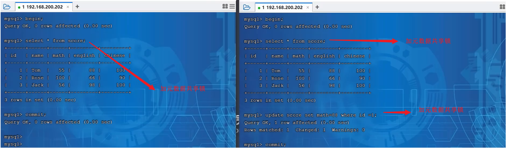

当执行SELECT语句时，添加的是元数据共享锁（SHARED_READ），会阻塞元数据排他锁（EXCLUSIVE），之间是互斥的。

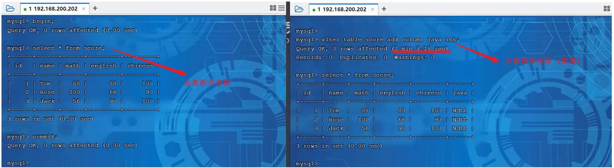

我们可以通过下面的SQL，来查看数据库中的元数据锁的情况：

```sql
select object_type,object_schema,object_name,lock_type,lock_duration from performance_schema.metadata_locks ;
mysql> select object_type,object_schema,object_name,lock_type,lock_duration
    -> from performance_schema.metadata_locks;
+-------------+--------------------+----------------+-------------+---------------+
| object_type | object_schema      | object_name    | lock_type   | lock_duration |
+-------------+--------------------+----------------+-------------+---------------+
| TABLE       | db01               | score          | SHARED_READ | TRANSACTION   |
| TABLE       | performance_schema | metadata_locks | SHARED_READ | TRANSACTION   |
+-------------+--------------------+----------------+-------------+---------------+
```

### 意向锁

为了避免DML在执行时，加的行锁与表锁的冲突，在InnoDB中引入了意向锁，使得表锁不用检查每行数据是否加锁，使用意向锁来减少表锁的检查。

假如没有意向锁，客户端一对表加了行锁后，客户端二如何给表加表锁呢，来通过示意图简单分析一下：

客户端一，在执行DML操作时，会对涉及的行加行锁，同时也会对该表加上意向锁。

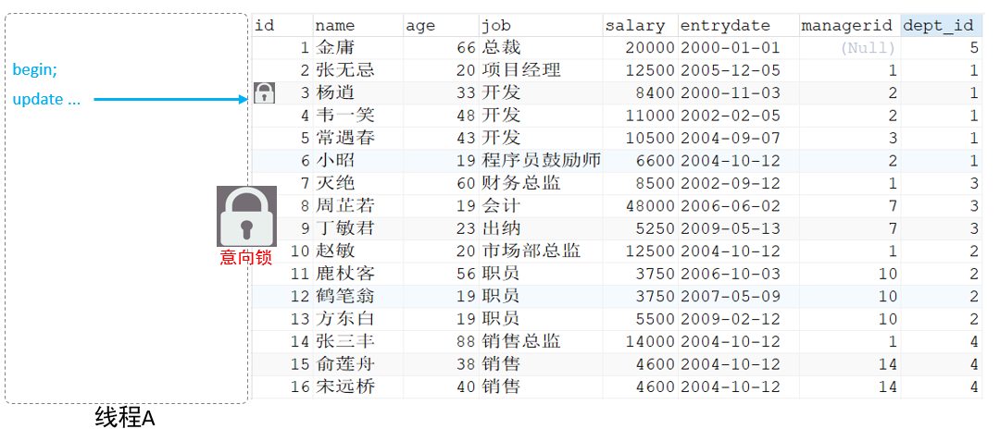

而其他客户端，在对这张表加表锁的时候，会根据该表上所加的意向锁来判定是否可以成功加表锁，而不用逐行判断行锁情况了。

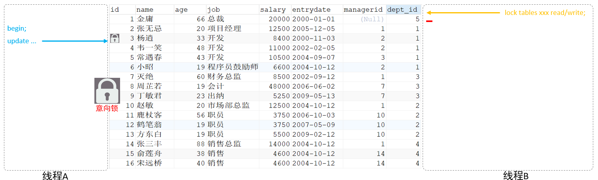

- 意向共享锁(IS): 由语句select ... lock in share mode添加。与表锁共享锁(read)兼容，与表锁排他锁(write)互斥。
- 意向排他锁(IX): 由insert、update、delete、select...for update添加。与表锁共享锁(read)及排他锁(write)都互斥，意向锁之间不会互斥。

> 一旦事务提交了，意向共享锁、意向排他锁，都会自动释放。

可以通过以下SQL，查看意向锁及行锁的加锁情况：

```sql
select object_schema,object_name,index_name,lock_type,lock_mode,lock_data from performance_schema.data_locks;
```

## 行级锁

行级锁，每次操作锁住对应的行数据。锁定粒度最小，发生锁冲突的概率最低，并发度最高。应用在InnoDB存储引擎中。

InnoDB的数据是基于索引组织的，行锁是通过对索引上的索引项加锁来实现的，而不是对记录加的锁。对于行级锁，主要分为以下三类：

- 行锁（Record Lock）：锁定单个行记录的锁，防止其他事务对此行进行update和delete。在RC、RR隔离级别下都支持。

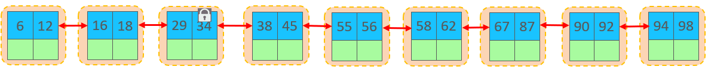

- 间隙锁（Gap Lock）：锁定索引记录间隙（不含该记录），确保索引记录间隙不变，防止其他事务在这个间隙进行insert，产生幻读。在RR隔离级别下都支持。

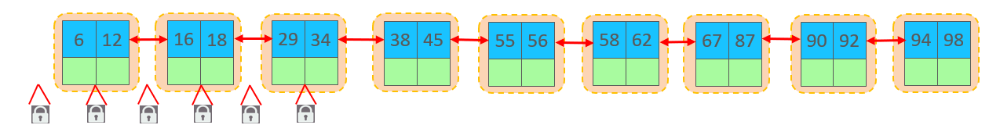

- 临键锁（Next-Key Lock）：**行锁和间隙锁组合**，同时锁住数据，并锁住数据前面的间隙Gap。在RR隔离级别下支持。

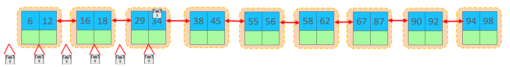

### 行锁

InnoDB实现了以下两种类型的行锁：

- 共享锁（S）：允许一个事务去读一行，阻止其他事务获得相同数据集的排它锁。
- 排他锁（X）：允许获取排他锁的事务更新数据，阻止其他事务获得相同数据集的共享锁和排他锁。


| SQL                           | 行锁类型   | 说明                                     |
| ----------------------------- | ---------- | ---------------------------------------- |
| INSERT ...                    | 排他锁     | 自动加锁                                 |
| UPDATE ...                    | 排他锁     | 自动加锁                                 |
| DELETE ...                    | 排他锁     | 自动加锁                                 |
| SELECT（正常                  | 不加任何锁 |                                          |
| SELECT ... LOCK IN SHARE MODE | 共享锁     | 需要手动在SELECT之后加LOCK IN SHARE MODE |
| SELECT ... FOR UPDATE         | 排他锁     | 需要手动在SELECT之后加FOR UPDATE         |

默认情况下，InnoDB在 REPEATABLE READ事务隔离级别运行，InnoDB使用 next-key 锁进行搜索和索引扫描，以防止幻读。

- 针对唯一索引进行检索时，对已存在的记录进行等值匹配时，将会自动优化为行锁。
- InnoDB的行锁是针对于索引加的锁，如果不通过索引条件检索数据，那么InnoDB将对表中的所有记录加锁，此时 就会升级为表锁。

可以通过以下SQL，查看意向锁及行锁的加锁情况：

```sql
select object_schema,object_name,index_name,lock_type,lock_mode,lock_data from performance_schema.data_locks;
```

示例演示

```sql
CREATE TABLE `stu` (
`id` int NOT NULL PRIMARY KEY AUTO_INCREMENT,
`name` varchar(255) DEFAULT NULL,
`age` int NOT NULL
) ENGINE = InnoDB CHARACTER SET = utf8mb4;
INSERT INTO `stu` VALUES (1, 'tom', 1);
INSERT INTO `stu` VALUES (3, 'cat', 3);
INSERT INTO `stu` VALUES (8, 'rose', 8);
INSERT INTO `stu` VALUES (11, 'jetty', 11);
INSERT INTO `stu` VALUES (19, 'lily', 19);
INSERT INTO `stu` VALUES (25, 'luci', 25);
```

A. 普通的select语句，执行时，不会加锁。

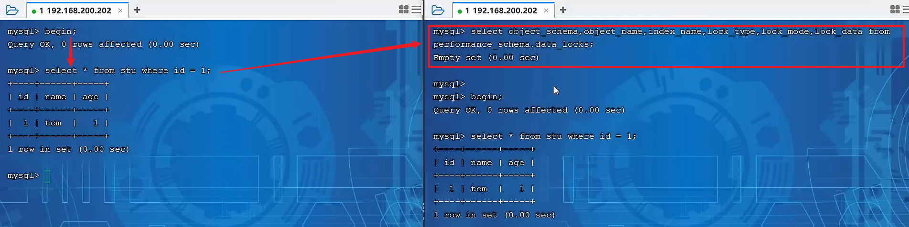

B. select...lock in share mode，加共享锁，共享锁与共享锁之间兼容。

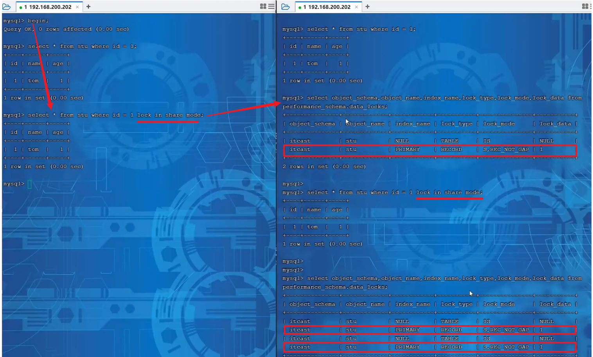

共享锁与排他锁之间互斥。

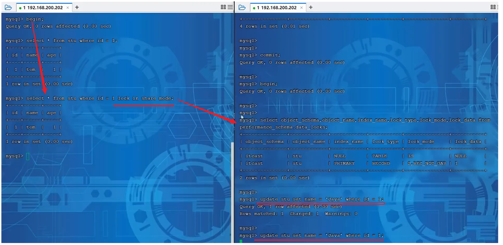

客户端一获取的是id为1这行的共享锁，客户端二是可以获取id为3这行的排它锁的，因为不是同一行数据。 而如果客户端二想获取id为1这行的排他锁，会处于阻塞状态，以为共享锁与排他锁之间互斥。

C. 排它锁与排他锁之间互斥


当客户端一，执行update语句，会为id为1的记录加排他锁； 客户端二，如果也执行update语句更新id为1的数据，也要为id为1的数据加排他锁，但是客户端二会处于阻塞状态，因为排他锁之间是互斥的。 直到客户端一，把事务提交了，才会把这一行的行锁释放，此时客户端二，解除阻塞。

D. 无索引行锁升级为表锁

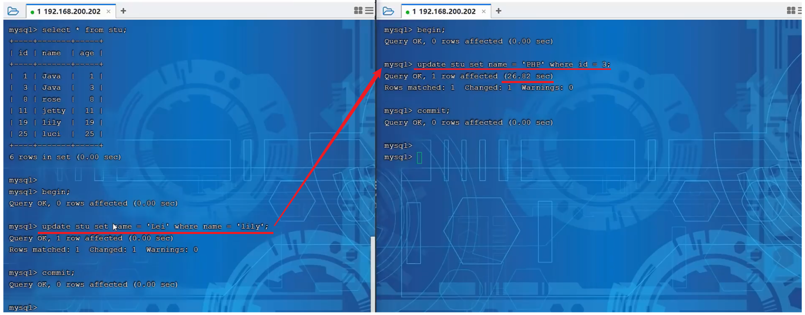

客户端一，根据name字段进行更新时，name字段是没有索引的，如果没有索引，此时行锁会升级为表锁(因为行锁是对索引项加的锁，而name没有索引)。

接下来，我们再针对name字段建立索引，索引建立之后，再次做一个测试：

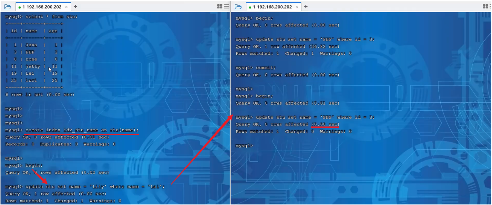

此时我们可以看到，客户端一，开启事务，然后依然是根据name进行更新。而客户端二，在更新id为3的数据时，更新成功，并未进入阻塞状态。这样就说明，我们根据索引字段进行更新操作，就可以避免行锁升级为表锁的情况。

### 间隙锁&临键锁

默认情况下，InnoDB在 REPEATABLE READ事务隔离级别运行，InnoDB使用 next-key 锁进行搜索和索引扫描，以防止幻读。

- 索引上的等值查询(唯一索引)，给不存在的记录加锁时, 优化为间隙锁 。
- 索引上的等值查询(非唯一普通索引)，向右遍历时最后一个值不满足查询需求时，next-keylock 退化为间隙锁。
- 索引上的范围查询(唯一索引) -- 会访问到不满足条件的第一个值为止。

> 注意：间隙锁唯一目的是防止其他事务插入间隙。间隙锁可以共存，一个事务采用的间隙锁不会阻止另一个事务在同一间隙上采用间隙锁。

A. 索引上的等值查询(唯一索引)，给不存在的记录加锁时, 优化为间隙锁 。

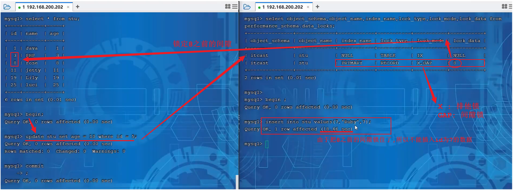

B. 索引上的等值查询(非唯一普通索引)，向右遍历时最后一个值不满足查询需求时，next-key lock 退化为间隙锁。

我们知道InnoDB的B+树索引，叶子节点是有序的双向链表。假如，我们要根据这个二级索引查询值为18的数据，并加上共享锁，我们是只锁定18这一行就可以了吗？并不是，因为是非唯一索引，这个结构中可能有多个18的存在，所以，在加锁时会继续往后找，找到一个不满足条件的值（当前案例中也就是29）。此时会对18加临键锁，并对29之前的间隙加锁。

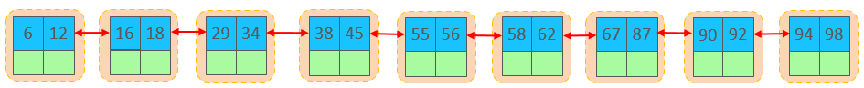

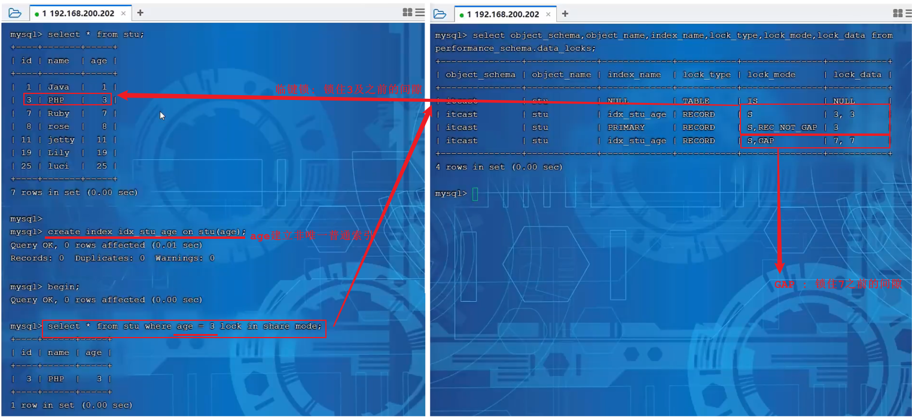

C. 索引上的范围查询(唯一索引) -- 会访问到不满足条件的第一个值为止。

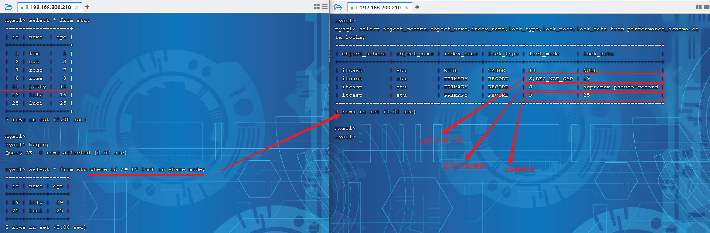

查询的条件为id\>=19，并添加共享锁。 此时我们可以根据数据库表中现有的数据，将数据分为三个部分：

\[19\]

(19,25\]

(25,+∞\]

所以数据库数据在加锁是，就是将19加了行锁，25的临键锁（包含25及25之前的间隙），正无穷的临键锁(正无穷及之前的间隙)。

# InnoDB引擎

## 逻辑存储结构

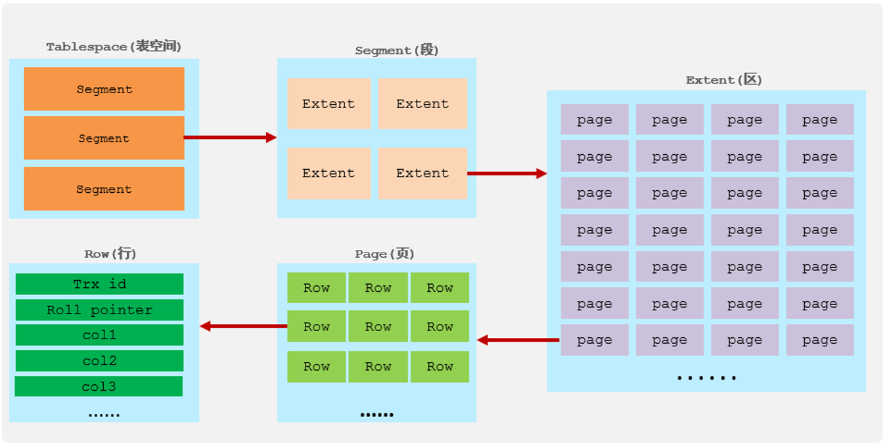

1). 表空间

表空间是InnoDB存储引擎逻辑结构的最高层， 如果用户启用了参数 innodb_file_per_table(在8.0版本中默认开启) ，则每张表都会有一个表空间（xxx.ibd），一个mysql实例可以对应多个表空间，用于存储记录、索引等数据。

2). 段

段，分为数据段（Leaf node segment）、索引段（Non-leaf node segment）、回滚段（Rollback segment），InnoDB是索引组织表，数据段就是B+树的叶子节点， 索引段即为B+树的非叶子节点。段用来管理多个Extent（区）。

3). 区

区，表空间的单元结构，每个区的大小为1M。 默认情况下， InnoDB存储引擎页大小为16K， 即一个区中一共有64个连续的页。

4). 页

页，是InnoDB 存储引擎磁盘管理的最小单元，每个页的大小默认为 16KB。为了保证页的连续性，

InnoDB 存储引擎每次从磁盘申请 4-5 个区。

5). 行

行，InnoDB 存储引擎数据是按行进行存放的。在行中，默认有两个隐藏字段：

- `trx_id`：每次对某条记录进行改动时，都会把对应的事务id赋值给trx_id隐藏列。
- `roll_pointer`：每次对某条引记录进行改动时，都会把旧的版本写入到undo日志中，然后这个隐藏列就相当于一个指针，可以通过它来找到该记录修改前的信息。

## MVCC(Multi-Version Concurrency Control)

1). 当前读

读取的是记录的最新版本，读取时还要保证其他并发事务不能修改当前记录，会对读取的记录进行加锁。对于我们日常的操作，如：select ... lock in share mode(共享锁)，select ... for update、update、insert、delete(排他锁)都是一种当前读。

测试：

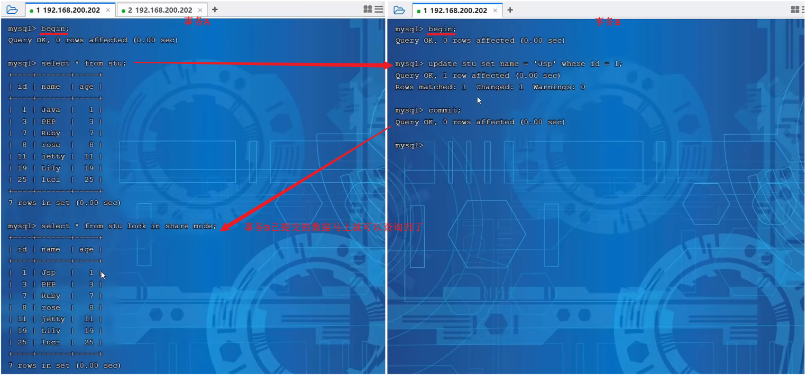

在测试中我们可以看到，即使是在默认的RR隔离级别下，事务A中依然可以读取到事务B最新提交的内容，因为在查询语句后面加上了 lock in share mode 共享锁，此时是当前读操作。当然，当我们加排他锁的时候，也是当前读操作。

2). 快照读

简单的select（不加锁）就是快照读，快照读，读取的是记录数据的可见版本，有可能是历史数据，不加锁，是非阻塞读。

- Read Committed：每次select，都生成一个快照读。
- Repeatable Read：开启事务后第一个select语句才是快照读的地方。
- Serializable：快照读会退化为当前读。

测试:

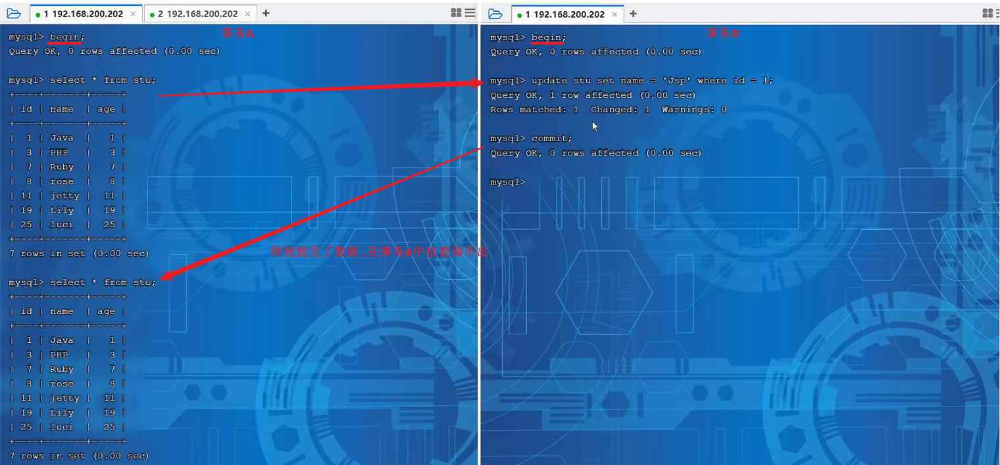

在测试中,我们看到即使事务B提交了数据,事务A中也查询不到。 原因就是因为普通的select是快照读，而在当前默认的RR隔离级别下，开启事务后第一个select语句才是快照读的地方，后面执行相同的select语句都是从快照中获取数据，可能不是当前的最新数据，这样也就保证了可重复读。

3). MVCC

全称 Multi-Version Concurrency Control，多版本并发控制。指维护一个数据的多个版本，使得读写操作没有冲突，快照读为MySQL实现MVCC提供了一个非阻塞读功能。MVCC的具体实现，还需要依赖于数据库记录中的三个隐式字段、undo log日志、readView。

### 隐藏字段


| id | age | name |
| -: | --: | ---- |
|  1 |   1 | tom  |
|  3 |   3 | cat  |

当我们创建了上面的这张表，我们在查看表结构的时候，就可以显式的看到这三个字段。 实际上除了这三个字段以外，InnoDB还会自动的给我们添加三个隐藏字段及其含义分别是：


| **隐藏字段** | **含义**                                                               |
| ------------ | ---------------------------------------------------------------------- |
| DB_TRX_ID    | 最近修改事务ID，记录插入这条记录或最后一次修改该记录的事务ID。         |
| DB_ROLL_PTR  | 回滚指针，指向这条记录的上一个版本，用于配合undo log，指向上一个版本。 |
| DB_ROW_ID    | 隐藏主键，如果表结构没有指定主键，将会生成该隐藏字段。                 |

而上述的前两个字段是肯定会添加的， 是否添加最后一个字段DB_ROW_ID，得看当前表有没有主键，如果有主键，则不会添加该隐藏字段。

1). 查看有主键的表 stu

进入服务器中的 /var/lib/mysql/itcast/ , 查看stu的表结构信息, 通过如下指令:

```bash
ibd2sdi stu.ibd
```

查看到的表结构信息中，有一栏 columns，在其中我们会看到处理我们建表时指定的字段以外，还有额外的两个字段 分别是：DB_TRX_ID 、 DB_ROLL_PTR ，因为该表有主键，所以没有DB_ROW_ID隐藏字段。

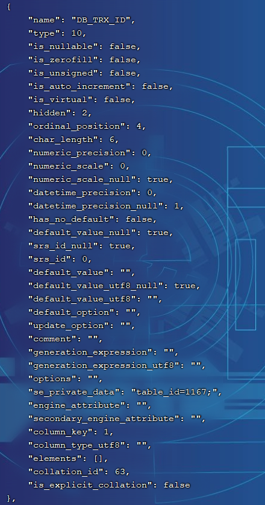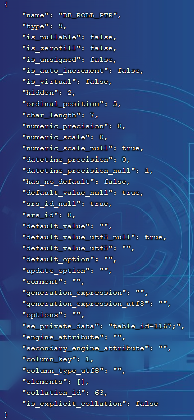

2). 查看没有主键的表 employee

建表语句：

```sql
create table employee (id int , name varchar(10));
```

此时，我们再通过以下指令来查看表结构及其其中的字段信息：

ibd2sdi employee.ibd

查看到的表结构信息中，有一栏 columns，在其中我们会看到处理我们建表时指定的字段以外，还有额外的三个字段 分别是：DB_TRX_ID 、 DB_ROLL_PTR 、DB_ROW_ID，因为employee表是没有指定主键的。

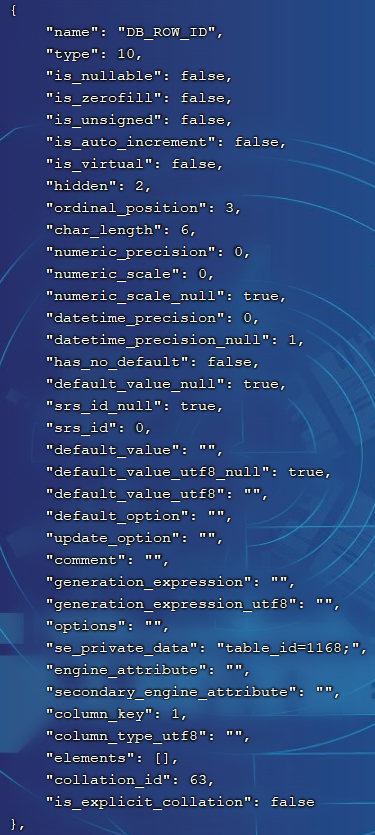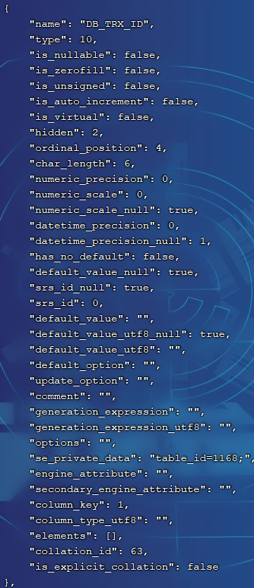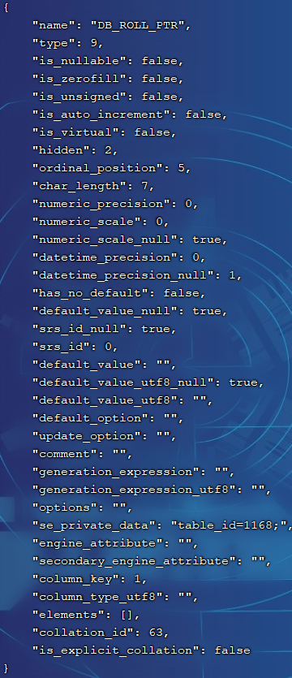

### undolog

回滚日志，在insert、update、delete的时候产生的便于数据回滚的日志。

当insert的时候，产生的undo log日志只在回滚时需要，在事务提交后，可被立即删除。

而update、delete的时候，产生的undo log日志不仅在回滚时需要，在快照读时也需要，不会立即被删除。

- 版本链

有一张表原始数据为：


| id | age | name | DB_TRX_ID | DB_ROLL_PTR |
| -: | --: | ---- | --------: | ----------- |
| 30 |  30 | A30  |         1 | null        |

DB_TRX_ID: 代表最近修改事务ID，记录插入这条记录或最后一次修改该记录的事务ID，是自增的。

DB_ROLL_PTR：由于这条数据是才插入的，没有被更新过，所以该字段值为null。

A. 第一步


| 事务2                          | 事务3                      | 事务4                     | 事务5            |
| ------------------------------ | -------------------------- | ------------------------- | ---------------- |
| 开始事务                       | 开始事务                   | 开始事务                  | 开始事务         |
| ***修改id为30记录，age改为3*** |                            | 查询id为30的记录          |                  |
|                                |                            |                           |                  |
| 提交事务                       |                            |                           |                  |
|                                | 修改id为30记录，name改为A3 |                           |                  |
|                                |                            |                           | 查询id为30的记录 |
|                                | 提交事务                   |                           |                  |
|                                |                            | 修改id为30记录，age改为10 |                  |
|                                |                            | 查询id为30的记录          |                  |
|                                |                            |                           | 查询id为30的记录 |
|                                |                            | 提交事务                  |                  |

当事务2执行第一条修改语句时，会记录undo log日志，记录数据变更之前的样子; 然后更新记录，并且记录本次操作的事务ID，回滚指针，回滚指针用来指定如果发生回滚，回滚到哪一个版本。

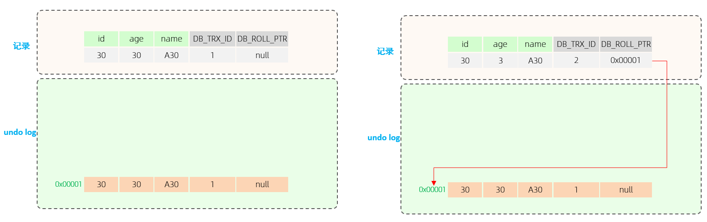

B.第二步


| 事务2                          | 事务3                            | 事务4                     | 事务5            |
| ------------------------------ | -------------------------------- | ------------------------- | ---------------- |
| 开始事务                       | 开始事务                         | 开始事务                  | 开始事务         |
| ***修改id为30记录，age改为3*** |                                  | 查询id为30的记录          |                  |
|                                |                                  |                           |                  |
| 提交事务                       |                                  |                           |                  |
|                                | ***修改id为30记录，name改为A3*** |                           |                  |
|                                |                                  |                           | 查询id为30的记录 |
|                                | 提交事务                         |                           |                  |
|                                |                                  | 修改id为30记录，age改为10 |                  |
|                                |                                  | 查询id为30的记录          |                  |
|                                |                                  |                           | 查询id为30的记录 |
|                                |                                  | 提交事务                  |                  |

当事务3执行第一条修改语句时，也会记录undo log日志，记录数据变更之前的样子; 然后更新记录，并且记录本次操作的事务ID，回滚指针，回滚指针用来指定如果发生回滚，回滚到哪一个版本。

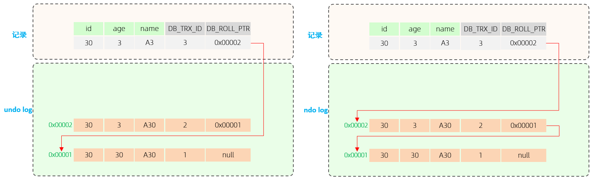

C. 第三步


| 事务2                          | 事务3                            | 事务4                           | 事务5            |
| ------------------------------ | -------------------------------- | ------------------------------- | ---------------- |
| 开始事务                       | 开始事务                         | 开始事务                        | 开始事务         |
| ***修改id为30记录，age改为3*** |                                  | 查询id为30的记录                |                  |
|                                |                                  |                                 |                  |
| 提交事务                       |                                  |                                 |                  |
|                                | ***修改id为30记录，name改为A3*** |                                 |                  |
|                                |                                  |                                 | 查询id为30的记录 |
|                                | 提交事务                         |                                 |                  |
|                                |                                  | ***修改id为30记录，age改为10*** |                  |
|                                |                                  | 查询id为30的记录                |                  |
|                                |                                  |                                 | 查询id为30的记录 |
|                                |                                  | 提交事务                        |                  |

当事务4执行第一条修改语句时，也会记录undo log日志，记录数据变更之前的样子; 然后更新记录，并且记录本次操作的事务ID，回滚指针，回滚指针用来指定如果发生回滚，回滚到哪一个版本。

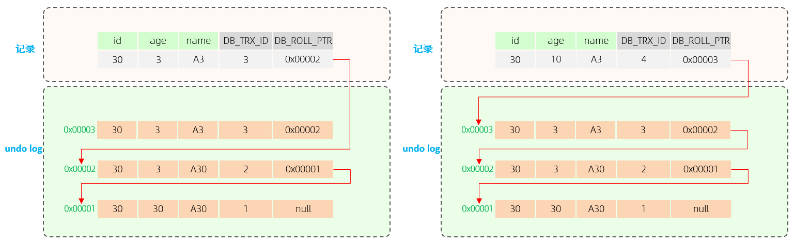

最终我们发现，不同事务或相同事务对同一条记录进行修改，会导致该记录的undolog生成一条记录版本链表，链表的头部是最新的旧记录，链表尾部是最早的旧记录。

### readview

ReadView（读视图）是快照读SQL执行时MVCC提取数据的依据，记录并维护系统当前活跃的事务（未提交的）id。

ReadView中包含了四个核心字段：


| 字段           | 含义                                                   |
| -------------- | ------------------------------------------------------ |
| m_ids          | 当前活跃的事务ID集合                                   |
| min_trx_id     | 最小活跃事务ID                                         |
| max_trx_id     | 预分配事务ID，当前最大事务ID + 1（因为事务ID是自增的） |
| creator_trx_id | ReadView创建者的事务ID                                 |

而在readview中就规定了版本链数据的访问规则：

trx_id 代表当前undolog版本链对应事务ID。


| 条件                                 | 是否可以访问                     | 说明                                         |
| ------------------------------------ | -------------------------------- | -------------------------------------------- |
| `trx_id == creator_trx_id`           | 可以访问该版本✅                 | 成立，说明数据是当前这个事务更改的。         |
| `trx_id < min_trx_id`                | 可以访问该版本✅                 | 成立，说明数据已经提交了。                   |
| `trx_id > max_trx_id`                | 不可以访问该版本❌               | 成立，说明该事务是在 ReadView 生成后才开启。 |
| `min_trx_id <= trx_id <= max_trx_id` | 如果`trx_id` 不在 `m_ids` 中，✅ | 成立，说明数据已经提交。                     |

不同的隔离级别，生成ReadView的时机不同：

- READ COMMITTED ：在事务中每一次执行快照读时生成ReadView。

- REPEATABLE READ：仅在事务中第一次执行快照读时生成ReadView，后续复用该ReadView。

### 6.4.5 原理分析

#### 6.4.5.1 RC隔离级别

RC隔离级别下，在事务中每一次执行快照读时生成ReadView。

我们就来分析事务5中，两次快照读读取数据，是如何获取数据的?

在事务5中，查询了两次id为30的记录，由于隔离级别为Read Committed，所以每一次进行快照读 都会生成一个ReadView，那么两次生成的ReadView如下。

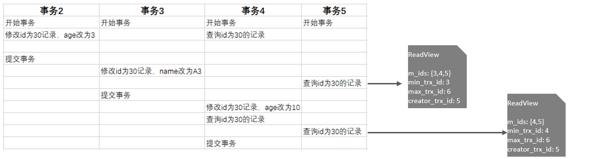

那么这两次快照读在获取数据时，就需要根据所生成的ReadView以及ReadView的版本链访问规则， 到undolog版本链中匹配数据，最终决定此次快照读返回的数据。

**A. 先来看第一次快照读具体的读取过程：**

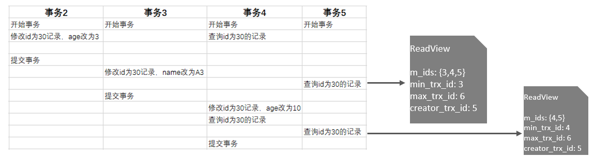

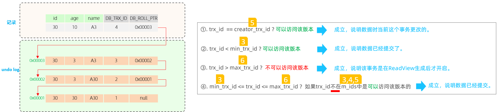

在进行匹配时，会从undo log的版本链，从上到下进行挨个匹配：


先匹配 这条记录，这条记录对应的

trx_id为4，也就是将4带入右侧的匹配规则中。 ①不满足 ②不满足 ③不满足 ④也不满足 ， 都不满足，则继续匹配undo log版本链的下一条。


再匹配第二条 ，这条

记录对应的trx_id为3，也就是将3带入右侧的匹配规则中。①不满足 ②不满足 ③不满足 ④也 不满足 ，都不满足，则继续匹配undo log版本链的下一条。


再匹配第三条 ，这条记 录对应的trx_id为2，也就是将2带入右侧的匹配规则中。①不满足 ②满足 终止匹配，此次快照 读，返回的数据就是版本链中记录的这条数据。

**B. 再来看第二次快照读具体的读取过程:**

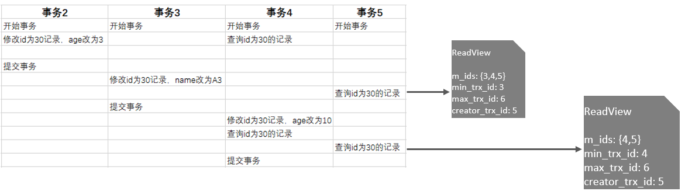

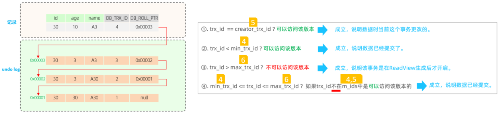

在进行匹配时，会从undo log的版本链，从上到下进行挨个匹配：

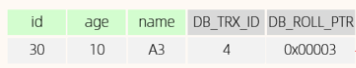

先匹配 这条记录，这条记录对应的

trx_id为4，也就是将4带入右侧的匹配规则中。 ①不满足 ②不满足 ③不满足 ④也不满足 ， 都不满足，则继续匹配undo log版本链的下一条。


再匹配第二条 ，这条 记录对应的trx_id为3，也就是将3带入右侧的匹配规则中。①不满足 ②满足 。终止匹配，此次 快照读，返回的数据就是版本链中记录的这条数据。

#### 6.4.5.3 RR隔离级别

RR隔离级别下，仅在事务中第一次执行快照读时生成ReadView，后续复用该ReadView。 而RR 是可 重复读，在一个事务中，执行两次相同的select语句，查询到的结果是一样的。

那MySQL是如何做到可重复读的呢? 我们简单分析一下就知道了

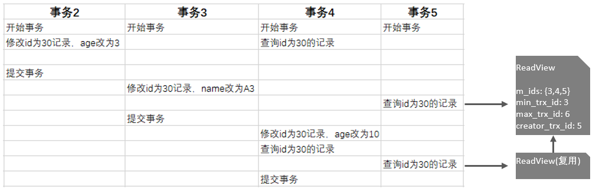

我们看到，在RR隔离级别下，只是在事务中第一次快照读时生成ReadView，后续都是复用该 ReadView，那么既然ReadView都一样， ReadView的版本链匹配规则也一样， 那么最终快照读返 回的结果也是一样的。

所以呢，MVCC的实现原理就是通过 InnoDB表的隐藏字段、UndoLog 版本链、ReadView来实现的。 而MVCC + 锁，则实现了事务的隔离性。 而一致性则是由redolog 与 undolog保证。


## 6.2 架构

### 6.2.1 概述

MySQL5.5 版本开始，默认使用InnoDB存储引擎，它擅长事务处理，具有崩溃恢复特性，在日常开发 中使用非常广泛。下面是InnoDB架构图，左侧为内存结构，右侧为磁盘结构。

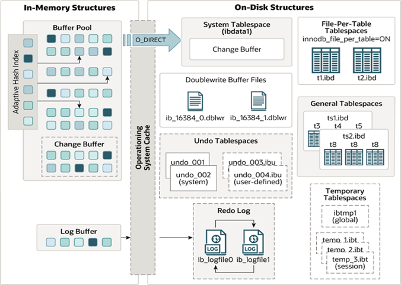

### 6.2.2 内存结构

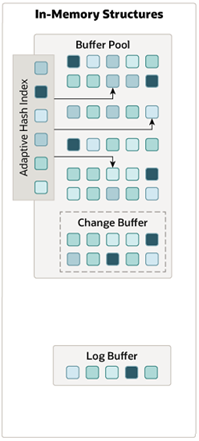

在左侧的内存结构中，主要分为这么四大块儿： Buffer Pool、Change Buffer、Adaptive Hash Index、Log Buffer。 接下来介绍一下这四个部分。

**1). Buffer Pool**

InnoDB存储引擎基于磁盘文件存储，访问物理硬盘和在内存中进行访问，速度相差很大，为了尽可能 弥补这两者之间的I/O效率的差值，就需要把经常使用的数据加载到缓冲池中，避免每次访问都进行磁 盘I/O。

在InnoDB的缓冲池中不仅缓存了索引页和数据页，还包含了undo页、插入缓存、自适应哈希索引以及 InnoDB的锁信息等等。

缓冲池 Buffer Pool，是主内存中的一个区域，里面可以缓存磁盘上经常操作的真实数据，在执行增 删改查操作时，先操作缓冲池中的数据（若缓冲池没有数据，则从磁盘加载并缓存），然后再以一定频 率刷新到磁盘，从而减少磁盘IO，加快处理速度。

缓冲池以Page页为单位，底层采用链表数据结构管理Page。根据状态，将Page分为三种类型：

• free page：空闲page，未被使用。

• clean page：被使用page，数据没有被修改过。

• dirty page：脏页，被使用page，数据被修改过，也中数据与磁盘的数据产生了不一致。

在专用服务器上，通常将多达80％的物理内存分配给缓冲池 。参数设置： show variables like 'innodb_buffer_pool_size';


**2). Change Buffer**

Change Buffer，更改缓冲区（针对于非唯一二级索引页），在执行DML语句时，如果这些数据Page 没有在Buffer Pool中，不会直接操作磁盘，而会将数据变更存在更改缓冲区 Change Buffer 中，在未来数据被读取时，再将数据合并恢复到Buffer Pool中，再将合并后的数据刷新到磁盘中。

Change Buffer的意义是什么呢?

先来看一幅图，这个是二级索引的结构图：

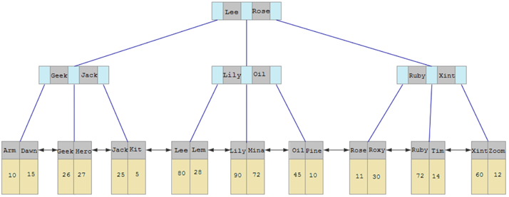

与聚集索引不同，二级索引通常是非唯一的，并且以相对随机的顺序插入二级索引。同样，删除和更新 可能会影响索引树中不相邻的二级索引页，如果每一次都操作磁盘，会造成大量的磁盘IO。有了 ChangeBuffer之后，我们可以在缓冲池中进行合并处理，减少磁盘IO。

**3). Adaptive Hash Index**

自适应hash索引，用于优化对Buffer Pool数据的查询。MySQL的innoDB引擎中虽然没有直接支持 hash索引，但是给我们提供了一个功能就是这个自适应hash索引。因为前面我们讲到过，hash索引在 进行等值匹配时，一般性能是要高于B+树的，因为hash索引一般只需要一次IO即可，而B+树，可能需 要几次匹配，所以hash索引的效率要高，但是hash索引又不适合做范围查询、模糊匹配等。

InnoDB存储引擎会监控对表上各索引页的查询，如果观察到在特定的条件下hash索引可以提升速度， 则建立hash索引，称之为自适应hash索引。

自适应哈希索引，无需人工干预，是系统根据情况自动完成。

参数： adaptive_hash_index

**4). Log Buffer**

Log Buffer：日志缓冲区，用来保存要写入到磁盘中的log日志数据（redo log 、undo log）， 默认大小为 16MB，日志缓冲区的日志会定期刷新到磁盘中。如果需要更新、插入或删除许多行的事 务，增加日志缓冲区的大小可以节省磁盘 I/O。

参数:

innodb_log_buffer_size：缓冲区大小

innodb_flush_log_at_trx_commit：日志刷新到磁盘时机，取值主要包含以下三个：

1: 日志在每次事务提交时写入并刷新到磁盘，默认值。

0: 每秒将日志写入并刷新到磁盘一次。

2: 日志在每次事务提交后写入，并每秒刷新到磁盘一次。


### 6.2.3 磁盘结构

接下来，再来看看InnoDB体系结构的右边部分，也就是磁盘结构：

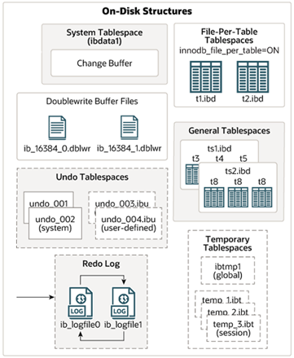

**1). System Tablespace**

系统表空间是更改缓冲区的存储区域。如果表是在系统表空间而不是每个表文件或通用表空间中创建 的，它也可能包含表和索引数据。(在MySQL5.x版本中还包含InnoDB数据字典、undolog等)

参数：innodb_data_file_path


系统表空间，默认的文件名叫 ibdata1。

**2). File-Per-Table Tablespaces**

如果开启了innodb_file_per_table开关 ，则每个表的文件表空间包含单个InnoDB表的数据和索 引 ，并存储在文件系统上的单个数据文件中。

开关参数：innodb_file_per_table ，该参数默认开启。


那也就是说，我们没创建一个表，都会产生一个表空间文件，如图：


**3). General Tablespaces**

通用表空间，需要通过 CREATE TABLESPACE 语法创建通用表空间，在创建表时，可以指定该表空 间。

**A. 创建表空间**

```sql
CREATE TABLESPACE ts_name ADD DATAFILE 'file_name' ENGINE = engine_name;
```


**B. 创建表时指定表空间**

```sql
CREATE TABLE xxx ... TABLESPACE ts_name;
```


**4). Undo Tablespaces**

撤销表空间，MySQL实例在初始化时会自动创建两个默认的undo表空间（初始大小16M），用于存储 undo log日志。

**5). Temporary Tablespaces**

InnoDB 使用会话临时表空间和全局临时表空间。存储用户创建的临时表等数据。

**6). Doublewrite Buffer Files**

双写缓冲区，innoDB引擎将数据页从Buffer Pool刷新到磁盘前，先将数据页写入双写缓冲区文件 中，便于系统异常时恢复数据。

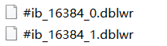

**7). Redo Log**

重做日志，是用来实现事务的持久性。该日志文件由两部分组成：重做日志缓冲（redo log buffer）以及重做日志文件（redo log）,前者是在内存中，后者在磁盘中。当事务提交之后会把所 有修改信息都会存到该日志中, 用于在刷新脏页到磁盘时,发生错误时, 进行数据恢复使用。

以循环方式写入重做日志文件，涉及两个文件：


前面我们介绍了InnoDB的内存结构，以及磁盘结构，那么内存中我们所更新的数据，又是如何到磁盘 中的呢？ 此时，就涉及到一组后台线程，接下来，就来介绍一些InnoDB中涉及到的后台线程。

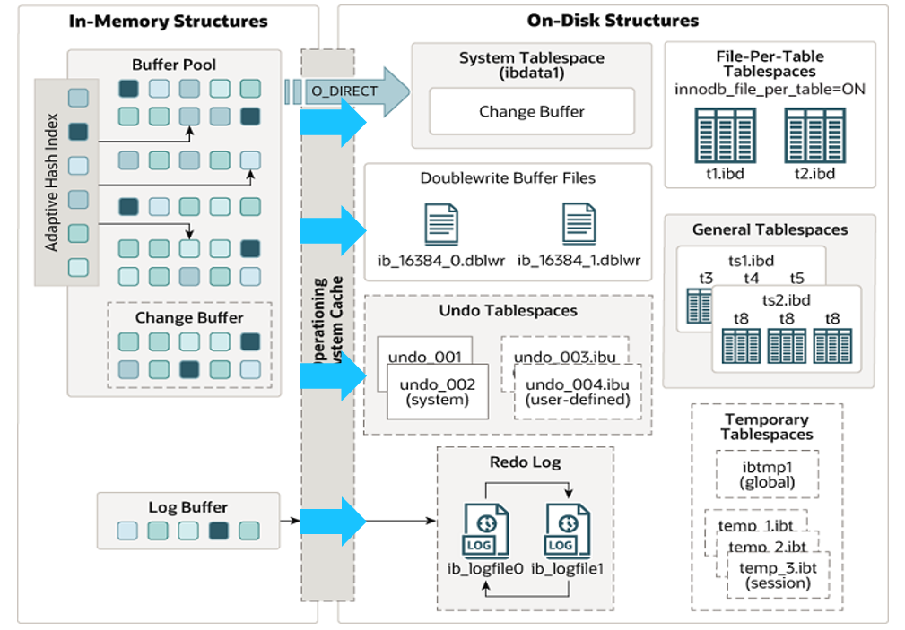

### 6.2.4 后台线程

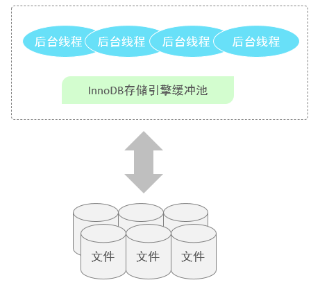

在InnoDB的后台线程中，分为4类，分别是：Master Thread 、IO Thread、Purge Thread、 Page Cleaner Thread。

**1). Master Thread**

核心后台线程，负责调度其他线程，还负责将缓冲池中的数据异步刷新到磁盘中, 保持数据的一致性， 还包括脏页的刷新、合并插入缓存、undo页的回收 。

**2). IO Thread**

在InnoDB存储引擎中大量使用了AIO来处理IO请求, 这样可以极大地提高数据库的性能，而IO Thread主要负责这些IO请求的回调。

线程类型 默认个数 职责

Read thread 4 负责读操作

Write thread 4 负责写操作

Log thread 1 负责将日志缓冲区刷新到磁盘

Insert buffer thread 1 负责将写缓冲区内容刷新到磁盘

我们可以通过以下的这条指令，查看到InnoDB的状态信息，其中就包含IO Thread信息。

```sql
show engine innodb status \G;
```


**3). Purge Thread**

主要用于回收事务已经提交了的undo log，在事务提交之后，undo log可能不用了，就用它来回 收。

**4). Page Cleaner Thread**

协助 Master Thread 刷新脏页到磁盘的线程，它可以减轻 Master Thread 的工作压力，减少阻 塞。

## 6.3 事务原理

### 6.3.1 事务基础

**1). 事务**

事务 是一组操作的集合，它是一个不可分割的工作单位，事务会把所有的操作作为一个整体一起向系 统提交或撤销操作请求，即这些操作要么同时成功，要么同时失败。

**2). 特性**

• 原子性（Atomicity）：事务是不可分割的最小操作单元，要么全部成功，要么全部失败。

• 一致性（Consistency）：事务完成时，必须使所有的数据都保持一致状态。

• 隔离性（Isolation）：数据库系统提供的隔离机制，保证事务在不受外部并发操作影响的独立环 境下运行。

• 持久性（Durability）：事务一旦提交或回滚，它对数据库中的数据的改变就是永久的。

那实际上，我们研究事务的原理，就是研究MySQL的InnoDB引擎是如何保证事务的这四大特性的。


而对于这四大特性，实际上分为两个部分。 其中的原子性、一致性、持久化，实际上是由InnoDB中的 两份日志来保证的，一份是redo log日志，一份是undo log日志。 而持久性是通过数据库的锁， 加上MVCC来保证的。


我们在讲解事务原理的时候，主要就是来研究一下redolog，undolog以及MVCC。

### 6.3.2 redo log

重做日志，记录的是事务提交时数据页的物理修改，是用来实现事务的持久性。

该日志文件由两部分组成：重做日志缓冲（redo log buffer）以及重做日志文件（redo log file）,前者是在内存中，后者在磁盘中。当事务提交之后会把所有修改信息都存到该日志文件中, 用 于在刷新脏页到磁盘,发生错误时, 进行数据恢复使用。

如果没有redolog，可能会存在什么问题的？ 我们一起来分析一下。

我们知道，在InnoDB引擎中的内存结构中，主要的内存区域就是缓冲池，在缓冲池中缓存了很多的数 据页。 当我们在一个事务中，执行多个增删改的操作时，InnoDB引擎会先操作缓冲池中的数据，如果 缓冲区没有对应的数据，会通过后台线程将磁盘中的数据加载出来，存放在缓冲区中，然后将缓冲池中 的数据修改，修改后的数据页我们称为脏页。 而脏页则会在一定的时机，通过后台线程刷新到磁盘 中，从而保证缓冲区与磁盘的数据一致。 而缓冲区的脏页数据并不是实时刷新的，而是一段时间之后 将缓冲区的数据刷新到磁盘中，假如刷新到磁盘的过程出错了，而提示给用户事务提交成功，而数据却 没有持久化下来，这就出现问题了，没有保证事务的持久性。

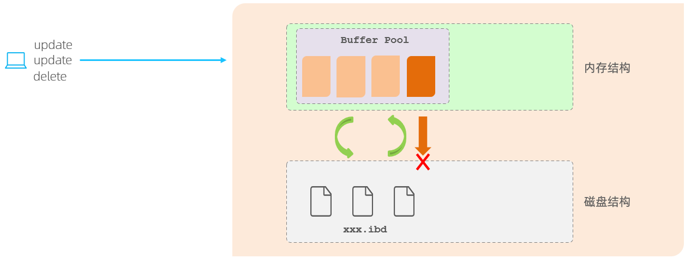

那么，如何解决上述的问题呢？ 在InnoDB中提供了一份日志 redo log，接下来我们再来分析一 下，通过redolog如何解决这个问题。

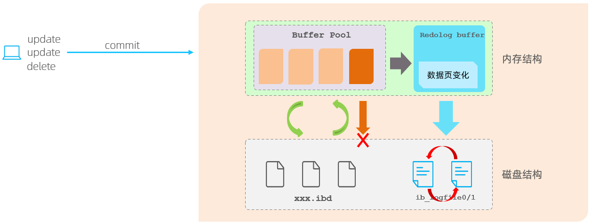

有了redolog之后，当对缓冲区的数据进行增删改之后，会首先将操作的数据页的变化，记录在redo log buffer中。在事务提交时，会将redo log buffer中的数据刷新到redo log磁盘文件中。 过一段时间之后，如果刷新缓冲区的脏页到磁盘时，发生错误，此时就可以借助于redo log进行数据 恢复，这样就保证了事务的持久性。 而如果脏页成功刷新到磁盘 或 或者涉及到的数据已经落盘，此 时redolog就没有作用了，就可以删除了，所以存在的两个redolog文件是循环写的。

那为什么每一次提交事务，要刷新redo log 到磁盘中呢，而不是直接将buffer pool中的脏页刷新 到磁盘呢 ?

因为在业务操作中，我们操作数据一般都是随机读写磁盘的，而不是顺序读写磁盘。 而redo log在 往磁盘文件中写入数据，由于是日志文件，所以都是顺序写的。顺序写的效率，要远大于随机写。 这 种先写日志的方式，称之为 WAL（Write-Ahead Logging）。
