### **Redis 基础：为什么要用分布式缓存？**

> 相关面试题 ：
>
> - 为什么要用缓存？
> - 本地缓存应该怎么做？
> - 为什么要有分布式缓存?/为什么不直接用本地缓存?
> - 多级缓存了解么？

#### 缓存的基本思想

很多同学只知道缓存可以提高系统性能以及减少请求相应时间，但是，不太清楚缓存的本质思想是什么。

缓存的基本思想其实很简单，就是我们非常熟悉的空间换时间。不要把缓存想的太高大上，虽然，它的确对系统的性能提升的性价比非常高。

其实，我们在学习使用缓存的时候，你会发现缓存的思想实际在操作系统或者其他地方都被大量用到。 比如 CPU Cache 缓存的是内存数据用于解决 CPU 处理速度和内存不匹配的问题，内存缓存的是硬盘数据用于解决硬盘访问速度过慢的问题。 再比如操作系统在 页表方案 基础之上引入了 快表 来加速虚拟地址到物理地址的转换。我们可以把快表理解为一种特殊的高速缓冲存储器（Cache）。

我们知道，缓存中的数据通常存储于内存中，因此访问速度非常快。为了避免内存中的数据在重启或者宕机之后丢失，很多缓存中间件会利用磁盘做持久化。

也就是说，缓存相比较于我们常用的关系型数据库（比如 MySQL）来说访问速度要快非常多。为了避免用户请求数据库中的数据速度过于缓慢，我们可以在数据库之上增加一层缓存。

除了能够提高访问速度之外，缓存支持的并发量也要更大，有了缓存之后，数据库的压力也会随之变小。

#### 缓存的分类

##### 本地缓存 

###### 什么是本地缓存? 

这个实际在很多项目中用的蛮多，特别是单体架构的时候。数据量不大，并且没有分布式要求的话，使用本地缓存还是可以的。

本地缓存位于应用内部，其最大的优点是应用存在于同一个进程内部，请求本地缓存的速度非常快，不存在额外的网络开销。

常见的单体架构图如下，我们使用 **Nginx** 来做**负载均衡**，部署两个相同的应用到服务器，两个服务使用同一个数据库，并且使用的是本地缓存。

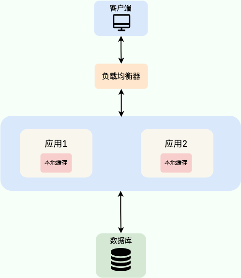

###### 本地缓存的方案有哪些？

**1、JDK 自带的 HashMap 和 ConcurrentHashMap 了。**

ConcurrentHashMap 可以看作是线程安全版本的 HashMap ，两者都是存放 key/value 形式的键值对。但是，大部分场景来说不会使用这两者当做缓存，因为只提供了缓存的功能，并没有提供其他诸如过期时间之类的功能。一个稍微完善一点的缓存框架至少要提供：过期时间、淘汰机制、命中率统计这三点。

**2、 Ehcache 、 Guava Cache 、 Spring Cache 这三者是使用的比较多的本地缓存框架。**

- `Ehcache` 的话相比于其他两者更加重量。不过，相比于 `Guava Cache `、 `Spring Cache` 来说，` Ehcache `支持可以嵌入到 hibernate 和 mybatis 作为多级缓存，并且可以将缓存的数据持久化到本地磁盘中、同时也提供了集群方案（比较鸡肋，可忽略）。
- `Guava Cache `和 `Spring Cache `两者的话比较像。`Guava `相比于`Spring Cache `的话使用的更多一点，它提供了 API 非常方便我们使用，同时也提供了设置缓存有效时间等功能。它的内部实现也比较干净，很多地方都和 `ConcurrentHashMap` 的思想有异曲同工之妙。
- 使用 `Spring Cache `的注解实现缓存的话，代码会看着很干净和优雅，但是很容易出现问题比如缓存穿透、内存溢出。

**3、后起之秀 Caffeine。**

相比于` Guava` 来说` Caffeine` 在各个方面比如性能要更加优秀，一般建议使用其来替代` Guava `。并且， `Guava` 和 `Caffeine` 的使用方式很像！

###### 本地缓存有什么痛点？

本地的缓存的优势非常明显：低依赖、轻量、简单、成本低。

但是，本地缓存存在下面这些缺陷：

- **本地缓存应用耦合，对分布式架构支持不友好**，比如同一个相同的服务部署在多台机器上的时候，各个服务之间的缓存是无法共享的，因为本地缓存只在当前机器上有。
- **本地缓存容量受服务部署所在的机器限制明显**。 如果当前系统服务所耗费的内存多，那么本地缓存可用的容量就很少。

##### 分布式缓存 

###### 什么是分布式缓存？ 

我们可以把分布式缓存（Distributed Cache） 看作是一种内存数据库的服务，它的最终作用就是提供缓存数据的服务。

分布式缓存脱离于应用独立存在，多个应用可直接的共同使用同一个分布式缓存服务。

如下图所示，就是一个简单的使用分布式缓存的架构图。我们使用 Nginx 来做负载均衡，部署两个相同的应用到服务器，两个服务使用同一个数据库和缓存。

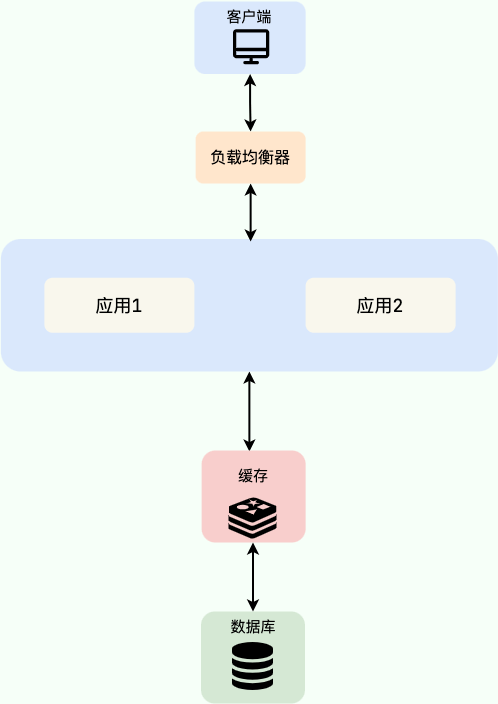

使用分布式缓存之后，缓存服务可以部署在一台单独的服务器上，即使同一个相同的服务部署在多台机器上，也是使用的同一份缓存。 并且，单独的分布式缓存服务的性能、容量和提供的功能都要更加强大。

**软件系统设计中没有银弹，往往任何技术的引入都像是把双刃剑。** 你使用的方式得当，就能为系统带来很大的收益。否则，只是费了精力不讨好。

简单来说，为系统引入分布式缓存之后往往会带来下面这些问题：

- **系统复杂性增加 ：**引入缓存之后，你要维护缓存和数据库的数据一致性、维护热点缓存、保证缓存服务的高可用等等。
- **系统开发成本往往会增加 ：**引入缓存意味着系统需要一个单独的缓存服务，这是需要花费相应的成本的，并且这个成本还是很贵的，毕竟耗费的是宝贵的内存。

###### 分布式缓存的方案有哪些？

分布式缓存的话，比较老牌同时也是使用的比较多的还是 **Memcached** 和 **Redis**。不过，现在基本没有看过还有项目使用 **Memcached** 来做缓存，都是直接用 **Redis**。

Memcached 是分布式缓存最开始兴起的那会，比较常用的。后来，随着 Redis 的发展，大家慢慢都转而使用更加强大的 Redis 了。

另外，腾讯也开源了一款类似于 Redis 的分布式高性能 KV 存储数据库，基于知名的开源项目 [RocksDB](https://github.com/facebook/rocksdb) 作为存储引擎 ，100% 兼容 Redis 协议和 Redis4.0 所有数据模型，名为 [Tendis](https://github.com/Tencent/Tendis)。

关于 Redis 和 Tendis 的对比，腾讯官方曾经发过一篇文章：[Redis vs Tendis：冷热混合存储版架构揭秘](https://mp.weixin.qq.com/s/MeYkfOIdnU6LYlsGb24KjQ) ，可以简单参考一下。

从这个项目的 Github 提交记录可以看出，Tendis 开源版几乎已经没有被维护更新了，加上其关注度并不高，使用的公司也比较少。因此，不建议你使用 Tendis 来实现分布式缓存。

##### 多级缓存

我们这里只来简单聊聊 **本地缓存 + 分布式缓存** 的多级缓存方案。

这个时候估计有很多小伙伴就会问了：**既然用了分布式缓存，为什么还要用本地缓存呢？** 。

的确，一般情况下，我们也是不建议使用多级缓存的，这会增加维护负担（比如你需要保证一级缓存和二级缓存的数据一致性），并且，实际带来的提升效果对于绝大部分项目来说其实并不是很大。

多级缓存方案中，第一级缓存（L1）使用本地内存（比如 Caffeine)），第二级缓存（L2）使用分布式缓存（比如 Redis）。读取缓存数据的时候，我们先从 L1 中读取，读取不到的时候再去 L2 读取。这样可以降低 L2 的压力，减少 L2 的读次数。并且，本地内存的访问速度是最快的，不存在什么网络开销。

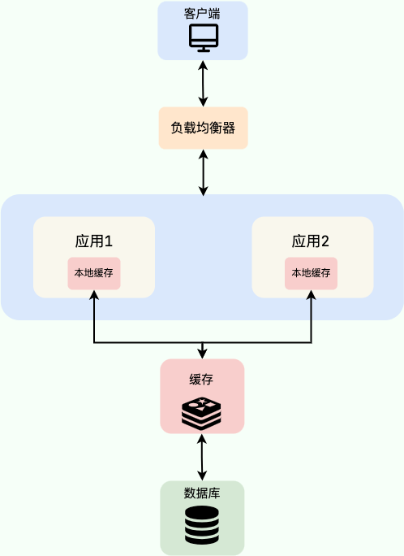

[J2Cache](https://gitee.com/ld/J2Cache) 就是一个基于本地内存和分布式缓存的两级 Java 缓存框架，感兴趣的同学可以研究一下。

### **Redis 基础：常见的缓存更新策略有哪几种?**

下面介绍到的三种模式各有优劣，不存在最佳模式，根据具体的业务场景选择适合自己的缓存读写模式即可！

#### Cache Aside Pattern（旁路缓存模式）

**Cache Aside Pattern 是我们平时使用比较多的一个缓存读写模式，比较适合读请求比较多的场景。**

Cache Aside Pattern 中服务端需要同时维系数据库（后文简称 db）和缓存（后文简称 cache），并且是以 db 的结果为准。

下面我们来看一下这个策略模式下的缓存读写步骤。

**写 ：**

1. 先更新 db；
2. 直接删除 cache 。

简单画了一张图帮助大家理解写的步骤。

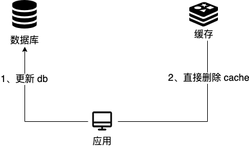

**读 :**

1. 从 cache 中读取数据，读取到就直接返回；
2. cache 中读取不到的话，就从 db 中读取数据返回；
3. 再把 db 中读取到的数据放到 cache 中。

简单画了一张图帮助大家理解读的步骤。

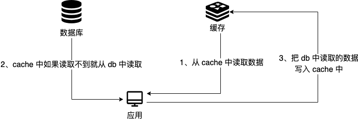

你仅仅了解了上面这些内容的话是远远不够的，我们还要搞懂其中的原理。

比如说面试官可能会问你：**“为什么删除 cache，而不是更新 cache？”**

主要原因有两点：

1. **对服务端资源造成浪费 ：**删除 cache 更加直接，这是因为 cache 中存放的一些数据需要服务端经过大量的计算才能得出，会消耗服务端的资源，是一笔不晓得开销。如果频繁修改 db，就能会导致需要频繁更新 cache，而 cache 中的数据可能都没有被访问到。
2. **产生数据不一致问题 ：**并发场景下，更新 cache 产生数据不一致性问题的概率会更大（后文会解释原因）。

面试官很可能会追问：**“在写数据的过程中，可以先删除 cache ，后更新 db 么？”**

答案： 那肯定是不行的！因为这样可能会造成 **数据库（db）和缓存（Cache）数据不一致**的问题。

举例：请求 1 先写数据 A，请求 2 随后读数据 A 的话，就很有可能产生数据不一致性的问题。这个过程可以简单描述为：

1. 请求 1 先把 cache 中的 A 数据删除；

2. 请求 2 从 db 中读取数据；

3. 请求 1 再把 db 中的 A 数据更新。

这就会导致请求 2 读取到的是旧值。

当你这样回答之后，面试官可能会紧接着就追问：**“在写数据的过程中，先更新 db，后删除 cache 就没有问题了么？”**

**答案：** 理论上来说还是可能会出现数据不一致性的问题，不过概率非常小，因为缓存的写入速度是比数据库的写入速度快很多。

举例：请求 1 先读数据 A，请求 2 随后写数据 A，并且数据 A 在请求 1 请求之前不在缓存中的话，也有可能产生数据不一致性的问题。这个过程可以简单描述为：

1. 请求 1 从 db 读数据 A；

2. 请求 2 更新 db 中的数据 A（此时缓存中无数据 A ，故不用执行删除缓存操作 ）；

3. 请求 1 将数据 A 写入 cache。

这就会导致 cache 中存放的其实是旧值。

现在我们再来分析一下 **Cache Aside Pattern 的缺陷。**

**缺陷 1：首次请求数据一定不在 cache 的问题**

解决办法：可以将热点数据可以提前放入 cache 中。

**缺陷 2：写操作比较频繁的话导致 cache 中的数据会被频繁被删除，这样会影响缓存命中率 。**

解决办法：

- 数据库和缓存数据强一致场景 ：更新 db 的时候同样更新 cache，不过我们需要加一个锁/分布式锁来保证更新 cache 的时候不存在线程安全问题。

- 可以短暂地允许数据库和缓存数据不一致的场景 ：更新 db 的时候同样更新 cache，但是给缓存加一个比较短的过期时间，这样的话就可以保证即使数据不一致的话影响也比较小。

#### Read/Write Through Pattern（读写穿透） 

Read/Write Through Pattern 中服务端把 cache 视为主要数据存储，从中读取数据并将数据写入其中。cache 服务负责将此数据读取和写入 db，从而减轻了应用程序的职责。

这种缓存读写策略小伙伴们应该也发现了在平时在开发过程中非常少见。抛去性能方面的影响，大概率是因为我们经常使用的分布式缓存 Redis 并没有提供 cache 将数据写入 db 的功能。

**写（Write Through）：**

- 先查 cache，cache 中不存在，直接更新 db。

- cache 中存在，则先更新 cache，然后 cache 服务自己更新 db（**同步更新 cache 和 db**）。

简单画了一张图帮助大家理解写的步骤。

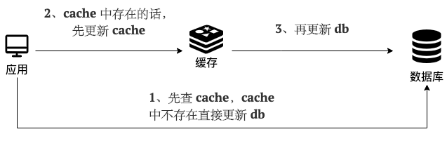

**读(Read Through)：**

- 从 cache 中读取数据，读取到就直接返回 。
- 读取不到的话，先从 db 加载，写入到 cache 后返回响应。

简单画了一张图帮助大家理解读的步骤。

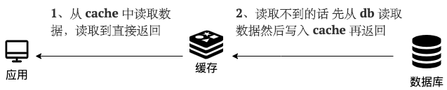

Read-Through Pattern 实际只是在 Cache-Aside Pattern 之上进行了封装。在 Cache-Aside Pattern 下，发生读请求的时候，如果 cache 中不存在对应的数据，是由客户端自己负责把数据写入 cache，而 Read Through Pattern 则是 cache 服务自己来写入缓存的，这对客户端是透明的。

和 Cache Aside Pattern 一样， Read-Through Pattern 也有首次请求数据一定不再 cache 的问题，对于热点数据可以提前放入缓存中。

#### Write Behind Pattern（异步缓存写入）

Write Behind Pattern 和 Read/Write Through Pattern 很相似，两者都是由 cache 服务来负责 cache 和 db 的读写。

但是，两个又有很大的不同：**Read/Write Through 是同步更新 cache 和 db，而 Write Behind 则是只更新缓存，不直接更新 db，而是改为异步批量的方式来更新 db。**

很明显，这种方式对数据一致性带来了更大的挑战，比如 cache 数据可能还没异步更新 db 的话，cache 服务可能就就挂掉了。

这种策略在我们平时开发过程中也非常非常少见，但是不代表它的应用场景少，比如消息队列中消息的异步写入磁盘、MySQL 的 Innodb Buffer Pool 机制都用到了这种策略。

Write Behind Pattern 下 db 的写性能非常高，非常适合一些数据经常变化又对数据一致性要求没那么高的场景，比如浏览量、点赞量。

### **Redis Sentinel：如何实现自动化地故障转移？**

普通的主从复制方案下，一旦 master 宕机，我们需要从 slave 中手动选择一个新的 master，同时需要修改应用方的主节点地址，还需要命令所有从节点去复制新的主节点，整个过程需要人工干预。人工干预大大增加了问题的处理时间以及出错的可能性。

我们可以借助 Redis 官方的 Sentinel（哨兵）方案来帮助我们解决这个痛点，实现自动化地故障切换。

建议带着下面这些重要的问题（面试常问）阅读：

1. 什么是 Sentinel？ 有什么用？
2. Sentinel 如何检测节点是否下线？主观下线与客观下线的区别?
3. Sentinel 是如何实现故障转移的？
4. 为什么建议部署多个 sentinel 节点（哨兵集群）？
5. Sentinel 如何选择出新的 master（选举机制）?
6. 如何从 Sentinel 集群中选择出 Leader ？
7. Sentinel 可以防止脑裂吗？

#### 什么是 Sentinel？

**Sentinel（哨兵）** 只是 Redis 的一种运行模式 ，不提供读写服务，默认运行在 26379 端口上，依赖于 Redis 工作。Redis Sentinel 的稳定版本是在 Redis 2.8 之后发布的。

Redis 在 Sentinel 这种特殊的运行模式下，使用专门的命令表，也就是说普通模式运行下的 Redis 命令将无法使用。

通过下面的命令就可以让 Redis 以 Sentinel 的方式运行:

```bash
redis-sentinel /path/to/sentinel.conf
或者
redis-server /path/to/sentinel.conf --sentinel
```

Redis 源码中的`sentinel.conf`是用来配置 Sentinel 的，一个常见的最小配置如下所示：

```
// 指定要监视的 master
// 127.0.0.1 6379 为 master 地址
// 2 表示当有 2 个 sentinel 认为 master 失效时，master 才算真正失效
sentinel monitor mymaster 127.0.0.1 6379 2
// master 节点宕机多长时间才会被 sentinel 认为是失效
sentinel down-after-milliseconds mymaster 60000
sentinel failover-timeout mymaster 180000
sentinel parallel-syncs mymaster 1

sentinel monitor resque 192.168.1.3 6380 4
sentinel down-after-milliseconds resque 10000
sentinel failover-timeout resque 180000
// 在发生主备切换时最多可以有 5 个 slave 同时对新的 master 进行同步
sentinel parallel-syncs resque 5
```

Redis Sentinel 实现 Redis 集群高可用，只是在主从复制实现集群的基础下，多了一个 Sentinel 角色来帮助我们监控 Redis 节点的运行状态并自动实现故障转移。

当 master 节点出现故障的时候， Sentinel 会帮助我们实现故障转移，自动根据一定的规则选出一个 slave 升级为 master，确保整个 Redis 系统的可用性。整个过程完全自动，不需要人工介入。

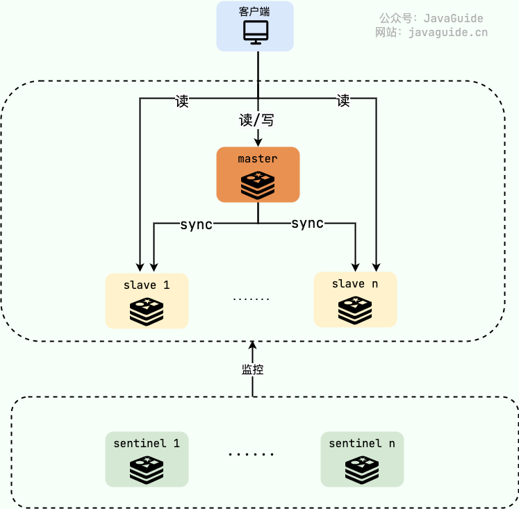

#### Sentinel 有什么作用？

根据 [Redis Sentinel 官方文档](https://redis.io/topics/sentinel)的介绍，sentinel 节点主要可以提供 4 个功能：

- **监控：**监控所有 redis 节点（包括 sentinel 节点自身）的状态是否正常。
- **故障转移：**如果一个 master 出现故障，Sentinel 会帮助我们实现故障转移，自动将某一台 slave 升级为 master，确保整个 Redis 系统的可用性。
- **通知 ：**通知 slave 新的 master 连接信息，让它们执行 replicaof 成为新的 master 的 slave。
- **配置提供 ：**客户端连接 sentinel 请求 master 的地址，如果发生故障转移，sentinel 会通知新的 master 链接信息给客户端。

Redis Sentinel 本身设计的就是一个分布式系统，建议多个 sentinel 节点协作运行。这样做的好处是：

- 多个 sentinel 节点通过投票的方式来确定 sentinel 节点是否真的不可用，避免误判（比如网络问题可能会导致误判）。
- Sentinel 自身就是高可用。

**如果想要实现高可用，建议将哨兵 Sentinel 配置成单数且大于等于 3 台。**

一个最简易的 Redis Sentinel 集群如下所示（官方文档中的一个例子），其中：

- M1 表示 master，R2、R3 表示 slave；
- S1、S2、S3 都是 sentinel；
- quorum 表示判定 master 失效最少需要的仲裁节点数。这里的值为 2 ，也就是说当有 2 个 sentinel 认为 master 失效时，master 才算真正失效。

```lua
       +----+
       | M1 |
       | S1 |
       +----+
          |
+----+    |    +----+
| R2 |----+----| R3 |
| S2 |         | S3 |
+----+         +----+

Configuration: quorum = 2
```

如果 M1 出现问题，只要 S1、S2、S3 其中的两个投票赞同的话，就会开始故障转移工作，从 R2 或者 R3 中重新选出一个作为 master。

#### **Sentinel 如何检测节点是否下线？**

> 相关的问题：
>
> - 主观下线与客观下线的区别?
> - Sentinel 是如何实现故障转移的？
> - 为什么建议部署多个 sentinel 节点（哨兵集群）？

Redis Sentinel 中有两个下线（Down）的概念：

- **主观下线(SDOWN) ：**sentinel 节点认为某个 Redis 节点已经下线了（主观下线），但还不是很确定，需要其他 sentinel 节点的投票。
- **客观下线(ODOWN) ：**法定数量（通常为过半）的 sentinel 节点认定某个 Redis 节点已经下线（客观下线），那它就算是真的下线了。

也就是说，**主观下线** 当前的 sentinel 自己认为节点宕机，客观下线是 sentinel 整体达成一致认为节点宕机。

每个 sentinel 节点以每秒钟一次的频率向整个集群中的 master、slave 以及其他 sentinel 节点发送一个 PING 命令。

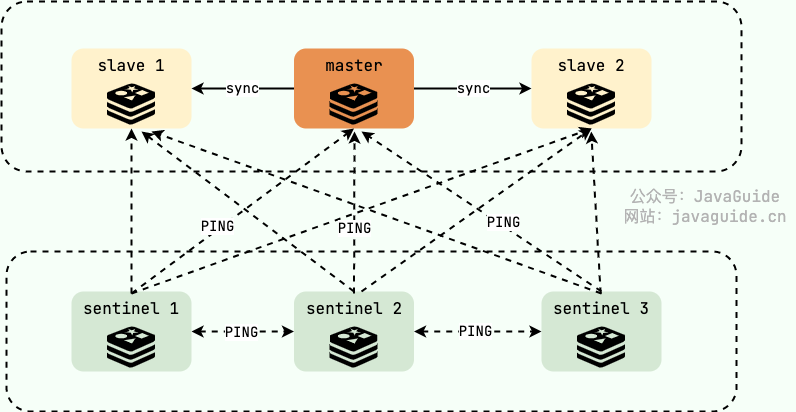

如果对应的节点超过规定的时间（down-after-millisenconds）没有进行有效回复的话，就会被其认定为是 **主观下线(SDOWN)** 。注意！这里的有效回复不一定是 PONG，可以是-LOADING 或者 -MASTERDOWN 。

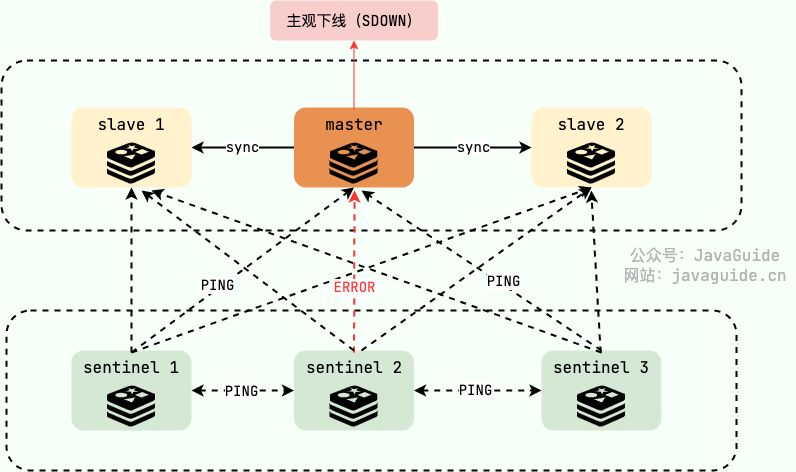

如果被认定为主观下线的是 slave 的话， sentinel 不会做什么事情，因为 slave 下线对 Redis 集群的影响不大，Redis 集群对外正常提供服务。但如果是 master 被认定为主观下线就不一样了，sentinel 整体还要对其进行进一步核实，确保 master 是真的下线了。

所有 sentinel 节点要以每秒一次的频率确认 master 的确下线了，当法定数量（通常为过半）的 sentinel 节点认定 master 已经下线， master 才被判定为 **客观下线(ODOWN)** 。这样做的目的是为了防止误判，毕竟故障转移的开销还是比较大的，这也是为什么 Redis 官方推荐部署多个 sentinel 节点（哨兵集群）。

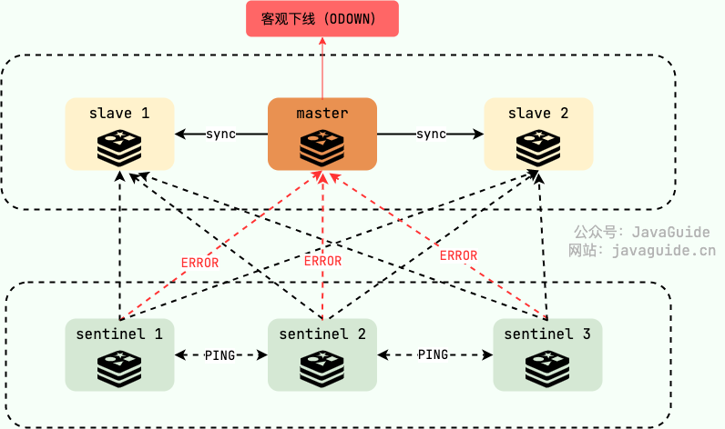

随后， sentinel 中会有一个 Leader 的角色来负责故障转移，也就是自动地从 slave 中选出一个新的 master 并执行完相关的一些工作(比如通知 slave 新的 master 连接信息，让它们执行 replicaof 成为新的 master 的 slave)。

如果没有足够数量的 sentinel 节点认定 master 已经下线的话，当 master 能对 sentinel 的 PING 命令进行有效回复之后，master 也就不再被认定为主观下线，回归正常。

#### Sentinel 如何选择出新的 master?

slave 必须是在线状态才能参加新的 master 的选举，筛选出所有在线的 slave 之后，通过下面 3 个维度进行最后的筛选（优先级依次降低）：

1. **slave 优先级 ：**可以通过 slave-priority 手动设置 slave 的优先级，优先级越高得分越高，优先级最高的直接成为新的 master。如果没有优先级最高的，再判断复制进度。
2. **复制进度 ：**Sentinel 总是希望选择出数据最完整（与旧 master 数据最接近）也就是复制进度最快的 slave 被提升为新的 master，复制进度越快得分也就越高。
3. **runid(运行 id) ：**通常经过前面两轮筛选已经成果选出来了新的 master，万一真有多个 slave 的优先级和复制进度一样的话，那就 runid 小的成为新的 master，每个 redis 节点启动时都有一个 40 字节随机字符串作为运行 id。

#### 如何从 Sentinel 集群中选择出 Leader ？

我们前面说了，当 sentinel 集群确认有 master 客观下线了，就会开始故障转移流程，故障转移流程的第一步就是在 sentinel 集群选择一个 leader，让 leader 来负责完成故障转移。

**如何选择出 Leader 角色呢？**

这就需要用到分布式领域的 **共识算法** 了。简单来说，共识算法就是让分布式系统中的节点就一个问题达成共识。在 sentinel 选举 leader 这个场景下，这些 sentinel 要达成的共识就是谁才是 leader 。

大部分共识算法都是基于 Paxos 算法改进而来，在 sentinel 选举 leader 这个场景下使用的是 [Raft 算法](https://javaguide.cn/distributed-system/theorem&algorithm&protocol/raft-algorithm.html)。这是一个比 Paxos 算法更易理解和实现的共识算法—Raft 算法。更具体点来说，Raft 是 Multi-Paxos 的一个变种，其简化了 Multi-Paxos 的思想，变得更容易被理解以及工程实现。

对于学有余力并且想要深入了解 Raft 算法实践以及 sentinel 选举 leader 的详细过程的同学，推荐阅读下面这两篇文章：

- [Raft 算法详解](https://javaguide.cn/distributed-system/theorem&algorithm&protocol/raft-algorithm.html)
- [Raft 协议实战之 Redis Sentinel 的选举 Leader 源码解析](https://cloud.tencent.com/developer/article/1021467)

#### Sentinel 可以防止脑裂吗？

还是上面的例子，如果 M1 和 R2、R3 之间的网络被隔离，也就是发生了脑裂，M1 和 R2 、 R3 隔离在了两个不同的网络分区中。这意味着，R2 或者 R3 其中一个会被选为 master，这里假设为 R2。

但是！这样会出现问题了！！

如果客户端 C1 是和 M1 在一个网络分区的话，从网络被隔离到网络分区恢复这段时间，C1 写入 M1 的数据都会丢失，并且，C1 读取的可能也是过时的数据。这是因为当网络分区恢复之后，M1 将会成为 slave 节点。

```lua
         +----+
         | M1 |
         | S1 | <- C1 (writes will be lost)
         +----+
            |
            /
            /
+------+    |    +----+
| [M2] |----+----| R3 |
| S2   |         | S3 |
+------+         +----+
```

想要解决这个问题的话也不难，对 Redis 主从复制进行配置即可。

```lua
min-replicas-to-write 1
min-replicas-max-lag 10
```

下面对这两个配置进行解释：

- **min-replicas-to-write 1：**用于配置写 master 至少写入的 slave 数量，设置为 0 表示关闭该功能。3 个节点的情况下，可以配置为 1 ，表示 master 必须写入至少 1 个 slave ，否则就停止接受新的写入命令请求。
- **min-replicas-max-lag 10 ：**用于配置 master 多长时间（秒）无法得到从节点的响应，就认为这个节点失联。我们这里配置的是 10 秒，也就是说 master 10 秒都得不到一个从节点的响应，就会认为这个从节点失联，停止接受新的写入命令请求。

不过，这样配置会降低 Redis 服务的整体可用性，如果 2 个 slave 都挂掉，master 将会停止接受新的写入命令请求。

### **Redis Cluster：缓存的数据量太大怎么办？**

来来来！一起来盘盘 Redis Cluster 常见的问题。如果你的项目用到了 Redis 的话（大部分人的项目都用到了 Redis 来做分布式缓存），为了能比别人更有亮点，Redis Cluster 是一个不错的选择。

这篇文章原本写了接近 8000 字，有点写嗨了，后面删减到了现在的 5000+ 字。为了帮助理解，我手绘了很多张图解，尽可能用大白话的语言来讲。

建议带着下面这些重要的问题（面试常问）阅读：

- 为什么需要 Redis Cluster？解决了什么问题？有什么优势？
- Redis Cluster 是如何分片的？
- 为什么 Redis Cluster 的哈希槽是 16384 个?
- 如何确定给定 key 的应该分布到哪个哈希槽中？
- Redis Cluster 支持重新分配哈希槽吗？
- Redis Cluster 扩容缩容期间可以提供服务吗？
- Redis Cluster 中的节点是怎么进行通信的？

#### 为什么需要 Redis Cluster？

高并发场景下，使用 Redis 主要会遇到的两个问题：

1. **缓存的数据量太大 ：**实际缓存的数据量可以达到几十 G，甚至是成百上千 G；
2. **并发量要求太大 ：**虽然 Redis 号称单机可以支持 10w 并发，但实际项目中，不可靠因素太多，就比如一些复杂的写/读操作就可能会让这个并发量大打折扣。而且，就算真的可以实际支持 10w 并发，达到瓶颈了，可能也没办法满足系统的实际需求。

主从复制和 Redis Sentinel 这两种方案本质都是通过增加主库（master）的副本（slave）数量的方式来提高 Redis 服务的整体可用性和读吞吐量，都不支持横向扩展来缓解写压力以及解决缓存数据量过大的问题。

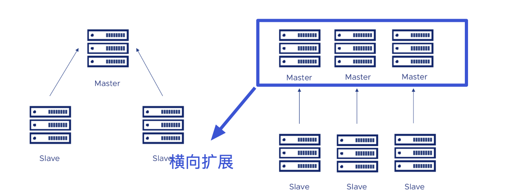

对于这两种方案来说，如果写压力太大或者缓存数据量太大的话，我们可以考虑提高服务器硬件的配置。不过，提高硬件配置成本太高，能力有限，无法动态扩容缩容，局限性太大。从本质上来说，靠堆硬件配置的方式并没有实质性地解决问题，依然无法满足高并发场景下分布式缓存的要求。

通常情况下，更建议使用 **Redis 切片集群** 这种方案，更能满足高并发场景下分布式缓存的要求。

简单来说，**Redis 切片集群** 就是部署多台 Redis 主节点（master），这些节点之间平等，并没有主从之说，同时对外提供读/写服务。缓存的数据库相对均匀地分布在这些 Redis 实例上，客户端的请求通过路由规则转发到目标 master 上。

为了保障集群整体的高可用，我们需要保证集群中每一个 master 的高可用，可以通过主从复制给每个 master 配置一个或者多个从节点（slave）。

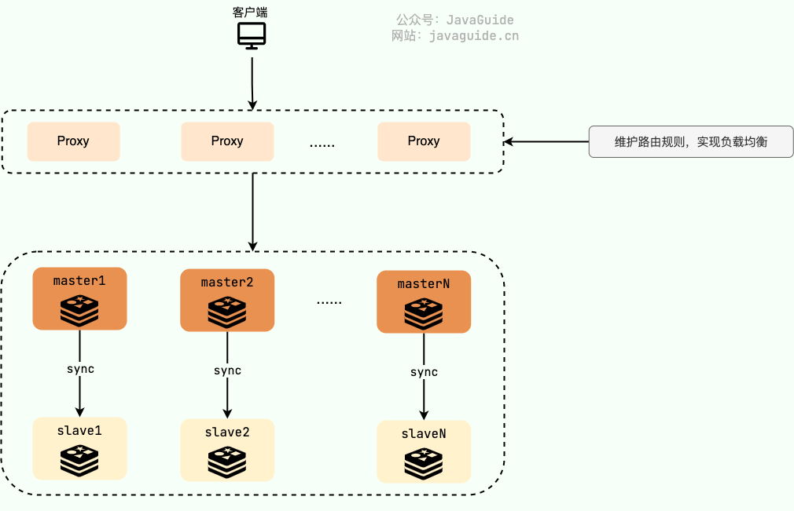

**Redis 切片集群对于横向扩展非常友好，只需要增加 Redis 节点到集群中即可。**

在 Redis 3.0 之前，我们通常使用的是 [Twemproxy](https://github.com/twitter/twemproxy)、[Codis](https://github.com/CodisLabs/codis) 这类开源分片集群方案。Twemproxy、Codis 就相当于是上面的 Proxy 层，负责维护路由规则，实现负载均衡。

不过，Twemproxy、Codis 虽然未被淘汰，但官方已经没有继续维护了。

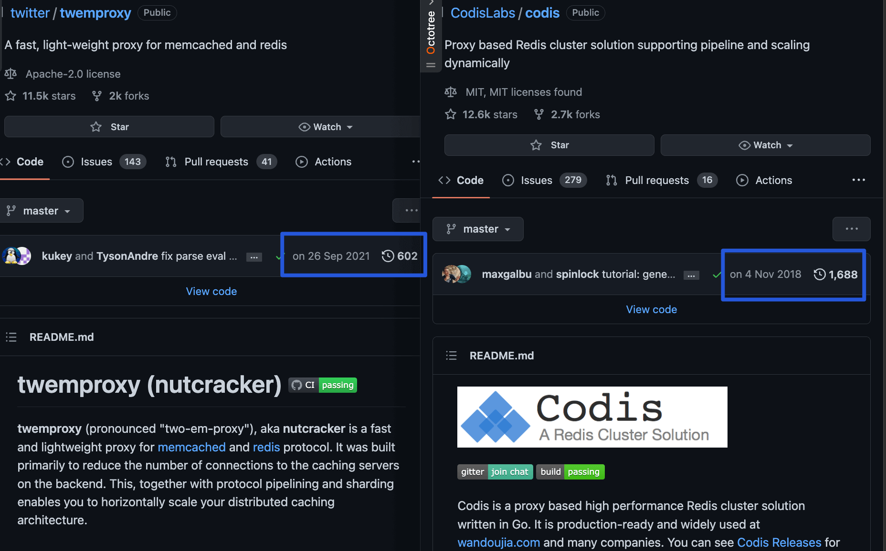

到了 Redis 3.0 的时候，Redis 官方推出了分片集群解决方案 [Redis Cluster](https://redis.io/topics/cluster-tutorial) 。经过多个版本的持续完善，Redis Cluster 成为 Redis 切片集群的首选方案，满足绝大部分高并发业务场景需求。

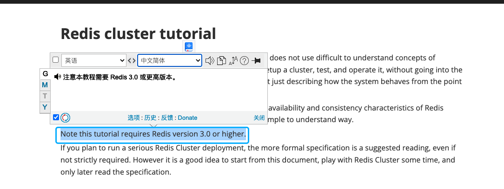

Redis Cluster 通过 **分片（Sharding）** 来进行数据管理，提供 **主从复制（Master-Slave Replication）**、**故障转移（Failover）** 等开箱即用的功能，可以非常方便地帮助我们解决 Redis 大数据量缓存以及 Redis 服务高可用的问题。

Redis Cluster 这种方案可以很方便地进行 **横向拓展（Scale Out）**，内置了开箱即用的解决方案。当 Redis Cluster 的处理能力达到瓶颈无法满足系统要求的时候，直接动态添加 Redis 节点到集群中即可。根据官方文档中的介绍，Redis Cluster 支持扩展到 1000 个节点。反之，当 Redis Cluster 的处理能力远远满足系统要求，同样可以动态删除集群中 Redis 节点，节省资源。

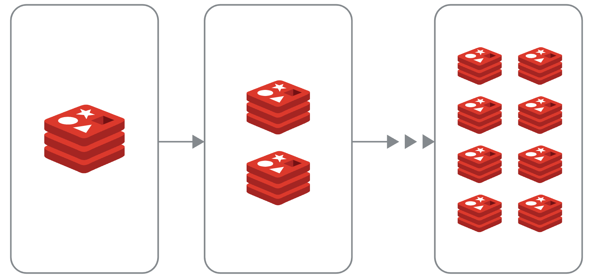

可以说，**Redis Cluster 的动态扩容和缩容是其最大的优势**。

虽说 Redis Cluster 可以扩展到 1000 个节点，但强烈不推荐这样做，应尽量避免集群中的节点过多。这是因为 Redis Cluster 中的各个节点基于 Gossip 协议 来进行通信共享信息，当节点过多时，Gossip 协议的效率会显著下降，通信成本剧增。

最后，总结一下 Redis Cluster 的主要优势：

- 可以横向扩展缓解写压力和存储压力，支持动态扩容和缩容；
- 具备主从复制、故障转移（内置了 Sentinel 机制，无需单独部署 Sentinel 集群）等开箱即用的功能。

#### 一个最基本的 Redis Cluster 架构是怎样的？

为了保证高可用，Redis Cluster 至少需要 3 个 master 以及 3 个 slave，也就是说每个 master 必须有 1 个 slave。master 和 slave 之间做主从复制，slave 会实时同步 master 上的数据。

不同于普通的 Redis 主从架构，这里的 slave 不对外提供读服务，主要用来保障 master 的高可用，当 master 出现故障的时候替代它。

如果 master 只有一个 slave 的话，master 宕机之后就直接使用这个 slave 替代 master 继续提供服务。假设 master1 出现故障，slave1 会直接替代 master1，保证 Redis Cluster 的高可用。

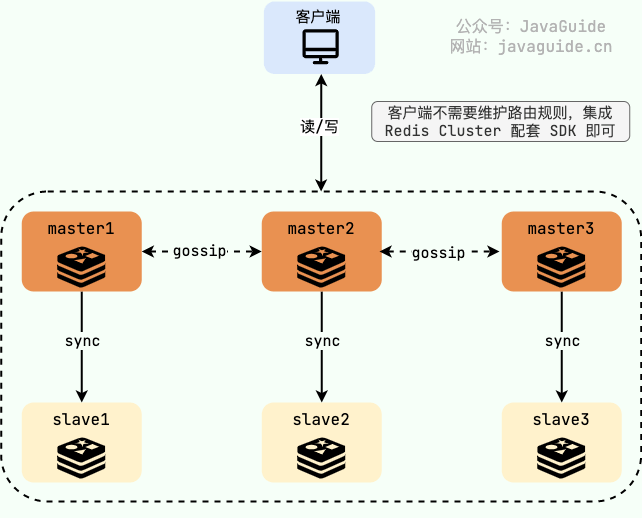

如果 master 有多个 slave 的话，Redis Cluster 中的其他节点会从这个 master 的所有 slave 中选出一个替代 master 继续提供服务。Redis Cluster 总是希望数据最完整的 slave 被提升为新的 master。

Redis Cluster 是去中心化的（各个节点基于 Gossip 进行通信），任何一个 master 出现故障，其它的 master 节点不受影响，因为 key 找的是哈希槽而不是 Redis 节点。不过，Redis Cluster 至少要保证宕机的 master 有一个 slave 可用。

如果宕机的 master 无 slave 的话，为了保障集群的完整性，保证所有的哈希槽都指派给了可用的 master ，整个集群将不可用。这种情况下，还是想让集群保持可用的话，可以将cluster-require-full-coverage 这个参数设置成 no，cluster-require-full-coverage 表示需要 16384 个 slot 都正常被分配的时候 Redis Cluster 才可以对外提供服务。

如果我们想要添加新的节点比如 master4、master5 进入 Redis Cluster 也非常方便，只需要重新分配哈希槽即可。

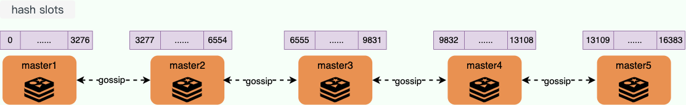

如果我们想要移除某个 master 节点的话，需要先将该节点的哈希槽移动到其他节点上，这样才可以进行删除，不然会报错。

#### **Redis Cluster 是如何分片的？**

> 类似的问题：
>
> - Redis Cluster 中的数据是如何分布的？
> - 如何确定给定 key 的应该分布到哪个哈希槽中？

Redis Cluster 并没有使用一致性哈希，采用的是 哈希槽分区 ，每一个键值对都属于一个 hash slot（哈希槽） 。

Redis Cluster 通常有 16384 个哈希槽 ，要计算给定 key 应该分布到哪个哈希槽中，我们只需要先对每个 key 计算 CRC-16（XMODEM） 校验码，然后再对这个校验码对 16384(哈希槽的总数) 取模，得到的值即是 key 对应的哈希槽。

哈希槽的计算公式如下：

```C
HASH_SLOT = CRC16(key) mod NUMER_OF_SLOTS
```

创建并初始化 Redis Cluster 的时候，Redis 会自动平均分配这 16384 个哈希槽到各个节点，不需要我们手动分配。如果你想自己手动调整的话，Redis Cluster 也内置了相关的命令比如` ADDSLOTS、ADDSLOTSRANGE`（后面会详细介绍到重新分配哈希槽相关的命令）。

假设集群有 3 个 Redis 节点组成，每个节点负责整个集群的一部分数据，哈希槽可能是这样分配的（这里只是演示，实际效果可能会有差异）：

- Node 1 ： 0 - 5500 的 hash slots
- Node 2 ： 5501 - 11000 的 hash slots
- Node 3 ： 11001 - 16383 的 hash slots

在任意一个 master 节点上执行 CLUSTER SLOTS命令即可返回哈希槽和节点的映射关系：

```bash
127.0.0.1:7000>> CLUSTER SLOTS
# 哈希槽的范围
1) 1) (integer) 0
   2) (integer) 5500
   # master 的 ip 和端口号
   3) 1) "127.0.0.1"
      2) (integer) 7002
   # slave 的 ip 和端口号
   4) 1) "127.0.0.1"
      2) (integer) 8002
2) 1) (integer) 11001
   2) (integer) 16383
   3) 1) "127.0.0.1"
      2) (integer) 7000
   4) 1) "127.0.0.1"
      2) (integer) 8000
3) 1) (integer) 5501
   2) (integer) 11000
   3) 1) "127.0.0.1"
      2) (integer) 7001
   4) 1) "127.0.0.1"
      2) (integer) 8001
```

客户端连接 Redis Cluster 中任意一个 master 节点即可访问 Redis Cluster 的数据，当客户端发送命令请求的时候，需要先根据 key 通过上面的计算公示找到的对应的哈希槽，然后再查询哈希槽和节点的映射关系，即可找到目标节点。

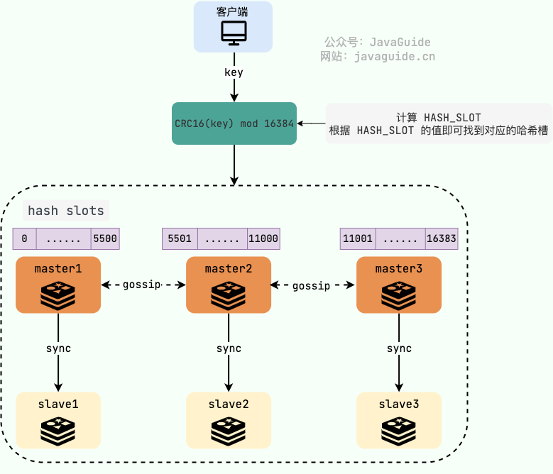

如果哈希槽确实是当前节点负责，那就直接响应客户端的请求返回结果，如果不由当前节点负责，就会返回 -MOVED 重定向错误，告知客户端当前哈希槽是由哪个节点负责，客户端向目标节点发送请求并更新缓存的哈希槽分配信息。

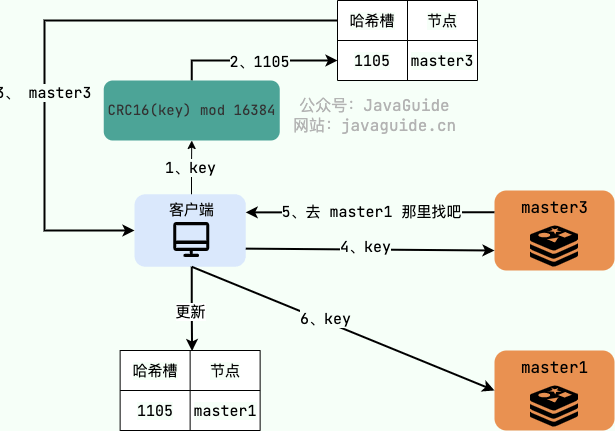

这个时候你可能就会疑问：**为什么还会存在找错节点的情况呢？根据公式计算难道还会出错？**

这是因为 Redis Cluster 内部可能会重新分配哈希槽比如扩容缩容的时候（后文中有详细介绍到 Redis Cluster 的扩容和缩容问题），这就可能会导致客户端缓存的哈希槽分配信息会有误。

从上面的介绍中，我们可以简单总结出 Redis Cluster 哈希槽分区机制的优点：**解耦了数据和节点之间的关系，提升了集群的横向扩展性和容错性。**

#### 为什么 Redis Cluster 的哈希槽是 16384 个?

CRC16 算法产生的校验码有 16 位，理论上可以产生 65536（2^16，0 ~ 65535）个值。为什么 Redis Cluster 的哈希槽偏偏选择的是 16384（2^14）个呢？

2015 年的时候，在 Redis 项目的 issues 区，已经有人提了类似的问题，地址：https://github.com/redis/redis/issues/2576。Redis 作者 antirez 巨佬本人专门对这个问题进行了回复。

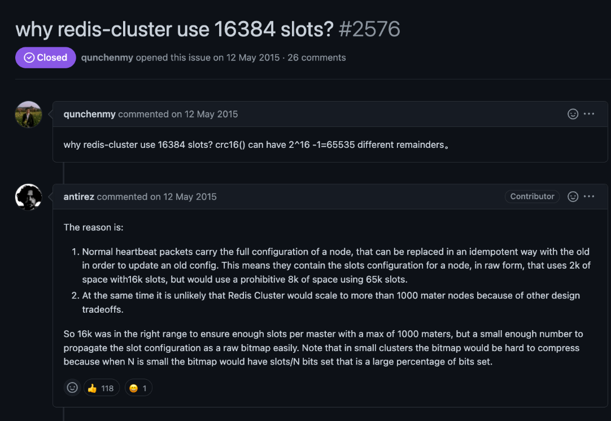

antirez 认为哈希槽是 16384（2 的 14 次方） 个的原因是：

- 正常的心跳包会携带一个节点的完整配置，它会以幂等的方式更新旧的配置，这意味着心跳包会附带当前节点的负责的哈希槽的信息。假设哈希槽采用 16384 ,则占空间 2k(16384/8)。假设哈希槽采用 65536， 则占空间 8k(65536/8)，这是令人难以接受的内存占用。
- 由于其他设计上的权衡，Redis Cluster 不太可能扩展到超过 1000 个主节点。

也就是说，65536 个固然可以确保每个主节点有足够的哈希槽，但其占用的空间太大。而且，Redis Cluster 的主节点通常不会扩展太多，16384 个哈希槽完全足够用了。

`cluster.h `文件中定义了消息结构` clusterMsg`（源码地址：https://github.com/redis/redis/blob/7.0/src/cluster.h） ：

```c
typedef struct {
    // 省略部分字段
    // ......
    // 本节点负责的哈希槽信息,16384/8 个 char 数组，一共为16384bit
    unsigned char myslots[CLUSTER_SLOTS/8];
    // 集群的状态
    unsigned char state;
    // 消息的内容
    union clusterMsgData data;
} clusterMsg;
```

`myslots `字段用于存储哈希槽信息， 属于无符号类型的 char 数组，数组长度为 16384/8 = 2048。C 语言中的 char 只占用一个字节，而 Java 语言中 char 占用两个字节，小伙伴们不要搞混了。

这里实际就是通过 bitmap 这种数据结构维护的哈希槽信息，每一个 bit 代表一个哈希槽，每个 bit 只能存储 0/1 。如果该位为 1，表示这个哈希槽是属于这个节点。


消息传输过程中，会对 myslots 进行压缩，bitmap 的填充率越低，压缩率越高。bitmap 的填充率的值是 **哈希槽总数/节点数** ，如果哈希槽总数太大的话，bitmap 的填充率的值也会比较大。

最后，总结一下 Redis Cluster 的哈希槽的数量选择 16384 而不是 65536 的主要原因：

- 哈希槽太大会导致心跳包太大，消耗太多带宽；
- 哈希槽总数越少，对存储哈希槽信息的 bitmap 压缩效果越好；
- Redis Cluster 的主节点通常不会扩展太多，16384 个哈希槽已经足够用了。

Redis Cluster 如何重新分配哈希槽？

如果你想自己手动调整的话，Redis Cluster 也内置了相关的命令：

- CLUSTER ADDSLOTS slot [slot ...] : 把一组 hash slots 分配给接收命令的节点，时间复杂度为 O(N)，其中 N 是 hash slot 的总数；
- CLUSTER ADDSLOTSRANGE start-slot end-slot [start-slot end-slot ...] （Redis 7.0 后新加的命令）： 把指定范围的 hash slots 分配给接收命令的节点，类似于 ADDSLOTS 命令，时间复杂度为 O(N) 其中 N 是起始 hash slot 和结束 hash slot 之间的 hash slot 的总数。
- CLUSTER DELSLOTS slot [slot ...] : 从接收命令的节点中删除一组 hash slots；
- CLUSTER FLUSHSLOTS ：移除接受命令的节点中的所有 hash slot；
- CLUSTER SETSLOT slot MIGRATING node-id： 迁移接受命令的节点的指定 hash slot 到目标节点（node_id 指定）中；
- CLUSTER SETSLOT slot IMPORTING node-id： 将目标节点（node_id 指定）中的指定 hash slot 迁移到接受命令的节点中；
- ......

简单演示一下:

```bash
# 将 slot 1 2 3 4 5 分配给节点
> CLUSTER ADDSLOTS 1 2 3 4 5
OK
# 可以使用 ADDSLOTSRANGE 命令完成一样的效果
> CLUSTER ADDSLOTSRANGE 1 5
OK
# 从接收命令的节点中删除 hash slot 1000 1001 1002
> CLUSTER DELSLOTS 1000 1001 1002
# 迁移接受命令的节点的 hash slot 1005 到 node_id(一长串字符串)对应的节点中
> CLUSTER SETSLOT 1005 MIGRATING node_id(一长串字符串)
# 将node_id(一长串字符串)对应的节点中的 hash slot 1005 迁移到接受命令的节点中
> CLUSTER SETSLOT 1005 IMPORTING 92fd7c2a7b7b8933d1019e72a852f621f6b4faff
```

#### **Redis Cluster 扩容缩容期间可以提供服务吗？**

> 类似的问题：
>
> - 如果客户端访问的 key 所属的槽正在迁移怎么办？
> - 如何确定给定 key 的应该分布到哪个哈希槽中？

**Redis Cluster 扩容和缩容本质是进行重新分片，动态迁移哈希槽。**

为了保证 Redis Cluster 在扩容和缩容期间依然能够对外正常提供服务，Redis Cluster 提供了重定向机制，两种不同的类型：

- ASK 重定向
- MOVED 重定向

从客户端的角度来看，ASK 重定向是下面这样的：

1. 客户端发送请求命令，如果请求的 key 对应的哈希槽还在当前节点的话，就直接响应客户端的请求。
2. 如果客户端请求的 key 对应的哈希槽当前正在迁移至新的节点，就会返回 -ASK 重定向错误，告知客户端要将请求发送到哈希槽被迁移到的目标节点。
3. 客户端收到 -ASK 重定向错误后，将会临时（一次性）重定向，自动向目标节点发送一条 [ASKING](https://redis.io/commands/asking/) 命令。也就是说，接收到 ASKING 命令的节点会强制执行一次请求，下次再来需要重新提前发送 ASKING 命令。
4. 客户端发送真正的请求命令。
5. ASK 重定向并不会同步更新客户端缓存的哈希槽分配信息，也就是说，客户端对正在迁移的相同哈希槽的请求依然会发送到原节点而不是目标节点。

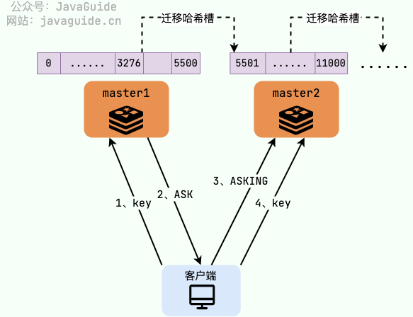

如果客户端请求的 key 对应的哈希槽应该迁移完成的话，就会返回 -MOVED 重定向错误，告知客户端当前哈希槽是由哪个节点负责，客户端向目标节点发送请求并更新缓存的哈希槽分配信息。

#### Redis Cluster 中的节点是怎么进行通信的？

Redis Cluster 是一个典型的分布式系统，分布式系统中的各个节点需要互相通信。既然要相互通信就要遵循一致的通信协议，Redis Cluster 中的各个节点基于 **Gossip 协议** 来进行通信共享信息，每个 Redis 节点都维护了一份集群的状态信息。

Redis Cluster 的节点之间会相互发送多种 Gossip 消息：

- MEET ：在 Redis Cluster 中的某个 Redis 节点上执行 CLUSTER MEET ip port 命令，可以向指定的 Redis 节点发送一条 MEET 信息，用于将其添加进 Redis Cluster 成为新的 Redis 节点。
- PING/PONG ：Redis Cluster 中的节点都会定时地向其他节点发送 PING 消息，来交换各个节点状态信息，检查各个节点状态，包括在线状态、疑似下线状态 PFAIL 和已下线状态 FAIL。
- FAIL ：Redis Cluster 中的节点 A 发现 B 节点 PFAIL ，并且在下线报告的有效期限内集群中半数以上的节点将 B 节点标记为 PFAIL，节点 A 就会向集群广播一条 FAIL 消息，通知其他节点将故障节点 B 标记为 FAIL 。
- ......

有了 Redis Cluster 之后，不需要专门部署 Sentinel 集群服务了。Redis Cluster 相当于是内置了 Sentinel 机制，Redis Cluster 内部的各个 Redis 节点通过 Gossip 协议互相探测健康状态，在故障时可以自动切换。

`cluster.h` 文件中定义了所有的消息类型（源码地址：https://github.com/redis/redis/blob/7.0/src/cluster.h） 。Redis 3.0 版本的时候只有 9 种消息类型，到了 7.0 版本的时候已经有 11 种消息类型了。

```c
// 注意，PING 、 PONG 和 MEET 实际上是同一种消息。
// PONG 是对 PING 的回复，它的实际格式也为 PING 消息，
// 而 MEET 则是一种特殊的 PING 消息，用于强制消息的接收者将消息的发送者添加到集群中（如果节点尚未在节点列表中的话）
#define CLUSTERMSG_TYPE_PING 0          /* Ping 消息 */
#define CLUSTERMSG_TYPE_PONG 1          /* Pong 用于回复Ping */
#define CLUSTERMSG_TYPE_MEET 2          /* Meet 请求将某个节点添加到集群中 */
#define CLUSTERMSG_TYPE_FAIL 3          /* Fail 将某个节点标记为 FAIL */
#define CLUSTERMSG_TYPE_PUBLISH 4       /* 通过发布与订阅功能广播消息 */
#define CLUSTERMSG_TYPE_FAILOVER_AUTH_REQUEST 5 /* 请求进行故障转移操作，要求消息的接收者通过投票来支持消息的发送者 */
#define CLUSTERMSG_TYPE_FAILOVER_AUTH_ACK 6     /* 消息的接收者同意向消息的发送者投票 */
#define CLUSTERMSG_TYPE_UPDATE 7        /* slots 已经发生变化，消息发送者要求消息接收者进行相应的更新 */
#define CLUSTERMSG_TYPE_MFSTART 8       /* 为了进行手动故障转移，暂停各个客户端 */
#define CLUSTERMSG_TYPE_MODULE 9        /* 模块集群API消息 */
#define CLUSTERMSG_TYPE_PUBLISHSHARD 10 /* 通过发布与订阅功能广播分片消息 */
#define CLUSTERMSG_TYPE_COUNT 11        /* 消息总数 */
```

`cluster.h` 文件中定义了消息结构 `clusterMsg`（源码地址：https://github.com/redis/redis/blob/7.0/src/cluster.h） ：

```c
typedef struct {
    char sig[4];        /* 标志位，"RCmb" (Redis Cluster message bus). */
    uint32_t totlen;    /* 消息总长度 */
    uint16_t ver;       /* 消息协议版本 */
    uint16_t port;      /* 端口 */
    uint16_t type;      /* 消息类型 */
    char sender[CLUSTER_NAMELEN];  /* 消息发送节点的名字（ID） */
    // 本节点负责的哈希槽信息,16384/8 个 char 数组，一共为16384bit
    unsigned char myslots[CLUSTER_SLOTS/8];
    // 如果消息发送者是一个从节点，那么这里记录的是消息发送者正在复制的主节点的名字
    // 如果消息发送者是一个主节点，那么这里记录的是 REDIS_NODE_NULL_NAME
    // （一个 40 字节长，值全为 0 的字节数组）
    char slaveof[CLUSTER_NAMELEN];
    // 省略部分属性
    // ......
    // 集群的状态
    unsigned char state;
    // 消息的内容
    union clusterMsgData data;
} clusterMsg;
```

`clusterMsgData `是一个联合体(union）,可以为 PING，MEET，PONG 、FAIL 等消息类型。当消息为 PING、MEET 和 PONG 类型时，都是 ping 字段是被赋值的，这也就解释了为什么我们上面说 PING 、 PONG 和 MEET 实际上是同一种消息。

```c
union clusterMsgData {
    /* PING, MEET and PONG */
    struct {
        /* Array of N clusterMsgDataGossip structures */
        clusterMsgDataGossip gossip[1];
    } ping;

    /* FAIL */
    struct {
        clusterMsgDataFail about;
    } fail;

    /* PUBLISH */
    struct {
        clusterMsgDataPublish msg;
    } publish;

    /* UPDATE */
    struct {
        clusterMsgDataUpdate nodecfg;
    } update;

    /* MODULE */
    struct {
        clusterMsgModule msg;
    } module;
};
```

#### 参考

- Redis Cluster 官方规范：https://redis.io/docs/reference/cluster-spec/
- Redis Cluster 官方教程：https://redis.io/topics/cluster-tutorial
- Redis Cluster 官方公开 PDF 讲义：https://redis.io/presentation/Redis_Cluster.pdf
- Redis 集群详述：https://juejin.cn/post/7016865316240097287
- Redis 专题：了解 Redis 集群，这篇就够了：https://juejin.cn/post/6949832776224866340
- Redis Notes - Cluster mode：https://www.stevenchang.tw/blog/2020/12/08/redis-notes-cluster-mode
- 带有详细注释的 Redis 3.0 代码（开源项目）：https://github.com/huangz1990/redis-3.0-annotated


