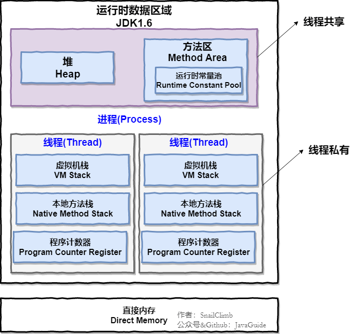
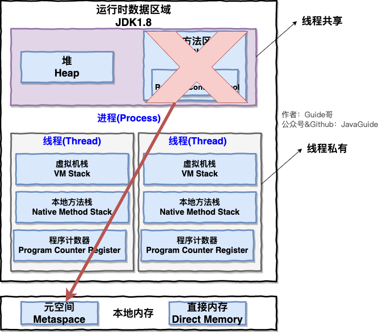
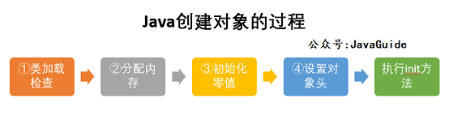
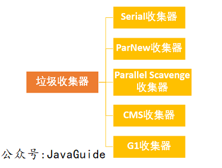

# 三、技术面试题自测篇

## Java基础

>  可选标题：面了一个应届生，我问了这些 Java 基础问题。

**Java 中有哪 8 种基本数据类型？它们的默认值和占用的空间大小知道不？ 说说这 8 种基本数据类型对应的包装类型。**

💡 提示：Java 中有 8 种基本数据类型，分别为：

1. 6 种数字类型 ：byte、short、int、long、float、double
2. 1 种字符类型：char
3. 1 种布尔型：boolean。

**包装类型的常量池技术了解么？**

💡 提示：Java 基本类型的包装类的大部分（Byte,Short,Integer,Long ,Character,Boolean）都实现了常量池技术。

🌈 拓展：整型包装类对象之间值的比较应该使用 equals 方法

**为什么要有包装类型？**

💡 提示： 基本类型有默认值、泛型参数不能是基本类型

**什么是自动拆装箱？原理？**

💡 提示：基本类型和包装类型之间的互转。装箱其实就是调用了 包装类的valueOf()方法，拆箱其实就是调用了 xxxValue()方法。

**遇到过自动拆箱引发的 NPE 问题吗？**

💡 提示：两个常见的场景：

- 数据库的查询结果可能是 null，因为自动拆箱，用基本数据类型接收有 NPE 风险
- 三目运算符使用不当会导致诡异的 NPE 异常

**String、StringBuffer 和 StringBuilder 的区别是什么? String 为什么是不可变的?**

💡 提示：可以从可变性、线程安全性、性能这几个角度来回答。

**重载和重写的区别？**

💡 提示：可以从下面几个角度来回答：

- 发生范围
- 参数列表
- 返回值类型
- 异常
- 访问修饰符
- 发生阶段

**== 和 equals() 的区别**

💡 提示：== 对于基本类型和引用类型的作用效果是不同的，equals() 不能用于判断基本数据类型的变量，只能用来判断两个对象是否相等。equals() 方法存在两种使用情况：

- 类没有重写 equals()方法 ：通过equals()比较该类的两个对象时，等价于通过“==”比较这两个对象，使用的默认是 Object类equals()方法。
- 类重写了 equals()方法 ：一般我们都重写 equals()方法来比较两个对象中的属性是否相等；若它们的属性相等，则返回 true(即，认为这两个对象相等)。

**Java 反射？反射有什么优点/缺点？你是怎么理解反射的（为什么框架需要反射）？**

💡 提示： 想想你平时使用框架为啥能够如此方便。想想动态代理以及注解和反射之间的关系。

**谈谈对 Java 注解的理解，解决了什么问题？**

💡 提示： 想想你平时使用框架为啥能够如此方便。另外，需要注意注解的解析依赖于反射机制，务必要提前把反射机制搞懂。

**Java 泛型了解么？泛型的作用？什么是类型擦除？泛型有哪些限制？介绍一下常用的通配符？**

💡 提示：

- 好处：编译期间的类型检测（安全）、可读性更好
- Java 的泛型是伪泛型

**内部类了解吗？匿名内部类了解吗？**

内部类分为下面 4 种：

- 成员内部类
- 静态内部类
- 局部（方法）内部类
- 匿名内部类

**BIO,NIO,AIO 有什么区别?**

IO 模型这块挺难理解的，需要很多计算机底层知识。建议小伙伴们克服困难，一定要把这个点搞明白。

## **Java 集合**

**说说 List,Set,Map 三者的区别？**

💡 提示：可以从这些数据结构中的元素是否有序、是否可以重复、存储的元素类型（比如 Map 存储的就是键值对）等方面来回答。

**List,Set,Map 在 Java 中分别由哪些对应的实现类？底层的数据结构？**

💡 提示：拿 List 来举例， List 的常见实现类以及它们的数据结构 ：

- ArrayList： Object[]数组
- Vector：Object[]数组
- LinkedList： 双向链表(JDK1.6 之前为循环链表，JDK1.7 取消了循环)

**有哪些集合是线程不安全的？怎么解决呢？**

💡 提示：这块比较常问的是 Arraylist 和 Vector 、HashMap 和 ConcurrentHashMap（高频问题，重要） 。被问到 Vector 的时候， 你紧接着可能会被问到 Arraylist 和 Vector 的区别。被问到 ConcurrentHashMap 的时候，你紧接着就可能会被问到 ConcurrentHashMap 相关的问题比如 ConcurrentHashMap 是如何保证线程安全的。

**HashMap 查询，删除的时间复杂度**

💡 提示：

- 没有哈希冲突的情况
- 转链表的情况
- 链表转红黑树的情况

**HashMap 的底层实现**

💡 提示：

- JDK1.8 之前 ： 数组和链表
- JDK1.8 之后 ： 多了红黑树

**HashMap 的长度为什么是 2 的幂次方**

💡 提示：提高运算效率。

**比较 HashSet、LinkedHashSet 和 TreeSet 三者的异同**

💡 提示：

- HashSet、LinkedHashSet 和 TreeSet 都是 Set 接口的实现类，都能保证元素唯一，并且都不是线程安全的。
- HashSet、LinkedHashSet 和 TreeSet 的主要区别在于底层数据结构不同（底层数据结构不同又导致这三者的应用场景不同）。

**HashMap 和 Hashtable 的区别？HashMap 和 HashSet 区别？HashMap 和 TreeMap 区别？**

**ConcurrentHashMap 和 Hashtable 的区别？**

💡 提示：

- 底层数据结构
- 实现线程安全的方式的区别

**ConcurrentHashMap 线程安全的具体实现方式/底层具体实现**

💡 提示：

- JDK 1.7 ：Segment 分段锁
- JDK 1.8 ： CAS 和 synchronized

## **Java并发**

**什么是线程和进程?线程与进程的关系,区别及优缺点？⭐⭐⭐⭐**

💡 提示：可以从从 JVM 角度说进程和线程之间的关系

**为什么要使用多线程呢? ⭐⭐⭐**

💡 提示：从计算机角度来说主要是为了充分利用多核 CPU 的能力，从项目角度来说主要是为了提升系统的性能。

**说说线程的生命周期和状态? ⭐⭐⭐⭐**

💡 提示： 6 种状态（NEW、RUNNABLE、BLOCKED、WAITING、TIME_WAITING、TERMINATED）。

🌈 拓展：在操作系统中层面线程有 READY 和 RUNNING 状态，而在 JVM 层面只能看到 RUNNABLE 状态。

**什么是线程死锁?如何避免死锁?如何预防和避免线程死锁? ⭐⭐⭐⭐**

💡 提示： 这里最好能够结合代码来聊，你要确保自己可以写出有死锁问题的代码。

🌈 拓展：项目中遇到死锁问题是比较常见的，除了要搞懂上面这些死锁的基本概念之外，你还要知道线上项目遇到死锁问题该如何排查和解决。

**synchronized 关键字 ⭐⭐⭐⭐⭐**

💡 提示：synchronized 关键字几乎是面试必问，你需要搞懂下面这些 synchronized 关键字相关的问题：

- synchronized 关键字的作用，自己是怎么使用的。 
-  synchronized 关键字的底层原理（重点！！！） 
-  JDK1.6 之后的 synchronized 关键字底层做了哪些优化。synchronized 锁升级流程。 
-  synchronized 和 ReentrantLock 的区别。 
-  synchronized 和 volatile 的区别。 

**并发编程的三个重要特性 ⭐⭐⭐⭐⭐** 

💡 提示： 原子性、可见性、有序性

**JMM（Java Memory Model，Java 内存模型）和 happens-before 原则。 ⭐⭐⭐⭐⭐**

**volatile 关键字 ⭐⭐⭐⭐⭐**

💡 提示：volatile 关键字同样是一个重点！结合 JMM（Java Memory Model，Java 内存模型）和 happens-before 原则来回答就行了。

**ThreadLocal 关键字 ⭐⭐⭐⭐⭐**

💡 提示：关注ThreadLocal的底层原理、内存泄露问题以及自己是如何在项目中使用ThreadLocal关键字的。

**线程池 ⭐⭐⭐⭐⭐**

💡 提示：线程池有哪几种，各种线程池的优缺点，线程池的重要参数、线程池的执行流程、线程池的饱和策略、如何设置线程池的大小等等。

**ReentrantLock 和 AQS ⭐⭐⭐⭐⭐**

💡 提示： ReentrantLock 的特性、实现原理（基于 AQS）。可以从 ReentrantLock 的实现来理解 AQS。

**乐观锁和悲观锁的区别 ⭐⭐⭐⭐⭐**

**CAS 了解么？原理？什么是 ABA 问题？ABA 问题怎么解决？ ⭐⭐⭐⭐⭐**

💡 提示：多地方都用到了 CAS 比如 ConcurrentHashMap 采用 CAS 和 synchronized 来保证并发安全，再比如java.util.concurrent.atomic包中的类通过 volatile+CAS 重试保证线程安全性。和面试官聊 CAS 的时候，你可以结合 CAS 的一些实际应用来说。

**Atomic 原子类 ⭐⭐**

## **JVM**

> 如非特殊说明，本文主要针对的就是 HotSpot VM 。

**运行时数据区中包含哪些区域？哪些线程共享？哪些线程独享？哪些区域可能会出现OutOfMemoryError？哪些区域不会出现OutOfMemoryError?【⭐⭐⭐⭐⭐】**

💡 提示：把下面两张图记在心里！并且，你还要搞懂这些区域大概的作用是什么。

**JDK 1.8 之前：**	



**JDK 1.8 ：**



线程私有的：程序计数器、虚拟机栈、本地方法栈

线程共享的：堆、方法区、直接内存 (非运行时数据区的一部分)

**说一下方法区和永久代的关系。【⭐⭐⭐】**

💡 提示：其实就有点像 Java 中接口和类的关系。

**Java 对象的创建过程。【⭐⭐⭐⭐】**

💡 提示：下图便是 Java 对象的创建过程，我建议最好是能默写出来，并且要掌握每一步在做什么。



**对象的访问定位的两种方式知道吗？各有什么优缺点。【⭐⭐⭐⭐】**

💡 提示：句柄和直接指针。

**如何判断对象是否死亡（两种方法）。 讲一下可达性分析算法的流程。 【⭐⭐⭐⭐】**

**JDK 中有几种引用类型？分别的特点是什么？【⭐⭐】**

💡 提示：JDK1.2 以后，Java 对引用的概念进行了扩充，将引用分为强引用、软引用、弱引用、虚引用四种（引用强度逐渐减弱）。对这些概念简单了解，有印象就可以了。

**堆空间的基本结构了解吗？什么情况下对象会进入老年代？【⭐⭐⭐⭐⭐】**

提示：

1. 大部分情况，对象都会首先在 Eden 区域分配。
2. 长期存活的对象将进入老年代。
3. 大对象直接进入老年代。

🌈 拓展：动态对象年龄判定。

**垃圾收集有哪些算法，各自的特点？【⭐⭐⭐⭐⭐】**

💡 提示：



**有哪些常见的 GC?谈谈你对 Minor GC、还有 Full GC 的理解。Minor GC 与 Full GC 分别在什么时候发生？ Minor GC 会发生 stop the world 现象吗？【⭐⭐⭐⭐⭐】**

💡 提示：

针对 HotSpot VM 的实现，它里面的 GC 其实准确分类只有两大种：

部分收集 (Partial GC)：

- 新生代收集（Minor GC / Young GC）：只对新生代进行垃圾收集；
- 老年代收集（Major GC / Old GC）：只对老年代进行垃圾收集。需要注意的是 Major GC 在有的语境中也用于指代整堆收集；
- 混合收集（Mixed GC）：对整个新生代和部分老年代进行垃圾收集。

整堆收集 (Full GC)：收集整个 Java 堆和方法区。

**讲一下 CMS 垃圾收集器的四个步骤。CMS 有什么缺点？【⭐⭐⭐⭐】**

💡 提示：初始标记、并发标记、重新标记、并发清除。

**并发标记要解决什么问题？并发标记带来了什么问题？如何解决并发扫描时对象消失问题？【⭐⭐⭐⭐】**

相关阅读：[面试官:你说你熟悉 jvm?那你讲一下并发的可达性分析](https://juejin.cn/post/6844904070788939790) 。

**G1 垃圾收集器的步骤。有什么缺点？【⭐⭐⭐⭐】**

💡 提示：和 CMS 类似。

**ZGC 了解吗？【⭐⭐⭐⭐】**

💡 提示： [新一代垃圾回收器 ZGC 的探索与实践(opens new window)](https://tech.meituan.com/2020/08/06/new-zgc-practice-in-meituan.html)

**JVM 中的安全点和安全区各代表什么？写屏障你了解吗？【⭐⭐⭐】**

**虚拟机基础故障处理工具有哪些？【⭐⭐⭐】**

💡 提示： 简单了解几个最重要的即可！

**什么是字节码？类文件结构的组成了解吗？【⭐⭐⭐⭐】**

💡 提示：在 Java 中，JVM 可以理解的代码就叫做字节码（即扩展名为 .class 的文件）。

ClassFile 的结构如下：

```clojure
ClassFile {
    u4             magic; //Class 文件的标志
    u2             minor_version;//Class 的小版本号
    u2             major_version;//Class 的大版本号
    u2             constant_pool_count;//常量池的数量
    cp_info        constant_pool[constant_pool_count-1];//常量池
    u2             access_flags;//Class 的访问标记
    u2             this_class;//当前类
    u2             super_class;//父类
    u2             interfaces_count;//接口
    u2             interfaces[interfaces_count];//一个类可以实现多个接口
    u2             fields_count;//Class 文件的字段属性
    field_info     fields[fields_count];//一个类会可以有多个字段
    u2             methods_count;//Class 文件的方法数量
    method_info    methods[methods_count];//一个类可以有个多个方法
    u2             attributes_count;//此类的属性表中的属性数
    attribute_info attributes[attributes_count];//属性表集合
}
```

**类的生命周期？类加载的过程了解么？加载这一步主要做了什么事情？初始化阶段中哪几种情况必须对类初始化？【⭐⭐⭐⭐⭐】**

💡 提示：


**双亲委派模型了解么？如果我们不想用双亲委派模型怎么办？【⭐⭐⭐⭐⭐】**

💡 提示：可以参考 Tomcat 的自定义类加载器 WebAppClassLoader

**双亲委派模型有什么好处？双亲委派模型是为了保证一个 Java 类在 JVM 中是唯一的？ 【⭐⭐⭐⭐⭐】**

**JDK 中有哪些默认的类加载器？ 【⭐⭐⭐⭐】**

💡 提示：

JVM 中内置了三个重要的 ClassLoader，除了 BootstrapClassLoader 其他类加载器均由 Java 实现且全部继承自java.lang.ClassLoader：

1. BootstrapClassLoader(启动类加载器) ：最顶层的加载类，由 C++实现，负责加载 %JAVA_HOME%/lib目录下的 jar 包和类或者被 -Xbootclasspath参数指定的路径中的所有类。
2. ExtensionClassLoader(扩展类加载器) ：主要负责加载 %JRE_HOME%/lib/ext 目录下的 jar 包和类，或被 java.ext.dirs 系统变量所指定的路径下的 jar 包。
3. AppClassLoader(应用程序类加载器) ：面向我们用户的加载器，负责加载当前应用 classpath 下的所有 jar 包和类。

**堆内存相关的 JVM 参数有哪些？你在项目中实际配置过了吗？ 【⭐⭐⭐⭐⭐】**

💡 提示：一定要自己动手操作一下。

相关问题：

- 如何设置年轻代和老年代的大小？
- 如何调整调整新生代和老年代的比值？
- ......

**如何对栈进行参数调优？【⭐⭐⭐⭐】**

**你在项目中遇到过 GC 问题吗？怎么分析和解决的？【⭐⭐⭐⭐⭐】**

💡 提示：比较有含金量的问题！比较能反映出求职者的水平，应该重点准备。

相关阅读：[Java 中 9 种常见的 CMS GC 问题分析与解决](https://tech.meituan.com/2020/11/12/java-9-cms-gc.html)

**GC 性能指标了解吗？调优原则呢？【⭐⭐⭐⭐⭐】**

- GC 性能指标通常关注吞吐量、停顿时间和垃圾回收频率。
- GC 优化的目标就是降低 Full GC 的频率以及减少 Full GC 的执行时间。

**如何降低 Full GC 的频率？【⭐⭐⭐⭐⭐】**

💡 提示： 可以通过减少进入老年代的对象数量可以显著降低 Full GC 的频率。如何减少进入老年代的对象数量呢？JVM 垃圾回收这部分有提到过。


