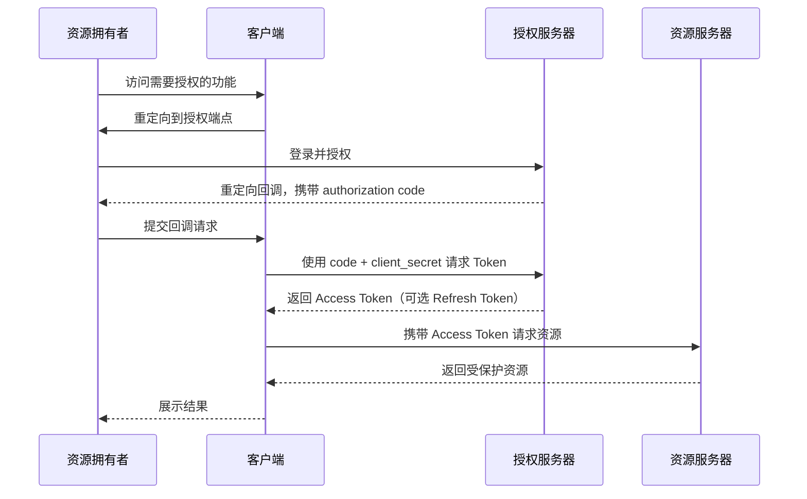
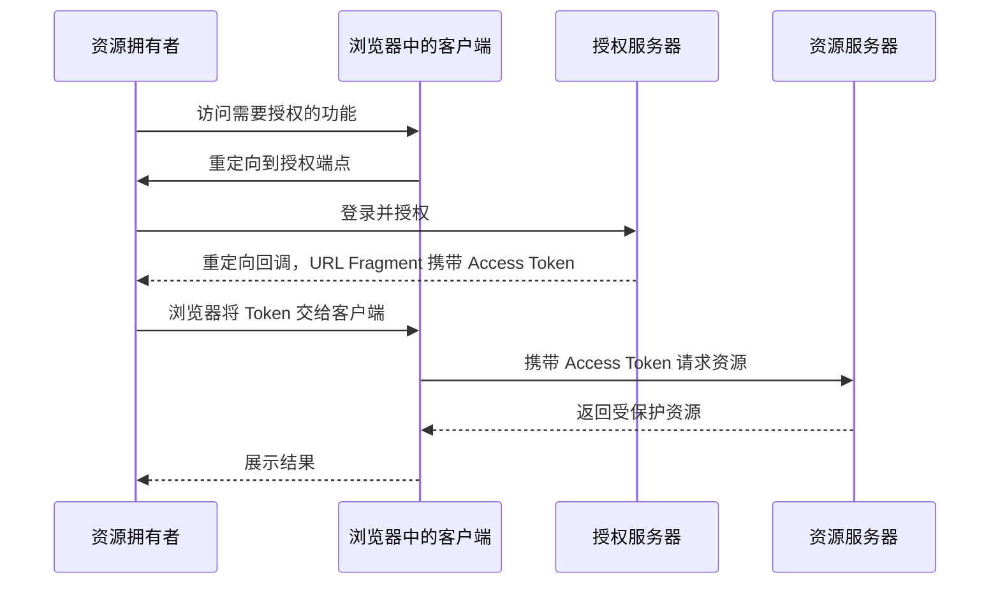
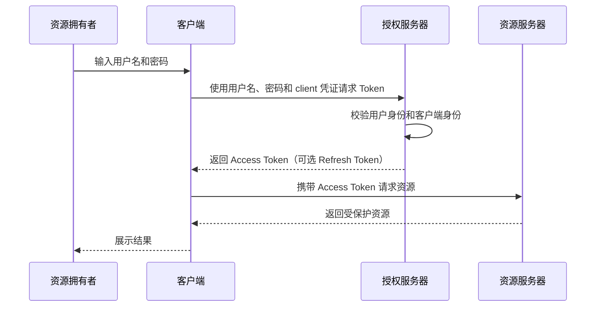
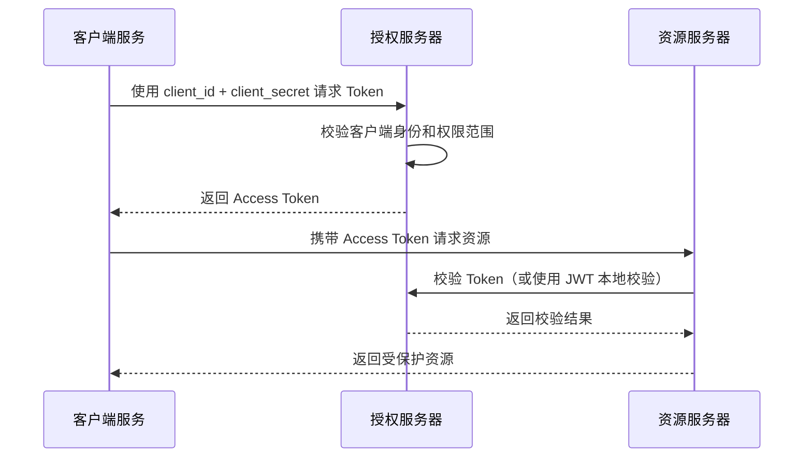
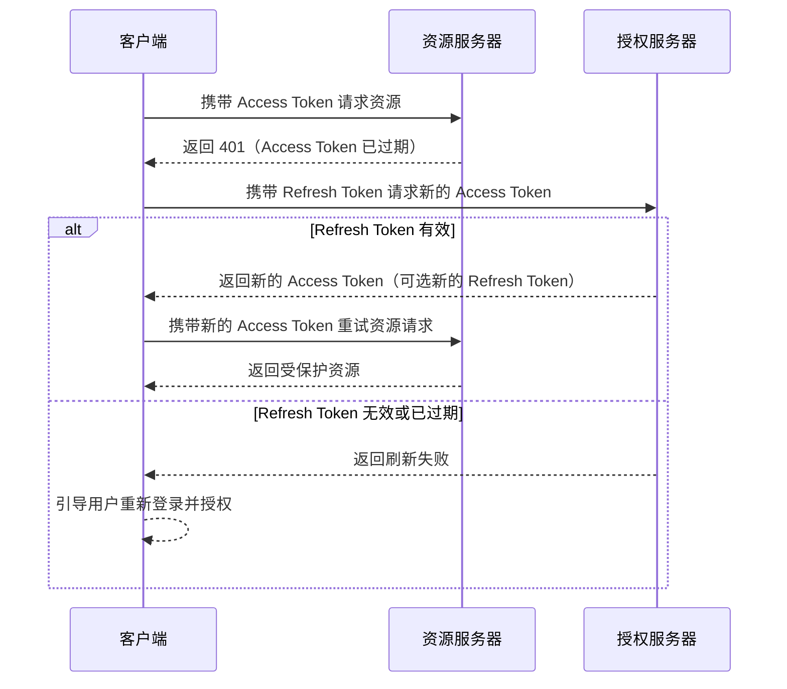

# OAuth2

## OAuth 2.0 是什么？

首先要明确，OAuth 2.0 是一个授权（Authorization）框架，而非认证（Authentication）协议。

- **授权（Authorization）**：解决“你能做什么？”的问题。它允许第三方应用（如“知乎”）在获得用户授权后，访问用户在另一平台（如“微信”）上的特定资源（如头像、昵称）。
- **认证（Authentication）**：解决“你是谁？”的问题。这通常由 OpenID Connect（OIDC）在 OAuth 2.0 之上扩展实现。

在微服务架构中，OAuth 2.0 通过令牌（Token）机制，解决了分布式系统间统一认证与授权的难题，将认证授权与业务逻辑解耦。

## 四个核心角色

OAuth 2.0 的授权过程涉及四个核心角色：

| 角色 | 英文名 | 通俗解释 | 举例 |
| --- | --- | --- | --- |
| 资源拥有者 | Resource Owner | 拥有数据的人 | 用户 |
| 客户端 | Client | 想要访问用户数据的第三方应用 | 知乎 App |
| 授权服务器 | Authorization Server | 负责验证用户身份并颁发 Token 的服务器 | 微信的 OAuth 登录系统 |
| 资源服务器 | Resource Server | 实际存储用户数据并提供 API 的服务器 | 微信的用户信息 API 服务器 |

## 四种授权模式（Grant Types）

OAuth 2.0 根据不同场景定义了四种授权模式，面试中授权码模式是重中之重。

| 模式 | 适用场景 | 核心流程 | 安全性 |
| --- | --- | --- | --- |
| 授权码模式（Authorization Code） | 有后端的 Web 应用 | 1. 客户端将用户导向授权服务器。 2. 用户登录并授权。 3. 授权服务器返回授权码（code）给客户端。 4. 客户端后端用 code 和 client_secret 换取访问令牌（Access Token）。 | 最安全。code 和 token 均通过后端交换，降低了泄露风险。 |
| 简化模式（Implicit） | 纯前端应用，如 SPA | 授权服务器直接将访问令牌通过重定向返回给客户端，省略授权码环节。 | 较低。令牌暴露在浏览器 URL 中，存在被截获的风险。 |
| 密码模式（Resource Owner Password Credentials） | 高度信任的客户端，如官方 App | 用户直接将用户名和密码提供给客户端，客户端再用它们向授权服务器换取令牌。 | 风险高。应用直接获取用户密码，仅限内部或高度信任场景使用。 |
| 客户端凭证模式（Client Credentials） | 服务间通信，无用户参与 | 客户端使用自己的 client_id 和 client_secret 直接向授权服务器换取令牌。 | 适用于机器对机器（M2M）的认证。 |

### 授权码模式（Authorization Code）

### 简化模式（Implicit）

> 简化模式已被 OAuth 2.1 移除。下图用于说明其历史上的典型流程。

### 密码模式（Resource Owner Password Credentials）

> 密码模式不应在新系统中使用，因为客户端会直接接触用户密码。

### 客户端凭证模式（Client Credentials）

## 高频面试题

### 概念与原理

#### 什么是 OAuth 2.0？它和 OAuth 1.0 有什么区别？

OAuth 2.0 是一个开放标准的授权协议，允许第三方应用在用户授权的前提下访问受保护资源，而无需共享密码。

OAuth 2.0 是 OAuth 1.0 的升级版，简化了流程和加解密复杂性，支持更多客户端类型（如移动 App、单页应用），并引入了 Bearer Token。

#### 什么是 Access Token 和 Refresh Token？它们有什么关系？

- **访问令牌（Access Token）**：客户端访问资源的凭证，有有效期和权限范围（Scope）。
- **刷新令牌（Refresh Token）**：用于在 Access Token 过期后，无需用户重新授权即可获取新的 Access Token。它通常有效期更长，可以改善用户体验，但也需要妥善保护。

#### 什么是 Scope？它的作用是什么？

Scope 是授权时的权限范围概念。例如，可以授权知乎“读取”微信头像，但拒绝它“发布”朋友圈。客户端在请求授权时指定所需的 Scope，由用户确认。

### Spring Security 与实战

#### 在 Spring Security 中，如何配置一个 OAuth2 客户端？

通常使用 `spring-boot-starter-oauth2-client` 依赖，并在 `application.yml` 中配置 `spring.security.oauth2.client` 下的 `registration` 和 `provider`：

- `registration`：客户端注册信息，如 `client-id`。
- `provider`：授权服务器信息。

#### 如何将 Spring Boot 应用同时配置为授权服务器和资源服务器？

这种职责分离是微服务安全架构的核心。

**授权服务器**负责认证用户并颁发令牌：

- 在 Spring Boot 2.x 中，可以通过 `@EnableAuthorizationServer` 注解和继承 `AuthorizationServerConfigurerAdapter` 进行配置。
- Spring Security 5 及更高版本中，官方已不再推荐这种方式，建议使用 Spring Authorization Server 项目。

**资源服务器**负责验证令牌并保护 API：

- 可以通过 `@EnableResourceServer` 注解和配置 `ResourceServerConfigurerAdapter` 实现。
- 在 Spring Security 5 中，也可以通过 `@EnableWebSecurity` 并配置 `http.oauth2ResourceServer()` 完成。

#### JWT 在 OAuth 2.0 中扮演什么角色？

JWT（JSON Web Token）是一种自包含的令牌格式。它将用户信息（如用户 ID、角色）和签名编码在令牌字符串中。

资源服务器无需每次都查询授权服务器或数据库来验证令牌，因为 JWT 本身可以通过签名进行验证，从而实现无状态认证，非常适合微服务架构。

## 进阶追问与思考

### 为什么选择授权码模式而不是密码模式？

核心原因是安全性和信任度。

授权码模式中，第三方应用（客户端）永远接触不到用户密码；密码模式则要求用户将密码直接提供给第三方，风险极高。因此，密码模式仅适用于高度信任的内部应用。

### API 网关在 OAuth 2.0 安全架构中承担什么角色？

网关是安全的第一道防线，作为所有请求的统一入口：

1. 拦截请求并验证 Access Token 的有效性。
2. 验证通过后，将请求路由到后端的各个微服务（资源服务器）。

这样可以实现安全校验的集中化。

### 如何设计一个高可用的授权服务器？

- **服务注册与发现**：将授权服务器注册到 Eureka 或 Consul 等服务注册中心。
- **负载均衡**：通过网关或 Ribbon 等负载均衡器将请求分发到多个授权服务器实例。
- **令牌存储**：使用 Redis 等分布式缓存存储 Token，实现多实例间共享。
- **数据库高可用**：对存储客户端信息和用户信息的数据库进行分库分表、主从同步等配置。

准备 OAuth 2.0 面试时，不仅要记住概念，更要理解其设计哲学以及在不同场景下的权衡。

关于 Spring Security OAuth2 的配置，随着 Spring 生态的演进，官方推荐使用 Spring Authorization Server 项目。在面试或实际项目中，应关注这一趋势。

图中的授权服务器通常是由微信（腾讯）搭建和运营的。

## 为什么授权码模式是最安全的

授权码模式之所以被认为是 OAuth 2.0 中最安全的模式，核心在于它通过一个关键的“中间人”——授权码（Authorization Code），将授权过程拆分为两个独立的步骤，从而降低访问令牌（Access Token）在传输过程中被泄露的风险。

### 核心安全机制：双重隔离与后端交互

#### 后端交互，避免令牌在前端暴露

这是最核心的一点。在授权码模式中，获取访问令牌的关键步骤——用授权码换取访问令牌——是在后端服务器之间完成的。

相比之下，隐式模式会将访问令牌直接通过浏览器 URL 传递，容易被浏览器历史记录、恶意插件等截获。授权码模式确保访问令牌不经过用户浏览器，从而降低泄露风险。

#### 授权码是临时且一次性的“令牌兑换券”

- **临时性**：授权码的有效期极短，通常只有几分钟，即使被截获，攻击者也很难在有效期内利用它。
- **一次性**：授权码使用一次即失效。即使攻击者截获了授权码，一旦合法客户端已经用它换取令牌，这个授权码也会作废。

#### 客户端认证，确认身份

在使用授权码换取访问令牌时，客户端需要同时提供授权码和 `client_secret`（客户端密钥）。

这就像取款时需要同时提供存单和密码，确保只有合法且经过认证的客户端才能完成令牌换取，有效防止授权码被盗用。

### 与其他模式的安全性对比

| 授权模式 | 核心流程 | 安全性分析 |
| --- | --- | --- |
| 授权码模式 | 前端获取 code，后端用 code + client_secret 换 token | 最高。Token 不经过前端，且 client_secret 在后端验证，形成双重保障。 |
| 隐式模式 | 前端直接获取 token | 低。Token 暴露在浏览器 URL 中，容易被截获，且已在 OAuth 2.1 中被弃用。 |
| 密码模式 | 用户将密码直接提供给客户端 | 风险高。客户端直接获取用户密码，仅适用于高度信任的内部应用。 |
| 客户端凭证模式 | 客户端用自身凭证换 token | 适用特定场景。用于服务器间通信，不涉及用户授权。 |

### 注意事项：并非绝对安全

授权码模式虽然安全，但并非万无一失，常见风险包括：

#### client_secret 泄露

如果开发人员将 `client_secret` 硬编码在前端代码中，就等于把客户端密钥公开。务必确保 `client_secret` 仅在后端存储和使用。

#### CSRF（跨站请求伪造）攻击

攻击者可以利用 CSRF 漏洞，将受害者的授权与攻击者的账户绑定。

**防御措施**：务必使用 `state` 参数。在发起授权请求时生成随机字符串作为 `state`，并在回调时验证其一致性，这是防御 CSRF 的标准做法。

## 总结与面试话术

在 Java 面试中回答“为什么授权码模式是最安全的”时，可以按以下逻辑组织：

1. **开宗明义**：授权码模式是 OAuth 2.0 中最安全的模式，主要因为它将授权和令牌获取过程分离了。
2. **阐明核心**：它通过临时、一次性的授权码作为中间凭证。用授权码换取访问令牌的步骤在后端服务器之间完成，使访问令牌不经过用户浏览器，极大降低泄露风险。
3. **补充关键点**：换取令牌时，后端会验证 `client_secret`，确保请求方的合法性。
4. **展现深度**：任何协议的安全都依赖于正确实现。例如，必须妥善保管 `client_secret`，并使用 `state` 参数防御 CSRF 攻击。

参考： [IT 老齐架构笔记：说人话讲明白 OAuth2 经典授权码模式](https://www.cnblogs.com/dongyaotou/p/22641800)
